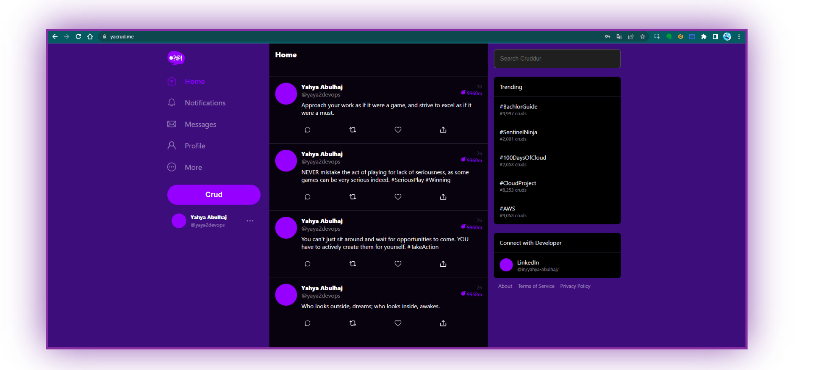

# AWS Cloud Project Bootcamp

- Application Re-brand: [Yacrud](https://yacrud.me/)
- Cohort: 2023-A1 — [**Cruds**](_docs/assets/yaYacrud.csv)

💡

Did you know? 
 

The term "Yacrud" is a combination of my nickname "Yaya" and the function "crud" used for posting content on the [app](https://yacrud.me/).

### **Project Inventory**

Unleash the full potential of this project in the `/journal` directory right [here.](journal/README.md)

