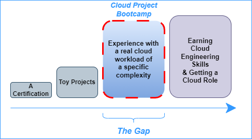
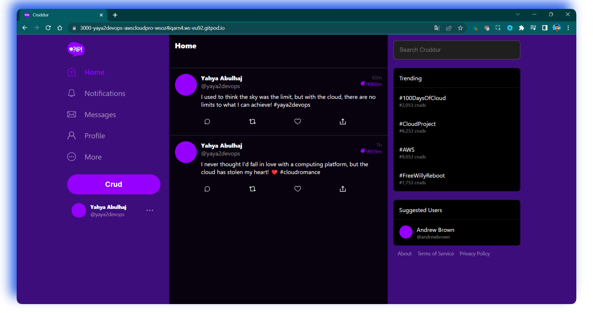
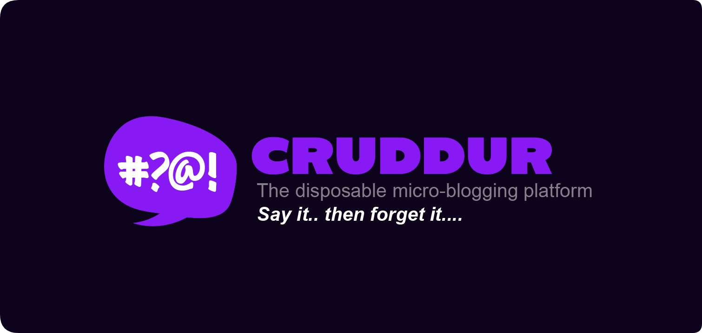

# AWS Cloud Project Bootcamp

- Application: Cruddur
- Cohort: 2023-A1

# Bootcamp Goal: Overview of Objectives and Difficulty

| | Target |
| ---: | :--- |
| Skills Gained |  Create a cloud project with sufficient complexity that can add value to one's resume  Combine multiple cloud services to emulate a real-world production workload |
| Transparency | This bootcamp is rated as Level 250 based on the following difficulty scale:   **Level 100** Foundational   **Level 200** Intermediate     • **Level 250** - **AWS Cloud Project Bootcamp**   **Level 300** Advanced   **Level 400** Expert |

# Micro-blogging Platform Development
|Project Scenario  | A startup company has hired a cloud engineer to build their own micro-blogging platform |
| --- | --- |
| **Initial Development** | The web-development firm created a mock web-application based on wireframe designs to demo to investors |
| **Funding Round** | The startup raised capital and tasked the cloud engineer with making the mock web-application production ready at scale |
| **Technical Requirements** | A fractional CTO was consulted to choose the technical requirements, which include:   • Frontend in Javascript using React (functional components)   • Backend in Python using Flask   • API-only approach using a micro-framework and without an ORM   • Defining an API specification detailing endpoints |
| **Deployment** | The web application will be deployed on AWS and take advantage of modern cloud services |
| **Cost Optimization** | The startup company wants to keep cloud provider costs as low as possible to maximize their investment. |

# Bootcamp Student Progress Tracker
| My Journal  | Technologies   | Start Date | Status|
| :---: | :--- | --- |:---: |
| [Week 0](journal/week0.md) | Bootcamp Overview and Introduction to Cloud Spend | Feb 11, 2023 |✅|
| [Week 1](journal/week1.md) | Docker and App Containerization | Feb 18, 2023 |✅|
| [Week 2](journal/week2.md) | Distributed Tracing | Feb 25, 2023 |✅|
| [Week 3](journal/week3.md) | Decentralized Authentication | Mar 4, 2023 |✅|
| [Week 4](journal/week4.md) | SQL Database | Mar 11, 2023 |✅|
|  [Week 5](journal/week5.md) | NoSQL Database | Mar 18, 2023 |Doing|
| [Week 6](journal/week6.md) | Deploying Serverless Containers (Part 1/2) | Mar 25, 2023 |Coming|
| [Week 7](journal/week7.md)  | Solving CORS with a Custom Domain and Load Balancing (Part 2/2) | Apr 1, 2023 |Coming|
| [Week 8](journal/week8.md) | Serverless Image Processing | Apr 8, 2023 |Coming|
|  [Week 9](journal/week9.md) | CI/CD | Apr 15, 2023 |Coming|
|  [Week 10](journal/week10.md) | CloudFormation (Part 1/2) | Apr 22, 2023 |Coming|
| [Week 11](journal/week11.md)| CloudFormation (Part 2) | Apr 29, 2023 |Coming|
|  [Week 12](journal/week12.md) | Modern APIs | May 6, 2023 |Coming|

    

