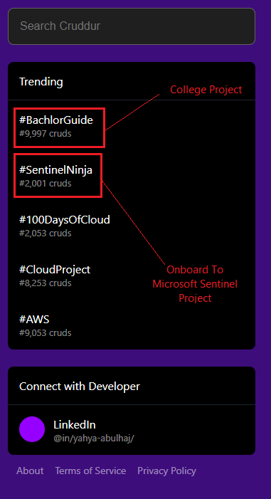

# Creative Compilation
In this section, I present a collection of assets I have handled, demonstrating my expertise in enhancing visual aesthetics. My aim is to showcase how I effectively amplify the visual appeal of various elements.

## Cloud Project Bootcamp

The asset provided below represents the project's primary deliverable, embodying the desired outcome.

[**Design Use-Case**](https://github.com/yaya2devops/aws-cloud-project-bootcamp/tree/week4#readme)

### Reworked Project Objective <small>v2</small>

I initiated the process of improving the appearance by initially removing the background.

To view and edit this file, use [DRAWIO](objective.drawio)

[**Design Use-Case**](https://github.com/yaya2devops/aws-cloud-project-bootcamp/tree/week5#readme)

### Recently Released Design  <small>v4.4</small>

After pushing to the extreme, I emerged with this masterpiece, surpassing all expectations.

To view and edit this file, use [DRAWIO](aware.drawio)

[**Design Use-Case**](https://github.com/yaya2devops/aws-cloud-project-bootcamp/tree/week6-7#readme)

> The link is broken because it was linked to the "week6-7" tag, which no longer exists. I split it into two separate weeks [6](https://github.com/yaya2devops/aws-cloud-project-bootcamp/tree/week6) and [7](https://github.com/yaya2devops/aws-cloud-project-bootcamp/tree/week7) for better organization.

## Assets Progression

Having crafted 16 creative essays, I have identified four potential changes that truly exemplify my qualities and characteristics.

# Cruddur Project Banner 
This creation is credited to the bootcamp organizer.

### Rounding
I decided to take the initiative to improve the banner  by rounding its edges.
 
 

##  Cruddur's Homefeed

The official screenshot with seed data showcases the application's initial state and functionality.

### Cruddur On PostgreSQL CRUD Activity in Week 4

This screenshot represents my progress in developing and improving the CRUDDUR's UI/UX functionality w/ mySQL and implementing psql.

Refer to PostgreSQL situational captures implementation from [here.](../../journal/week4.md)

### Yacrud On RDS CRUD Activity in Week 7
[Cruds available in csv.](yayacrud.csv)

> About [Week Seven](../../journal/week7.md).

## Yacrud Hashtags

- [**Project1:** Bachelor Guide](https://istic.computer-engineering.tech/#/)
- [**Project2:** Implement Microsoft Sentinel](https://sentinel.yahya-abulhaj.dev/)
- [**Project3:** Open Cyber Threat Intelligence Platform](https://opencti.yahya-abulhaj.dev/) (bonus)

