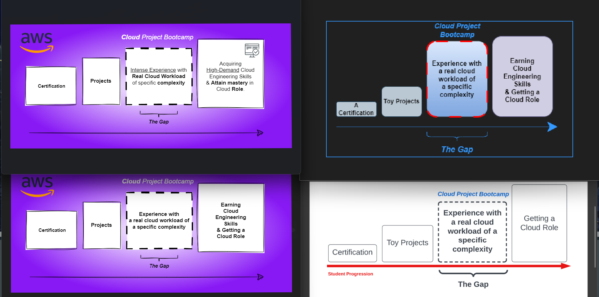

# Creative Compilation

The asset below illustrates the initial deliverable that the project aims to achieve.

[**Design Use-Case**](https://github.com/yaya2devops/aws-cloud-project-bootcamp/tree/week4#readme)

## Reworked Project Objective <small>v2</small>

To view and edit this file, use [DRAWIO](objective.drawio)

[**Design Use-Case**](https://github.com/yaya2devops/aws-cloud-project-bootcamp/tree/week5#readme)

## Recently Released Design  <small>v4.4</small>

To view and edit this file, use [DRAWIO](aware.drawio)

[**Design Use-Case**](https://github.com/yaya2devops/aws-cloud-project-bootcamp/tree/week6-7#readme)

> The link is broken because it was linked to the "week6-7" tag, which no longer exists. I split it into two separate weeks for better organization.

## Assets Progression

After creating 16 creative essays, here are four potential changes:

# Cruddur Project Banner 

## Rounding
I decided to take the initiative to improve the banner  by rounding its edges.
 
 

#  Cruddur's Homefeed

The official screenshot with seed data showcases the application's initial state and functionality.

## Cruddur On PostgreSQL CRUD Activity in Week 4

This screenshot represents my progress in developing and improving the CRUDDUR's UI/UX functionality, and serves as a testament to my skills in mySQL and implementing psql with success:

Refer to PostgreSQL situational captures implementation from [here.](../../journal/week4.md)

## [YACRUD](https://yacrud.me/) On RDS CRUD Activity in Week 7

The assets below demonstrate my unwavering dedication to the app, as demonstrated by my successful implementation of a custom domain using Route53, Certificate Manager, and Porkbun.

These results prove my outstanding competence with AWS RDS specifically and point out my unwavering commitment to achieving excellence in all endeavors.

