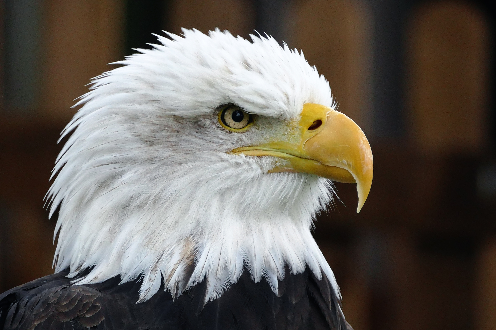

## Falcon's Velocity, Eagle's Insight

> A Life in Balance

I used to think a lot about two amazing birds: falcons and eagles. 

Each of them has unique qualities that fascinated me.

I saw myself as its combination;
- Blending the speed of a falcon 
- With the incredible vision of an eagle.

As I thought more about it, I realized that the eagle's keen eyesight held more importance for me.

You see, an eagle's vision is so sharp that it can make fast-moving things appear slow.

This ability to see things clearly and make quick decisions based on what I see has become a valuable skill in my life.

Being able to slow down the chaos around me and approach challenges with a focused and deliberate mindset.

Here is one; 

Damn..

I still appreciate the speed of a falcon its more of [Musk things](https://www.inverse.com/article/35774-elon-musk-names-spacex#:~:text=Falcon%209%20and%20Falcon%20Heavy&text=Such%20centerpieces%20of%20the%20company,A%20Raptor%20engine%20test%20fire.).. Just the eagle perceptive eye that I truly value.
