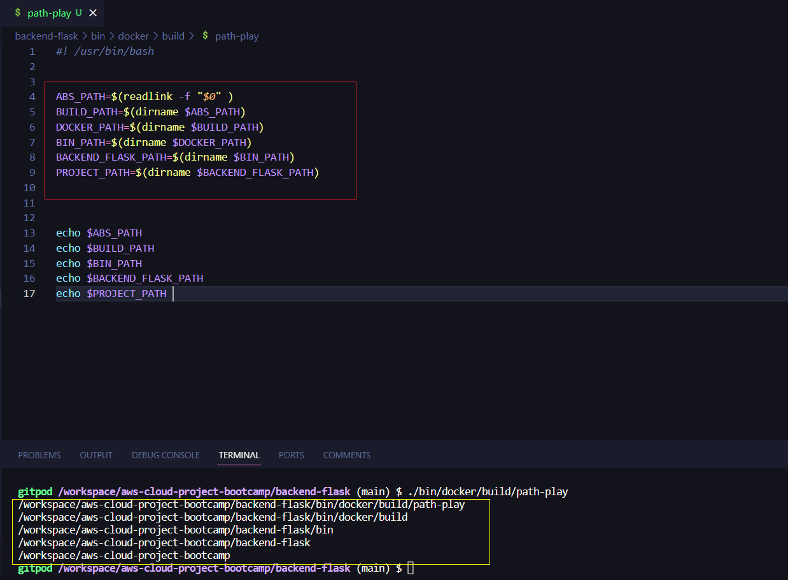

## Extracting Directory Paths

In this example, we will explore how to extract the directory portion of a given file path using shell commands


**First,** we use the `readlink -f` command, which resolves symbolic links and provides the absolute path of the specified file. 

```sh
path=$(readlink -f $0)
```

Executing the above commands yields the following output


```sh
echo $path
/home/user/test.sh
```


Now that we have learned how to obtain the full path, let's move on to extracting the directory portion of a given path. For this demonstration, we'll consider the path `/home/user/YAYA-WORK/id.ea`

We use the `dirname` command, which returns the directory name of the specified path. We assign the result to the variable `dir`. To extract the parent directory, we again use `dirname`, but this time on the `dir` variable.

```sh
path="/home/user/YAYA-WORK/id.ea"
dir=$(dirname $path)
parent_dir=$(dirname $dir)
```

```sh
echo $dir
/home/user/YAYA-WORK

echo $parent_dir
/home/user
```

## Experimental 



**Explanation**
> the workload is migrated to `bin/frontend` and `bin/backend` directories

1. The `dirname` command is used to extract the directory part of a given path.
2. In this example, we have a path "/home/user/YAYA-WORK/id.ea."
3. By executing `dir=$(dirname $path)`, we store the result of `dirname $path` in the `dir` variable.
   - `dirname $path` returns the directory path "/home/user/YAYA-WORK".
   - This is stored in the `dir` variable.
4. Similarly, by executing `parent_dir=$(dirname $dir)`, we store the result of `dirname $dir` in the `parent_dir` variable.
   - `dirname $dir` returns the parent directory path "/home/user".
   - This is stored in the `parent_dir` variable.
5. You can access the extracted directory paths by echoing the respective variables (`$dir` and `$parent_dir`).


## PoC Implementation:

- [`bin/docker/build/frontend-react-js`](../../frontend/build) 
- [`bin/docker/build/backend-flask-prod`](../../backend/build) 
- [`bin/db/schema-load`](../../db/schema-load) 
- [`bin/db/seed`](../../db/seed) 
- [`bin/db/setup`](../../db/setup) 
