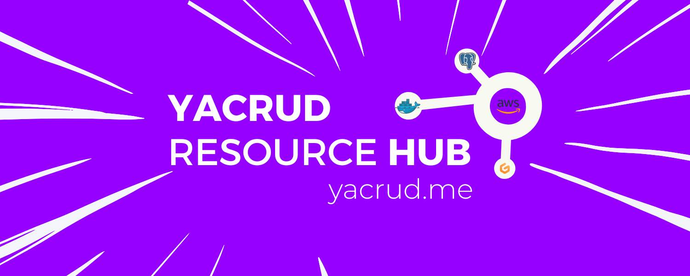

# Ultimate Resource Hub
The resources listed below were compiled out of intellectual curiosity and are provided here for your reference.  
Strategically located in 1️⃣ site.

| Exploration | Description | 
| :---: | :--- | 
| [Project Scenario](resources/project-scenario.md)  |Review the project scenario to determine the overall scope|
| [Student Portal](resources/student-portal.md) | Online portal for accessing course materials and weekly tasks |
| [Builder Assets](assets/README.md)  | The author's collection of resources and screenshots|
| [Required Tasks](resources/required-tasks.md)  | My current standing with regard to the required bootcamp duties|
| [ Challenges](resources/homework.md)  | Bonus tasks for those seeking more homework challenges|
| [ Beautify](../_docs/assets/README.md) | The Builder's  promotion of the marketing aspect of the things |

    
| Resource | Description | 
| :---: | --- | 
| [Gitpod Migration](resources/new-gitpod.md) | Guide for migrating the project to another Gitpod environment | 
| [Weekly Tagging](resources/tagging.md) | Guide for properly tagging and labeling project resources | 
| [ Scripts Library](../bin/README.md) | Scripting Directory produced during the bootcamp | 
| [AWS Guidebook](../aws/README.md) | Developer references for AWS Console resources | 
| [AWS CDK](../thumbing-serverless-cdk/README.md) |  Provision Cloud Resources with AWS CDK in Typescript  | 
| [SAM Templates](../ddb/README.md) |  Provisioning Infrastructure with AWS SAM Templates  | 
| [VS Code Tasks](../.vscode/README.md) |  Automate processes and run scripts using vscode tasks | 
| [Discord Issues](assets/week4/Discord/README.md)  | Troubleshooting exchanged with community in Discord |
| [ Stories](resources/instagram-stories.md)  | Bootcamp Assets shared to community on instagram |

---

    
##   [ᵃ⤻ᶻBuilding —](https://www.linkedin.com/feed/update/urn:li:activity:7060203832382808064/) Constructive Chronicles
  

| Journal | Technologies                                                           | Start Date   | Status |
| :-----: | -------------------------------------------------                      | ----------   | :----: |
| [Week 0](week0.md)  | ⭐Billing and Architecture         | Feb 11, 2023 |   ✘    |
| [Week 1](week1.md)  | ⭐Docker and App Containerization                         | Feb 18, 2023 |   ✘    |
| [Week 2](week2.md)  | ⭐Distributed Tracing                                     | Feb 25, 2023 |   ✘    |
| [Week 3](week3.md)  | ⭐Decentralized Authentication       | Mar 4, 2023  |   ✘   |
| [Week 4](week4.md)  | SQL Database with PostgreSQL   (*Under Revision*)       | Mar 11, 2023 |   ✘   |
| [Week 5](week5.md)  | NoSQL Database with AWS DynamoDB  (*Under Revision*)    | Mar 18, 2023 |   ✘   |
| [Week 6](week6.md)  | Deploying Serverless Containers   (*Under Revision*) (Part 1/2)            | Mar 25, 2023 |   ✘   |
| [Week 7](week7.md)  | Solving CORS with a Custom Domain and Load Balancing  (*Under Revision*) (Part 2/2)| Apr 1, 2023 |✘|
| [Week 8](week8.md)  | ⭐Serverless Image Processing                                | Apr 8, 2023  | ✘ |
| [Week 9](week9.md)  | CI/CD with AWS CodeBuild and CodePipeline  (*Under Revision*)   | Apr 15, 2023 | ✘ |
| [Week 10](week10.md) |⭐CloudFormation   (Part 1/2)                            | Apr 22, 2023 | ✘ |
| [Week 11](week11.md) | CloudFormation & SAM Templates   (Part 2/2)            | Apr 29, 2023 |Doing |
| [Week ✘](week12.md) | Modern APIs & Cleanup                                      | May 6, 2023  |Doing |

    

