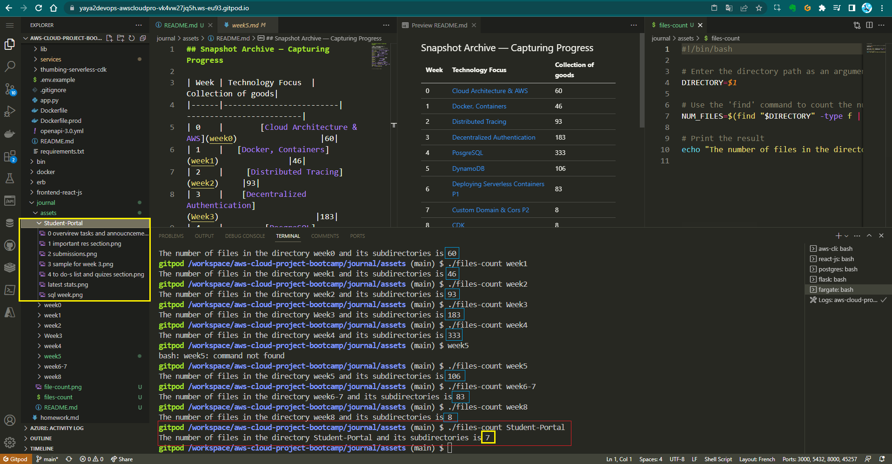

## Gallery Archive — Capturing Progress
>
| Week | Technology Focus  | Collection of goods|
|------|-------------------------|-------------------------|
| 0    |        [Cloud Architecture & AWS](week0)                  |60|
| 1    |   [Docker, Containers](week1)               |46|
| 2    |     [Distributed Tracing](week2)     |93|
| 3    |    [Decentralized Authentication](Week3)                     |183|
| 4    |         [PosgreSQL](week4)                |333|
| 5    |       [DynamoDB](week5)                  |106|
| 6    |     [Deploying Serverless Containers P1](week6-7)   |83|
| 7    |     [Custom Domain &  Cors P2](week6-7)                    |83|
|8   | [CDK](week8)|8|

> As of 10 April 2023

  
Developer Reference

  

[Scripting companion](files-count)

