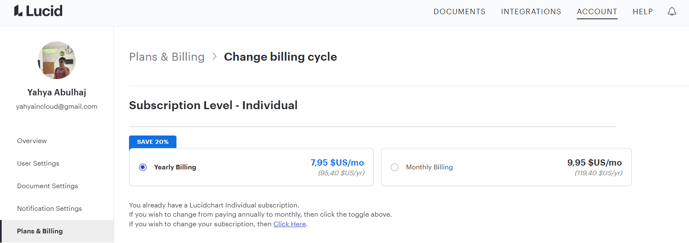

## Lucidchart Resource

Yep

- [Network Blueprint](https://lucid.app/lucidchart/e24f0c25-921f-405d-b910-c704a35b4c6d/edit?viewport_loc=-852%2C-414%2C4175%2C2141%2C0_0&invitationId=inv_2f294941-2fc9-47a0-ba92-d73cdc7773e1)
- [CFN Yacrud Stack](https://lucid.app/lucidchart/e3aafb80-1a1f-48fb-b846-3583e0380714/edit?viewport_loc=-800%2C-747%2C3316%2C1630%2C0_0&invitationId=inv_de394d8a-365d-461d-bb77-86256f478379)
- [Networking Layer, Cluster layer](https://lucid.app/lucidchart/4eca3a66-ae75-4b1d-94bf-0aecefe499bb/edit?viewport_loc=-2697%2C-743%2C5837%2C2966%2C0_0&invitationId=inv_44707e31-f1d7-4334-9bb4-68ddc59a61c5)
- [Yacrud DynamoDB](https://lucid.app/lucidchart/79af4388-e0d1-4cde-8009-5588a5f5a1eb/edit?viewport_loc=181%2C-89%2C1939%2C913%2C0_0&invitationId=inv_20592b35-416d-4cc7-9d75-8020947965d1)
- [Yacrud CI/CD](https://lucid.app/lucidchart/2d20bc15-f1aa-4138-8039-9411ae0be403/edit?viewport_loc=112%2C-364%2C2211%2C1011%2C0_0&invitationId=inv_6c8147b7-e308-4aa6-9bb2-5d7e88dae02a)
- [Process Images w/CDK CFN](https://lucid.app/lucidchart/c4bccdd5-2a07-4284-a5fd-2726348c0bdd/edit?viewport_loc=-935%2C-775%2C3316%2C1516%2C0_0&invitationId=inv_9967975a-6a3b-4f52-9fb6-70b79f33c879)

