## Community Exchange

<b>Issue 1 — PSQL<b>

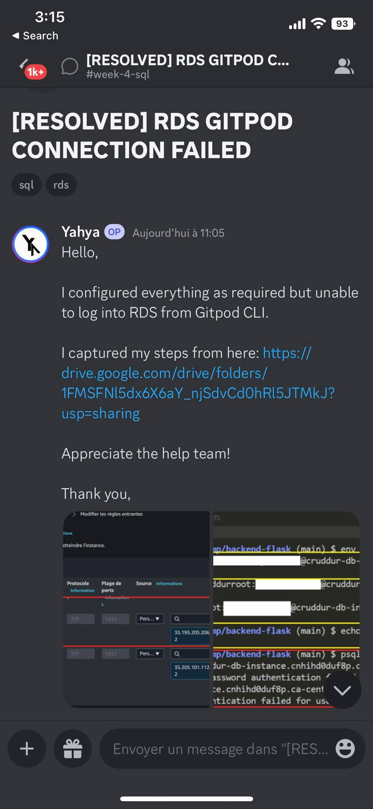

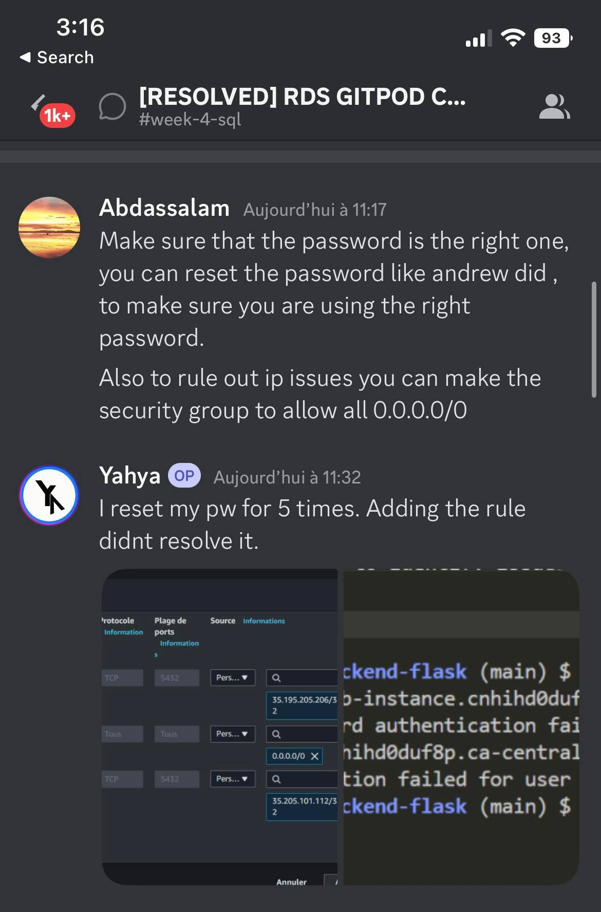

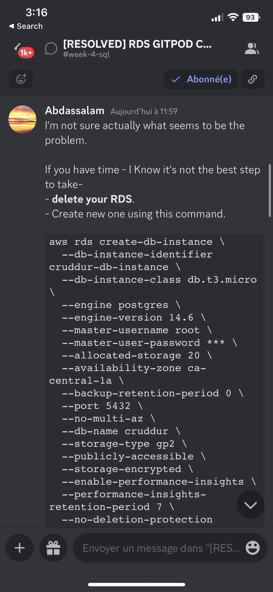

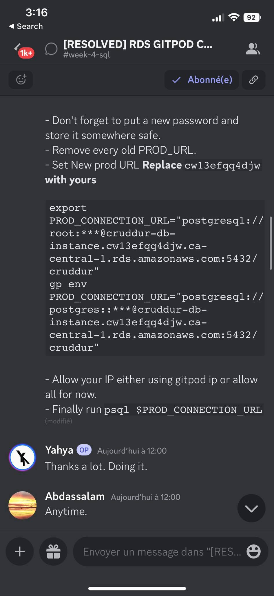

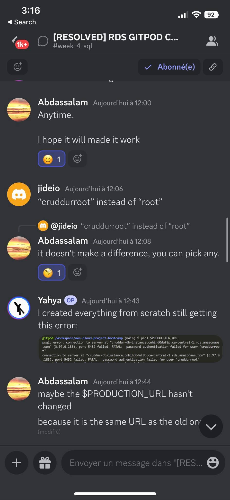

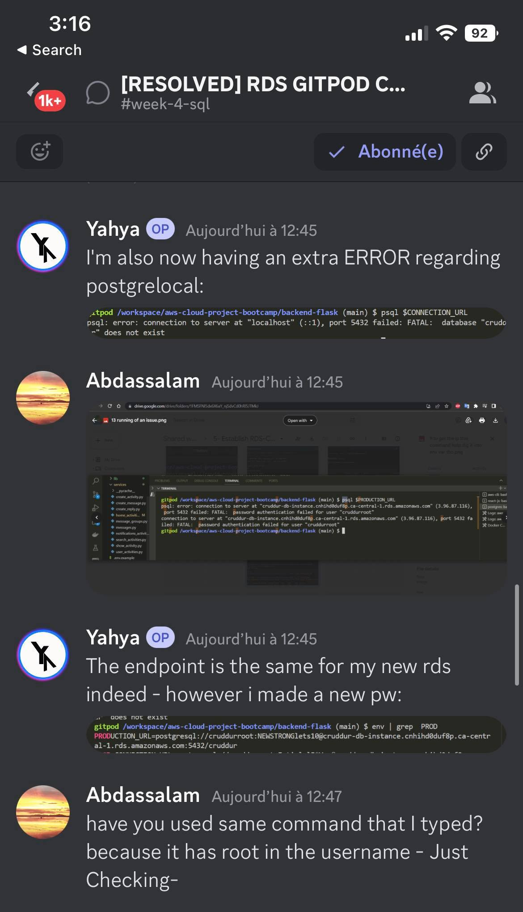

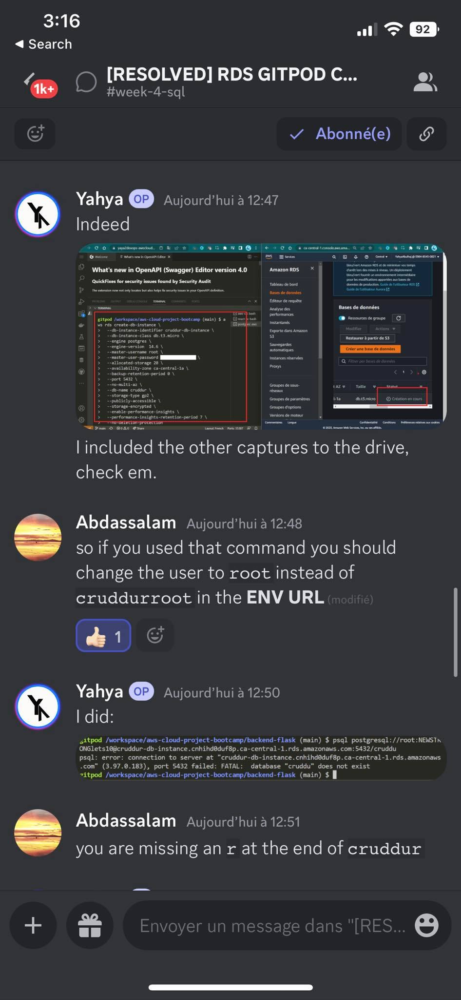

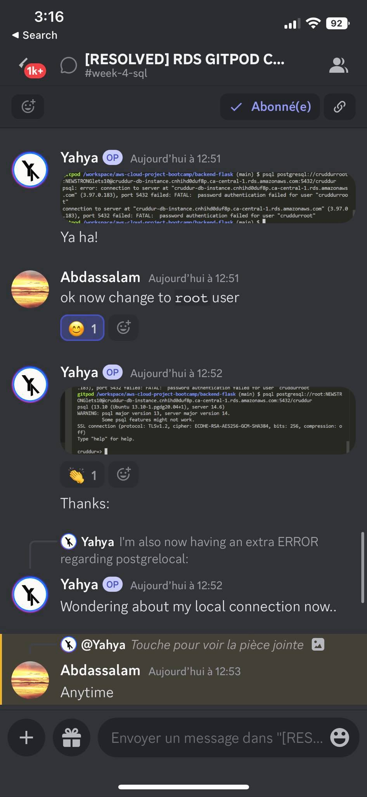

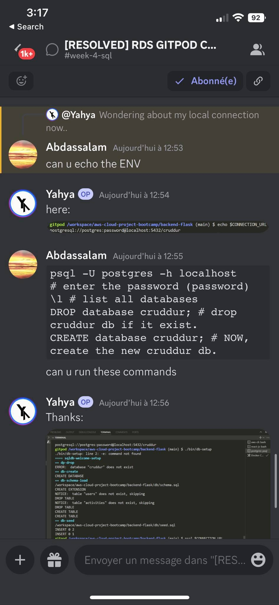

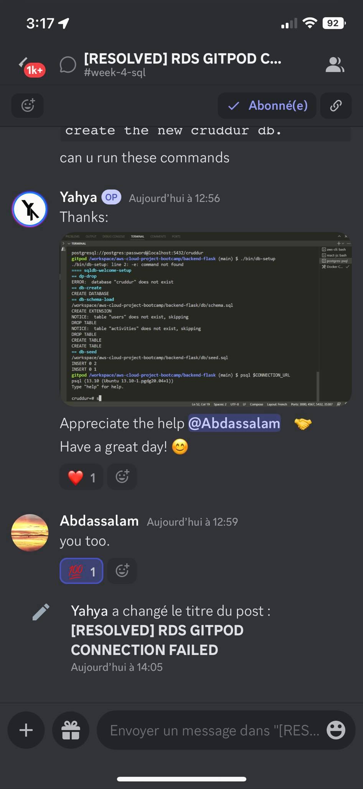

<b>Issue 2 — Prod Connetion<b>

<b>Issue 3 — Tagging<b>

You can learn more about tagging from [here.](../../../resources/tagging.md)

<b>Issue 4 — Env Variables<b>

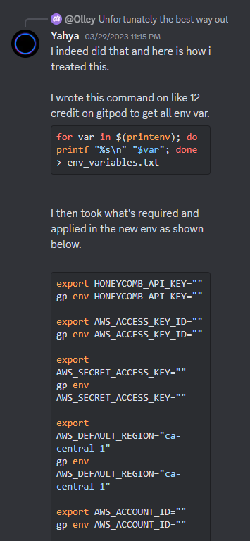

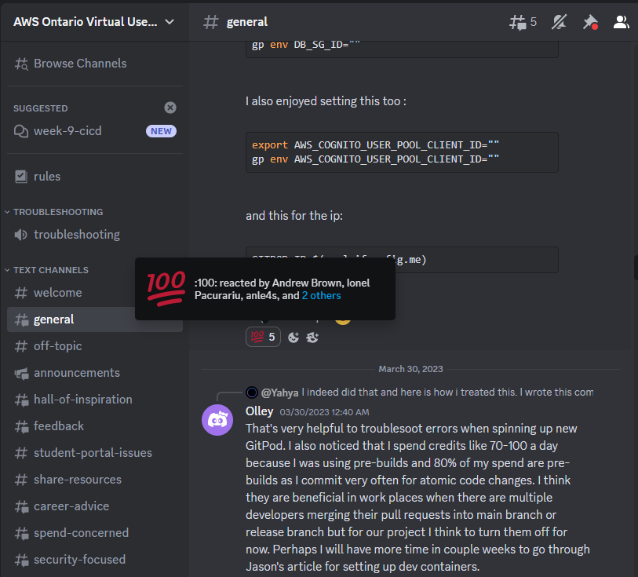

