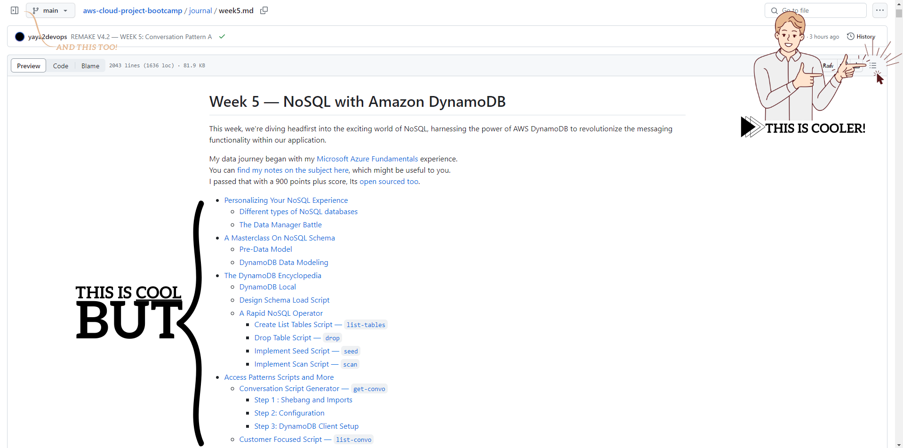
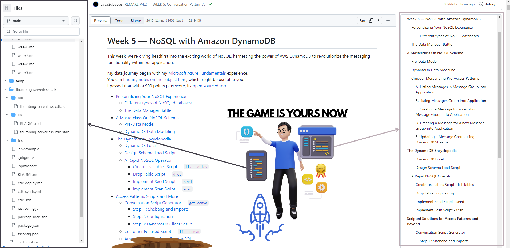

# How To Read My Stuff

Simple.  This is a push of awareness because you want to get better.

I believe I took the project to some god level.  So It is as important to show you  *how to absorb my stuff*.

I will not put too much energy in the writing but leave the assets get your mind to the top.

## The Average Developer On GitHub
[See Me In Full Screen](https://raw.githubusercontent.com/yaya2devops/aws-cloud-project-bootcamp/main/journal/resources/assets/average-dev.png)

## Unlocking Your Developer Mastery

[See Me In Full Screen](https://raw.githubusercontent.com/yaya2devops/aws-cloud-project-bootcamp/main/journal/resources/assets/pro-dev-you.png)

Before delving into my weekly journaling  Ensure your are visually ready.  This will empower you.  Thats it. Cool.