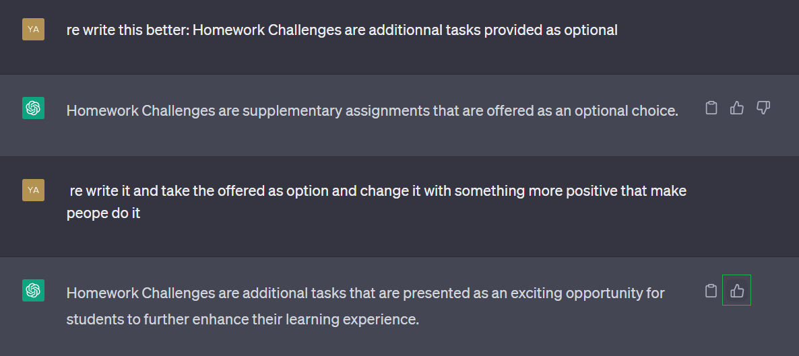

# Homework Challenges — Check-ins

The challenges are additional tasks presented as an exciting opportunity for bootcampers to further enhance their learning experience.

🤖

---

| Week 0 Challenges                                                                                        | Status |
|:----------------------------------------------------------------------------------------------------------|:--------:|
| Destroy your root account credentials, Set MFA, IAM role                                                |     ✅   |
| Review all the questions of each pillars in the Well Architected Tool (No specialized lens)             |     ✅   |
| Create an architectural diagram (to the best of your ability) the CI/CD logical pipeline in Lucid Charts |  ✅      |
| Research the technical and service limits of specific services and how they could impact the technical path for technical flexibility. |    ✅    |
| Open a support ticket and request a service limit                                                        |  ✅      |
|Use EventBridge to hookup Health Dashboard to SNS and send notification when there is a service health issue| ✅|

---

|  Week 1 Challenges                                                        | Status |
|:---------------------------------------------------------------------------------|:--------:|
| Run the dockerfile CMD as an external script                                    |        ✅|
| Push and tag a image to DockerHub (they have a free tier)                        |     ✅   |
| Use multi-stage building for a Dockerfile build                                 | ✅       |
| Implement a healthcheck in the V3 Docker compose file                            |    ✅    |
| Research best practices of Dockerfiles and attempt to implement it in your Dockerfile |  ✅      |
| Learn how to install Docker on your localmachine and get the same containers running outside of Gitpod / Codespaces |   ✅     |
| Launch an EC2 instance that has docker installed, and pull a container to demonstrate you can run your own docker processes. |     ✅   |

---

|  Week 2 Challenges                                                                                                   | Status |
|:----------------------------------------------------------------------------------------------------------------------|:--------:|
| Add custom instrumentation to Honeycomb to add more attributes eg. UserId, Add a custom span                          |     ✅    |
| Run custom queries in Honeycomb and save them later eg. Latency by UserID, Recent Traces                              |     ✅    |
| Figure out how to do segment and sub-segment on AWS XRAY                                                               |     ✅    |
|Instrument Honeycomb for the frontend-application to observe network latency between frontend and backend  |❗|
| [Events limits](assets/week2/pricing/README.md)|+|

---

|  Week 3 Challenges ❗                                                                              | Difficulty | Status |
|---------------------------------------------------------------------------------------------------|------------|--------|
| Decouple the JWT verify from the application code by writing a Flask Middleware                  | Medium     |   ❗     |
| Implement a Container Sidecar pattern using AWS’s official Aws-jwt-verify.js library             | Hard       |  ❗      |
| Decouple the JWT verify process by using Envoy as a sidecar                                      | Hard       |       ❗ |
| Implement a IdP login (e.g. Login with Amazon or Facebook or Apple)                               | Hard       |    ❗    |
| Implement MFA that sends an SMS (text message) (Note: This may have additional costs)             | Easy       |   ❗     |

---

|  Week 4 Challenges                                                                               | Difficulty | Status |
|---------------------------------------------------------------------------------------------------|------------|--------|
|        No homework challenges provided 	         |   N/A   | N/A|   

---

|  Week 5 Challenges                                                                               | Difficulty | Status |
|---------------------------------------------------------------------------------------------------|------------|--------|
|        No homework challenges provided 	          |     N/A | N/A|   
---

|  Week 6 and 7 Challenges                                                                               | Difficulty | Status |
|---------------------------------------------------------------------------------------------------|------------|--------|
| Try and host your frontend application on Static Website Hosting with CloudFront     |     Medium | ✅ | 

| This challenge could count for both Week 4 and 5 because you will have to deal with CORS as well. |
|--------|

---

|  Week 8 Challenges                                                                               | Difficulty | Status |
|---------------------------------------------------------------------------------------------------|------------|--------|
|       AWS CDK Costs Best Practices	         |   N/A   | N/A|   
|       AWS CDK Security Best Practices	         |   N/A   | N/A|   

---

|  Week 9 Challenges ❗                                                                              | Difficulty | Status |
|---------------------------------------------------------------------------------------------------|------------|--------|
|       Create a build server that will run the test suite for the backend code	         |  N/A   | ❗|   
|       Sub-task: Add the test server step to CodePipeline	         |  N/A | ❗| 
|      CICD Optimize for Costs Best Practices         |  N/A   | ❗|   

---

|  Week 10 Challenges                                                                               | Difficulty | Status |
|---------------------------------------------------------------------------------------------------|------------|--------|
|     CFN  Optimize for Costs Best Practices 	         |   N/A    | ❗ |   
|    SAM Optimize for Costs Best Practices|   N/A | ❗ |   

|  Week 11 Challenges                                                                               | Difficulty | Status |
|---------------------------------------------------------------------------------------------------|------------|--------|
|       Fargate Via Terraform  	         |   N/A   | ❗ |  
|       CICD Via Terraform  	         |   N/A   | ❗|   
|        Cluster Via Terraform 		         |   N/A    | ❗ |   
|        RDS Via Terraform 	 	         |   N/A    | ❗ |   
|        DDB Via Terraform 		         |   N/A    | ❗ |   
|  Terraform Costs Best Practices | N/A     | ❗ |   

---

|  Week 12 Challenges ❗                                                                              | Difficulty | Status |
|---------------------------------------------------------------------------------------------------|------------|--------|
|       Convert an existing DynamoDB REST API endpoint to use AppSync GraphQL 	         |   N/A   | ❗|  
|        Convert an existing Postgres SQL REST API endpoint to use AppSync GraphQL	         |   N/A   | ❗|   
|        Replace AuthN with Cognito as authentication system with AppSync	         |   N/A   | ❗|   

