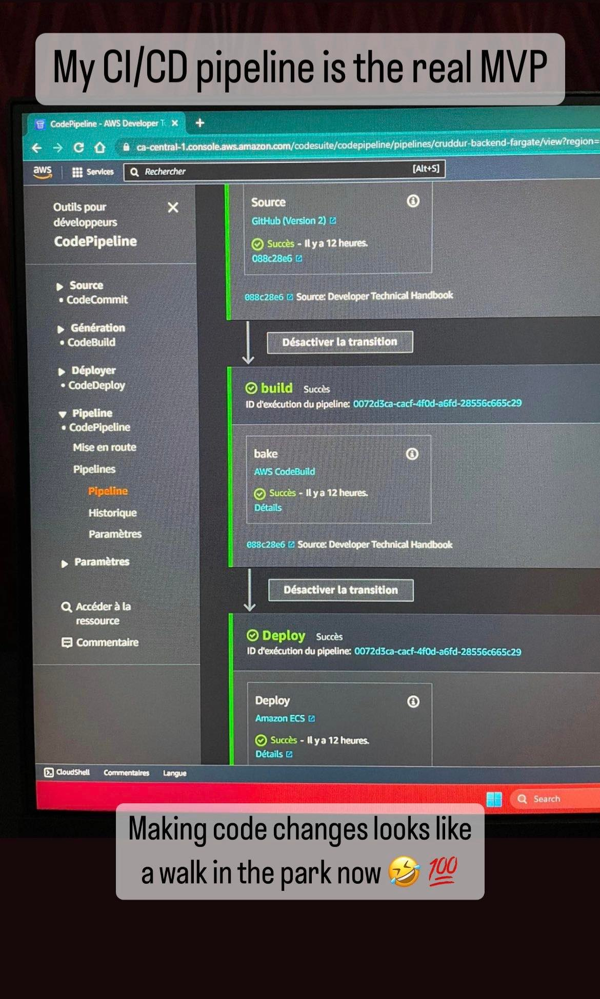
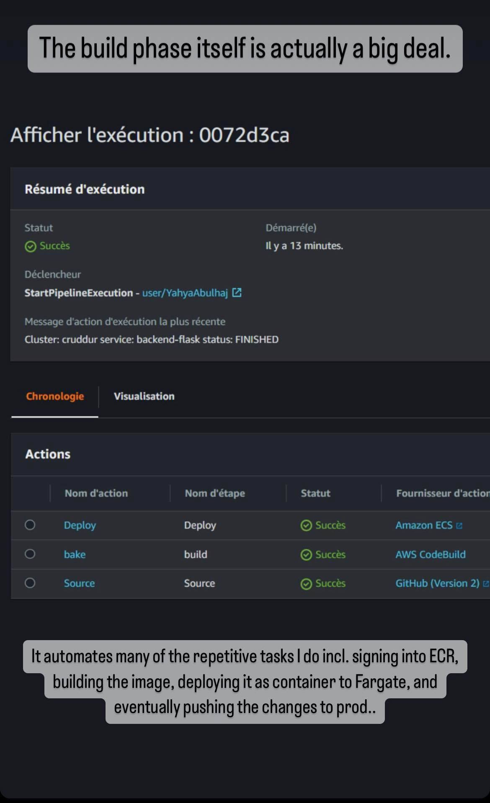
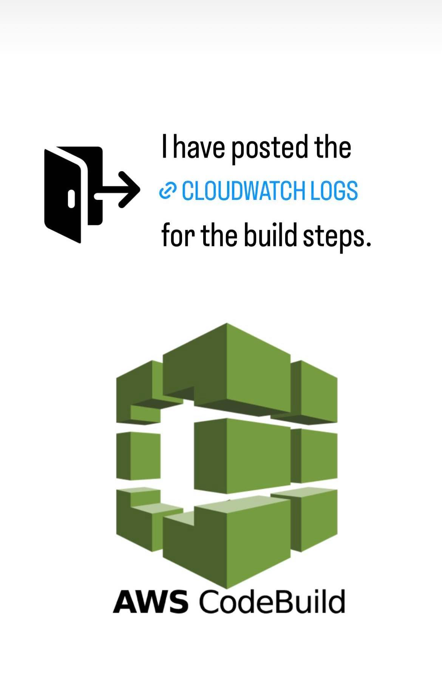
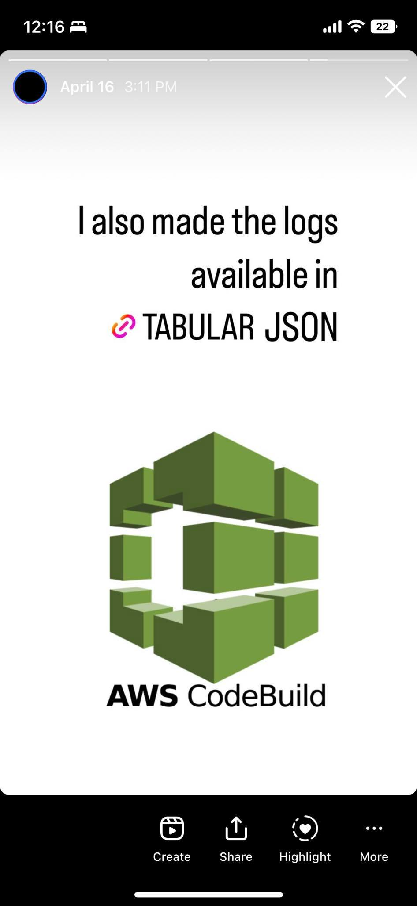
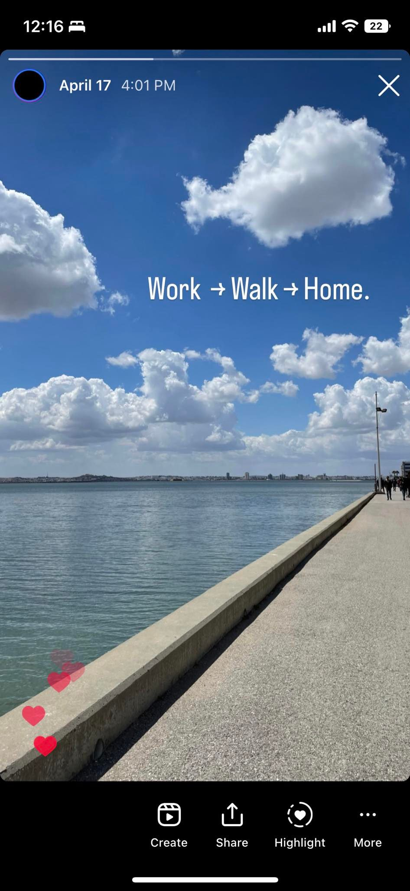

## Highlight Stories 

<b>CI-CD Pipeline<b>

- Pipeline Success

- Build phase using [`buildspec.yml`](../../backend-flask/buildspec.yml)

- [CodeBuild Cloudwatch logs](https://docs.google.com/spreadsheets/d/1cnOQrXY6l5aSpkBI3lPtha-YfQ4KpWd6QUi6ag3heq8/edit?usp=sharing)

- In [Tabluar JSON format](../assets/week9/Codebuild/%5BTABULAR%5Dcode-build-backend-success.json)

Available in [gist](https://gist.github.com/yaya2devops/291ddfd44785120437500eb7bf8289c0)

Cloud and work

