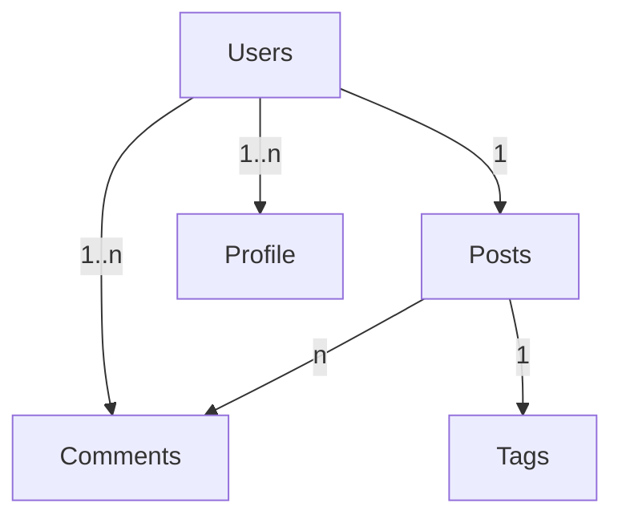

# Crafting Visualizations with Text-based Diagrams

Mermaid is a text-based diagramming and visualization tool that empowers users to create intricate and professional diagrams using simple textual descriptions.

This is a simplified example, and a real-world database schema would likely be more complex. 

- `Users` is connected to `Posts` with a "1" indicating a one-to-many relationship (one user can have multiple posts).
- `Users` is also connected to `Comments` with "1..n" indicating a one-to-many relationship (one user can have multiple comments).
- `Posts` is connected to `Comments` with "n" indicating a many-to-one relationship (many posts can have one comment).
- `Posts` is connected to `Tags` with a "1" indicating a one-to-one relationship (one post can have multiple tags).
- `Users` is connected to `Profile` with "1..n" indicating a one-to-many relationship (one user can have multiple profiles).

To render this Mermaid code into an actual diagram, you can use [this Mermaid editor](https://mermaid-js.github.io/mermaid-live-editor/).

For greater intricacy, refer to [week four.](../week4.md)  I also integrated this technology during that, in conjunction with PostgreSQL and database systems.