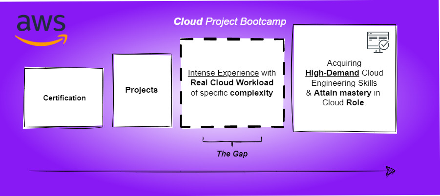

# Visionary Pursuit — Twitter-Like

## Purposes and Adversities
The organizer expressed uncertainty regarding the accuracy of their judgment in scaling the project at 250.

The bootcamp project, as acknowledged by the pursuers Incl. the individuals instrumental in the realization, undeniably surpasses the specified level and is considered **Advanced**.

| | Target |
| ---: | :--- |
| **Skills Gained** |  Create a cloud project with sufficient complexity that can add value to one's resume  Combine multiple cloud services to emulate a real-world production workload |
| **Transparency** | This bootcamp is rated as Level 250 based on the following difficulty scale:   **Level 100** Foundational   **Level 200** Intermediate     • **Level 250** - **AWS Cloud Project Bootcamp**   **Level 300** Advanced   **Level 400** Expert |

# Micro-blogging Platform Development
|Project Scenario  | A startup company has hired a cloud engineer to build their own micro-blogging platform |
| :---: | :--- |
| **Initial Development** | The web-development firm created a mock web-application based on wireframe designs to demo to investors |
| **Funding Round** | The startup raised capital and tasked the cloud engineer with making the mock web-application production ready at scale |
| **Technical Requirements** | A fractional CTO was consulted to choose the technical requirements, which include:   • Frontend in Javascript using React (functional components)   • Backend in Python using Flask   • API-only approach using a micro-framework and without an ORM   • Defining an API specification detailing endpoints |
| **Deployment** | The web application will be deployed on AWS and take advantage of modern cloud services |
| **Cost Optimization** | The startup company wants to keep cloud provider costs as low as possible to maximize their investment. |