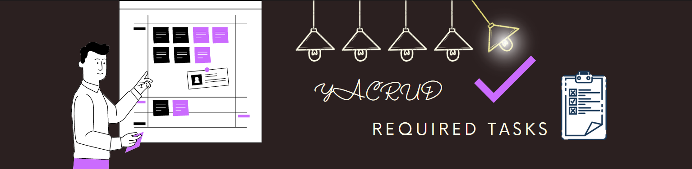

# CRUDDUR Required Weekly Tasks

### Table Of Contents
- [Week Zero](#week-0--aws-operations-and-cli)
  - [Week One](#week-1--containerize-application-w-docker)
    - [Week Two](#week-2--distributed-tracing)
      - [Week Three](#week-3--decentralized-authenitication)
         - [Week Four](#week-4--sql-databases-w-postgresql)
           - [Week Five](#week-5--nosql-databases-w-dynamodb)
             - [Week Six](#week-6--aws-ecs-fargate)
                - [Week Seven](#week-7--aws-load-balancer--cors)
                    - [Week Eight](#week-8--aws-cdk-w-typescript)
                       - [Week Nine](#week-9--cicd-pipelines-w-codebuild-and-codepipelines)
                             ∎ [Week Ten](#week-10--cloudformation)
                                 ∎ [Week Eleven](#week-11--cloudformation)
                                     ∎ [**Week X**](#week-x--cloudformation)

### Week 0 — AWS Operations and CLI
| Required Tasks                                              |Status  |
| ---                                                         |:------:|
| Watched Week 0 - Live Streamed Video                        | ✅     | 
| Watched Chirag's Week 0 - Spend Considerations              | ✅     | 
| Watched Ashish's Week 0 - Security Considerations           | ✅     | 
| Recreate Conceptual Diagram in Lucid Charts or on a Napkin  | ✅     | 
| Recreate Logical Architectural Diagram in Lucid Charts      | ✅     | 
| Create an Admin User                                        | ✅     | 
| Use CloudShell                                              | ✅     | 
| Generate AWS Credentials                                    | ✅     | 
| Installed AWS CLI                                           | ✅     | 
| Create a Billing Alarm                                      | ✅     | 
| Create a Budget                                             | ✅     | 

----

### Week 1 — Containerize Application w/ Docker

| Required Tasks                                              | Status  |
| :----------------------------------------------------       |:------: |
| Watch How to Ask for Technical Help                         |  ✅    |
| Watched Grading Homework Summaries                          |  ✅    |
| Watched Week 1 - Live Streamed Video                        |  ✅    |
| Remember to Commit Your Code                                |  ✅    |
| Watcked Chirag's Week 1 - Spending Considerations           |  ✅    |
| Watched Ashish's Week 1 - Container Security Considerations |  ✅    |
| Containerize Application (Dockerfiles, Docker Compose)      |  ✅    |
| Document the Notification Endpoint for the OpenAI Document  |  ✅    |
| Write a Flask Backend Endpoint for Notifications            |  ✅    |
| Write a React Page for Notifications                        |  ✅    |
| Run DynamoDB Local Container and ensure it works            |  ✅    |
| Run Postgres Container and ensure it works                  |  ✅    |

---

###  Week 2 — Distributed Tracing 

| Required Tasks                                       | Status |
|:---------------------------------------------------  |:--------:|
| Watch Week 2 Live-Stream Video                                                           |✅   |
| Watch Chirag Week 2 - Spending Considerations                                            |✅   |
|Watched  Github Codespaces Crash Course                                                   |✅   |
| Watched Ashish's Week 2 - Observability Security Considerations                          |✅   |
| Instrument Honeycomb with OTEL                                                           |✅   |
|Run queries to explore traces within Honeycomb.io                                         |✅   |
| Instrument AWS X-Ray                                                                     |✅   |
|Configure and provision X-Ray daemon within docker-compose and send data back to X-Ray API|✅   |
|Observe X-Ray traces within the AWS Console                                               |✅   |
| Instrument AWS X-Ray Subsegments                                                         |✅   |
|Install WatchTower & Onboard to Cloudwatch                                                |✅   |
| Configure custom logger to send to CloudWatch Logs                                       |✅   |
| Integrate Rollbar and capture an error                                                   |✅   |

---

### Week 3 — Decentralized Authenitication 

| Required Tasks                                                                         | Status |
|---------------------------------------------                                           |--------|
| Watched Ashish's Week 3                                                                |✅  |
| Provision via ClickOps a Amazon Cognito User Pool                                      |✅  |
|Implement API calls to Amazon Coginto for custom login                                  |✅  |
|Install and configure Amplify client-side library for Amazon Congito                    |✅  |
| Implement Custom Signup Page                                                           |✅  |
| Implement Custom Confirmation Page                                                     |✅  |
| Implement Custom Recovery Page                                                         |✅  |
| Watch about different approaches to verifying JWTs                                     |✅  |
|Verify JWT Token server side to serve authenticated API endpoints in Flask Application  |✅  |

---

### Week 4 — SQL Databases w/ PostgreSQL

| Required Tasks                                                                                         | Stats |
| :---                                                                                                   | :---: |
| Have a lecture about data modelling in (3rd Normal Form) 3NF for SQL                                   |✅ |
Watched Ashish's Week 4 - Security Considerations                                                        |✅ |
| Launch Postgres locally via a container                                                                |✅ |
|Bash scripting for common database actions                                                              |✅ |
| Seed our Postgres Database table with data                                                             |✅ |
| Write a DDL (for creating schema)                                                                      |✅ |
| Write an SQL read query                                                                                |✅ |
| Write an SQL write query                                                                               |✅ |
| Provision an RDS Postgres instance                                                                     |✅ |
| Configure local backend application to use production connection URL ( Connect Gitpod to RDS Instance) |✅ |
| Configure VPC Security Groups                                                                          |✅ |
| Propagate metrics from DDB to an RDS metrics table                                                     |✅ |
|Create Congito Trigger to insert user into database                                                     |✅ |
|Create new activities with a database insert                                                            |✅ |

---

### Week 5 — NoSQL Databases w/ DynamoDB

| Required Tasks                                                                          | Stats |
| ---                                                                                     |:---: |
| Watched Week 5 - Data Modelling (Live Stream)                                           |✅|
| Watched Ashish's Week 5 - DynamoDB Considerations                                       |✅|
| Implement Schema Load Script                                                            |✅|
| Implement Seed Script                                                                   |✅|
| Implement Scan Script                                                                   |✅|
| Implement Pattern Scripts for Read and List Conversations                               |✅|
| Implement Update Cognito ID Script for Postgres Database                                |✅|
| Implement (Pattern A) Listing Messages in Message Group into Application                |✅|
| Implement (Pattern B) Listing Messages Group into Application                           |✅|
| Implement (Pattern B) Listing Messages Group into Application                           |✅|
| Implement (Pattern C) Creating a Message for an existing Message Group into Application |✅|
| Implement (Pattern D) Creating a Message for a new Message Group into Application       |✅|
| Implement (Pattern E) Updating a Message Group using DynamoDB Streams                   |✅|

---

### Week 6 — AWS ECS Fargate   

| Required Tasks                                                     | Stats |
|------------------------------------------------------------------- |:---: |
| Watch ECS Security by Ashish                                       |✅|
| Watch Fargate Technical Questions with Maish                       |✅|
| Provision ECS Cluster                                              |✅|
| Create ECR repo and push image for backend-flask                   |✅|
| Deploy Backend Flask app as a service to Fargate                   |✅|
| Create ECR repo and push image for fronted-react-js                |✅|
| Deploy Frontend React JS app as a service to Fargate               |✅|

### Week 7 — AWS Load Balancer & CORS 

| Required Tasks                                                             | Stats |
|-------------------------------------------------------------------         |:---: |
| Provision and configure Application Load Balancer along with target groups |✅|
| Manage your domain using Route53 via hosted zone                           |✅|
| Create an SSL certificate via ACM                                          |✅|
| Setup a record set for naked domain to point to frontend-react-js          |✅|
| Setup a record set for api subdomain to point to the backend-flask         |✅|
| Configure CORS to only permit traffic from our domain                      |✅|
| Secure Flask by not running in debug mode                                  |✅|
| Implement Refresh Token for Amazon Cognito                                 |✅|
| Refactor bin directory to be top level                                     |✅|
| Configure task definitions to contain x-ray and turn on Container Insights |✅|
| Change Docker Compose to explicitly use a user-defined network             |✅|
| Create Dockerfile specifically for production use case                     |✅|
| Using ruby generate out env dot files for docker using erb templates       |✅|

---

### Week 8 — AWS CDK w/ Typescript

| ❗ Required Tasks Week 8 — AWS CDK               |Stats |
|-----------------------------------------------|:---: |
| Implement CDK Stack                           |✅|
| Serve Avatars via CloudFront                  |✅|
| Implement Users Profile Page                  |✅|
| Implement Users Profile Form                  |✅|
| Implement Backend Migrations                  |✅|
| Presigned URL generation via Ruby Lambda      |✅|
| HTTP API Gateway with Lambda Authorizer       |❗|        
| Create JWT Lambda Layer                       |✅|
| Render Avatars in App via CloudFront          |❗|

---

### Week 9 — CI/CD Pipelines w/ CodeBuild and CodePipelines

| Required Tasks                            |Stats |
|------------------------------------       |:---: |
| Implement CICD Pipeline Security B.P      |✅|
| Configure CodeBuild Project               |✅|
| Configure CodePipeline                    |✅|
| Design Cruddur buildspec                  |✅|
     

---

### Week 10 — Cloudformation 

| ❗Required Tasks                               |Stats |
|------------------------------------            |:---: |
| Implement CFN Networking Layer                 |✅|
| Design CFN Networking Layer Diagram            |✅| 
| Implement CFN Cluster Layer                    |✅|
| Implement CFN Toml                             |✅|
| Design CFN Cluster Layer Diagram               |✅|
| Implement CFN Fargate Service  for Backend     |✅|
| Design CFN Service Diagram                     |✅|
| Implement CFN RDS                              |✅|
| Design CFN RDS Diagram                         |✅|

### Week 11 — Cloudformation 

| ❗Required Tasks                               |Stats |
|------------------------------------            |:---: |
| Implement DynamoDB using SAM                   |✅|
| Design DynamoDB Diagram                        |✅|
| Implement CI/CD                                |✅|
| Design CI/CD Diagram                           |✅|
| Implement CFN Static Website Hosting Frontend  |❗|
| Design Static Frontend Diagram                 |❗|
| IaaC Security Practices                        |❗|
| CloudFormation Security Practices              |❗|
| SAM Security Practices                         |❗|

---

### Week X — Cleanup 

| ❗Required Tasks                                      |Stats |
|------------------------------------                   |:---: |
|Week X Sync tool for static website hosting            |⌛ |
|Reconnect DB and Postgre Confirmation Lamba            |⌛ |
|Fix CORS to use domain name for web-app                |⌛ |
|Ensure CI/CD pipeline works and create activity works  |⌛ |
|Refactor to use JWT Decorator in Flask App             |⌛ |
|Refactor App.py                                        |⌛ |
|Refactor Flask Routes                                  |⌛ |
|Implement Replies for Posts                            |⌛ |
|Improved Error Handling for the app                    |⌛ |
|Activities Show Page                                   |⌛ |
|More General Cleanup Part 1 and Part 2                 |⌛ |

