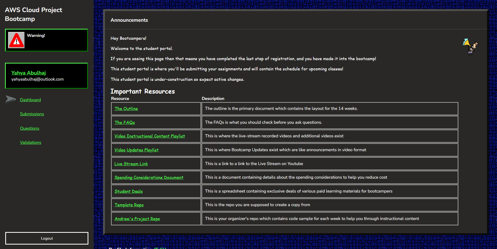

# Student Portal Tour

The student portal is where we can access information about weekly tasks and assignments that need to be completed and submitted.

The student portal is also a valuable source of information, providing access to resources, special discounts, and a wide range of materials that can enhance our learning experience.

The student portal also serves as a centralized hub for bootcamp organizers to track enrolled students and gain direction to the work they're doing. This includes links to GitHub projects, AWS IDs, Discord handles, domain names, and other essential resources.

I took this opportunity to provide you with a brief tour of what's happening on the inside. Have fun!

## Landing page

Expand Student Portal Dashboard

This is where the important links for the student to identify and navigate are located.

Expand Student Portal Submissions

This section is where the student is required to submit weekly To-Do tasks.

E.g. Week 3 submission

In here, student can find guidance and direction what he should complete and get done.

A good portion of each week is spent explaining a summary of the work completed. 

Being transparent and saying exactly what you practiced and not making it difficult for yourself and your supervisor to grade you.

Bonus, Week 4 

**Overall:**

### Directive
During the learning journey, students will need to refer to additional resources and documents to stay on top of the weekly challenges.

[Bootcamp Outlines](https://docs.google.com/document/d/19XMyd5zCk7S9QT2q1_Cg-wvbnBwOge7EgzgvtVCgcz0/mobilebasic#h.phh8kngo2rl7)

Can i assist you?

I'm always here to help out friends, and I'd be happy to receive an email from you ! 

If you have any questions or concerns, please do not hesitate to contact me. 

You can connect with me on LinkedIn as well from [here](https://www.linkedin.com/in/yahya-abulhaj/).

