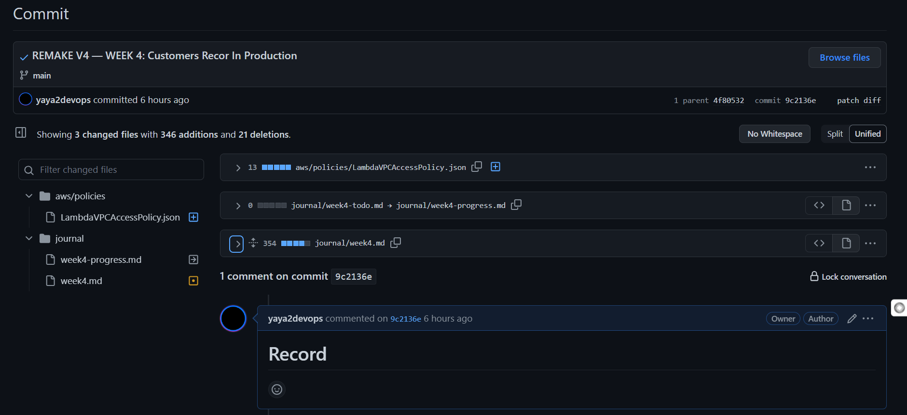
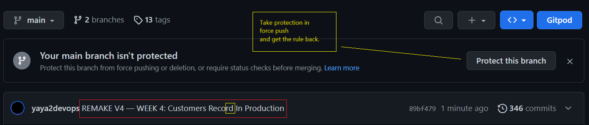

## Rename Latest Pushed Commit
```sh
$ git commit --amend -m "Rename Me"

$ git push --force origin main
```

### Try it out

I named this one  `REMAKE V4 — WEEK 4: Customers Recor In Production`

I missed the `d`. 

You can refer to the commit. I named the asset below with Its hash.



So, I did what [I just teached you above](#rename-latest-pushed-commit).
```
$ git commit --amend -m "REMAKE V4 — WEEK 4: Customers Record In Production"

[main 89bf479] REMAKE V4 — WEEK 4: Customers Record In Production
 Date: Fri Aug 25 09:53:12 2023 +0000
 3 files changed, 346 insertions(+), 21 deletions(-)
 create mode 100644 aws/policies/LambdaVPCAccessPolicy.json
 rename journal/{week4-todo.md => week4-progress.md} (100%)
```

Before forcing I had to unprotect the branch to force the push. Things you are expected to do when playing the tree and creating the reality.

```sh
gitpod /workspace/aws-cloud-project-bootcamp (main) $ git push --force origin main
gitpod /workspace/aws-cloud-project-bootcamp (main) $ git push --force origin main
Enumerating objects: 12, done.
Counting objects: 100% (12/12), done.
Delta compression using up to 16 threads
Compressing objects: 100% (7/7), done.
Writing objects: 100% (7/7), 5.33 KiB | 5.33 MiB/s, done.
Total 7 (delta 5), reused 1 (delta 0), pack-reused 0
remote: Resolving deltas: 100% (5/5), completed with 5 local objects.
remote: error: GH006: Protected branch update failed for refs/heads/main.
remote: error: Cannot force-push to this branch
To https://github.com/yaya2devops/aws-cloud-project-bootcamp.git
 ! [remote rejected] main -> main (protected branch hook declined)
error: failed to push some refs to 'https://github.com/yaya2devops/aws-cloud-project-bootcamp.git'
```

So Its working now.



```
gitpod /workspace/aws-cloud-project-bootcamp (main) $ git push --force origin main
Enumerating objects: 12, done.
Counting objects: 100% (12/12), done.
Delta compression using up to 16 threads
Compressing objects: 100% (7/7), done.
Writing objects: 100% (7/7), 5.33 KiB | 2.67 MiB/s, done.
Total 7 (delta 5), reused 1 (delta 0), pack-reused 0
remote: Resolving deltas: 100% (5/5), completed with 5 local objects.
To https://github.com/yaya2devops/aws-cloud-project-bootcamp.git
 + 9c2136e...89bf479 main -> main (forced update)
```

At the end. Go back and re-protect your branch. How? Find out—No links.