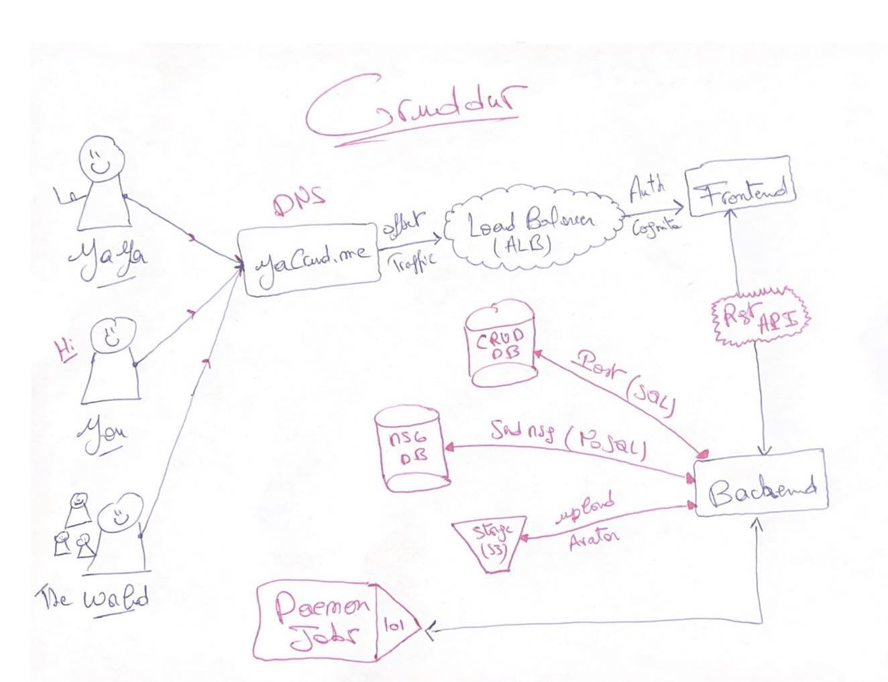
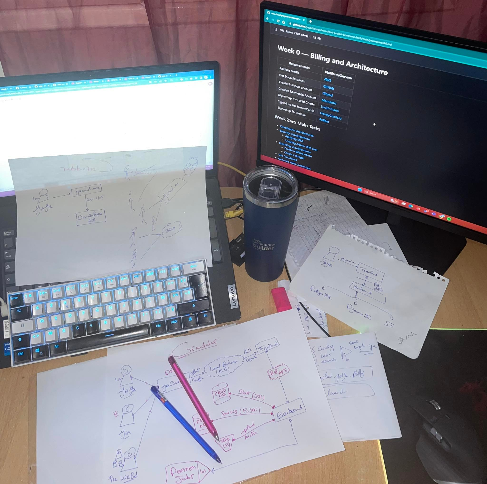
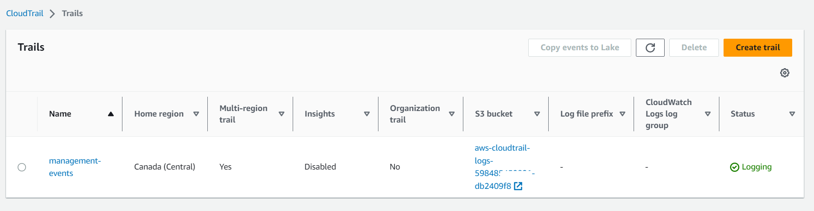
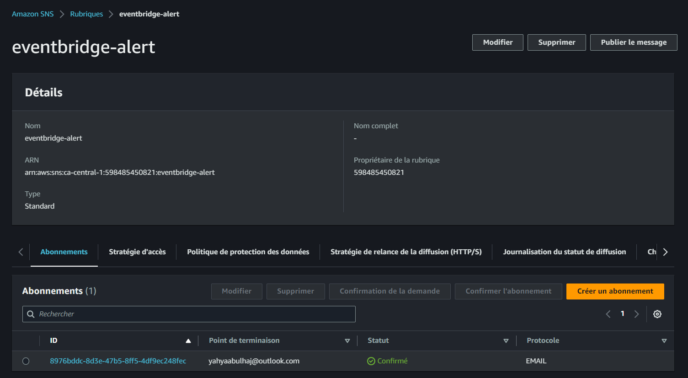
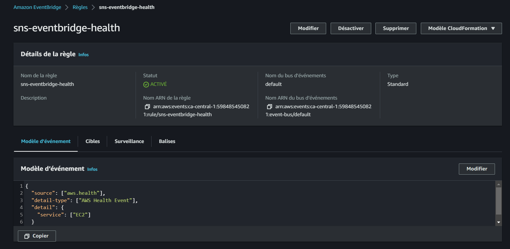
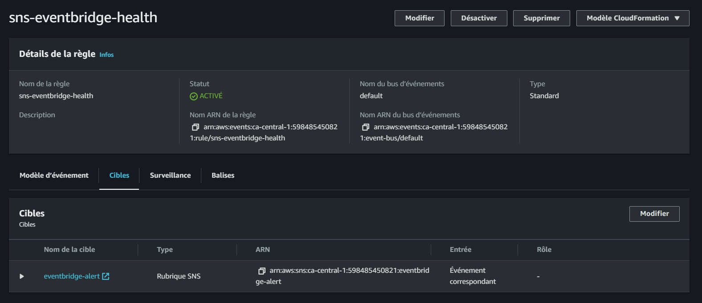
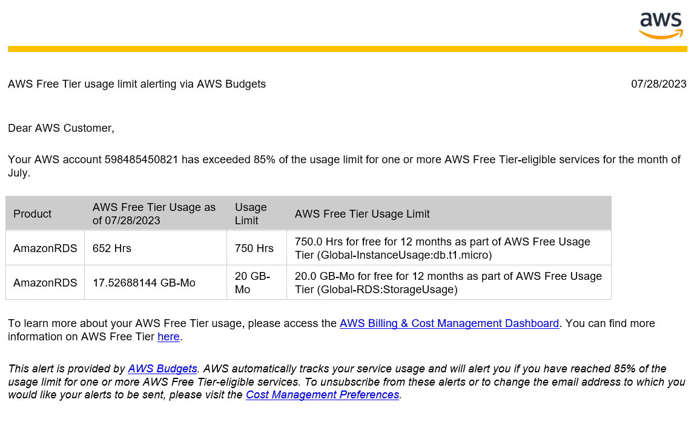

# Week 0 — Billing and Architecture
Welcome to the exhilarating kickoff of Week Zero in our AWS Cloud Bootcamp. This is the **perfect starting point** for your thrilling journey into the boundless realm of the cloud.

☁️ Are you ready to **take the first step** towards mastering the cloud❓

We'll be talking about **cloud architecture, security, cost considerations, and operations**. *Join us* as we unlock the secrets of the cloud, paving the way for a dynamicfuture in this rapidly evolving industry. 

## Week Zero Main Tasks
- [A Path Towards Modern Solutions](#a-path-towards-modern-solutions)
  - [Build Scalable and Resilient Applications](#build-scalable-and-resilient-applications)
  - [The Fundamental Pillars of Project Management](#the-fundamental-pillars-of-project-management)
  - [Develop a Common Dictionary](#develop-a-common-dictionary)
- [Types of Architectural Diagrams](#types-of-architectural-diagrams)
    - [When to Use Each Type](#when-to-use-each-type-of-architectural-diagram)
    - [How to Create an Architectural Diagram](#how-to-create-an-architectural-diagram)
    - [**Get started Diagramming Now**](#get-started-now)
  - [Creating Logical Diagram](#creating-logical-diagram)
  - [Creating Conceptual Design](#creating-conceptual-design)
  - [Creating CI/CD Flow](#creating-cicd-flow)
- [Frameworks for Efficient Design](#frameworks-for-efficient-design)
  - [The Open Group Architecture Framework](#the-open-group-architecture-framework)
  - [Paving the Way for Robust Systems](#paving-the-way-for-robust-systems)
  - [AWS Well-Architected Framework](#empowering-design-with-aws-well-architected-framework)
- [Security Considerations](#security-considerations)
  - [ Apply MFA to the AWS Root User](#how-to-apply-mfa-to-the-aws-root-user)
  - [What is an AWS Organization Unit?](#what-is-an-aws-organization-unit)
  - [Managing IAM Users and Roles in AWS](#managing-iam-users-and-roles-in-aws)
  - [Email Addresses with Aliasing](#email-addresses-with-aliasing)
    - [📧 Real-World Application](#-real-world-application)
  - [Seamless IAM User Connection](#seamless-iam-user-connection)
  - [Crafting an IAM AWS Role, Policy](#crafting-an-efficient-aws-role)
  - [Service Control Policies](#service-control-policies)
  - [CloudTrail for Enhanced Visibility and Security](#trailblazing-with-aws-cloudtrail)
- [Spend Considerations](#spend-considerations)
    - [Viewing Your AWS Spending](#viewing-your-aws-spending)
  - [CloudWatch Alarm](#cloudwatch-alarm)
  - [AWS Budget Made Easy](#aws-budget-made-easy)
  - [Checking and Claiming AWS Credits](#checking-and-claiming-aws-credits)
  - [Welcome To AWS Free Tier](#welcome-to-aws-free-tier)
- [Open Support ticket](#open-support-ticket)
- [Health Dashboard with SNS](#integrate-health-dashboard-with-sns-using-eventbridge)
  - [Real-time Messaging and Notification](#real-time-messaging-and-notification)

## Command AWS Like a Pro
Welcome to *AWS CLI onboarding experience* helping you to get things done more effectively.

- [Command-Line Interface In The Console](#command-line-interface-in-the-console)
- [Empower Your Favorite IDE with AWS](#empower-your-favorite-ide-with-aws-cli)
- [Go to Your Favorite IDE](#go-to-your-favorite-ide)
- [Install AWS CLI](#install-aws-command-line-tool)
- [Checking AWS Connections with Console](#checking-aws-connections-with-console)
- [**AWS CLI auto-prompt**](#aws-cli-auto-prompt)
    - [**Git Bash** ](#git-bash-)
    - [**Gitpod** ](#gitpod-)
- [Create AWS Budget Using the CLI](#create-aws-budget-using-the-cli)
- [Creating a CloudWatch Alarm](#creating-a-cloudwatch-alarm)

# A Path Towards Modern Solutions
A monolithic architecture is a traditional way of designing and developing apps where all of the application's code and data are contained in a single codebase. 


- **It is difficult to develop**. Because all of the code and data are in a single codebase, not practical to track changes and make updates which lead to errors and bugs.
- **It is difficult to deploy**. The entire application is deployed as a single unit, when you deploy changes to the application you can affect other parts of the application.
- **It is difficult to scale**. If the application experiences increased traffic, it can be difficult to scale the application without targeting performance.

In addressing the challenge at hand, a profound and enduring resolution emerged - the adoption of a cloud-native architecture. 

This forward-thinking approach harnessed the power of cloud technologies to reshape the very fabric of our systems, opening up a world of possibilities and transformative potential

## Build Scalable and Resilient Applications
**Cloud-native architecture** is a design methodology that uses cloud services to allow dynamic and agile application development techniques that take a modular approach to building, running, and updating software through a suite of cloud-based microservices versus a monolithic application infrastructure.

Before the release of the app, cloud architects typically follow these steps to ensure its successful implementation.
1. ***Define the project goals***<br>
The first step towards great cloud-native architecture is the discussions with both the technical and business team to ensure that the project's objectives are met in its entirety. It is also important to consider [the risks, assumptions, and constraints](#additional-considerations) that may be involved in the project.
2. ***Design the architecture***<br>
This step involves breaking down the application into microservices, which are small, independent services that can be developed, deployed, and scaled independently. Designs and its type will be [break down below](#⚡get-started-now).
3. ***Implement the microservices***<br>
Developing the microservices using a variety of technologies and deploying them to the cloud. The cloud platform e.g AWS will provide the infrastructure for running the microservices and managing their scaling.<br>
The µservices can be developed using a variety of technologies e.g. as Java, Go, or [**Python our case**](../backend-flask/README.md).
4. ***Test and deploy the application***<br>
The final step (Starting point) is to test and deploy the application. This involves [testing the microservices individually](week1.md#containerize-flask-app) and then [testing the application as a whole](week1.md#running-multiple-containers).

| Goals                            |   Substantiation     |
|----------------------------------|--------|
| Define the project goals         |   [Fund to PM](#the-fundamental-pillars-of-project-management)      |
| Design the architecture          |  [Architectures ](#types-of-architectural-diagrams)     |
| Implement the microservices      |  [Code Structure](../backend-flask/services/)      |
| Test and deploy the application  |  [Containerization](week1.md)    |

This project application is constructed upon this robust architecture, and we have committed to accomplishing each step outlined above. 

## The Fundamental Pillars of Project Management
In the realm of project management, certain key factors play a pivotal role in shaping the destiny of any endeavor. 

Before proceeding - prioritize reviewing [the project scenario and its objectives](resources/project-scenario.md).

***The Iron Triangle*** is a project management concept that refers to the three constraints that are commonly considered to be the most important in determining the success or failure of a project. 

**The three constraints are,**

| Constraint | Description |
|---|---|
| **Time** | Refers to the amount of time available to complete a project. The project needs to be completed within a specific timeframe, and any delays can have a significant impact on the project's success. |
| **Cost** | Refers to the budget available to complete a project. The project needs to be completed within the allocated budget, and any cost overruns can have a significant impact on the project's success. |
| **Scope** | Refers to the goals, deliverables, and features of a project. The project needs to meet the agreed-upon scope, and any changes or deviations from the scope can have a significant impact on the project's success. |

**Benefits of the Iron Triangle**

The Iron Triangle provides several benefits for project managers, including:

* It helps to ensure that projects are completed on time, within budget, and with the agreed-upon scope.
* It provides a framework for making decisions about project trade-offs.
* It helps to identify and manage risks.
* It provides a common language for communicating with stakeholders.

**How to Use the Iron Triangle**

The Iron Triangle can be used to manage projects by following these steps:

1. Identify the three constraints for your project.
2. Set realistic expectations for each constraint.
3. Monitor the constraints throughout the project.
4. Make trade-offs as needed to ensure that the project is completed successfully.

#### **Additional Considerations,**

| Concept | Description | Examples |
|---|---|---|
| **Risks** | Events that could happen and have a negative impact on the project | Late delivery, user commitment, technical problems |
| **Assumptions** | Things that we believe to be true but that haven't been proven | The budget being approved, sufficient network bandwidth, the availability of key resources |
| **Constraints** | Limitations that the project must adhere to | Time, budget, technical requirements |

Understanding the three constraints and how they interact, also the assumptions and the risks project managers can increase their chances of success.

## Develop a Common Dictionary
Have you ever wondered what would be a valuable tip I could share with you? READ.
- **Ask questions** — Don't be afraid to ask questions, even if you think they're obvious. This will help to ensure that everyone is on the same page.
- **Play "be-the-packet"** — This exercise can help you to understand how data is transmitted through the network.
- **Document everything** — This includes both technical and non-technical documentation.

**By doing so, you can achive the following :==)**
- *Prevents misunderstandings*<br>
Everyone will be using the same terminology, so there will be no confusion about what different terms mean.
- *Makes communication easier* <br>It will be easier for people to understand each other and to collaborate on projects.
- *Improves the quality of the product* <br>When everyone is on the same page, the product will be more likely to be successful.
How to Overcome Challenges

Lastly. Be patient. It takes time.💯<br>
Be consistent and use the same terminology throughout the project and be willing to compromise. 

Not everyone will agree on everything, but it's important to find common ground.

# Types of Architectural Diagrams

Architectural diagrams are visual representations of a software system's architecture. They are used to communicate the system's design to stakeholders, and to help developers understand how the system works.

There are three main types of architectural diagrams:

- **Conceptual diagrams (aka napkin designs)** provide a high-level overview of the system. They show the system's major components and how they interact.
- **Logical diagrams (aka blueprints)** show the system's functionality in more detail. They show how the system's components interact, and how data flows through the system.
- **Physical diagrams** show the physical components of the system, such as hardware, software, and networks. They show how these components are connected, and how they interact with each other.

Each type of architectural diagram has its own purpose, and they are often used together to provide a complete picture of the system's architecture.

### **When to Use Each Type of Architectural Diagram**
- **Conceptual diagrams** are used early in the development process, when the system's requirements are still being defined. They are a quick and easy way to communicate the overall idea of the system to stakeholders.
- **Logical diagrams** are used later in the development process, when the system's functionality is being designed. They are a more detailed way to communicate the system's design to developers.
- **Physical diagrams** are used in the final stages of development, when the system is being implemented. They are a way to communicate the system's design to system administrators and other technical staff.

Architectural diagrams are a valuable tool for communicating the design of a software system. They really can be used to expand your vision to whoever. 

### How to Create an Architectural Diagram
Here are different tools that can be used to create architectural diagrams. <br>I personally like first two.

- Lucidchart (Paid)
- draw.io (FREE)
- Microsoft Visio (Paid)

I used **Draw.io** extensively in weeks 5, 6, 7, 8 and nine. 

In week 10, you'll also find CloudFormation architectures *I* built using **Lucidchart**, which highlights the potential differences. <br>Logic, comparing a free product and a paid one.

In Lucidchart, you can conveniently access built-in shapes by navigating to "File" → "Import Data," making it an ideal platform for working with AWS-related projects.
- Here is a [DRAWIO Sample.](https://raw.githubusercontent.com/yaya2devops/aws-cloud-project-bootcamp/main/journal/assets/week9/CI-CD-Architect/ci-cd-architect.png)
- Here is a [Lucidchart Sample.](https://raw.githubusercontent.com/yaya2devops/aws-cloud-project-bootcamp/a22ddff9354e1ad1b680ed92383f5b0430d4f608/journal/assets/week11/big-bundle/0-App-Network-Buleprint.svg)


Find additional [diagramming tools, and AWS icons.](https://aws.amazon.com/fr/architecture/icons/) 

### **Get started Now**
⚡If budget is a concern, I highly recommend starting with Draw.io.<br>
There's even an [extension available in VS Code](https://marketplace.visualstudio.com/items?itemName=hediet.vscode-drawio) for you to design directly from your favorite IDE. 

I have included all the extensible files for your convenience. e.g. visit [week 8.](week8.md)<br>
Meaning, you can easily begin by importing one of my architecture files to DRAWIO and make edits on top. 

*Happy diagramming*!

## Creating **Logical Diagram**
Logical diagrams are more detailed than conceptual diagrams. 
> Communicate the system's design to developers.

- **System architecture:** The system will be a three-tier architecture, consisting of a presentation layer, a business logic layer, and a data access layer.<br>
- **Data flow:** The data flow will be unidirectional, with users entering data into the presentation layer, which will then pass the data to the business logic layer for processing. 

This also effectively showcases the diverse components comprising the Cruddur product ecosystem.


The business logic layer will then pass the data to the data access layer for storage. 

### Unveiling the Application Layers
An application layer is a software layer that provides a set of services for the application. The application layer is responsible for interacting with the user, processing business logic, and accessing data.

**The application layer is typically divided into three sublayers,**

- **User interface layer:** The user interface layer is responsible for interacting with the user. It provides a way for the user to input data and view output.
- **Business logic layer:** The business logic layer is responsible for processing business logic. It implements the rules and procedures that define the application's functionality.
- **Data access layer:** The data access layer is responsible for accessing data. It provides a way for the application to store and retrieve data from a database or other data source.

The application layer is a critical part of any software application. 

The application layer should be well-designed, well-implemented, and well-tested to ensure that the application is reliable and secure.

## Creating **Conceptual Design**

Overall idea and scope to create a system that will allow users to share information and collaborate on projects. Conceptual diagrams are often drawn on napkins or whiteboards, hence the nickname "napkin designs.

With genuine enthusiasm and a touch of artistic flair, I created this captivating design, delicately sketching every stroke with two pens - one dipped in serene blue and the other ablaze with passionate red. We hope you like it!

I ensured that the architecture was designed with the following key features in mind:
- Secure Platform: considering [Security best practices](#security-considerations)
- Robust Data Storage System: A reliable and scalable data storage system was integrated.



When designing, the following constraints were also put forward.
- The system must be scalable to accommodate a large number of users.
- The system must be affordable to operate with [costs considerations](#spend-considerations).

I believe you'll greatly appreciate my design, so I've provided it in [PDF format](assets/week0/Cruddur-Architecture/cruddur-architecture.pdf) for your convenience and enjoyment.

<details>
<summary> More! Behind the scenes </summary>

Welcome to my cozy space, where you can indulge in the delightful aroma of my freshly brewed AWS cup of coffee while finding abundant inspiration!
> When not at work, I work!


</details>

## **Creating CI/CD Flow**

Outlined below is the CI/CD pipeline I have designed, which aims to automate the process of code integration, testing, and deployment. This pipeline fosters collaboration and accelerates the delivery of high-quality software, facilitating a more responsive development environment.

- Developer commits code to GitHub repository.
- AWS CodePipeline is triggered.
- The pipes are stored in the S3 pipeline bucket.
- Code changes are retrieved from AWS CodeCommit and passed to AWS CodeBuild.
- CodeBuild compiles and builds the application artifacts.
- AWS CodeDeploy deploys the artifacts to the target environment.


Week zero marked the initial phase of our journey towards establishing robust DevOps and CI/CD pipelines. 

The real progress and significant advancements were witnessed [during week 9](week9.md). <br>Throughout this, we delved deep into the realm of DevOps and CI/CD pipelines, where the focus shifted from theoretical concepts to hands-on implementation and real-world application.

Kindly [direct your attention to week nine](week9.md), also find below lucidchart architectures.
- [Twitter System Architecture](https://lucid.app/lucidchart/3dd58bb4-27dc-440d-9dc0-9bcd0154a346/edit?viewport_loc=224%2C471%2C1939%2C867%2Cu~1sbYNXU9q3&invitationId=inv_b811bc56-a51b-4481-a306-2f347e725dc5)
- [Diagrams Design](https://lucid.app/lucidchart/f03569ad-27eb-435d-a81e-4c0d404e5951/edit?viewport_loc=-513%2C135%2C2720%2C1216%2CwcSxugjtXe~j&invitationId=inv_d8a1495b-87a4-4031-80bf-08a7067c8e12)

# Frameworks for Efficient Design
Frameworks are a valuable tool for any designer, architect or a *technologist*. 


Frameworks are essential for reducing complexity, minimizing errors, and making the design process more efficient. 

Frameworks provide a common language and methodology for teams to follow, which can help to ensure that everyone is on the same page and that the final product meets the desired requirements.

## The Open Group Architecture Framework
TOGAF is a widely used framework for enterprise architecture. It provides a comprehensive set of tools and techniques for designing, implementing, and managing enterprise architecture. TOGAF is structured into four main components:

- **Architecture Development Method:** A systematic approach to creating and implementing enterprise architecture.
- **Enterprise Continuum:** A classification scheme for organizing architecture artifacts.
- **Architecture Content Framework:** Defining the necessary skills, processes, and tools for efficient enterprise architecture development and management.
- **Architecture Capability Framework:** Establishing the core content of enterprise architecture.

## Paving the Way for Robust Systems
Emphasizing six critical pillars, the AWS Well-Architected Tool fosters the creation of highly reliable, secure, performant, and cost-efficient systems, while enabling agile responses to changing market trends and customer needs. 

**These pillars are,**
| Pillar | Focus |
| --- | --- |
| Operational Excellence | Utilizing a fully automated operations pipeline for IT operations |
| Security | Ensuring that security accounts are always up to date |
| Reliability | Building highly reliable systems that self-heal and recover quickly |
| Performance Efficiency | Ensuring that systems are running at peak performance efficiently |
| Cost Optimization | Reducing costs by utilizing cost optimization principles |
| Business Agility | Enabling rapid responses to changing customer requirements and market trends |

## Empowering Design with AWS Well-Architected Framework

The AWS Well-Architected Framework can be used to assess the current state of your applications and to identify areas where you can improve your architecture. 

The tool also provides recommendations for how to improve your architecture.

The AWS Well-Architected Framework incorporates a set of insightful questions aligned with the aforementioned pillars of the well-architected approach. 

Based on the inputs provided, the framework generates a comprehensive report, aiding businesses in achieving optimal and sustainable design outcomes.


***aws***
:  Is a term I use before a name to refer the act of searching a service in the console.

To get started, from the console aws `AWS Well-Architected Framework`.

# Security Considerations
AWS is literally a secure cloud platform, but it is as important to implement additional security measures to protect your data and applications. 

> Zero Trust, Verify Explicitly.

Also, Microsoft champions the path of zero compromise and explicit validation, setting a resolute standard for unwavering security and reliability.


- **Use strong authentication and authorization mechanisms.** Use IAM to create and manage users and roles, and requiring MFA for all users with access to sensitive data.
- **Implement network security.** This includes using security groups to control network traffic, and enabling encryption for data in transit and at rest.
- **Continuously monitor your resources.** Employ CloudTrail to track all API calls, and CloudWatch to monitor resource usage and performance.
- **Use secure coding practices.** Write code that is free of vulnerabilities, and using secure development practices such as code reviews and penetration testing.

| **Security Increase** | **Description** |
|---:|---|
| Data Protection & Residency | Protect your data by encrypting it at rest and in transit, and storing it in a region that meets your compliance requirements. |
| Governance & Compliance | Use the right AWS services and configure them correctly, and regularly audit your AWS environment to ensure that it is compliant with your security policies. |
| Shared Responsibility of Threat Detection | AWS takes responsibility for the security of the underlying cloud infrastructure, but you are responsible for the security of your data and applications. This includes detecting and responding to threats. |
| Incident Response Plans | Have a plan in place for responding to security incidents, including steps for identifying, containing, and remediating incidents. |

During camping, we addressed most security considerations. Below, you will find more of what matters. 

- **Use the principle of least privilege.** This means only giving users the permissions they need to perform their jobs, and no more.
- **Segment your network.** This will help to isolate your resources in case of a security breach.
- **Back up your data regularly.** To recover from a data breach or other disaster.
- **Have a disaster recovery plan.** Better restore your services in the event of a disaster.

Additionally, for CloudWatch configurations and continuous monitoring during the 12-week period and beyond, you can [refer back to week two](week2.md#monitor-flaskapp-with-cloudwatch).

## How to Apply MFA to the AWS Root User

The root user is the most powerful user in an AWS account, so it is important to secure it properly. 

One way to do this is to enable multi-factor authentication. MFA adds an extra layer of security by requiring users to provide two forms of identification when they sign in.

To enable MFA for the root user, follow these steps:

1. Sign in to the **AWS Management Console** as the root user.
2. In the navigation bar, choose **Your Account**, then **Security Credentials**.
3. In the **Multi-Factor Authentication (MFA)** section, choose **Assign MFA device**.
4. Follow the instructions to configure your MFA device.


- AWS strongly recommends enforcing MFA for all organization resources without any exceptions.

Once you have enabled MFA for the root user, you will need to provide your MFA token when you sign in. <br>
This will help to protect your account from unauthorized access.

## What is an AWS Organization Unit?
An AWS Organization Unit (OU) is a logical grouping of AWS accounts within an AWS Organization. OUs can be used to organize and manage AWS accounts more effectively, and to simplify account management tasks.

**Why use AWS Organization Units?**
- **To organize your AWS accounts by business unit, department, or application.** This can make it easier to track costs, assign permissions, and manage compliance.
- **To simplify account management tasks.** For example, you can use OUs to set up billing and cost allocation, and to apply policies to groups of accounts.
- **To improve security.** You can use OUs to restrict access to resources, and to enforce security policies.

**How to create an AWS Organization Unit**

To create an AWS Organization Unit, you can use the AWS Organizations console or the AWS CLI. Here are the steps to create an OU using the console:

1. Go to the AWS Organizations console.
2. Click the **Organization Units** tab.
3. Click the **Create organizational unit** button.
4. Enter a name for the OU.
5. (Optional) Enter a description for the OU.
6. Click the **Create** button.

You can now use it to organize your AWS accounts and to simplify account management tasks by business unit, application or department. 

##  Managing IAM Users and Roles in AWS
IAM users and roles are the foundation of AWS security. They allow you to control who can access your AWS resources and what they can do with them.
- **Roles:** A set of permissions that can be assumed by entities like users or services, allowing them to perform specific actions on AWS resources.
- **Policies:** JSON documents that define what actions are allowed or denied on AWS resources, providing fine-grained control over access permissions.

IAM users can be given specific roles to access AWS resources, which are controlled through policies assigned (technically attached) to these roles.

#### How to Set up an IAM User

An IAM user is an individual or application that uses AWS resources. To set up an IAM user, you need to:

1. Create a user name and password for the user.
2. (Optional) Tag the user with metadata.
3. Click next or "Suivant" ;)


## Email Addresses with Aliasing

AWS aliases are a way to create friendly names for AWS resources. For example, you could create an alias for an email address, a Lambda function, or a KMS key. 

**To create an AWS alias, you can take note of the following,**

- Use the **AWS CLI, the AWS Management Console, or the AWS SDKs**.
- AWS alias names must be **unique** within your **account** and **region**.
- WS alias names can contain **letters**, **numbers**, and the **characters** `-`, `_`, and `..`

**Some examples of valid AWS aliases Incl,**
- `example`
- `example-alias`
- `example.alias`
- `example+alias`

Here is how to create an alias for an email address using the AWS CLI:

```sh
aws ses create-alias --alias-name example --email-address example@example.com
```
- **aws ses:** This part of the command tells the AWS CLI to interact with the Amazon SES service.
- **create-alias:** This is the specific action that tells the AWS SES service to create an alias.
- **--alias-name example:** This option specifies the name of the alias you want to create. In this case, the alias name will be "example".
- **--email-address example@example.com:** This option specifies the email address to which the alias will be associated. In this case, the alias "example" will be associated with the email address "example@example.com".

### 📧 Real-World Application

Let's say you have an online store that sends order confirmation emails to customers.

The primary email address you use for sending these emails is `orders@boutiquoo.com` and this email address is already verified in Amazon SES.

You now want to create an alias for tracking emails related to order cancellations.

To do this, you can use the AWS CLI with the following command:
```sh
aws ses create-alias --alias-name order-cancellations --email-address orders@boutiquoo.com
```
- The alias name is "order-cancellations".
- The email address associated with the alias is `orders@boutiquoo.com`.
- The alias email address itself for `order-cancellations` is `order-cancellations@boutiquoo.com`

### Seamless IAM User Connection

Once you have set up an IAM user, you can connect to the AWS Management Console as that user. 
1. Open the AWS Management Console in a web browser.
2. In the sign-in dialog box, select **IAM user**.
3. Enter the user name and password for the IAM user.
4. Click **Sign in**.


### Crafting an Efficient AWS Role:

1. Select the type of role you want to create.
2. Attach a policy to the role that grants the role the permissions it needs to access your AWS resources.
3. (Optional) Tag the role with metadata.


### Policy Attachment in AWS

1. Go to the IAM console in the AWS Management Console.
2. In the navigation pane, select **Policies**.
3. Select the policy that you want to attach.
4. Click **Attach Policy**.
5. Select the role or user group that you want to attach the policy to.
6. Click **Attach**.


### Service Control Policies
SCPs are a type of organization policy that you can use to manage permissions in your organization. 

- SCPs can help to simplify the management of permissions in an organization.
- SCPs can help to improve security by preventing unauthorized users from performing certain actions.
- SCPs can help to reduce costs by preventing users from creating unnecessary accounts or resources.

SCPs are enforced at the root of your organization, and they can be used to deny or allow specific actions for all accounts in your organization.

1. In the navigation IAM pane, select Service control policies.
2. Click Create policy.
3. In the Policy name field, enter a name for your SCP.
4. In the Policy document field, paste the JSON code for your SCP.
```JSON
{
    "Version": "2012-10-17",
    "Statement": [
        {
            "Effect": "Deny",
            "Action": [
                "organizations:LeaveOrganization"
            ],
            "Resource": "*"
        }
    ]
}
```
5. Click Create.

Once you have created your SCP, you need to attach it to the root of your [organizational unit (OU)](#what-is-an-aws-organization-unit). 

1. In the navigation pane, select **Organization**.
2. In the **Accounts** tab, select the root of your organization or the OU that you want to attach the SCP to.
3. Click **Service control policies**.
4. Click **Attach policy**.
4. In the **Policy** list, select the SCP that you want to attach.
5. Click **Attach.**

| Information | Description |
|---:|---|
| SCP order of application | SCPs are applied in the order that they are attached.<br> The first SCP that matches an action will be the one that is enforced. |
| Multiple SCPs | You can attach multiple SCPs to the same root or OU.<br>  In this case, the SCPs will be evaluated in the order that they are attached. |
| IAM policy overrides | SCPs can be overridden by IAM policies. If an IAM policy grants a user or role permission to perform an action that is denied by an SCP, the IAM policy will take precedence. |

The SCP will now be applied to the root of your organization or to the OU that you selected.

## Trailblazing with AWS CloudTrail
In general, a ***trail*** refers to a marked or beaten path or track, often in a natural environment such as a forest, mountain, or wilderness area.

**AWS Cloud Trail** is an auditing service that records AWS API calls and related events. 

**This data can be used to,**
* Security Analysis
* Incident Response
* Audit logs and compliance
* Track user activity
* Troubleshoot issues
### Create a Cloud Trail

1. aws AWS CloudTrail.
2. Click **CreateTrail**.
3. Enter a name for your trail.
4. Select the regions and accounts that you want to monitor.
5. Select the events that you want to log.
6. Choose a S3 bucket to store your Cloud Trail logs.
7. Click **Create**.



## Integrate Health Dashboard with SNS

In this part, I'll walk you through the process of configuring a Sub/Pub system with SNS and EventBridge to enable notifications for your Health Dashboard.

The Health Dashboard is a critical component for monitoring the well-being of your application. It tracks vital metrics, such as server health, response times, and resource utilization.

Integrating the Health Dashboard with SNS via EventBridge, you can receive real-time notifications on important events and take immediate action when necessary.

**Step 1: Create an SNS Topic - Pub**

Begin by creating an SNS topic using the AWS Command Line Interface (CLI):
```sh
aws sns create-topic --name eventbridge-alert
```

This command will return the Amazon Resource Name (ARN) of the newly created topic:
```JSON
{
    "TopicArn": "arn:aws:sns:<AWS-REGION>:<aws-id>:eventbridge-alert"
}
```

**Step 2: Subscribe to the SNS Topic**

Next, subscribe to the SNS topic with your preferred communication channel (e.g., email) to receive notifications:
```sh
aws sns subscribe \
--topic-arn arn:aws:sns:<REGION>:<ACCOUNTID>:eventbridge-alert \
--protocol <email> \
--notification-endpoint <EMAIL>
```
The system will provide a response in JSON format. 

The response will include a key-value pair, where the key is "SubscriptionArn" and the value is "pending confirmation."
```JSON
{
    "SubscriptionArn": "pending confirmation"
}
```
Upon subscription, a confirmation email will be sent to the specified EMAIL, containing a confirmation link.
```txt
You have chosen to subscribe to the topic: 
arn:aws:sns:<aws-region>:<aws-id>:eventbridge-alert
To confirm this subscription, click or visit the link below (If this was in error no action is necessary): 
Confirm subscription
```


- Please access the console and navigate to SNS to locate the confirmations<br> It will be listed in the subscription column.



**Step 3: Create an EventBridge Rule**

1. Use the [provided file](../aws/json/sns-event-bridge.json) to create an EventBridge rule that defines the event pattern:
```sh
aws events put-rule --name "sns-eventbridge-health" \
--event-pattern file://aws/json/sns-event-bridge.json
```

2. Upon successful execution, the command will return the ARN of the created rule:
```JSON
{
    "RuleArn": "arn:aws:events:<AWS-REGION>:<AWS-ID>:rule/sns-eventbridge-health"
}
```


**Step 4: Add a Target to the Rule**
1. Finally, add the SNS topic as the target for the EventBridge rule:
```sh
aws events put-targets --rule sns-eventbridge-health --targets "Id"="1","Arn"="arn:aws:sns:<AWS-REGION>:<REDACTED>7434:eventbridge-alert"
```

If successful, the command will return a response indicating no failure entries:
```JSON
{
    "FailedEntryCount": 0,
    "FailedEntries": []
}
```
**Step 5: Navigate to the Console**

You have successfully integrated your Health Dashboard with SNS using EventBridge. 



# Spend Considerations
The costs of services can vary depending on many factors which it is being offered.

Here are some approches, self-architected, to consider when planning your AWS spend.

### Understanding Cost Variability
The costs of services can vary based on factors such as the type of service and the region where it is provisioned. 
| Factor | Description |
|---|---|
| **Type of service** | Some services, such as EC2 instances, are charged by the hour, while others, such as S3 buckets, are charged by the GB. |
| **Region** | The cost of a service can vary depending on the region in which it is being offered. For example, the cost of an EC2 instance in the us-east-1 region is different from the cost of an EC2 instance in the us-west-2 region. |
| **Amount of usage** | The more you use a service, the more you will pay. For example, if you run an EC2 instance for 10 hours, you will pay more than if you run it for 1 hour. |

It's essential to be aware of these variations and make informed decisions to control expenses.

### Choosing the Right Pricing Model
**When selecting instances, you have three primary pricing options,**
| Pricing Model | Description |
|---|---|
| **On-Demand** | Pay as you go. You are charged for the resources you use, when you use them. |
| **Reserved Instances** | Pay a one-time upfront fee for a reserved capacity. You will receive a discount on the hourly rate for the reserved capacity. |
| **Spot Instances** | Pay a discounted price for spare EC2 instances. Spot Instances are available when demand for resources is low. |

### Continuously Monitor and Optimize Spending

AWS offers a plethora of options and services that can be leveraged to optimize spending while maintaining high-performance levels. 

| Service | Description |
|---|---|
| **Cost Explorer** | Cost Explorer provides a graphical view of your AWS costs. You can use Cost Explorer to track your costs over time, identify areas where you can save money, and set budgets. |
| **AWS Budgets** | AWS Budgets allows you to set alerts and notifications when your AWS costs exceed a certain threshold. This can help you avoid unexpected costs. |
| **Spot Instances** | Spot Instances are spare EC2 instances that are available at a discounted price. You can use Spot Instances to save money on compute resources. |
| **AWS Trusted Advisor** | AWS Trusted Advisor offers real-time guidance to optimize your AWS infrastructure across various aspects, including cost optimization, security, performance, and fault tolerance. |

### Viewing Your AWS Spending
To view your AWS spending and services currently running, follow these steps:

1. Log in to your AWS Management Console.
2. In the left pane, click on **"Profile."**
3. From the dropdown, select **"Billing Dashboard."**
4. Click on **"Bills"** to access the detailed billing information.

Gain insights into your current and past bills, helping you keep track of your AWS expenditure

## CloudWatch Alarm

CloudWatch alarms are a powerful way to monitor your AWS resources and take action when certain conditions are met. For example, you can create an alarm that will send you an email notification if your EC2 instance CPU utilization exceeds 80%.


1. Go to the [CloudWatch console](https://console.aws.amazon.com/cloudwatch/).
2. Click the **Alarms** tab.
3. Click the **Create Alarm** button.
4. In the **Select Metric** dialog box, select the metric that you want to monitor.
5. In the **Threshold** dialog box, specify the threshold value and the evaluation period.
6. In the **Actions** dialog box, specify the actions that you want to take when the alarm is triggered.
7. Click the **Create Alarm** button.


- **Get Notified** 
Receive Cloudwatch Alarm Topic Notifications Directly to Your Inbox.


I started my journey in the [US East Central region](#aws-cloudshell) and subsequently shifted to CA Central for upcoming weeks.

## AWS Budget Made Easy

Billing Management Budgets are a newer method of alerting about spending that replaces alerts. Budgets allow you to set a spending limit and receive notifications when your spending exceeds the limit.

To create a Billing Management Budget, go to the [Billing console](https://console.aws.amazon.com/billing/home#/budgets) and click the **Create Budget** button.


**E.g. notifies when,**
- actual spending reaches 85% 
- forecasted spend is expected to reach 100%

# Checking and Claiming AWS Credits

AWS credits are a great way to save money on your AWS bill. There are a number of ways to get AWS credits, including:

* **AWS Activate**. AWS Activate is a program that provides eligible startups with up to $100,000 in AWS credits.
* **AWS Promotional Credits**. AWS Promotional Credits are offered to customers who meet certain criteria, such as signing up for a new AWS service or attending an AWS event.
* **AWS Partner Credits**. AWS Partner Credits are offered by AWS partners to their customers.

Once you have AWS credits, you can check your balance and claim them in the AWS Billing console. To do this, follow these steps:

1. Go to the [AWS Billing console](https://console.aws.amazon.com/billing/home#/).
2. Click the **Profile** tab.
3. Click the **Billing Dashboard** tab.
4. Click the **Credits** tab (left pane).

The Credits tab will show you a list of your AWS credits, including the credit amount, expiration date, and remaining balance. To claim a credit, click the **Claim** button next to the credit.

Once you have claimed a credit, it will be applied to your AWS bill. The credit will be applied to the first eligible charges on your bill, until it is exhausted.


> Some credits are only applicable to a few services.

## Welcome To AWS Free Tier

The AWS Free Tier is a great way to try out AWS services for free. The Free Tier offers a variety of services, each with different types of free options.



To view details related to AWS Free Tier, visit the [AWS Free Tier website](https://aws.amazon.com/free).

**Here are some of the benefits of using the AWS Free Tier,**
* You can try out AWS services without having to pay anything.
* You can learn how to use AWS services without having to commit to a paid plan.
* You can use the AWS Free Tier to build and test your applications.

**Here are some of the limitations of the AWS Free Tier,**
* The Free Tier is limited to certain services and usage levels.
* The Free Tier does not include all AWS services.
* The Free Tier is not available to all customers.

**Here are some tips for using the AWS Free Tier,**
* **Choose the right services.** Not all AWS services are available in the Free Tier. Choose the services that are most relevant to your needs.
* **Track your usage.** The AWS Free Tier has usage limits. Make sure that you are not exceeding the limits.
* **Plan for the future.** The Free Tier is not a permanent solution. Plan for how you will pay for AWS services when the Free Tier expires.

## Command-Line Interface In The Console

AWS CloudShell is a browser-based shell that you can use to interact with AWS services. CloudShell is pre-configured with the AWS CLI and other tools, so you can start using AWS services right away.

**To use AWS CloudShell:**

1. Go to the [AWS CloudShell console](https://console.aws.amazon.com/cloudshell/).
2. Click the **Launch CloudShell** button.
3. A new tab will open in your browser with a pre-configured shell.
4. Type the following command while inside.
```bash
aws sts get-caller-identity
```
- Yes, It is Implicit authentication check.


> Please refer to the shell, It is in us-east-1.

## **Empower Your Favorite IDE with AWS CLI**

*W*hether  you're using Codespaces, Gitpod, your own hosted IDE on a cloud VM, or an on-premises setup, here are the typical steps you can follow to onboard yourself with the AWS Command Line Interface.

### **Generate AWS credentials**

To begin authenticating your AWS account with any IDE, you need to first generate the necessary credentials from your AWS console.

1. In the AWS CloudShell, click the **Profile** icon in the top right corner.
2. Click the **Credentials** tab.
3. Click the **Create New Profile** button.
4. In the **Profile Name** field, enter a name for your profile.
5. In the **Access Key ID** and **Secret Access Key** fields, enter your AWS credentials.
6. Click the **Create Profile** button.


### Go to Your Favorite IDE

### **Setting Environement Variables**

1. In its terminal, run the following commands:
```BASH
export AWS_ID=your_aws_id
export AWS_ACCESS_KEY_ID=your_access_key_id
export AWS_SECRET_ACCESS_KEY=your_secret_access_key
```

2. E.g. you can persist environment variables by using the command `gp env` after rerunning the above commands.
```BASH
gp env  AWS_ID=your_aws_id
gp env AWS_ACCESS_KEY_ID=your_access_key_id
gp env AWS_SECRET_ACCESS_KEY=your_secret_access_key
```


3. Once you have set the environment variables, you can start onboarding the AWS CLI in Gitpod.

## Install AWS Command-Line Tool

The AWS CLI is a command-line tool that allows you to interact with AWS services. It is a powerful tool that can be used to automate tasks, manage resources, and troubleshoot problems.

To install the AWS CLI, you can follow these steps:

1. Download the AWS CLI package from the [AWS website](https://aws.amazon.com/cli/).
```BASH
curl "https://awscli.amazonaws.com/awscli-exe-linux-x86_64.zip" -o "awscliv2.zip"
```
2. Unzip the package.
```bash
unzip awscliv2.zip
```
3. Run the `install` script.
```bash
sudo ./aws/install
```
Once you have installed the AWS CLI, you can verify that it is installed by running the following command:
```bash
aws --version
```
> This will print the version of the AWS CLI that is installed.

### Checking AWS Connections with Console

Once you have installed the AWS CLI, you can check that you are connected to AWS by running the following command:
```bash
aws sts get-caller-identity
```
> If you are [pondering!](#setting-environement-variables)

This command will return your AWS account ID, your AWS Region and your Arn.

You can also get your AWS account ID by running the following command:
```bash
export AWS_ACCOUNT_ID=$(aws sts get-caller-identity --query Account --output text)
```
This command will export the AWS account ID to the environment variable` AWS_ACCOUNT_ID`. You can then use this variable in other AWS CLI commands.

## **AWS CLI auto-prompt**

The AWS CLI auto-prompt is a feature that allows you to use the `Enter` key to complete commands. <br>This can save you time and effort when you are using the AWS CLI.

### **Git Bash** <br>

- To enable the AWS CLI auto-prompt, you need to add the following lines to your `.bashrc` file


```BASH
export AWS_CLI_AUTO_PROMPT=on
export PS1="\[\033[38;5;247m\]\u\[$(tput sgr0)\]\[\033[38;5;15m\]@\[$(tput sgr0)\]\[\033[38;5;243m\]\h\[$(tput sgr0)\]\[\033[38;5;15m\]:\[$(tput sgr0)\]\[\033[38;5;47m\]\w\[$(tput sgr0)\]\[\033[38;5;15m\]\\$ \[$(tput sgr0)\]"
```
Once you have enabled the AWS CLI auto-prompt, you can start using it by typing the first few characters of a command and then pressing the `Enter` key. The AWS CLI will complete the command for you.


### **Gitpod** <br>

To easily enable AWS CLI auto-prompt in your Gitpod environment for the AWS CLI, follow these instructions:

1. Open your `.gitpod.yml` file in your Gitpod workspace.
2. Include the `env` section within the `tasks` section related to the CLI phase.
3. Assign it the following value.
```yaml
env:
  AWS_CLI_AUTO_PROMPT: on_partial
```
4. Save the `.gitpod.yml`.

Go to Gitpod Terminal and try it!


## Create AWS Budget Using the CLI

We did create the budget above using clickops. But now you possess the cli skills. Let's try the real magic :)

Again, an AWS Budget is a way to track your AWS costs and set alerts when your costs exceed a certain threshold. 

To create an AWS Budget, you can follow these steps:

1. Create a [budget JSON file.](../aws/json/budget.json)
1. Create a [notifications JSON file](../aws/json/budget-notifications-with-subscribers.json).
2. Configure a your budget as code.

3. Run the `aws budgets create-budget` command.

```
aws budgets create-budget \
    --account-id $AWS_ACCOUNT_ID \
    --budget file://aws/json/budget.json \
    --notifications-with-subscribers file://aws/json/budget-notifications-with-subscribers.json

```
- The [budget JSON file](../aws/json/budget.json) specifies the budget settings, such as the budget name, the budget type, the budget amount, and the budget notifications. 
- The [notifications JSON file](../aws/json/budget-notifications-with-subscribers.json) specifies the notification settings, such as the notification topic ARN, the notification protocol.


By checking the console, you will notice that there are now two budgets available. 

- The first budget, "clickops," [was created earlier.](#aws-budget-made-easy) 
- The other from the terminal. Bringing the total number of budgets to two.


**[Reference](https://docs.aws.amazon.com/cli/latest/reference/budgets/create-budget.html#examples)**

## Real-time Messaging and Notification

SNS is a service that allows you to send and receive notifications. You can use SNS to send notifications to email addresses, phone numbers, and other endpoints.

To set up SNS for your budget, you can follow these steps:

1. Create a SNS topic.
```bash
aws sns create-topic --name CLI-billing-alarm
```


2. Subscribe to the topic.

The SNS topic will be used to send notifications when your budget is exceeded. You can subscribe to the topic using email, SMS, or other protocols.

Once you have created the SNS topic and subscribed to the topic, you can start receiving notifications when your budget is exceeded.
```bash
aws sns subscribe \
    --topic-arn="arn:aws:sns:ca-central-1:598485450821:CLI-billing-alarm" \
    --protocol=email \
    --notification-endpoint yahyaabulhaj@outlook.com
```


- Go to the console and check if the changes took effects


* [AWS Budgets documentation](https://docs.aws.amazon.com/budgets/latest/userguide/budgets-getting-started.html)
* [AWS SNS documentation](https://docs.aws.amazon.com/sns/latest/dg/)

## Creating a CloudWatch Alarm

A CloudWatch alarm is a way to monitor your AWS resources and take action when they exceed a certain threshold. Alarms can be used to help you avoid overspending on AWS resources and to troubleshoot problems.

To create a CloudWatch alarm, you can follow these steps:

1. Create a CloudWatch alarm JSON file.
2. Run the `aws cloudwatch put-metric-alarm` command.

```
aws cloudwatch put-metric-alarm --cli-input-json file://aws/json/alarm_config.json
```


The CloudWatch alarm JSON file specifies the alarm settings, such as the alarm name, the metric to monitor, the threshold, and the alarm actions.

Once you have created the CloudWatch alarm JSON file, and ran the `aws cloudwatch put-metric-alarm` command to create the alarm. You will see an alarm on daily estimated charges to verify.


## **Open Support ticket**  

The AWS Support Center is a way to get help from AWS support engineers. You can open a support ticket to request help with a problem you are having with AWS services.

To open a support ticket, you can follow these steps:

**[Request  Service Limit](https://support.console.aws.amazon.com/support/home#/ )**

1. Navigate to the AWS Support Center.(Link Above)
2. On the left side menu, select "Create Case".
3. Select "Looking for service limit increase?" from the link in the center right.
4. Specify the limit or feature that you need.
5. Click on "Create Case".
6. Verify that the ticket you opened reflects the necessary details.


Once you have opened a support ticket, you will receive an email confirmation with the ticket number. You can use the ticket number to track the status of your ticket.


* [CloudWatch alarms documentation](https://docs.aws.amazon.com/AmazonCloudWatch/latest/monitoring/AlarmQuickStart.html)
* [AWS Support Center documentation](https://docs.aws.amazon.com/awssupport/latest/userguide/troubleshooting-support-case.html)