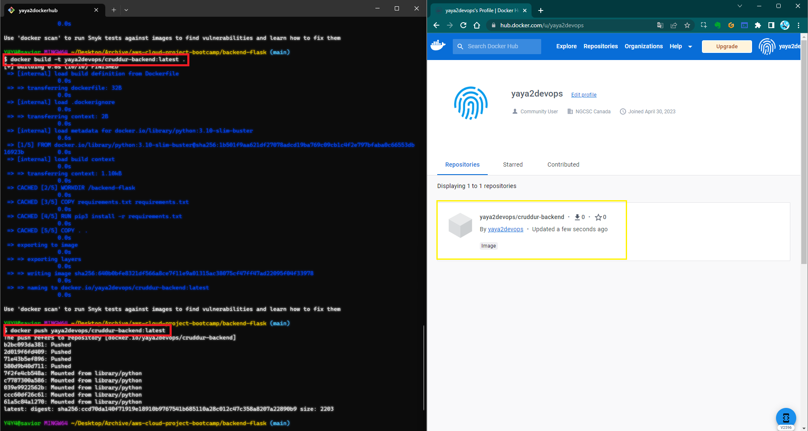
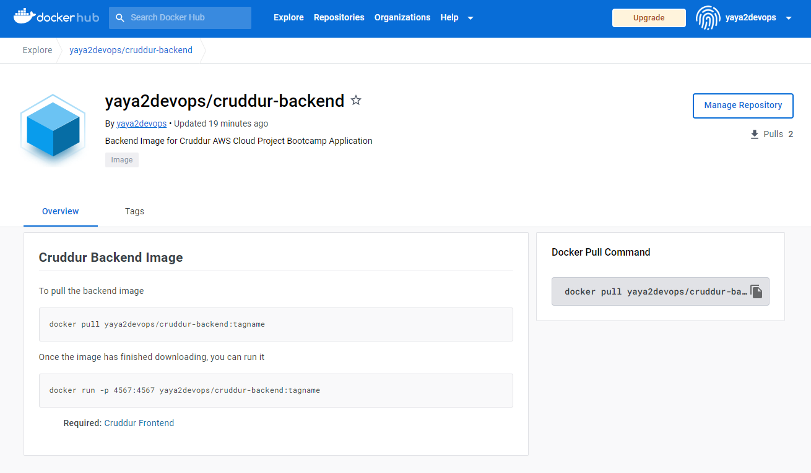
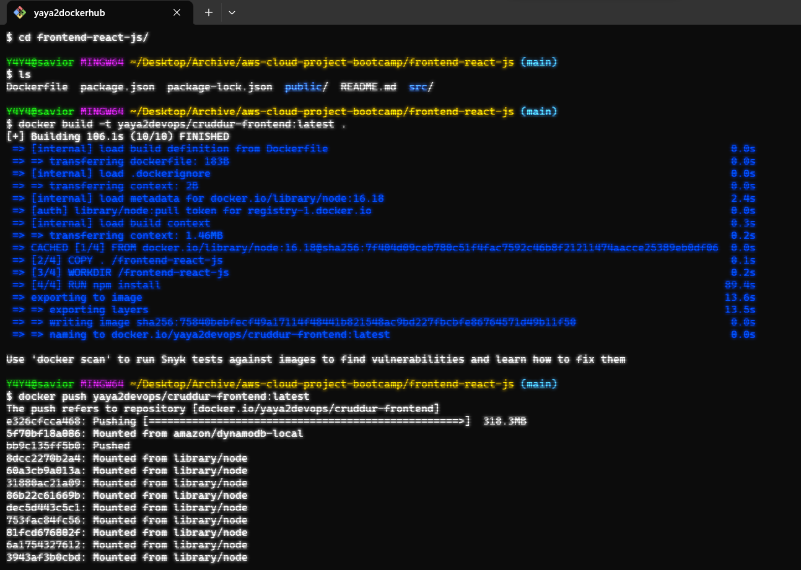
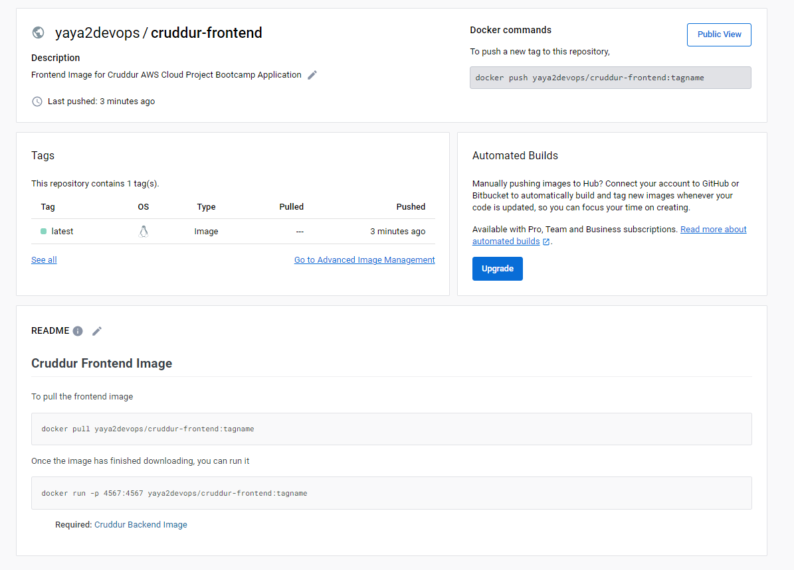
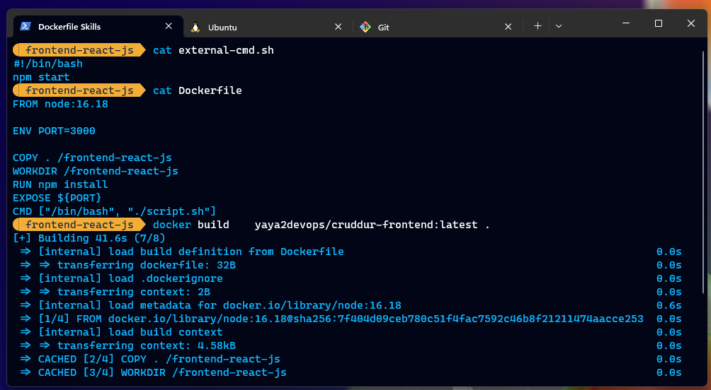

# Week 1 — App Containerization


| Objective           | Description                                                                 |
|---------------------|-----------------------------------------------------------------------------|
| **Backend**  | Learn how to use Flask framework to create web applications                 |
| **Docker for 1container**  | Learned how to Dockerize applications using Dockerfile                         |
| **Mutiple Containers**  | Learned how to use Docker Compose to run containers //                   |
| **Problem Solving**  | Learned how to troubleshoot using the debugger and error codes                |


---

## Brief Considerations

This week was jam-packed of learning experiences. 


- I created a `Dockerfiles` and built the Docker containers for both the front end & the backend. 
- I then ran each individually before configuring Docker Compose to run both containers // with `docker-compose up`.
- In the front end, I installed required dependencies and packages, such as `react-scripts`, and made certain that package installations were correctly directory-targeted. 
- In addition, I learned more about React components and patterns, which were relatively simple in comparison to the backend.
- Moving on to the backend with Flask on top of the great Python, I installed some packages and added 'em to the backend directory's gitignore file. 
- I also learned more about APIs & the services features towards a microservice architecture, and `README.IO` proved to be a useful tool for creating API documentation.
- I worked on adding the notification feature to the website. 
- I  installed DynamoDB using AWS CLI and performed additional database operations such as table creation and listing
- I configured Postgres in `.gitpod` along AWS CLI required commands incl. in [journal zero](week0.md), connecting to the database, and performed basic database operations.


---

## Week One Main Tasks
> week two if we started counting from one.

- Containerize Application
- Document the Notification Endpoint
Flask Endpoint for Notifications
- React Page for Notifications  
- Run DynamoDB Local Container
- Run Postgres Container
- Run the Dockerfile CMD as an external script
- Running container on local machine
- Multi-Stage Docker Build
- Health check in Docker Compose
- Push and tag image to DockerHub
- Launch Docker Container on EC2


---
Do you know, i wrote an article about Docker last year? <br>**Click**.

[](https://blog.yahya-abulhaj.dev/containers-docker-or-what-exactly-is-that)
---


| Prerequisites           | Description                                                                 |
|---------------------|-----------------------------------------------------------------------------|
| **Project**    | Install [Docker ](../.gitpod.yml#L49) extension                                         |
| **Backend**    | Install Flask and its [dependencies](../backend-flask/requirements.txt)                                         |
| **Frontend**    | Install NPM for ReactJS to use react-scripts                                |


## Backend work:
### Install Flask


### Install Flask Core


### Docker Run issue, Env Variable


### Logs Troubleshoot


### Server is working


### building docker image


### Success Build


### Docker PS from BASH


### Listing current images


### working ports


### Data is here


### Docker Run


## Frontend

Front end is honestly easier, same process, the only diff is the docker compose to be able to run both dockers same time and get ur app running and functional with backend.


### NPM required


### Building front docker, using the dockerfile ofc


### Some stats of what i have 


## Result Front Container


### The union port issue
You have to shutdown the frontend container since it will be used by docker compose later when running the entire app.


### Docker compose, using compose up or from terminal


# Troubleshooting

This didnt work cause i forgot to install npm which itself will require the react scripts required for our front end reactjs application frontend


## This command was a game changer


# More Troubleshooting


[](https://www.youtube.com/watch?v=QHj7mUYc0LE&ab_channel=Yahya)


| CONTAINER ID   | IMAGE                                          | COMMAND                  | CREATED          | STATUS                 | PORTS                                       | NAMES                                      |
| -------------- | ---------------------------------------------- | ------------------------ | ---------------- | ---------------------- | ------------------------------------------- | ------------------------------------------ |
| 61ab34832d8a   | aws-cloud-project-bootcamp-frontend-react-js   | "docker-entrypoint.s…"   | 18 minutes ago   | Up 18 minutes          | 0.0.0.0:3000->3000/tcp, :::3000->3000/tcp   | aws-cloud-project-bootcamp-frontend-react-js-1 |
| 3ed9dff36c1e   | aws-cloud-project-bootcamp-backend-flask       | "python3 -m flask ru…"   | 18 minutes ago   | Up 18 minutes          | 0.0.0.0:4567->4567/tcp, :::4567->4567/tcp   | aws-cloud-project-bootcamp-backend-flask-1 |
| 6da1651b38c0   | postgres:13-alpine                             | "docker-entrypoint.s…"   | 4 hours ago      | Up 4 hours (healthy)   | 0.0.0.0:5432->5432/tcp, :::5432->5432/tcp   | aws-cloud-project-bootcamp-db-1             |
| cd062d6c1188   | amazon/dynamodb-local:latest                   | "java -jar DynamoDBL…"   | 4 hours ago      | Up 4 hours             | 0.0.0.0:8000->8000/tcp, :::8000->8000/tcp   | dynamodb-local    |           


## Docker Compose Success


## I'm there! Welcome To the App


# Sign ins


# First CRUDD !


# Notification Feature 

### How i'm starting


READMEDOTIO For APIs 


### A sceenshot me into backend


## Including the endpoint URL For the notification API


## Checking it, works JSON


## UI NOTIF EFFECTS


# Dynamo Local


AWS check to use for dynamoDB


## Create DB
```
aws dynamodb create-table \
    --endpoint-url http://localhost:8000 \
    --table-name Music \
    --attribute-definitions \
        AttributeName=Artist,AttributeType=S \
        AttributeName=SongTitle,AttributeType=S \
    --key-schema AttributeName=Artist,KeyType=HASH AttributeName=SongTitle,KeyType=RANGE \
    --provisioned-throughput ReadCapacityUnits=1,WriteCapacityUnits=1 \
    --table-class STANDARD
```


## Create an Item
```

aws dynamodb put-item \
    --endpoint-url http://localhost:8000 \
    --table-name Music \
    --item \
        '{"Artist": {"S": "No One You Know"}, "SongTitle": {"S": "Call Me Today"}, "AlbumTitle": {"S": "Somewhat Famous"}}' \
    --return-consumed-capacity TOTAL  
```


## list Tables


```
aws dynamodb list-tables --endpoint-url http://localhost:8000
```


## Get Records

```
aws dynamodb scan --table-name cruddur_cruds --query "Items" --endpoint-url http://localhost:8000
```


# Postgres

Have it in `.gitpod`:


After going to DB Explorer and created a connection:


Connect to postgres:
```
psql --host localhost
```

or our case Connect to postgres with password as pw (Picked it DB Explorer):

```
psql -Upostgres --host localhost
```


- This will get you into Postgres

### Database Stuff
to find relations:
```
\d
```


to check tuples on or off:
```
\t
```


to see ID owner and description:

```
\dl
```


to see templates:

```
\l
```


## Finished work? Quit DB


---

### Docker Local

**Codespaces:**


**Docker Desktop:**


**Local Work:**


> [Cause](week3.md#codespaces-down---moving-to-local)


### Cruddur Imgs To Dockerhub

**Push & tag images**


- Push to dockerhub
```
docker push yaya2devops/cruddur-frontend:latest
docker push yaya2devops/cruddur-backend:latest
```

**Building and pushing Backend:**

```
docker build -t dockerhub-username/cruddur-backend:a-good-tag .
docker push dockerhub-username/cruddur-backend:a-good-tag
```




**The image in Dockerhub w/ Instructions:**


**Frontend built and pushed:**
```
docker build -t dockerhub-username/cruddur-frontend:a-good-tag .
docker push dockerhub-username/cruddur-frontend:latest
```



**Managing frontend Image**



In case you wanted to push a newer image

- Updates

```
docker tag my_username/my_image_name:a-good-tag my_username/my_image_name:latest
docker push my_username/my_image_name:latest
```

Find my images on Dockerhub from [here.](https://hub.docker.com/u/yaya2devops)

### External CMD Script

**Frontend**
```
FROM node:16.18

ENV PORT=3000

COPY . /frontend-react-js
WORKDIR /frontend-react-js
RUN npm install
EXPOSE ${PORT}
CMD ["/bin/bash", "./script.sh"]
```


**The external script:**
```
#!/bin/bash
npm start
```




For backend, i thought to add ENTRYPOINT. These cannot be overtitten, while we could use cmd but we could change e.g. in this case another script.


I added this `ENTRYPOINT [""]` and directed my `external-script.sh` path

```
FROM python:3.10-slim-buster

WORKDIR /backend-flask

COPY requirements.txt requirements.txt

RUN pip3 install -r requirements.txt

COPY . .

EXPOSE ${PORT}

ENV PYTHONUNBUFFERED=1
cd de
ENTRYPOINT ["/backend-flask/external-script.sh"]
```


`External-cmd.sh`

```
#!/bin/bash
python3 -m flask run --host=0.0.0.0 --port=${PORT:-4567} --debug
```


---

### Concluding

This week provided an abundance of invaluable, hands-on learning opportunities. Overall, it was another fantastic week that left me eager to continue building on the practical skills I gained. Even weeks later, I am back and so excited to learn more! 😊


