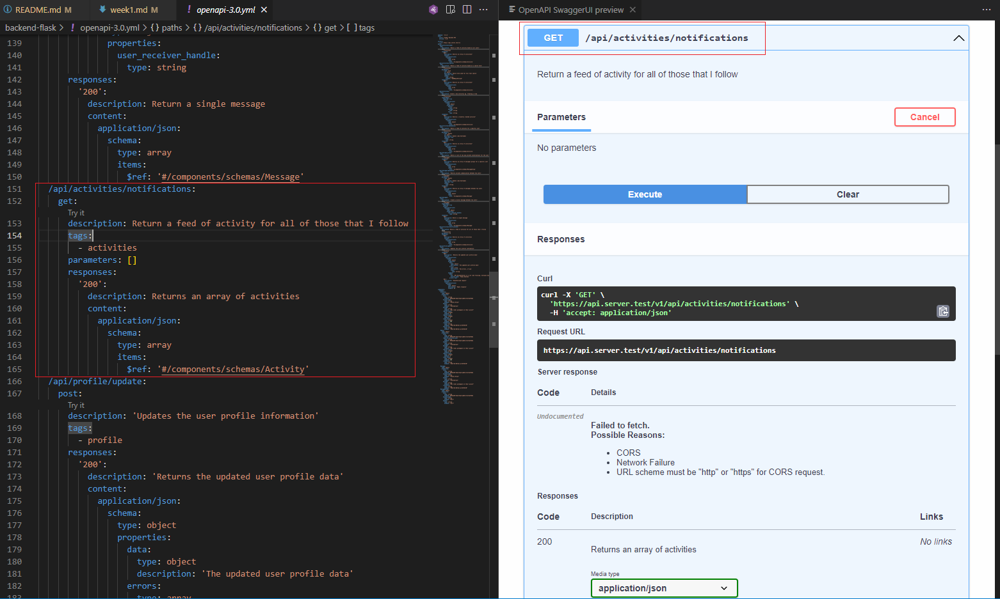
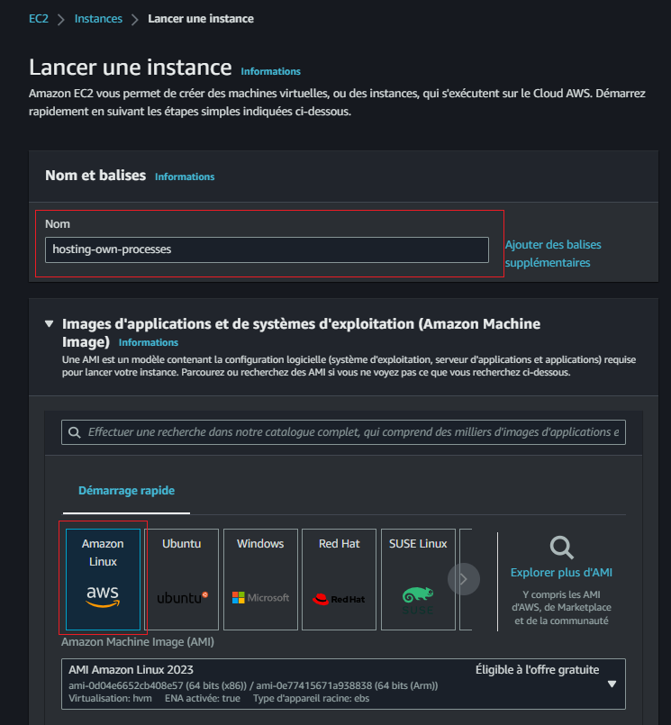
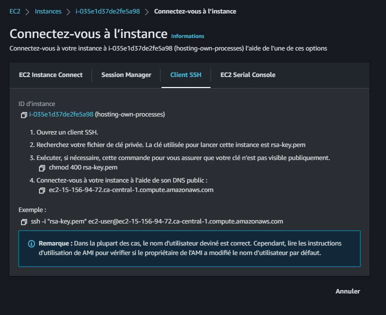
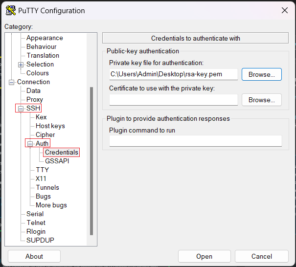
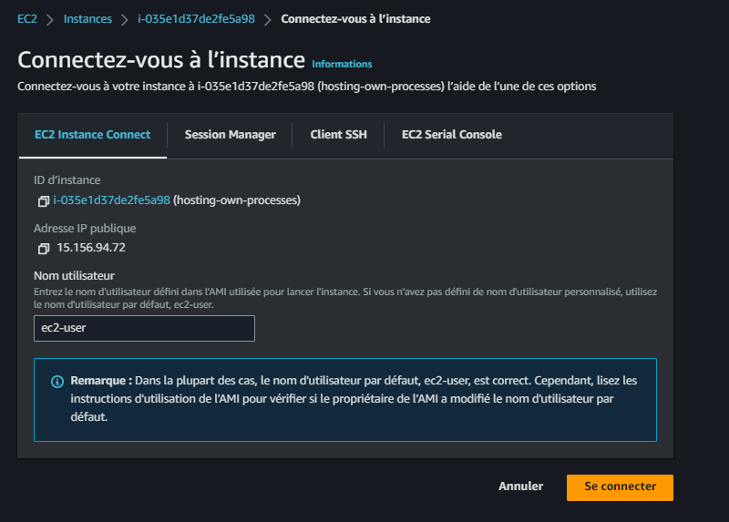
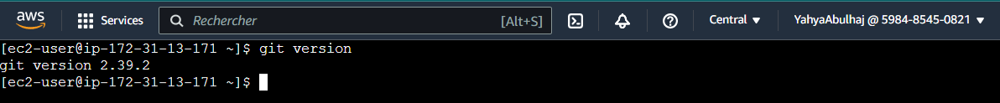
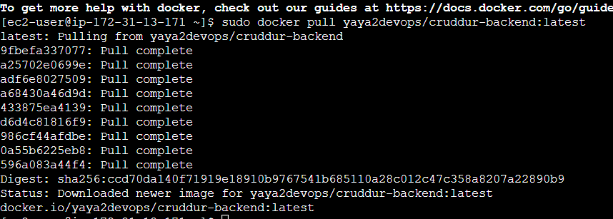
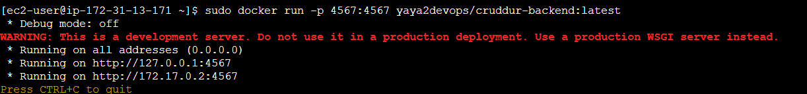

# Week 1 — App Containerization 🐳

> Refer to [the Initial version](week1-progress.md).

## Week One Main Tasks

- [Containerize Application](#containerize-application)
    - [Technical Essentials](#technical-essentials)
  - [Before Docker](#before-docker)
  - [After Docker](#after-docker)
    - [Containerize Flask App](#containerize-flask-app)
  - [Continue To Reactjs App](#continue-to-reactjs-app)
- [Open Container Initiative](#open-container-initiative)
    - [Considering Alternatives to Docker?](#considering-alternatives-to-docker)
- [Add notification endpoint and Reactjs page](#add-notification-endpoint-and-reactjs-page)
  - [OpenAPI](#openapi)
    - [Adding OpenAPI endpoint](#adding-openapi-endpoint)
  - [Define Endpoint Flask App](#define-endpoint-flask-app)
  - [Design Reactjs Notifications Webpage](#design-reactjs-notifications-webpage)
- [External CMD Script](#external-cmd-script)
- [Containers on Docker Desktop](#containers-on-docker-desktop)
- [Docker Container on EC2](#docker-container-on-ec2)
- [Flask Health check](#flask-health-check)
- [Container Management and Scaling](#orchestrating-multiple-containers)
  - [Two Containers Quickstart](#two-containers-quickstart)
  - [Databases As Containers](#databases-as-containers)
    - [DynamoDB Container](#dynamodb-container)
    - [PostgreSQL Container](#postgresql-container)
  - [Leveraging the Power of Databases](#leveraging-the-power-of-databases)
    - [Working with DynamoDB](#working-with-dynamodb)
    - [Working with PostgreSQL](#working-with-postgresql)
- [Multi-Stage Containerization](#multi-stage-containerization)
- [Images On Dockerhub](#cruddur-on-dockerhub)
- [Security Best Practices](#security-best-practices)

#  Containerize Application


Containerization has literally revolutionized the software development landscape, enabling developers like yourself to package applications and their dependencies into lightweight and portable containers. 


Docker has emerged as the de facto standard for containerization. The tech follows a client-server architecture and comprises various components that work together seamlessly. 

- **Docker Engine** The core runtime that creates and manages containers.
- **Docker Images** Self-contained snapshots of applications and their dependencies e.g Frontend.
- **Docker Containers** Runnable instances of Docker images that encapsulate the application and its runtime environment.
- **Docker Registry** A centralized repository for storing and sharing Docker images e.g. Dockerhub or ECR.


### Technical Essentials

These are the 2 key components and utilities that you should be familiar with

- `Dockerfile` is a text file that contains instructions for building Docker images. It specifies the base image, adds dependencies, configures the environment, and defines runtime commands.
- `Docker Compose` simplifies managing multi-container applications. With a YAML file, it defines services, their configurations, and relationships between them.

For interacting with containers Docker provides a set of command-line utilities


| Command                  | Description                                               |
|--------------------------|-----------------------------------------------------------|
| `docker build`           | Builds an image from a Dockerfile.                        |
| `docker run`             | Runs a container based on an image.                        |
| `docker stop`            | Stops a running container.                                 |
| `docker ps -a`           | Lists all containers, including stopped ones.              |
| `docker images`          | Lists all available Docker images.                         |
| `docker logs`            | Displays logs of a running container.                      |
| `docker exec`            | Executes a command in container shell.                 |
| `docker-compose arg`      | Starts services with  `up ` and stop with  `down` as **arg**         |


## Before Docker

Imagine having a powerful backend application constructed using Flask, a popular Python web framework known for its simplicity and flexibility. 

```sh
./backend-flask
├── app.py
├── bin/
│   └── health-check*
├── buildspec.yml
├── db/
│   ├── kill-all-connections.sql
│   ├── migrations/
│   │   ├── 16824548085333924_add_bio_column.py
│   │   └── README.md
│   ├── schema.sql
│   ├── seed.sql
│   └── sql/
│       ├── activities/
│       │   ├── create.sql
│       │   ├── home.sql
│       │   └── object.sql
│       └── users/
│           ├── create_message_users.sql
│           ├── short.sql
│           ├── show.sql
│           ├── update.sql
│           └── uuid_from_cognito_user_id.sql
├── Dockerfile
├── Dockerfile.prod
├── Dockerfile.stage
├── external-script.sh
├── lib/
│   ├── cognito_jwt_token.py
│   ├── db.py
│   ├── ddb.py
│   └── middleware.py
├── openapi-3.0.yml
├── README.md
├── requirements.txt
├── services/
│   ├── create_activity.py
│   ├── create_message.py
│   ├── create_reply.py
│   ├── home_activities.py
│   ├── message_groups.py
│   ├── messages.py
│   ├── notifications_activities.py
│   ├── __pycache__/
│   │   ├── create_activity.cpython-38.pyc
│   │   ├── create_message.cpython-38.pyc
│   │   ├── home_activities.cpython-38.pyc
│   │   ├── message_groups.cpython-38.pyc
│   │   ├── messages.cpython-38.pyc
│   │   ├── search_activities.cpython-38.pyc
│   │   └── user_activities.cpython-38.pyc
│   ├── search_activities.py
│   ├── show_activity.py
│   ├── update_profile.py
│   ├── user_activities.py
│   └── users_short.py
├── test-buildspec.yml
└── yaya_tree.md
```


Each time you want to install the dependencies for this application, you will need to follow these steps:
```sh
pip3 install dependency1
pip3 install dependency2
pip3 install dependency3
pip3 install dependency4
.
.
pip3 install dependencyn
```

Alternatively, you have the option to include all the dependencies in a `requirements.txt` file.

```sh
pip3 install -r requirements.txt
```
This allows for a more streamlined installation process.

However, you still need to take these steps to run the application.

```sh
cd /workspace/aws-cloud-project-bootcamp/backend-flask
pip3 install -r requirements.txt
export FRONTEND_URL="*"
export BACKEND_URL="*"
python3 -m flask run --host=0.0.0.0 --port=4567
```


As you can observe, there are several tasks that need to be explicitly performed in this process.


## After Docker


Let's set you up with Docker to ensure your Flask app runs smoothly as intended.
1. Get to a root of directory that you want containerize its project
2. Create a file and call it `Dockerfile`
3. Add this content and follow up
```Dockerfile
FROM <base_image>
RUN <command>
COPY <source> <destination>
WORKDIR <directory>
EXPOSE <port>
```


These instructions collectively define the build process and you can make most Dockerfiles with its combination.
- **FROM**: Specifies the base image to use as the starting point.
- **RUN**: Executes a command during the image build process.
- **COPY** or **ADD**: Copies files and directories from the build context into the image.
- **WORKDIR**: Sets the working directory for subsequent instructions.
- **EXPOSE**: Exposes a specific port to allow communication with the container.
- **CMD**: Sets the default command to run when the container starts. 
- **ENV**: Sets environment variables inside the container. 


We created this after some time spent designing to containerize that flask application; 
<br>
let's talk about it below.

```Dockerfile
FROM python:3.10-slim-buster

WORKDIR /backend-flask

COPY requirements.txt requirements.txt

RUN pip3 install -r requirements.txt

COPY . .

EXPOSE ${PORT}

ENV PYTHONUNBUFFERED=1

CMD [ "python3", "-m" , "flask", "run", "--host=0.0.0.0", "--port=4567", "--debug"]
```


- `FROM python:3.10-slim-buster`: This instruction sets the base image as `python:3.10-slim-buster`, which is a slim version of Python 3.10 based on Debian Buster.
- `WORKDIR /backend-flask`: Sets the working directory inside the container to `/backend-flask`.
- `COPY requirements.txt requirements.txt`: Copies the `requirements.txt` file from the build context into the container's `/backend-flask` directory.
- `RUN pip3 install -r requirements.txt`: Runs the command `pip3 install -r requirements.txt` inside the container to install the Python dependencies specified in the `requirements.txt` file.
- `COPY . .`: Copies the remaining files and directories from the build context into the container's `/backend-flask` directory.
- `EXPOSE ${PORT}`: Exposes the port specified by the `${PORT}` environment variable, allowing communication with the container.
- `ENV PYTHONUNBUFFERED=1`: Sets the `PYTHONUNBUFFERED` environment variable to `1`, which ensures that Python output is not buffered.
- `CMD [ "python3", "-m" , "flask", "run", "--host=0.0.0.0", "--port=4567", "--debug"]`: Sets the default command to run when the container starts. In this case, it runs the Flask application using the `python3 -m flask run` command, specifying the host as `0.0.0.0` and the port as `4567`, with the `--debug` option enabled.


### Containerize Flask App

1. Build the Dockerfile aka the container:

```sh
docker build -t  backend-flask ./backend-flask
```

- `-t backend-flask`: Sets the tag name for the Docker image as "backend-flask".
- `./backend-flask`: Specifies the build context, indicating the location of the Dockerfile and any necessary files or directories required for the build.

2. Run the Dockerfile aka the container
```sh
docker run --rm -p 4567:4567 -it -e FRONTEND_URL='*' -e BACKEND_URL='*' backend-flask
```
- `--rm`: Automatically removes the container and its file system after it exits.
- `-p 4567:4567`: Maps port 4567 of the host to port 4567 inside the container, allowing external access to the containerized application.
- `-it`: Provides an interactive terminal for the container.
- `-e FRONTEND_URL='*' -e BACKEND_URL='*'`: Sets environment variables inside the container, with values assigned to `FRONTEND_URL` and `BACKEND_URL`.
- `backend-flask`: Specifies the name of the Docker image to run.


Better right? it will be even better when we make use of the docker compose.

3.1. You can use the host url to test a backend endpoint from the browser.<br>
http://workspace-url:4567/api/activities/home


3.2 Alternatively, start acting essentially and use curl.


```sh
curl -X GET http://<workspace-url>:4567/api/activities/home -H "Accept: application/json" -H "Content-Type: application/json"
```

It will reply the response from the browser but json in the cli.


## Continue To Reactjs App

Typically, to set up the frontend, we need first to install the Node Package Manager.


```sh
cd frontend-react-js
npm i
```

Once the dependencies are installed, you can run the ReactJS app on port
```sh
npm start -- --port=3000
```

By integrating both the backend and frontend processes, we can now get access to the app.

You probably got the the point of using Docker. It allows us to specify all tasks for each container in a single file, making them implicit.


In our current scenario, we only have two containers. Imagine an entreprise app with µservices architectures where it's common to have around 70 features each have its own container and dependencies.


### Containerize Reactjs

Create Dockerfile for frontend

```Dockerfile
FROM node:16.18

ENV PORT=3000

COPY . /frontend-react-js

WORKDIR /frontend-react-js

RUN npm install

EXPOSE ${PORT}

CMD ["npm", "start"]
```

1. Build the Frontend container

```sh
docker build -t frontend-react-js ./frontend-react-js
```
- `-t frontend-react-js`: Sets the tag name for the Docker image as "frontend-react-js".
- `./frontend-react-js`: Denotes the build context directory containing the Dockerfile and associated resources.  
2. Run Frontend container
```sh
docker run --rm -p 3000:3000 -d frontend-react-js
```

- `--rm`: Automatically removes the container and its file system after it exits.
- `-p 3000:3000`: Maps port 3000 of the host to port 3000 inside the container, enabling access to the containerized application from the host machine.
- `-d`: Runs the container in detached mode, allowing it to run in the background without blocking the terminal.
- `frontend-react-js`: Refers to the name of the Docker image to run.
- check the status of both containers at this point


Access the application on `https://3000-workspace-url`.


Still time consuming right? [Refer to Container Management and Scaling](#container-management-and-scaling)

# [Open Container Initiative](https://github.com/opencontainers)


The OCI is an open governance structure and specification for container formats and runtime. It was established in 2015 by industry leaders, including Docker, CoreOS with the aim of creating open standards for containerization technologies.


 OCI has developed two main specifications:

- **Image Specification:** This specification defines the format and structure of container images. It specifies the layout and contents of an OCI-compliant container image, including layers, metadata, and configuration.
- **Runtime Specification:** This specification defines the runtime environment for executing OCI-compliant container images. It describes the execution environment, lifecycle management, and interactions between the container runtime and the underlying host system.

Whether you know it or not, It plays a crucial role in driving the evolution of container technologies today and tomorrow providing open standards that promote collaboration, innovation, and choice in the container ecosystem.

### Considering Alternatives to Docker?

If you're considering alternatives to Docker for containerization, worry not! OCI and the runc project have got you covered. Runc serves as a reference implementation of the OCI runtime specification

It is already natively integrated with tools like Docker. 

If you consider exploring other tools you may consider deploying it.


You will have first to build runc to make use of it by creating the OCI Bundle and then building your container image following the specification.

> Follow [the project instructions](https://github.com/opencontainers/runc)


# Add notification endpoint and Reactjs page

To implement the notification, We will do the following
- Document the endpoint using OpenAPI specs
- Code a Flask notification endpoint
- Build React.js page for users to interact with

The files that will be affected are listed below.

| Frontend                                        | Backend                                                     |
|-------------------------------------------------|-------------------------------------------------------------|
| `frontend-react-js/src/App.js`                  | `backend-flask/openapi-3.0.yml`                              |
| `frontend-react-js/src/pages/NotificationsFeedPage.js` | `backend-flask/app.py`                                   |
| `frontend-react-js/src/pages/NotificationsFeedPage.css` | `backend-flask/services/notifications_activities.py` |
  


## OpenAPI


OpenAPI, formerly known as Swagger, is a specification that provides a machine-readable format for defining and documenting RESTful APIs. At its core, OpenAPI provides a comprehensive and user-friendly framework to help innovators visualize their vision.


Developers can create detailed documentation that precisely outlines the structure, endpoints, request/response formats, and even authentication requirements of their APIs. 


Here's a sample OpenAPI specification template
```YAML
openapi: 3.0.3
info:
  title: Document Your First API
  description: This is a sample OpenAPI specification.
  version: 1.0.0
servers:
  - url: https://api.example.com/v1
    description: Production server
paths:
  /users:
    get:
      summary: Get all users
      description: Retrieves a list of all users.
      responses:
        '200':
          description: Successful response
          content:
            application/json:
              schema:
                type: array
                items:
                  $ref: '#/components/schemas/User'
    post:
      summary: Create a new user
      description: Creates a new user.
      requestBody:
        required: true
        content:
          application/json:
            schema:
              $ref: '#/components/schemas/User'
      responses:
        '201':
          description: User created successfully
components:
  schemas:
    User:
      type: object
      properties:
        id:
          type: integer
          format: int64
          description: User ID
        name:
          type: string
          description: User's name
        email:
          type: string
          format: email
          description: User's email address
```
- `openapi`: Specifies the version of the OpenAPI specification being used. In this case, it's set to version 3.0.3.
- `info`: Provides general information about the API, including its title, description, and version.
- `servers`: Defines the server(s) where the API is hosted. In this example, there is one production server specified with its URL and description.
- `paths`: Contains the API endpoints and their associated operations (e.g., GET, POST) and responses.
  - `/users`: Represents the `/users` endpoint.
    - `get`: Describes the GET operation for retrieving all users. It includes a summary, description, and the expected response.
    - `post`: Describes the POST operation for creating a new user. It specifies a summary, description, the expected request body, and the possible responses.
- `responses`: Defines the possible responses that an API operation can return. In this example, `200` and `201` are the HTTP status codes representing successful responses.
- `components`: Contains reusable components used throughout the specification.
  - `schemas`: Defines data models or schemas used in the API. In this case, there is a `User` schema with properties such as `id`, `name`, and `email`.

This spec  demonstrates the basic structure of an API definition. Let's head over Cruddur API.


### Adding OpenAPI endpoint

To experience the power of OpenAPI in this project open the `openapi-3.0.yml` file and explore its contents. 


1. Start by creating a new path in your OpenAPI specification. 

You can do this by adding the following
```YAML
paths:
  /api/activites/notifications:
```

Once you've created the new path

2.  It's time to edit it to define the behavior of the notification endpoint. For this, I suggest you refer to the OpenAPI [specs](https://spec.openapis.org/oas/v3.1.0).


```yaml
/api/activites/notifications:
    get:
      description: 'Return a feed of activity for all of those that I interact with'
      tags:
        - activities
      parameters: []
      responses:
        '200':
          description: Return an array of activities
          content:
            application/json:
              schema:
                type: array
                items:
                  $ref: '#/components/schemas/Activity'
```

We defined the path `/api/activities/notifications`, which represents the endpoint for retrieving activity notifications. The `get` keyword indicates that this path supports the HTTP GET method.

- **description**: This field provides a brief description of the endpoint's purpose, which in this case is to return a feed of activity for all the users that the current user follows.
- **tags**: Tags are used to categorize endpoints. In this case, the endpoint is tagged with `activities`.
- **parameters**: This section specifies any parameters required by the endpoint. In the given code snippet, there are no parameters defined ([] empty array).
- **responses**: Here, we define the responses that the endpoint can return. In this case, there is a single response with the status code `200` (indicating a successful response).
  - **description**: This field provides a brief description of the response, stating that it returns an array of activities.
  - **content**: Describes the content type of the response. In this case, it is `application/json`, indicating that the response will be in JSON format.
    - **schema**: Defines the structure of the response data. Here, it specifies that the response is an array (`type: array`) of items that follow the schema defined in `#/components/schemas/Activity`.



The provided code is a simplified example of an OpenAPI specification for the `/api/activities/notifications` endpoint, outlining its purpose, parameters, and response structure. Let go code it.

## Define Endpoint Flask App

- Define the endpoint route in `app.py`

```python
@app.route("/api/activities/notifications", methods=['GET'])
def data_notification():
  data = NotificationActivities.run()
  return data, 200
```

- Create a file called `services/notification_activities.py` within the `backend-flask` directory and add the code below.
```python
from datetime import datetime, timedelta, timezone

class NotificationActivities:
  def run():
    now = datetime.now(timezone.utc).astimezone()
    results = [{
      'uuid': '68f126b0-1ceb-4a33-88be-d90fa7109eee',
      'handle':  'Tron',
      'message': 'I am a character in a movie where human gets inside game.',
      'created_at': (now - timedelta(days=2)).isoformat(),
      'expires_at': (now + timedelta(days=5)).isoformat(),
      'likes_count': 5,
      'replies_count': 1,
      'reposts_count': 0,
      'replies': [{
        'uuid': '26e12864-1c26-5c3a-9658-97a10f8fea67',
        'reply_to_activity_uuid': '68f126b0-1ceb-4a33-88be-d90fa7109eee',
        'handle':  'Worf',
        'message': 'This post has no honor!',
        'likes_count': 0,
        'replies_count': 0,
        'reposts_count': 0,
        'created_at': (now - timedelta(days=2)).isoformat()
      }],
    }
    ]
    return results
```

- Incorporate the `notification_activities.py` file into the `app.py` file and import it at the top level.

- Curl the backend with the new endpoint `api/activities/notifications`

```sh
curl -X GET http://<workspace-url>:4567/api/activities/notifications -H "Accept: application/json" -H "Content-Type: application/json"
```
You can also access it via the browser. But you need the curl skills.


## Design Reactjs Notifications Webpage

- Create a `frontend-react-js/src/pages/NotificationsFeedPage.js` and paste the code below
```js
import './NotificationsFeedPage.css';
import React from "react";

import DesktopNavigation  from '../components/DesktopNavigation';
import DesktopSidebar     from '../components/DesktopSidebar';
import ActivityFeed from '../components/ActivityFeed';
import ActivityForm from '../components/ActivityForm';
import ReplyForm from '../components/ReplyForm';

// [TODO] Authenication
import Cookies from 'js-cookie'

export default function NotificationsFeedPage() {
  const [activities, setActivities] = React.useState([]);
  const [popped, setPopped] = React.useState(false);
  const [poppedReply, setPoppedReply] = React.useState(false);
  const [replyActivity, setReplyActivity] = React.useState({});
  const [user, setUser] = React.useState(null);
  const dataFetchedRef = React.useRef(false);

  const loadData = async () => {
    try {
      const backend_url = `${process.env.REACT_APP_BACKEND_URL}/api/activities/notifications`
      const res = await fetch(backend_url, {
        method: "GET"
      });
      let resJson = await res.json();
      if (res.status === 200) {
        setActivities(resJson)
      } else {
        console.log(res)
      }
    } catch (err) {
      console.log(err);
    }
  };

  const checkAuth = async () => {
    console.log('checkAuth')
    // [TODO] Authenication
    if (Cookies.get('user.logged_in')) {
      setUser({
        display_name: Cookies.get('user.name'),
        handle: Cookies.get('user.username')
      })
    }
  };

  React.useEffect(()=>{
    //prevents double call
    if (dataFetchedRef.current) return;
    dataFetchedRef.current = true;

    loadData();
    checkAuth();
  }, [])

  return (
    <article>
      <DesktopNavigation user={user} active={'notifications'} setPopped={setPopped} />
      <div className='content'>
        <ActivityForm  
          popped={popped}
          setPopped={setPopped} 
          setActivities={setActivities} 
        />
        <ReplyForm 
          activity={replyActivity} 
          popped={poppedReply} 
          setPopped={setPoppedReply} 
          setActivities={setActivities} 
          activities={activities} 
        />
        <div className='activity_feed'>
          <div className='activity_feed_heading'>
            <div className='title'>Notifications</div>
          </div>
          <ActivityFeed 
            setReplyActivity={setReplyActivity} 
            setPopped={setPoppedReply} 
            activities={activities} 
          />
        </div>
      </div>
      <DesktopSidebar user={user} />
    </article>
  );
}
```

- Create a `NotificationsFeedPage.css` in the same dir to apply styling
- In the `App.js` file, include the following import statement

```js
import NotificationsFeedPage from './pages/NotificationsFeedPage';
```

- Below in `app.py` where the endpoints are declared add the following
```jsx
{
  path: "/notifications",
  element: <NotificationsFeedPage />
},
```


## [Cruddur on Dockerhub](https://hub.docker.com/u/yaya2devops)


To start the process, you need to build, tag, and push the image to Docker Hub.

```
docker build -t dockerhub-username/cruddur-backend:a-good-tag .
docker push dockerhub-username/cruddur-backend:a-good-tag
```


Once done, you can now visit Docker Hub and refer to the existing images that you have uploaded.


Same applies to the frontend container, you need to build, tag, and push the image

```
docker build -t dockerhub-username/cruddur-frontend:a-good-tag .
docker push dockerhub-username/cruddur-frontend:latest
```


If you wish to push a newer image, you can follow these steps to ensure your updates are reflected:


```
docker tag my_username/my_image_name:a-good-tag my_username/my_image_name:latest
docker push my_username/my_image_name:latest
```


### **External CMD Script**

Frontend
```
FROM node:16.18

ENV PORT=3000

COPY . /frontend-react-js
WORKDIR /frontend-react-js
RUN npm install
EXPOSE ${PORT}
CMD ["/bin/bash", "./script.sh"]
```


**The external [script](../frontend-react-js/script.sh)**
```
#!/bin/bash
npm start
```


For backend, i thought to add ENTRYPOINT. These cannot be overtitten, while we could use cmd but we could change e.g. in this case another script.


I added this `ENTRYPOINT [""]` and directed my `external-script.sh` path

```
FROM python:3.10-slim-buster

WORKDIR /backend-flask

COPY requirements.txt requirements.txt

RUN pip3 install -r requirements.txt

COPY . .

EXPOSE ${PORT}

ENV PYTHONUNBUFFERED=1
cd de
ENTRYPOINT ["/backend-flask/external-script.sh"]
```


[`external-script.sh`](../backend-flask/external-script.sh)

```
#!/bin/bash
python3 -m flask run --host=0.0.0.0 --port=${PORT:-4567} --debug
```

## Docker Container on EC2

- Create EC2
  


- Add key-pair


- allow ssh and HTTPS from internet


**SSH Using PuTTy**



- Add public IP, 
- leave port 22, its standard for ssh
- Expand on SSH -> Auth -> Credentials: Browse your .pem SK and add it
- Click Open, ec2 will open


[Related Lab Helped](https://www.cloudskillsboost.google/focuses/40544?parent=catalog)




> make sure the you chmod 600 or 400 ur "[rsa-key.pem](assets/week1/EC2/rsa-key.pem)"

**SSH using AWS EC2 Connect**



- Connect 
- Update yum: `sudo yum update`
- Get git with: `sudo yum install git`
- Clone Project repo


> Although Dockerhub is available, I started with this approach for various reasons. Lol.

**Install docker**

```
sudo yum install docker
```

### **Backend on EC2**

- Pulling the image from dockerhb to EC2:

```
sudo docker pull yaya2devops/cruddur-backend:latest
```



- Run it

```
sudo docker run -p 4567:4567 yaya2devops/cruddur-backend:latest
```


Nav to backend using `ec2-public-ip:port/endpoints`


##### **Frontend on EC2**

- Pull frontend Image
- Install Docker Compose
  
##### **Run both on Docker compose**

```yaml
version: "3.8"
services:
  backend-flask:
    environment:
      FRONTEND_URL: "http://IP:3000"
      BACKEND_URL: "http://IP:4567"
    image: yaya2devops/backend-flask:1.0
    ports:
      - "4567:4567"
  frontend-react-js:
    environment:
      REACT_APP_BACKEND_URL: "http://IP:4567"
    image: yaya2devops/frontend-react-js:1.0
    ports:
      - "3000:3000"
networks: 
  internal-network:
    driver: bridge
    name: cruddur
```

### Flask Health check

- Added a new endpoint in `app.py`
```py
@app.route("/api/health-check", methods=["GET"])
def health_check():
    return {'success': True, 'ver': 1}, 200
```
- Config docker compose

```yaml
healthcheck:
  test: curl --fail http://<URL>:4567/api/health || exit 1
  interval: 10s
  timeout: 10s
  start_period: 10s
  retries: 3
```

### Multi-Stage Containerization

- building the application with multistaged dockerfile:
```
gitpod /workspace/aws-cloud-project-bootcamp/backend-flask (main) $ docker build -t backend -f Dockerfile.stage .
[+] Building 33.1s (15/15) FINISHED                                                                                         
 => [internal] load .dockerignore                                                                                      0.0s
 => => transferring context: 44B                                                                                       0.0s
 => [internal] load build definition from Dockerfile.stage                                                             0.0s
 => => transferring dockerfile: 862B                                                                                   0.0s
 => [internal] load metadata for docker.io/library/python:3.10-slim-buster                                             0.7s
 => [internal] load build context                                                                                      0.0s
 => => transferring context: 96.01kB                                                                                   0.0s
 => CACHED [build 1/7] FROM docker.io/library/python:3.10-slim-buster@sha256:02874255d484428c9412db98923b387ac73822cb  0.0s
 => CACHED [stage-1 2/4] WORKDIR /backend-flask                                                                        0.0s
 => [build 2/7] RUN apt update                                                                                         2.7s
 => [build 3/7] RUN apt install -y --no-install-recommends     build-essential gcc                                     9.4s
 => [build 4/7] WORKDIR /backend-flask                                                                                 0.0s 
 => [build 5/7] RUN python3 -m venv /backend-flask/venv                                                                4.5s 
 => [build 6/7] COPY requirements.txt .                                                                                0.0s
 => [build 7/7] RUN pip3 install -r requirements.txt                                                                  10.6s
 => [stage-1 3/4] COPY --from=build /backend-flask/venv ./venv                                                         0.6s
 => [stage-1 4/4] COPY . .                                                                                             0.0s
 => exporting to image                                                                                                 3.9s
 => => exporting layers                                                                                                3.9s
 => => writing image sha256:4af2988118c434aea7ecf21dd750de0fec67442e83c35e6f63071c12eaa98cd1                           0.0s
 => => naming to docker.io/library/backend       
 ```

- Make use of our Health check to "check" app running


## Containers on Docker Desktop 

In this scenario, we will use Docker Desktop to execute the containers on a local environment.


Once you have successfully executed the Docker Compose, navigate to the localhost address in your web browser to access and examine the app.


<br>

# Orchestrating Multiple Containers


Compose is a tool for defining and running multi-container as services by designing a single YAML file and with a single command, you create and start all the services from your configuration.

Docker Compose will allows us to define and manage these containers in one go enabling seamless communication and collaboration between 'em. 


## Two Containers Quickstart

In our current setup, we have successfully containerized the **frontend** and **backend** components left is to compose them.

Let is go over the sample compose and disucss its content.

1. create a `docker-compose.yml` and paste the following
```YAML
version: "3.9"

services:
  backend:
    build:
      context: ./backend-flask
      dockerfile: Dockerfile
    ports:
      - "4567:4567"
    environment:
    volumes:
      - <host_path>:<container_path>  
  frontend:
    build:
      context: ./frontend-react-js
      dockerfile: Dockerfile
    ports:
      - 3000:3000
    environment:
    depends_on:
      - backend
```

- `version: "3.9"`: Specifies the version of the Docker Compose file format we are using. You can adjust the version according to your requirements.
- `services:` This section defines the services (containers) that will be created.
  - `backend:` Defines the backend service. You can customize the service name as per your application's needs.
    - `build:` Specifies the build context for the backend service. This is the directory containing the Dockerfile for the backend container. Adjust the context path to match the location of your Dockerfile.
      - `dockerfile: Dockerfile:` Indicates the name of the Dockerfile to use for building the backend container. If your Dockerfile has a different name, update it accordingly.
    - `ports:` Specifies the port mapping for the backend container. In this example, port 8000 on the host machine is mapped to port 8000 in the backend container.
    - `environment:` Sets the environment variables for the backend container. You can add or modify environment variables based on your application's requirements.
    - `volumes` config allows you to define shared data volumes between the host machine and the containers. 
- `frontend:` Defines the frontend service. Customize the service name if needed.
    - `build:` Specifies the build context for the frontend service. Update the context path to match the location of the Dockerfile for the frontend container.
      -  `dockerfile: Dockerfile:` Indicates the name of the Dockerfile to use for building the frontend container. Modify it if your Dockerfile has a different name.
    - `ports:` Specifies the port mapping for the frontend container. In this example, port 3000 on the host machine is mapped to port 3000 in the frontend container.
    - `depends_on:` Specifies the dependency of the frontend service on the backend service. The frontend container will start only after the backend container is up and running.

### *Backend Environments*
To establish a connection between the frontend and backend workspaces in different developer environments, you can follow these general guidelines.


Lets discuss how in three leading developer environements.


**Codespaces**<br>
If you are using Codespaces, you can easily establish the connection between them by adding the following


```yaml
    environment:
      FRONTEND_URL: "https://${CODESPACE_NAME}-3000.${GITHUB_CODESPACES_PORT_FORWARDING_DOMAIN}"
      BACKEND_URL: "https://${CODESPACE_NAME}-4567.${GITHUB_CODESPACES_PORT_FORWARDING_DOMAIN}"
```

**Gitpod**<br>
If you are using Gitpod, you can establish the connection as shown below.
```YAML
    environment:
      FRONTEND_URL: "https://3000-${GITPOD_WORKSPACE_ID}.${GITPOD_WORKSPACE_CLUSTER_HOST}"
      BACKEND_URL: "https://4567-${GITPOD_WORKSPACE_ID}.${GITPOD_WORKSPACE_CLUSTER_HOST}"
```

**VScode**<br>
If you are working locally, specifically with Visual Studio Code, you can establish the connection.

```YAML
    environment:
      FRONTEND_URL: "http://localhost:3000"
      BACKEND_URL: "http://localhost:4567"
```

### *Frontend Environments*

We only need the URL for the frontend service. The connection will be established through the backend service to establish the relationship with the frontend, as illustrated above.


**Codespaces**<br>
If you are in Codespaces, you can add the following to establish the connection.
```yaml
    environment:
      REACT_APP_BACKEND_URL: "https://${CODESPACE_NAME}-4567.${GITHUB_CODESPACES_PORT_FORWARDING_DOMAIN}"
```

**Gitpod**<br>
If you are in Gitpod, you can add the following to establish the connection.
```YAML
    environment:
      REACT_APP_BACKEND_URL: "https://4567-${GITPOD_WORKSPACE_ID}.${GITPOD_WORKSPACE_CLUSTER_HOST}"
```

**VScode**<br>
If you are working on your local machine, for example using Visual Studio Code, you can add the following.
```YAML
    environment:
      REACT_APP_BACKEND_URL: "https://localhost:4567"
```


After configuring `Gitpod` and making the necessary adjustments, our composition will be composed as follows.

```YAML
version: "3.8"
services:
  backend-flask:
    environment:
      FRONTEND_URL: "https://3000-${GITPOD_WORKSPACE_ID}.${GITPOD_WORKSPACE_CLUSTER_HOST}"
      BACKEND_URL: "https://4567-${GITPOD_WORKSPACE_ID}.${GITPOD_WORKSPACE_CLUSTER_HOST}"
    build: ./backend-flask
    ports:
      - "4567:4567"
    volumes:
      - ./backend-flask:/backend-flask
  frontend-react-js:
    environment:
      REACT_APP_BACKEND_URL: "https://4567-${GITPOD_WORKSPACE_ID}.${GITPOD_WORKSPACE_CLUSTER_HOST}"
    build: ./frontend-react-js
    ports:
      - "3000:3000"
    volumes:
      - ./frontend-react-js:/frontend-react-js
```

- Execute the command `docker compose up` to start the services within the `docker-compose.yml`.
- Ensure that the ports `3000` and `5432` are accessible and not blocked by Gitpod.
- Open your preferred web browser.
- In the browser's address bar, enter the URL associated with port `3000`. 


This will lead you to the application's homepage.


As we expand our services and integrate with other software, we diligently configure the application.


For seamless integration with AWS Cognito, we incorporated the necessary environment settings into both our frontend and backend to enable UI authentication.

```YAML
  frontend-react-js:
    environment:
      REACT_APP_AWS_COGNITO_REGION: "${AWS_DEFAULT_REGION}"
      REACT_APP_AWS_USER_POOLS_ID: "${AWS_USER_POOLS_ID}"
      REACT_APP_CLIENT_ID: "${APP_CLIENT_ID}"
```

To ensure secure authentication with AWS services, we seamlessly integrated our backend by generating a secret key from the platform. This key, along with the region and ID, was then passed to the compose for further utilization.


```YAML
  backend-flask:
    environment:
      AWS_DEFAULT_REGION: "${AWS_DEFAULT_REGION}"
      AWS_ACCESS_KEY_ID: "${AWS_ACCESS_KEY_ID}"
      AWS_SECRET_ACCESS_KEY: "${AWS_SECRET_ACCESS_KEY}"   
```


In the second week, we efficiently utilized distributed tracing tools such as X-Ray, OpenTelemetry (OTel), and Rollbar to aid in debugging and troubleshooting.

```YAML
  backend-flask:
    environment:
      ROLLBAR_ACCESS_TOKEN: "${ROLLBAR_ACCESS_TOKEN}" 
      OTEL_SERVICE_NAME: "backend-flask"
      OTEL_EXPORTER_OTLP_ENDPOINT: "https://api.honeycomb.io"
      OTEL_EXPORTER_OTLP_HEADERS: "x-honeycomb-team=${HONEYCOMB_API_KEY}"
      AWS_XRAY_URL: "*4567-${GITPOD_WORKSPACE_ID}.${GITPOD_WORKSPACE_CLUSTER_HOST}*"
      AWS_XRAY_DAEMON_ADDRESS: "xray-daemon:2000"
      ROLLBAR_ACCESS_TOKEN: "${ROLLBAR_ACCESS_TOKEN}" 
```

Exact. We tailor our configurations according to our unique needs and align them with our overall vision while integrating with other software solutions.


## Databases As Containers
To further enhance the app's functionality and ensure data persistence, we need to incorporate databases. 

We will make use of DynamoDB, a fully managed NoSQL database service provided by AWS and PostgreSQL. The first was used for week 5 to send messages and the second was used in week 4 to post cruds.


### DynamoDB Container

Included DynamoDB setup instructions in the `docker-compose.yml` file. 

```YAML
dynamodb-local:
    user: root
    command: "-jar DynamoDBLocal.jar -sharedDb -dbPath ./data"
    image: "amazon/dynamodb-local:latest"
    container_name: dynamodb-local
    ports:
      - "8000:8000"
    volumes:
      - "./docker/dynamodb:/home/dynamodblocal/data"
    working_dir: /home/dynamodblocal
```

`dynamodb-local` is the name given to this specific section.
- `user: root` specifies the user for running the DynamoDB Local container.
- `command: "-jar DynamoDBLocal.jar -sharedDb -dbPath ./data"` provides the command to be executed inside the container, launching DynamoDB Local with specific options. This includes using a shared database (`-sharedDb`) and specifying the database path (`-dbPath`) as "./data".
- `image: "amazon/dynamodb-local:latest"` refers to the Docker image used for the DynamoDB Local container. In this case, it uses the latest version of the "amazon/dynamodb-local" image.
- `container_name: dynamodb-local` assigns the name "dynamodb-local" to the container.
- `ports: - "8000:8000"` maps the container's port 8000 to the host machine's port 8000, allowing access to the DynamoDB Local service.
- `volumes: - "./docker/dynamodb:/home/dynamodblocal/data"` creates a volume mapping between the local directory "./docker/dynamodb" and the container's "/home/dynamodblocal/data" directory. This ensures that data persists between container restarts.
- `working_dir: /home/dynamodblocal` sets the working directory inside the container to "/home/dynamodblocal".


We strategically incorporated DynamoDB into our architecture to enable seamless message sending within our platform and efficiently store the associated data. 

### PostgreSQL Container

Included PostgreSQL setup instructions in the `docker-compose.yml` file. 

```yaml
db:
    image: postgres:13-alpine
    restart: always
    environment:
      - POSTGRES_USER=postgres
      - POSTGRES_PASSWORD=password
    ports:
      - '5432:5432'
    volumes: 
      - db:/var/lib/postgresql/data
```

Add `volumes` to `docker-compose.yml` file at the very end.

```yaml
volumes:
  db:
    driver: local
```

The `db` section defines a service named "db" in the Docker Compose file.
- `image: postgres:13-alpine` specifies the Docker image to be used, which is the PostgreSQL version 13 with the Alpine Linux distribution.
- `restart: always` ensures that the container automatically restarts if it stops unexpectedly.
- `environment` sets the environment variables required for the PostgreSQL container. In this case:
  - `POSTGRES_USER=postgres` specifies the username for the PostgreSQL database as "postgres".
  - `POSTGRES_PASSWORD=password` sets the password for the "postgres" user.
- `ports` maps the container's port 5432 to the host machine's port 5432, allowing access to the PostgreSQL database service.
- `volumes` creates a named volume named "db" and mounts it to the "/var/lib/postgresql/data" directory inside the container. This ensures that the database data persists even if the container is restarted or recreated.
  
During week 4, we made use of psql to enable CRUD operations.


Executing the command `docker compose up` will initiate the launch sequence of the `Frontend`, `Backend`, `DynamoDB` and `PostgreSQL` services, getting them to run with one command within your environment.


| CONTAINER ID   | IMAGE                                          | COMMAND                  | CREATED          | STATUS                 | PORTS                                       | NAMES                                      |
| -------------- | ---------------------------------------------- | ------------------------ | ---------------- | ---------------------- | ------------------------------------------- | ------------------------------------------ |
| 61ab34832d8a   | aws-cloud-project-bootcamp-frontend-react-js   | "docker-entrypoint.s…"   | 18 minutes ago   | Up 18 minutes          | 0.0.0.0:3000->3000/tcp, :::3000->3000/tcp   | aws-cloud-project-bootcamp-frontend-react-js-1 |
| 3ed9dff36c1e   | aws-cloud-project-bootcamp-backend-flask       | "python3 -m flask ru…"   | 18 minutes ago   | Up 18 minutes          | 0.0.0.0:4567->4567/tcp, :::4567->4567/tcp   | aws-cloud-project-bootcamp-backend-flask-1 |
| 6da1651b38c0   | postgres:13-alpine                             | "docker-entrypoint.s…"   | 4 hours ago      | Up 4 hours (healthy)   | 0.0.0.0:5432->5432/tcp, :::5432->5432/tcp   | aws-cloud-project-bootcamp-db-1             |
| cd062d6c1188   | amazon/dynamodb-local:latest                   | "java -jar DynamoDBL…"   | 4 hours ago      | Up 4 hours             | 0.0.0.0:8000->8000/tcp, :::8000->8000/tcp   | dynamodb-local    |           


## Leveraging the Power of Databases
Once your Docker Compose environment is up and running, encompassing the essential database configurations mentioned earlier, you can begin harnessing the full potential of these powerful tools to extract maximum value from your application.

### Working with DynamoDB 

1. To create a table in DynamoDB, you can run these commands:

```bash
aws dynamodb create-table \
    --endpoint-url http://localhost:8000 \
  --table-name Music \
    --attribute-definitions \
        AttributeName=Artist,AttributeType=S \
        AttributeName=SongTitle,AttributeType=S \
    --key-schema AttributeName=Artist,KeyType=HASH AttributeName=SongTitle,KeyType=RANGE \
    --provisioned-throughput ReadCapacityUnits=1,WriteCapacityUnits=1 \
    --table-class STANDARD
```

- `aws dynamodb create-table`: This is the AWS CLI command to create a table in DynamoDB.
- `--endpoint-url http://localhost:8000`: Specifies the endpoint URL to connect to the local instance of DynamoDB running on port 8000. This is useful for local development and testing.
- `--table-name Music`: Sets the name of the table to "Music".
- `--attribute-definitions`: Defines the attribute definitions for the table.
    - `AttributeName=Artist,AttributeType=S`: Specifies an attribute named "Artist" with a type of "String".
    - `AttributeName=SongTitle,AttributeType=S`: Specifies an attribute named "SongTitle" with a type of "String".
- `--key-schema AttributeName=Artist,KeyType=HASH AttributeName=SongTitle,KeyType=RANGE`: Sets the key schema for the table. In this case, the "Artist" attribute is set as the hash key (partition key) and the "SongTitle" attribute is set as the range key (sort key).
- `--provisioned-throughput ReadCapacityUnits=1,WriteCapacityUnits=1`: Specifies the provisioned throughput for the table. In this case, the read capacity is set to 1 unit and the write capacity is set to 1 unit.
- `--table-class STANDARD`: Specifies the table class as "STANDARD". This is the default table class.

2. To create an item in DynamoDB run the command

```bash
aws dynamodb put-item \
    --endpoint-url http://localhost:8000 \
    --table-name Music \
    --item \
        '{"Artist": {"S": "No One You Know"}, "SongTitle": {"S": "Call Me Today"}, "AlbumTitle": {"S": "Somewhat Famous"}}' \
    --return-consumed-capacity TOTAL
```

- `aws dynamodb put-item`: This is the AWS CLI command to put an item (create an item) in DynamoDB.
- `--endpoint-url http://localhost:8000`: Specifies the endpoint URL to connect to the local instance of DynamoDB running on port 8000. This is useful for local development and testing.
- `--table-name Music`: Specifies the name of the table where the item will be created, in this case, "Music"
- `--item`: Defines the item to be created with its attribute values. The attribute values are specified using JSON format.
    - `{"Artist": {"S": "No One You Know"}, "SongTitle": {"S": "Call Me Today"}, "AlbumTitle": {"S": "Somewhat Famous"}}`: This JSON object represents the attributes and their values for the item. Each attribute is specified with its data type (such as "S" for string).
- `--return-consumed-capacity TOTAL`: Specifies the type of consumed capacity information to be returned after the operation. In this case, it is set to "TOTAL".

3. To list tables in DynamoDB
```bash
aws dynamodb list-tables --endpoint-url http://localhost:8000
```


- `aws dynamodb list-tables`: This is the AWS CLI command to list the tables in DynamoDB.
- `--endpoint-url http://localhost:8000`: Specifies the endpoint URL to connect to the local instance of DynamoDB running on port 8000. This is useful for local development and testing.

4. The following command is used to get data from DynamoDB:

```bash
aws dynamodb scan --table-name Music --query "Items" --endpoint-url http://localhost:8000
```
- `aws dynamodb scan`: This is the AWS CLI command to scan (retrieve) data from a DynamoDB table.
  - `--table-name Music`: Specifies the name of the table from which you want to retrieve data, in this case, "Music".
  - `--query "Items"`: Specifies the query expression to retrieve the items from the table. In this case, it retrieves all the items.
  - `--endpoint-url http://localhost:8000`: Specifies the endpoint URL to connect to the local instance of DynamoDB running on port 8000. This is useful for local development and testing.


### Working with PostgreSQL 

- Install the client librairy in yourd developemr env

```yaml
- name: postgres
    init: |
      curl -fsSL https://www.postgresql.org/media/keys/ACCC4CF8.asc|sudo gpg --dearmor -o /etc/apt/trusted.gpg.d/postgresql.gpg
      echo "deb http://apt.postgresql.org/pub/repos/apt/ `lsb_release -cs`-pgdg main" |sudo tee  /etc/apt/sources.list.d/pgdg.list
      sudo apt update
      sudo apt install -y postgresql-client-13 libpq-dev
```
- `curl -fsSL https://www.postgresql.org/media/keys/ACCC4CF8.asc|sudo gpg --dearmor -o /etc/apt/trusted.gpg.d/postgresql.gpg`: Downloads the PostgreSQL GPG key and saves it to the trusted GPG key location.
- `echo "deb http://apt.postgresql.org/pub/repos/apt/ `lsb_release -cs`-pgdg main" |sudo tee  /etc/apt/sources.list.d/pgdg.list`: Adds the PostgreSQL repository to the apt sources list based on the current system release.
- `sudo apt update`: Updates the package lists from the repositories.
- `sudo apt install -y postgresql-client-13 libpq-dev`: Installs the PostgreSQL client and the libpq development package.


If you are using Gitpod, you have the ability to automate the process effortlessly.
```yaml
- name: postgres
    init: |
       <paste the commands at this level of identation>
```
- `name: postgres`: Specifies the name of the component or package to be installed, in this case, "postgres".
- `init:`: Indicates the initialization section where the necessary commands for installation are defined.

If you are using others you can refer to 

Execute  to connect the postgres server that’s already running at port `5432`

```sh
psql -U postgres --host localhost
```

- `psql`: This is the command to launch the psql tool, which allows you to interact with PostgreSQL databases.
- `-U postgres`: Specifies the username to connect to the PostgreSQL database as "postgres". This assumes that there is a PostgreSQL user named "postgres" with the necessary privileges.
- `--host localhost`: Specifies the hostname or IP address of the PostgreSQL server. In this case, it is set to "localhost" to connect to the PostgreSQL server running on the local machine.

Make use of the password "password" for the connection.


To exit or quit the psql command-line tool, simply enter `\q`.

Data explorer  allows us to conveniently view and interact with the PostgreSQL database and provides a user-friendly interface where we can explore the data stored in psql tables.


## Security Best Practices

To help ensure the integrity and protection of containerized environments, implementing container security best practices is crucial. 


- Image Integrity: Use trusted and verified container images from reputable sources. Regularly update and patch these images to address any known vulnerabilities.
- Container Isolation: Isolate containers from each other and the host system using appropriate containerization technologies. 
- Secure Configuration: Follow secure configuration practices Inc. minimizing the number of running processes disabling unnecessary services.
- Vulnerability Scanning: Regularly scan container images and the underlying host system for known vulnerabilities.

Other key practices Incl related to technical configurations.


| Dockerfiles                            | Docker Compose                          |
| -------------------------------------- | --------------------------------------- |
| Use official base images               | Limit exposed ports                      |
| Update regularly                       | Restrict container privileges            |
| Minimize image layers                  | Implement resource limits                |
| Remove unnecessary dependencies        | Use secure environment variables        |
| Run containers with non-root users      | Separate sensitive data                  |


### Reference

- [Compose Configuration](https://docs.docker.com/compose/)
- [Open Container Initiative](https://opencontainers.org/)
- [Synk Containers Security](https://snyk.io/fr/)
- [Extending FastAPI](https://fastapi.tiangolo.com/advanced/extending-openapi/)
- [AWS DynamoDB Image](https://hub.docker.com/r/amazon/dynamodb-local)


💡 Google has announced its open sourcing of Kubernetes, revealing that the company successfully manages an impressive 4 billion containers to handle the demands of global scale. 