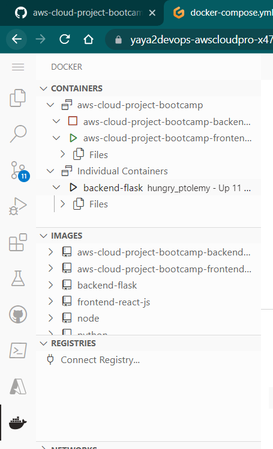
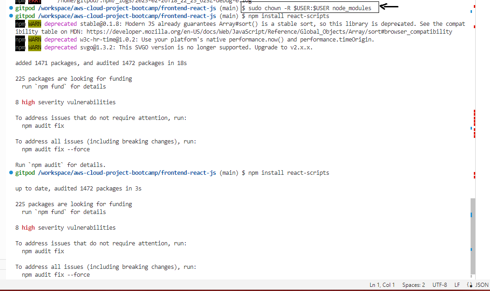
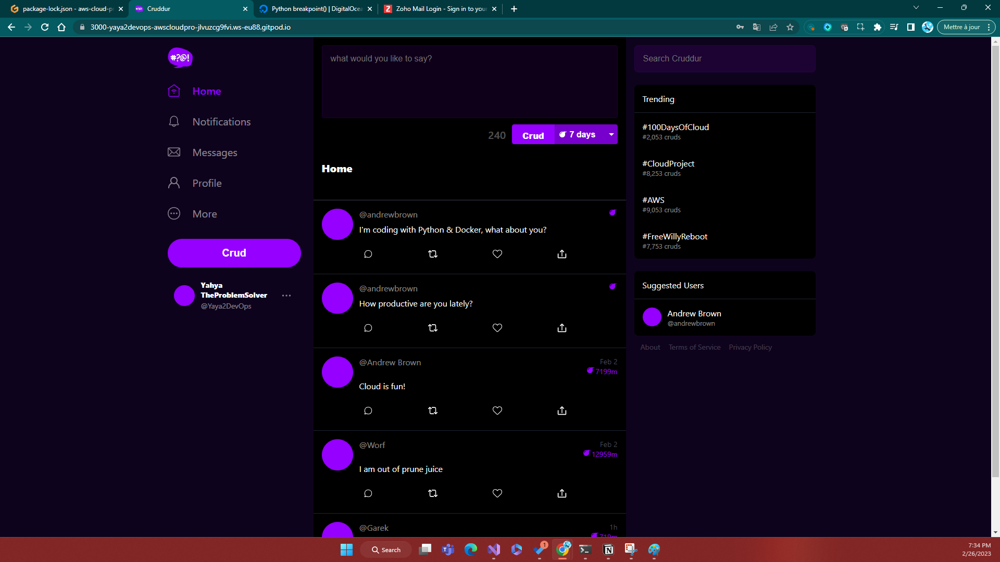

# Week 1 — App Containerization

#### First of all, I wrote a blog on docker months ago.

Check it!

### Week objectives:
- work with flask 
- dockerize using dockerfile
- docker-compose for running more than a container //
- troubleshoot using debugger, the error code and everything in between

#### Prereq 
- Docker extension
- Install Flask on top of py
- NPM for reactjs to use react-scripts

## Backend work:
### Install Flask

### Install Flask Core

### Docker Run issue, Env Variable

### Logs Troubleshoot

### Server is working

### building docker image

### Success Build

### Docker PS from BASH

### Listing current images

### working ports

### Data is here

### Docker Run

## Frontend

Front end is honestly easier, same process, the only diff is the docker compose to be able to run both dockers same time and get ur app running and functional with backend.

### NPM required

### Building front docker, using the dockerfile ofc

### Some stats of what i have 

## Result Front Container

### The union port issue
You have to shutdown the frontend container since it will be used by docker compose later when running the entire app.

### Docker compose, using compose up or from terminal

## Tons of troubleshooting

This didnt work cause i forgot to install npm which itself will require the react scripts required for our front end reactjs application frontend

## This command was a game changer

## Docker Compose Success

## I'm there! Welcome To the App

# Sign ins

# First CRUDD !

# Notification Feature 

