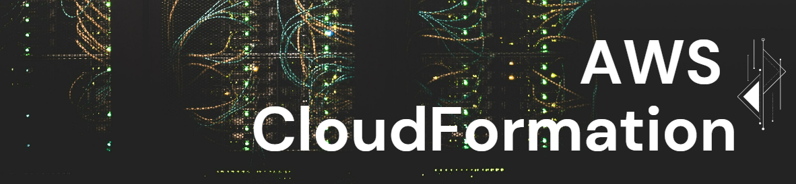
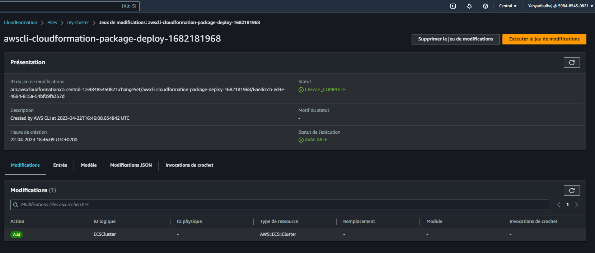
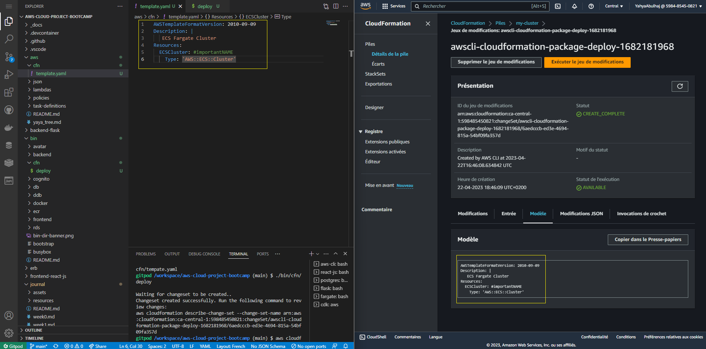
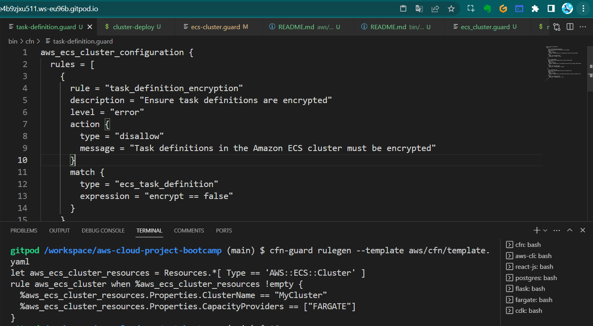
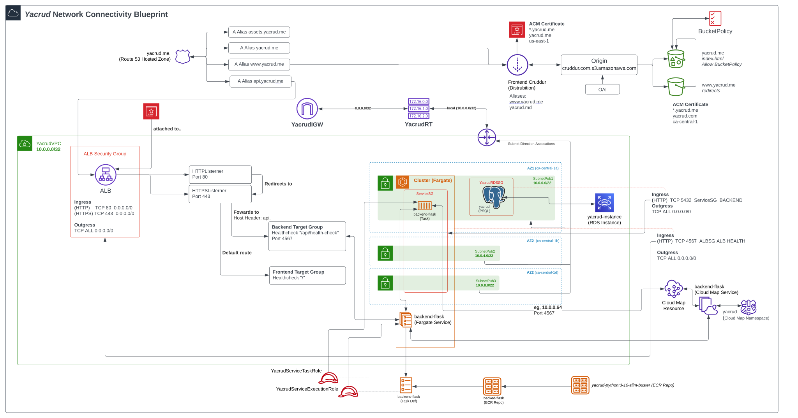
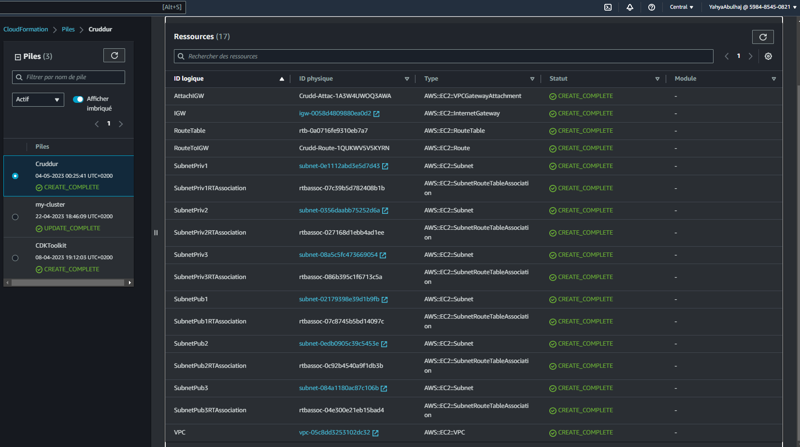
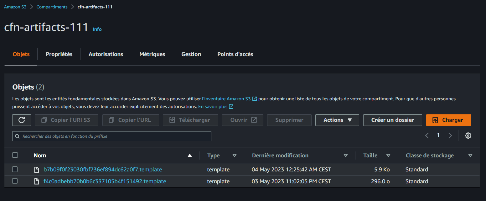
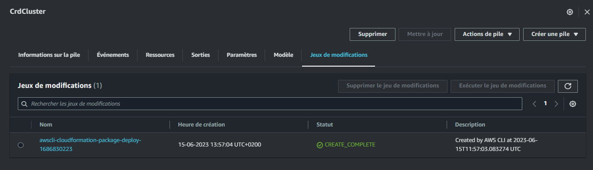

# Week 10 — CloudFormation 

In the consecutive weeks of ten and eleven, we have leveraged the power of Infrastructure as Code to provision and manage the main components of the app with the design to wrap up the bootcamp¹, easily manage updates to the application services², maintain consistency³, and enables the automation of the deployment process⁴ when needed.

## Week Ten Main Tasks
- [AWS CloudFormation](#what-is-aws-cloudformation)
  - [Provision ECS Cluster](#provision-first-project)
- [CloudFormation Policy As Code](#cfn--policy-as-code)
  - [CFN Guard](#onboard-cfn-guard)
  - [CFN Validate](#cfn-validate)
  - [CFN Lint](#cfn-lint)
  - [TOML Config ](#toml-and-config-management)
- [CloudFormation Stack](#yacrud-cfn-stack)
  - [CFN Bucket 🪣](#setting-up-cfn-artifact-bucket)
  - [Networking Layer](#cfn-network-layer)
  - [Cluster Template](#cluster-template)
  - [AWS RDS Template](#aws-rds-template)


## What is AWS CloudFormation?

CFN is a powerful IaC provided by AWS. It allows you to define and provision your cloud infrastructure using declarative templates either in JSON or **YAML** format as is the case for our scenario.
These templates describe the desired state, including resources, configurations, and dependencies in a very readable code.

[Full Asset](assets/week10/cfn-ban-full-w10.png)



### State Management
In CloudFormation, state management is handled differently compared to  IaC tools like Terraform and Ansible, explore the key differences below.

|          | CloudFormation                         | Terraform                                 | Ansible                                   |
|----------|----------------------------------------|-------------------------------------------|-------------------------------------------|
| State    | Managed internally by AWS               | Local state file                          | No explicit state file                     |
| Approach | Immutable infrastructure                | Mutable infrastructure                    | Idempotent execution                       |
| Stacks   | Yes                                    | No                                        | No                                        |

### Provision First Project

Let's get you going with a simple provision of a Cluster.

1. Create a file in a given direcotry and name it `template.yaml`
2. Specify the header for `AWSTemplateFormatVersion` and add `Description`

```YAML
  AWSTemplateFormatVersion: '2010-09-09'
  Description: ECS Fargate Cluster
```
3. Define the resources you want to create using AWS, we said **ECS Cluster**:
```YAML
Resources:
  ECSCluster: #LogicalName
    Type: 'AWS::ECS::Cluster'
```
4. Specify any additional configurationsas needed e.g. security groups, IAM roles.
5. Create Bucket for the template artifact
```sh
aws s3 mb s3://cfn-stuff-goes-here
```
6. Set your environement variables for `$STACK_NAME`, `$BUCKET` and your AWS `$REGION` e.g.
```
export BUCKET="cfn-stuff-goes-here"
export CFN_PATH="<path-to-ur-template>"
```
7. Authenticate and deploy using AWS CLI.
```sh
aws cloudformation deploy \
  --stack-name $STACK_NAME \
  --s3-bucket $BUCKET \
  --s3-prefix cluster \
  --region $REGION \
  --template-file "$CFN_PATH" \
  --no-execute-changeset \
  --tags group=best-cluster \
  --parameter-overrides $PARAMETERS \
```
8. Navigate to the AWS Management Console and manually execute the changeset to initiate the provisioning of the infrastructure.



The inclusion of this manual execution step using the `--no-execute-changeset \` flag is done for security reasons, ensuring that critical changes to the infrastructure are carefully reviewed and approved before being implemented.




Beyond the workflow, the key aspect of working with CFN lies in developing robust and secure templates.

> Check [Project Templates](../aws/cfn/README.md)

# CFN — Policy As Code

This is an approach that involves expressing and managing policies in the form of code. 

During CFN Implementations, It is as important to enforce compliance and PaC helps ensure that the deployed infrastructure adheres to the organization's policies and standards. 

## Application CFN Guard

CFN Guard allows us to define custom rules and policies that are enforced during the CloudFormation stack deployment process. This ensure that our infrastructure deployments comply with **security**, **compliance**, and **governance** requirements.


To get start with CFN Guard and leverage capabilities for validating your (CFN) templates, follow these steps:

1. Install [Rust](https://www.rust-lang.org/tools/install) and Its **PM** Cargo.

2. Get Guard from Cargo
```sh
 cargo install cfn-guard
```
3. verify that CFN Guard is successfully installed by running the command
```sh
 cfn-guard --version
```
4. Create  `task-definition.guard` for our cluster.
5. Apply it against a temlpate
```sh
 cfn-guard rulegen --template /workspace/awsbootcampcruddur-2023/aws/cfn/template.yaml
```


6. Inlclude the rule value to  [`aws/cfn/ecs_cluster.guard`](../aws/cfn/ecs_cluster.guard).
7. Validate the CFN template 
```sh
 cfn-guard validate
```


## CFN validate
This tool helps prevent common security risks that could potentially impact your infrastructure. Ensuring the templates are well-formed and follow the recommended CloudFormation syntax, reducing the likelihood of introducing vulnerabilities or misconfigurations.

To validate a **CloudFormation template**, you can use the below command 
```sh
aws cloudformation validate-template --template-body <value> [--template-url <value>]
```
- `--template-body` or `-t`: Specifies the CloudFormation template to validate, either as a string or a file path. You must provide either `--template-body` or `--template-url`.
- `--template-url`: The URL of the CloudFormation template to validate. You must provide either `--template-body` or `--template-url`.
```sh
aws cloudformation validate-template --template-body file:////path/to/your/cfn/template.yaml
``` 

 
AWS CloudFormation will examine the syntax and validate the contents of the template. If any errors or warnings are detected, they will be displayed in the command output.


> Another potential tool to validate your CFN is [taskcat](https://github.com/aws-ia/taskcat)


## CFN Lint

Cfn-lint is tool that provides linting capabilities for CFN templates to identify and address potential issues, errors, and security risks.

Integrating cfn-lint into your preferred IDE is a breeze. Simply install it using this command
```sh
pip install cfn-lint
```

Running linter Just execute the command to analyze your CFN template and receive valuable feedback. 
```sh
cfn-lint <path-to-template> 
```


## TOML and Config Management
Another thing that you may employ is the TOML, The obvious config Language built by the multi-billionaire and GitHub CEO Tom for storing configuration data and make It change consistent and agile to config.

0. Make sure you have `Ruby` and install `TOML` from `Gem`
```rb
gem install cfn-toml
```
1. Create a new file `aws/cfn/cluster/config.toml`

```cfn
[deploy]
bucket = 'cfn-artifacts-111'
region = 'us-east-1'
stack_name = 'CrdCluster'

[parameters]
CertificateArn = 'arn:aws:acm:us-east-1:480134889878:certificate/8a62223d-469e-4094-8c9d-bbecb01bba5d'
NetworkingStack = 'CrdNet'
```


2. Pass the parameters to `bin/cfn/cluster` script  

```sh
#! /usr/bin/env bash
set -e 

CFN_PATH="/workspace/aws-cloud-project-bootcamp/aws/cfn/cluster/template.yaml"
CONFIG_PATH="/workspace/aws-cloud-project-bootcamp/aws/cfn/cluster/config.toml"
echo $CFN_PATH

cfn-lint $CFN_PATH

# TOML Zone
BUCKET=$(cfn-toml key deploy.bucket -t $CONFIG_PATH)
REGION=$(cfn-toml key deploy.region -t $CONFIG_PATH)
STACK_NAME=$(cfn-toml key deploy.stack_name -t $CONFIG_PATH)
PARAMETERS=$(cfn-toml params v2 -t $CONFIG_PATH)
# TOML Zone

aws cloudformation deploy \
  --stack-name $STACK_NAME \
  --s3-bucket $BUCKET \
  --region $REGION \
  --template-file "$CFN_PATH" \
  --no-execute-changeset \
  --tags group=cruddur-cluster \
  --parameter-overrides $PARAMETERS \
  --capabilities CAPABILITY_NAMED_IAM
```

3. Run the bash script file `./bin/cfn/cluster-deploy` to fetch from Toml.

To learn more about TOML and how to leverage it effectively, refer to my previous work with SAM available [here.](../ddb/README.md) 


**TIP:** You can streamline the installation of `cfn-lint`, `cfn-guard`, `cfn-toml` in your `gitpod.yml`.


> [OWASP Infrastructure as Code Security Cheatsheet](https://cheatsheetseries.owasp.org/cheatsheets/Infrastructure_as_Code_Security_Cheat_Sheet.html)


# Yacrud CFN Stack
The architecture diagram showcases our application stack deployed using CloudFormation templates. This modular approach leverages AWS services and infrastructure as code principles to ensure scalability, resilience, and simplified deployment.


Our application is primarily made up of the following technologies.

```sh
./Yacrud-Stack/
├── Backend
│   ├── Networking Layer
│   ├── Cluster
│   ├── AWS RDS
│────────────────────────────────────── Week 10
│   ├── Fargate Service
│   └── AWS DynamoDB
├── Frontend CloudFront
├── CI/CD Services and Configuration
└────────────────────────────────────── Week 11
```


Below are some of the main components and my own improvisation  on the matter, based on my critical experience.

**Networking**
- Virtual Private Cloud (VPC): A dedicated VPC is established using CloudFormation, providing isolated network resources for the application.
- Ensuring the right CIDR block size is crucial , [use this tool](https://cidr.xyz/) to select an appropriate CIDR block.
- Public Subnet: Within the VPC, a public subnet is created, allowing external access to the application.
- Availability Zones: The architecture spans across multiple availability zones to enhance fault tolerance and ensure high availability.

**Cluster**
- Deployment: The cluster template is utilized to deploy a cluster, leveraging the VPC ID and Public Subnet from the Networking exports.
- Cluster Exports: Essential information such as the VPC ID, Service Security Group ID, and Target Groups are included in the Cluster Exports.

**Frontend**
- Integration: The Frontend template integrates with the cluster's Frontend Target Group, leveraging CloudFront for improved content delivery and scalability.

**Backend Services**
- Secure Communication: The Backend Services make use of the Cluster Exports' VPC ID to ensure secure communication within the VPC.
- Databases: An RDS database instance is included in the Backend Services for dealing with cruds and Dynamo for dealing with messages.

**CI/CD**
- Integration: Provision CodePipelines, and CodeBuild and configure the buildspec all using code.

## CFN Network Layer

This CloudFormation template is designed to create foundational networking components for the app stack and assure cloud connectivity.

Refer to [the CFN-AllArch.](assets/week11/big-bundle/README.md)




**Some** of the netowrk resources includes the following:

| Resource        | Description                                                                                                              |
|------------------:|--------------------------------------------------------------------------------------------------------------------------|
| `VPC`              | Configures VPC with specified CIDR block and enables DNS hostnames for EC2 instances allows traffic only from IPv4 and disables IPv6. |
| `InternetGateway`  | Creates an Internet Gateway resource.                                                                                     |
| `RouteTable`      | Sets up a route table that enables routing to the Internet Gateway and local resources. It includes routes to the Internet Gateway and local destinations.                        |
| `Subnets`          | Creates six subnets, each associated explicitly with the route table. There are three public subnets (numbered 1 to 3) and three private subnets (numbered 1 to 3).       |


As a good practice we can specify it in the `template.yaml` itself.

```YAML
AWSTemplateFormatVersion: 2010-09-09
Description: |
This CloudFormation template establishes the essential networking components for your stack, ensuring a solid foundation. 

It includes the following key components
  - VPC
    - configures DNS hostnames for EC2 instances
    - only allows2 traffic from IPV4, IPV6 is disabled
  - InternetGateway
  - Route Table that enables routing to the InternetGateway and local resources
    - route to the IGW
    - route to Local
  - Six subnets, each explicitly associated with the Route Table:
    - 3 Public Subnets numbered 1 to 3
    - 3 Private Subnets numbered 1 to 3
```

## The Template Parameters

- `VpcCidrBlock`: Specifies the CIDR block for the VPC. The default value is `10.0.0.0/16`.
- `Az1`: Defines the Availability Zone for the first subnet. The default value is `ca-central-1a`.
- **`SubnetCidrBlocks`**: Comma-delimited list of CIDR blocks for the private and public subnets. Please provide the CIDR blocks for all six subnets. Example: `10.0.0.0/24, 10.0.4.0/24, 10.0.8.0/24, 10.0.12.0/24, 10.0.16.0/24, 10.0.20.0/24`.
- `Az2`: Defines the Availability Zone for the second subnet. The default value is `ca-central-1b`.
- `Az3`: Defines the Availability Zone for the third subnet. The default value is `ca-central-1d`.
```YAML
  VpcCidrBlock:
    Type: String
    Default: 10.0.0.0/16
  Az1:
    Type: AWS::EC2::AvailabilityZone::Name
    Default: ca-central-1a
  SubnetCidrBlocks: 
    Description: "Comma-delimited list of CIDR blocks for our private public subnets"
    Type: CommaDelimitedList
    Default: >
      10.0.0.0/24, 
      10.0.4.0/24, 
      10.0.8.0/24, 
      10.0.12.0/24,
      10.0.16.0/24,
      10.0.20.0/24
  Az2:
    Type: AWS::EC2::AvailabilityZone::Name
    Default: ca-central-1b
  Az3:
    Type: AWS::EC2::AvailabilityZone::Name
    Default: ca-central-1d
```


### Virtual Private Cloud

The VPC  is a logically isolated section of the AWS cloud where you can launch AWS resources, It serves as the foundational networking component for Yarcrud app architecture, providing the network environment for all the other resources.

- **Type**: `AWS::EC2::VPC`
- **Properties**:
  - `CidrBlock`: Specifies the CIDR block for the VPC. You can reference the parameter `VpcCidrBlock`.
  - `EnableDnsHostnames`: Enables DNS hostnames for EC2 instances.
  - `EnableDnsSupport`: Enables DNS support.
  - `InstanceTenancy`: Specifies the tenancy of the instances launched in the VPC (default value: `default`).
  - `Tags`: Tags to assign to the VPC resource, including the `Name` tag.

```YAML
  VPC:
    Type: AWS::EC2::VPC
    Properties:
      CidrBlock: !Ref VpcCidrBlock
      EnableDnsHostnames: true
      EnableDnsSupport: true
      InstanceTenancy: default
      Tags:
        - Key: Name
          Value: !Sub "${AWS::StackName}VPC"
```

### InternetGateway

The IGW enables internet connectivity for resources within the VPC, allowing your app to communicate with external services and users on the internet.


- **Type**: `AWS::EC2::InternetGateway`
- **Properties**:
  - `Tags`: Tags to assign to the internet gateway resource, including the `Name` tag.

```YAML
  IGW:
    Type: AWS::EC2::InternetGateway
    Properties:
      Tags:
        - Key: Name
          Value: !Sub "${AWS::StackName}IGW"
```


### Attach VPC Gateway

Attaching the IGW to the VPC establishes the connectivity between your VPC and the internet, enabling inbound and outbound internet traffic for yacrud app.

- **Type**: `AWS::EC2::VPCGatewayAttachment`
- **Properties**:
  - `VpcId`: References the VPC resource.
  - `InternetGatewayId`: References the InternetGateway resource.

```YAML
  AttachIGW:
    Type: AWS::EC2::VPCGatewayAttachment
    Properties:
      VpcId: !Ref VPC
      InternetGatewayId: !Ref IGW
```


### Route Table

A route table contains a set of rules (routes) that determine where network traffic is directed within a VPC.

- **Type**: `AWS::EC2::RouteTable`
- **Properties**:
  - `VpcId`: References the VPC resource.
  - `Tags`: Tags to assign to the route table resource, including the `Name` tag.

```YAML
  RouteTable:
    Type: AWS::EC2::RouteTable
    Properties:
      VpcId:  !Ref VPC
      Tags:
        - Key: Name
          Value: !Sub "${AWS::StackName}RT"
```

### Route To Internet Gateway

This component defines a route in the route table to direct internet-bound traffic to the Internet Gateway to ensure that traffic destined for the internet is directed to the IGW.

- **Type**: `AWS::EC2::Route`
- **DependsOn**: Depends on the successful attachment of the InternetGateway to the VPC.
- **Properties**:
  - `RouteTableId`: References the RouteTable resource.
  - `GatewayId`: References the InternetGateway resource.
  - `DestinationCidrBlock`: Specifies the destination CIDR block for the route (0.0.0.0/0).

```YAML
  RouteToIGW:
    Type: AWS::EC2::Route
    DependsOn: AttachIGW
    Properties:
      RouteTableId: !Ref RouteTable
      GatewayId: !Ref IGW
      DestinationCidrBlock: 0.0.0.0/0
```

### Public Subnets

Public subnets are used to host our resources to have direct internet access and allow app to serve requests from the internet.


- **Type**: `AWS::EC2::Subnet`
- **Properties**:
  - `AvailabilityZone`: References the Availability Zone for each subnet.
  - `CidrBlock`: References the appropriate CIDR block from the `SubnetCidrBlocks` parameter.
  - `EnableDns64`: Disables DNS64 (IPv6).
  - `MapPublicIpOnLaunch`: Specifies if a public IP is assigned to instances launched in the subnet.
  - `VpcId`: References the VPC resource.
  - `Tags`: Tags to assign to each subnet resource, including the `Name` tag.

```YAML
  SubnetPub1:
    # https://docs.aws.amazon.com/AWSCloudFormation/latest/UserGuide/aws-resource-ec2-subnet.html
    Type: AWS::EC2::Subnet
    Properties:
      AvailabilityZone: !Ref Az1
      CidrBlock: !Select [0, !Ref SubnetCidrBlocks]
      EnableDns64: false
      MapPublicIpOnLaunch: true #public subnet
      VpcId: !Ref VPC
      Tags:
        - Key: Name
          Value: !Sub "${AWS::StackName}SubnetPub1"
  SubnetPub2:
    # https://docs.aws.amazon.com/AWSCloudFormation/latest/UserGuide/aws-resource-ec2-subnet.html
    Type: AWS::EC2::Subnet
    Properties:
      AvailabilityZone: !Ref Az2
      CidrBlock: !Select [1, !Ref SubnetCidrBlocks]
      EnableDns64: false
      MapPublicIpOnLaunch: true #public subnet
      VpcId: !Ref VPC
      Tags:
        - Key: Name
          Value: !Sub "${AWS::StackName}SubnetPub2"
  SubnetPub3:
    Type: AWS::EC2::Subnet
    Properties:
      AvailabilityZone: !Ref Az3
      CidrBlock: !Select [2, !Ref SubnetCidrBlocks]
      EnableDns64: false
      MapPublicIpOnLaunch: true #public subnet
      VpcId: !Ref VPC
      Tags:
        - Key: Name
          Value: !Sub "${AWS::StackName}SubnetPub3"
```

### Private Subnets

We used these private subnets to host resources that should not be directly accessible from the internet, such as RDS and DynamoDB connections.
- **Type**: `AWS::EC2::Subnet`
- **Properties**:
  - `AvailabilityZone`: References the Availability Zone for each subnet.
  - `CidrBlock`: References the appropriate CIDR block from the `SubnetCidrBlocks` parameter.
  - `EnableDns64`: Disables DNS64 (IPv6).
  - `MapPublicIpOnLaunch`: Specifies if a public IP is assigned to instances launched in the subnet (set to `false` for private subnets).
  - `VpcId`: References the VPC resource.
  - `Tags`: Tags to assign to each subnet resource, including the `Name` tag

```YAML
  SubnetPriv1:
    Type: AWS::EC2::Subnet
    Properties:
      AvailabilityZone: !Ref Az1
      CidrBlock: !Select [3, !Ref SubnetCidrBlocks]
      EnableDns64: false
      MapPublicIpOnLaunch: false #public subnet
      VpcId: !Ref VPC
      Tags:
        - Key: Name
          Value: !Sub "${AWS::StackName}SubnetPriv1"
  SubnetPriv2:
    Type: AWS::EC2::Subnet
    Properties:
      AvailabilityZone: !Ref Az2
      CidrBlock: !Select [4, !Ref SubnetCidrBlocks]
      EnableDns64: false
      MapPublicIpOnLaunch: false #public subnet
      VpcId: !Ref VPC
      Tags:
        - Key: Name
          Value: !Sub "${AWS::StackName}SubnetPriv2"
  SubnetPriv3:
    Type: AWS::EC2::Subnet
    Properties:
      AvailabilityZone: !Ref Az3
      CidrBlock: !Select [5, !Ref SubnetCidrBlocks]
      EnableDns64: false
      MapPublicIpOnLaunch: false #public subnet
      VpcId: !Ref VPC
      Tags:
        - Key: Name
          Value: !Sub "${AWS::StackName}SubnetPriv3"
```

### Subnet Associations

Subnet associations establish the link between subnets and the route table. Mainly, to control the flow of network traffic and ensure that it follows the desired routing paths within your VPC.

- **Type**: `AWS::EC2::SubnetRouteTableAssociation`
- **Properties**:
  - `SubnetId`: References the `SubnetPub` resource.
  - `RouteTableId`: References the `RouteTable` resource.

```YAML
 SubnetPub1RTAssociation:
    Type: AWS::EC2::SubnetRouteTableAssociation
    Properties:
      SubnetId: !Ref SubnetPub1
      RouteTableId: !Ref RouteTable
  SubnetPub2RTAssociation:
    Type: AWS::EC2::SubnetRouteTableAssociation
    Properties:
      SubnetId: !Ref SubnetPub2
      RouteTableId: !Ref RouteTable
  SubnetPub3RTAssociation:
    Type: AWS::EC2::SubnetRouteTableAssociation
    Properties:
      SubnetId: !Ref SubnetPub3
      RouteTableId: !Ref RouteTable
  SubnetPriv1RTAssociation:
    Type: AWS::EC2::SubnetRouteTableAssociation
    Properties:
```
### Outputs
CloudFormation templates allow you to export certain values or resources for use in other stacks or AWS services.

- **VpcId**:
  - **Value**: This output references the `VPC` resource.
  - **Export**: The name of the export is generated using the `AWS::StackName` and appended with `VpcId`. For example, if the stack name is `MyStack`, the export name would be `${AWS::StackName}VpcId`.
- **SubnetCidrBlocks**:
  - **Value**: This output joins the `SubnetCidrBlocks` parameter using a comma-separated format.
  - **Export**: The name of the export is generated using the `AWS::StackName` and appended with `SubnetCidrBlocks`. For example, if the stack name is `MyStack`, the export name would be `${AWS::StackName}SubnetCidrBlocks`.
- **PublicSubnetIds**:
  - **Value**: This output joins the `SubnetPub1`, `SubnetPub2`, and `SubnetPub3` resources using a comma-separated format.
  - **Export**: The name of the export is generated using the `AWS::StackName` and appended with `PublicSubnetIds`. For example, if the stack name is `MyStack`, the export name would be `${AWS::StackName}PublicSubnetIds`.
- **PrivateSubnetIds**:
  - **Value**: This output joins the `SubnetPriv1`, `SubnetPriv2`, and `SubnetPriv3` resources using a comma-separated format.
  - **Export**: The name of the export is generated using the `AWS::StackName` and appended with `PrivateSubnetIds`. For example, if the stack name is `MyStack`, the export name would be `${AWS::StackName}PrivateSubnetIds`.

```YAML
Outputs:
  VpcId:
    Value: !Ref VPC
    Export:
      Name: !Sub "${AWS::StackName}VpcId"
  VpcCidrBlock:
    Value: !GetAtt VPC.CidrBlock
    Export:
      Name: !Sub "${AWS::StackName}VpcCidrBlock"
  SubnetCidrBlocks:
    Value: !Join [",", !Ref SubnetCidrBlocks]
    Export:
      Name: !Sub "${AWS::StackName}SubnetCidrBlocks"
  PublicSubnetIds:
    Value: !Join 
      - ","
      - - !Ref SubnetPub1
        - !Ref SubnetPub2
        - !Ref SubnetPub3
    Export:
      Name: !Sub "${AWS::StackName}PublicSubnetIds"
  PrivateSubnetIds:
    Value: !Join 
      - ","
      - - !Ref SubnetPriv1
        - !Ref SubnetPriv2
        - !Ref SubnetPriv3
    Export:
      Name: !Sub "${AWS::StackName}PrivateSubnetIds"
```


#### **Availability Zones**
  - **Value**: This output joins the `Az1`, `Az2`, and `Az3` parameters using a comma-separated format.
  - **Export**:
    - **Name**: The name of the export is generated using the `AWS::StackName` and appended with `AvailabilityZones`. For example, if the stack name is `MyStack`, the export name would be `${AWS::StackName}AvailabilityZones`.
```YAML
  AvailabilityZones:
    Value: !Join 
      - ","
      - - !Ref Az1
        - !Ref Az2
        - !Ref Az3
    Export:
      Name: !Sub "${AWS::StackName}AvailabilityZones"
```


The networking components we have covered form the foundation of our app's network layer. 

Save the template in `aws/cfn/networking/template.yaml`

[**Follow the below section**](#setting-up-cfn-artifact-bucket) to create a bucket prior your first deployement.

#### Deploy Networking Layer

1. Create Script to deploy the template, It make use of [TOML](#toml-and-config-management)
```sh
#! /usr/bin/bash

set -e # stop execution if anything fails

abs_filepath="/workspace/aws-cloud-project-bootcamp/aws/cfn/networking/template.yaml"
FilePath=$(realpath --relative-base="$PWD" "$abs_filepath")

abs_config_filepath="/workspace/aws-cloud-project-bootcamp/aws/cfn/networking/config.toml"
ConfigFilePath=$(realpath --relative-base="$PWD" "$abs_config_filepath")

BUCKET=$(cfn-toml key deploy.bucket -t $ConfigFilePath)
REGION=$(cfn-toml key deploy.region -t $ConfigFilePath)
STACK_NAME=$(cfn-toml key deploy.stack_name -t $ConfigFilePath)

cfn-lint $FilePath

aws cloudformation deploy \
  --stack-name $STACK_NAME \
  --s3-bucket $BUCKET \
  --s3-prefix networking \
  --region $REGION \
  --template-file "$FilePath" \
  --no-execute-changeset \
  --tags group=cruddur-networking \
  --capabilities CAPABILITY_NAMED_IAM
```
2. save it in `bin/cfn/networking` and make it executable.
3. Create toml config.toml and add the required variables.
```TOML
[deploy]
bucket = 'cfn-artifacts-111'
region = 'ca-central-1'
stack_name = 'CrdNet'
```
4. save the file in `aws/cfn/networking/config.toml`
5. Deploy the template using `./bin/cfn/networking`
6. Execute changeset from the console




--- 

### Setting Up CFN Artifact Bucket

As show in the stack architecture, CFN artifacts will be stored in a bucket.

Follow these steps to do so:

1. Create an S3 bucket named `cfn-artifacts-111` for the CFN artifact. This bucket will be used for all future templates.

```sh
aws s3 mb s3://cfn-artifacts-111
```
2. Save the bucket name in your development environment for future reference.

```sh
export CFN_BUCKET="cfn-artifacts-111"
gp env CFN_BUCKET="cfn-artifacts-111"
```

We can now reference the bucket name in the scripts and get the artifacts on deployments in AWS.



> Bucket names are unique, *you may not use mine.*

---

## Cluster Template

Create `aws/cfn/cluster/config.toml` and add the below variables.

```TOML
[deploy]
bucket = 'cfn-artifacts-111'
region = '<region>'
stack_name = 'CrdCluster'

[parameters]
CertificateArn = 'arn:aws:acm:<region>:598485450821:certificate/dde234bf-7796-4c97-a977-b1d0a19e978d'
NetworkingStack = 'CrdNet'
```


### Cluster Description

Create `aws/cfn/cluster/template.yaml` and reflect on the description.


| Resource                        | Description                                                     |
| ------------------------------- | --------------------------------------------------------------- |
| ECS Fargate Cluster             | Configures an ECS Fargate Cluster.                               |
| Application Load Balancer (ALB) | Sets up an ALB that is IPv4 only and internet-facing.            |
| ALB Security Group              | Defines a security group for the ALB.                            |
| Certificate (ACM)               | Attaches a certificate from Amazon Certification Manager (ACM).  |
| HTTPS Listener                  | Listens for HTTPS traffic and directs it to appropriate targets. |
| HTTP Listener                   | Listens for HTTP traffic and redirects it to HTTPS.              |
| Backend Target Group            | Routes traffic to the backend service.                           |
| Frontend Target Group           | Routes traffic to the frontend service.                          |

Add the section to your  `Description` in `template.yaml`

```YAML
AWSTemplateFormatVersion: 2010-09-09
Description: |
 This template defines the networking and cluster configuration required to support Fargate containers. It includes:
  - ECS Fargate Cluster
  - Application Load Balanacer (ALB)
    - ipv4 only
    - internet facing
  - ALB Security Group
  - certificate attached from Amazon Certification Manager (ACM)
  - HTTPS Listerner
    - send naked domain to frontend Target Group
    - send api. subdomain to backend Target Group
  - HTTP Listerner
    - redirects to HTTPS Listerner
  - Backend Target Group
  - Frontend Target Group
```
### Cluster Parameters

Parameters:
- **NetworkingStack**: This parameter represents the base layer of networking components, such as VPC and subnets. It allows you to specify the networking stack to use as the foundation for the Fargate cluster. 
- **CertificateArn**: This parameter is of type string and is used to specify the ARN (Amazon Resource Name) of the certificate attached from Amazon Certification Manager (ACM). It allows you to associate an SSL/TLS certificate with the Application Load Balancer (ALB) for secure communication.
```yaml
Parameters:
  NetworkingStack:
    Type: String
    Description: This is our base layer of networking components eg. VPC, Subnets
    Default: CrdNet
  CertificateArn:
    Type: String
```

**Cluster Frontend**

- **FrontendPort**: This represents the port number for the frontend. The default value is set to 3000.
- **FrontendHealthCheckIntervalSeconds**: This specifies the interval, in seconds, between health checks for the frontend service. The default value is set to 15.
- **FrontendHealthCheckPath**: This represents the path that is used for the health check of the frontend service.
- **FrontendHealthCheckPort**: This defines the port that the ALB uses for health checks on the frontend service.
- **FrontendHealthCheckProtocol**: used for health checks on the frontend service. It specifies whether HTTP or HTTPS is used for the health check.
- **FrontendHealthCheckTimeoutSeconds**: determines how long the ALB waits for a response before considering the health check as failed.
- **FrontendHealthyThresholdCount**: Thisdefines the number of consecutive successful health checks required to consider the frontend service as healthy.
- **FrontendUnhealthyThresholdCount**: This specifies the number of consecutive failed health checks required to consider the frontend service as unhealthy. 

```YAML
  FrontendPort:
    Type: Number
    Default: 3000
  FrontendHealthCheckIntervalSeconds:
    Type: Number
    Default: 15
  FrontendHealthCheckPath:
    Type: String
    Default: "/"
  FrontendHealthCheckPort:
    Type: String
    Default: 80
  FrontendHealthCheckProtocol:
    Type: String
    Default: HTTP
  FrontendHealthCheckTimeoutSeconds:
    Type: Number
    Default: 5
  FrontendHealthyThresholdCount:
    Type: Number
    Default: 2
  FrontendUnhealthyThresholdCount:
    Type: Number
    Default: 2
```


**Cluster Backend**

- **BackendPort**: This represents the port number for the backend and is set to 4567.
- **BackendHealthCheckIntervalSeconds**: Same applies as frontend.
- **BackendHealthCheckPath**: It specifies the endpoint that the ALB uses to check the health of the backend service and is set to `"/api/health-check".`
- **BackendHealthCheckPort**: This parameter is of type string and defines the port that the ALB uses
- **BackendHealthCheckProtocol:**  It specifies whether HTTP or HTTPS is used for the health check. The default value is set to HTTP.
- **BackendHealthCheckTimeoutSeconds:** determines how long the ALB waits for a response before considering the health check as failed. The default value is set to 5.
- **BackendHealthyThresholdCount:** It specifies the minimum number of successful health checks needed to mark the service as healthy.
- **BackendUnhealthyThresholdCount:** This parameter is of type number and specifies the number of consecutive failed health checks required to consider the backend service as unhealthy. 

```YAML
  BackendPort:
    Type: Number
    Default: 4567
  BackendHealthCheckIntervalSeconds:
    Type: String
    Default: 15
  BackendHealthCheckPath:
    Type: String
    Default: "/api/health-check"
  BackendHealthCheckPort:
    Type: String
    Default: 80
  BackendHealthCheckProtocol:
    Type: String
    Default: HTTP
  BackendHealthCheckTimeoutSeconds:
    Type: Number
    Default: 5
  BackendHealthyThresholdCount:
    Type: Number
    Default: 2
  BackendUnhealthyThresholdCount:
    Type: Number
    Default: 2
```

**Cluster Required Resources**
### FargateCluster
The `FargateCluster` resource represents an ECS cluster using Fargate. It is the foundation of the containerized infrastructure. The properties for this resource include:

- `ClusterName`: The name of the ECS cluster.
- `CapacityProviders`: The capacity providers to associate with the cluster. In this case, it is set to `FARGATE`.
- `ClusterSettings`: Additional settings for the cluster. Here, the `containerInsights` setting is enabled.
- `Configuration`: Configuration settings for executing commands within the cluster, with the `Logging` property set to `DEFAULT`.
- `ServiceConnectDefaults`: Default settings for Service Discovery namespaces within the cluster.

```YAML
Resources:
  FargateCluster:
    Type: AWS::ECS::Cluster
    Properties:
      ClusterName: !Sub "${AWS::StackName}FargateCluster"
      CapacityProviders:
        - FARGATE
      ClusterSettings:
        - Name: containerInsights
          Value: enabled
      Configuration:
        ExecuteCommandConfiguration:
          Logging: DEFAULT
      ServiceConnectDefaults:
        Namespace: cruddur
```

### Application Load Balancer
The `ALB` resource represents an Application Load Balancer. It acts as the entry point for incoming traffic and distributes it to the appropriate target groups. The properties for this resource include:

- `Name`: The name of the load balancer.
- `Type`: The type of load balancer, set to `application`.
- `IpAddressType`: The IP address type for the load balancer, set to `ipv4`.
- `Scheme`: The scheme of the load balancer, set to `internet-facing`.
- `SecurityGroups`: The security groups associated with the load balancer.
- `Subnets`: The subnets in which the load balancer is deployed.
- `LoadBalancerAttributes`: Additional attributes for the load balancer, such as enabling HTTP/2, cross-zone load balancing, and more.

```YAML
  ALB:
    Type: AWS::ElasticLoadBalancingV2::LoadBalancer
    Properties: 
      Name: !Sub "${AWS::StackName}ALB"
      Type: application
      IpAddressType: ipv4
      Scheme: internet-facing
      SecurityGroups:
        - !GetAtt ALBSG.GroupId
      Subnets:
        Fn::Split:
          - ","
          - Fn::ImportValue:
              !Sub "${NetworkingStack}PublicSubnetIds"
      LoadBalancerAttributes:
        - Key: routing.http2.enabled
          Value: true
        - Key: routing.http.preserve_host_header.enabled
          Value: false
        - Key: deletion_protection.enabled
          Value: true
        - Key: load_balancing.cross_zone.enabled
          Value: true
        - Key: access_logs.s3.enabled
          Value: false
```

### HTTPS Listener
The `HTTPSListener` resource represents the HTTPS listener of the Application Load Balancer. It listens for incoming HTTPS traffic on port 443. The properties for this resource include:

- `Protocol`: The protocol for the listener, set to `HTTPS`.
- `Port`: The port on which the listener listens.
- `LoadBalancerArn`: The ARN of the load balancer to which the listener is attached.
- `Certificates`: The SSL/TLS certificates associated with the listener.
- `DefaultActions`: The default actions to be performed when a request matches the listener.
```YAML
  HTTPSListener:
    Type: AWS::ElasticLoadBalancingV2::Listener
    Properties:
      Protocol: HTTPS
      Port: 443
      LoadBalancerArn: !Ref ALB
      Certificates: 
        - CertificateArn: !Ref CertificateArn
      DefaultActions:
        - Type: forward
          TargetGroupArn:  !Ref FrontendTG
```
### HTTP Listener
The `HTTPListener` resource represents the HTTP listener of the Application Load Balancer. It listens for incoming HTTP traffic on port 80 and redirects it to HTTPS. The properties for this resource include:

- `Protocol`: The protocol for the listener, set to `HTTP`.
- `Port`: The port on which the listener listens.
- `LoadBalancerArn`: The ARN of the load balancer to which the listener is attached.
- `DefaultActions`: The default actions to be performed when a request matches the listener, in this case, a redirect to HTTPS.

```YAML
  HTTPListener:
    Type: AWS::ElasticLoadBalancingV2::Listener
    Properties:
        Protocol: HTTP
        Port: 80
        LoadBalancerArn: !Ref ALB
        DefaultActions:
          - Type: redirect
            RedirectConfig:
              Protocol: "HTTPS"
              Port: 443
              Host: "#{host}"
              Path: "/#{path}"
              Query: "#{query}"
              StatusCode: "HTTP_301"
```
### API ALB Listerner Rule
The `ApiALBListernerRule` resource represents a listener rule for the API subdomain. It defines conditions and actions for routing requests to the backend target group. The properties for this resource include:

- `Conditions`: The conditions that must be met for the rule to be applied.
- `Actions`: The actions to be performed when a request matches the rule.
- `ListenerArn`: The ARN of the listener to which the rule belongs.
- `Priority`: The priority of the rule to determine its order of evaluation.
```YAML
  ApiALBListernerRule:
    Type: AWS::ElasticLoadBalancingV2::ListenerRule
    Properties:
      Conditions: 
        - Field: host-header
          HostHeaderConfig: 
            Values: 
              - api.cruddur.com
      Actions: 
        - Type: forward
          TargetGroupArn:  !Ref BackendTG
      ListenerArn: !Ref HTTPSListener
      Priority: 1
```
### ALB Security Group
The `ALBSG` resource represents the security group associated with the Application Load Balancer. It controls the inbound and outbound traffic for the load balancer. The properties for this resource include:

- `GroupName`: The name of the security group.
- `GroupDescription`: The description of the security group.
- `VpcId`: The ID of the VPC in which the security group resides.
- `SecurityGroupIngress`: The inbound rules for the security group, specifying the allowed protocols, ports, and source IP ranges.

```YAML
    Type: AWS::EC2::SecurityGroup
    Properties:
      GroupName: !Sub "${AWS::StackName}AlbSG"
      GroupDescription: Public Facing SG for our Cruddur ALB
      VpcId:
        Fn::ImportValue:
          !Sub ${NetworkingStack}VpcId
      SecurityGroupIngress:
        - IpProtocol: tcp
          FromPort: 443
          ToPort: 443
          CidrIp: '0.0.0.0/0'
          Description: INTERNET HTTPS
        - IpProtocol: tcp
          FromPort: 80
          ToPort: 80
          CidrIp: '0.0.0.0/0'
          Description: INTERNET HTTP
```

### Fargate Service Security Group
The `ServiceSG` resource represents the security group for the Fargate services. It controls the inbound and outbound traffic for the services. The properties for this resource include:

- `GroupName`: The name of the security group.
- `GroupDescription`: The description of the security group.
- `VpcId`: The ID of the VPC in which the security group resides.
- `SecurityGroupIngress`: The inbound rules for the security group, specifying the allowed protocols, ports, and source security group.
```YAML
  ServiceSG:
    Type: AWS::EC2::SecurityGroup
    Properties:
      GroupName: !Sub "${AWS::StackName}ServSG"
      GroupDescription: Security for Fargate Services for Cruddur
      VpcId:
        Fn::ImportValue:
          !Sub ${NetworkingStack}VpcId
      SecurityGroupIngress:
        - IpProtocol: tcp
          SourceSecurityGroupId: !GetAtt ALBSG.GroupId
          FromPort: !Ref BackendPort
          ToPort: !Ref BackendPort
          Description: ALB HTTP
```
### Backend Target Group
The `BackendTG` resource represents the target group for the backend services. It defines the health checks and routing configuration for the services. The properties for this resource include:
```YAML
 BackendTG:
    Type: AWS::ElasticLoadBalancingV2::TargetGroup
    Properties:
      Port: !Ref BackendPort
      HealthCheckEnabled: true
      HealthCheckProtocol: !Ref BackendHealthCheckProtocol
      HealthCheckIntervalSeconds: !Ref BackendHealthCheckIntervalSeconds
      HealthCheckPath: !Ref BackendHealthCheckPath
      HealthCheckPort: !Ref BackendHealthCheckPort
      HealthCheckTimeoutSeconds: !Ref BackendHealthCheckTimeoutSeconds
      HealthyThresholdCount: !Ref BackendHealthyThresholdCount
      UnhealthyThresholdCount: !Ref BackendUnhealthyThresholdCount
      IpAddressType: ipv4
      Matcher: 
        HttpCode: 200
      Protocol: HTTP
      ProtocolVersion: HTTP2
      TargetType: ip
      TargetGroupAttributes: 
        - Key: deregistration_delay.timeout_seconds
          Value: 0
      VpcId:
        Fn::ImportValue:
          !Sub ${NetworkingStack}VpcId
      Tags:
        - Key: target-group-name
          Value: backend
```
### Frontend Target Group
The `FrontendTG` resource represents the target group for the frontend services. It defines the health checks and routing configuration for the services. 
```YAML
 FrontendTG:
    Type: AWS::ElasticLoadBalancingV2::TargetGroup
    Properties:
      Port: !Ref FrontendPort
      HealthCheckEnabled: true
      HealthCheckProtocol: !Ref FrontendHealthCheckProtocol
      HealthCheckIntervalSeconds: !Ref FrontendHealthCheckIntervalSeconds
      HealthCheckPath: !Ref FrontendHealthCheckPath
      HealthCheckPort: !Ref FrontendHealthCheckPort
      HealthCheckTimeoutSeconds: !Ref FrontendHealthCheckTimeoutSeconds
      HealthyThresholdCount: !Ref FrontendHealthyThresholdCount
      UnhealthyThresholdCount: !Ref FrontendUnhealthyThresholdCount
      IpAddressType: ipv4
      Matcher: 
        HttpCode: 200
      Protocol: HTTP
      ProtocolVersion: HTTP2
      TargetType: ip
      TargetGroupAttributes: 
        - Key: deregistration_delay.timeout_seconds
          Value: 0
      VpcId:
        Fn::ImportValue:
          !Sub ${NetworkingStack}VpcId
      Tags:
        - Key: target-group-name
          Value: frontend
```

### Cluster Outputs

Specify the output values for `ClusterName`, `ServiceSecurityGroupId`, `ALBSecurityGroupId`, `FrontendTGArn`and `BackendTGArn`.

```YAML
Outputs:
  ClusterName:
    Value: !Ref FargateCluster
    Export:
      Name: !Sub "${AWS::StackName}ClusterName"
  ServiceSecurityGroupId:
    Value: !GetAtt ServiceSG.GroupId
    Export:
      Name: !Sub "${AWS::StackName}ServiceSecurityGroupId"
  ALBSecurityGroupId:
    Value: !GetAtt ALBSG.GroupId
    Export:
      Name: !Sub "${AWS::StackName}ALBSecurityGroupId"
  FrontendTGArn:
    Value: !Ref FrontendTG
    Export:
      Name: !Sub "${AWS::StackName}FrontendTGArn"
  BackendTGArn:
    Value: !Ref BackendTG
    Export:
      Name: !Sub "${AWS::StackName}BackendTGArn"
```

<details>

<summary>
❗Expand and apply the entire Cluster template. 
</summary>

```YAML
AWSTemplateFormatVersion: 2010-09-09

Description: |
 This template defines the networking and cluster configuration required to support Fargate containers. It includes:
  - ECS Fargate Cluster
  - Application Load Balanacer (ALB)
    - ipv4 only
    - internet facing
  - ALB Security Group
  - certificate attached from Amazon Certification Manager (ACM)
  - HTTPS Listerner
    - send naked domain to frontend Target Group
    - send api. subdomain to backend Target Group
  - HTTP Listerner
    - redirects to HTTPS Listerner
  - Backend Target Group
  - Frontend Target Group
Parameters:
  NetworkingStack:
    Type: String
    Description: This is our base layer of networking components eg. VPC, Subnets
    Default: CrdNet
  CertificateArn:
    Type: String
  #Frontend ------
  FrontendPort:
    Type: Number
    Default: 3000
  FrontendHealthCheckIntervalSeconds:
    Type: Number
    Default: 15
  FrontendHealthCheckPath:
    Type: String
    Default: "/"
  FrontendHealthCheckPort:
    Type: String
    Default: 80
  FrontendHealthCheckProtocol:
    Type: String
    Default: HTTP
  FrontendHealthCheckTimeoutSeconds:
    Type: Number
    Default: 5
  FrontendHealthyThresholdCount:
    Type: Number
    Default: 2
  FrontendUnhealthyThresholdCount:
    Type: Number
    Default: 2
  #Backend ------
  BackendPort:
    Type: Number
    Default: 4567
  BackendHealthCheckIntervalSeconds:
    Type: String
    Default: 15
  BackendHealthCheckPath:
    Type: String
    Default: "/api/health-check"
  BackendHealthCheckPort:
    Type: String
    Default: 80
  BackendHealthCheckProtocol:
    Type: String
    Default: HTTP
  BackendHealthCheckTimeoutSeconds:
    Type: Number
    Default: 5
  BackendHealthyThresholdCount:
    Type: Number
    Default: 2
  BackendUnhealthyThresholdCount:
    Type: Number
    Default: 2
Resources:
  FargateCluster:
    Type: AWS::ECS::Cluster
    Properties:
      ClusterName: !Sub "${AWS::StackName}FargateCluster"
      CapacityProviders:
        - FARGATE
      ClusterSettings:
        - Name: containerInsights
          Value: enabled
      Configuration:
        ExecuteCommandConfiguration:
          Logging: DEFAULT
      ServiceConnectDefaults:
        Namespace: cruddur
  ALB:
    Type: AWS::ElasticLoadBalancingV2::LoadBalancer
    Properties: 
      Name: !Sub "${AWS::StackName}ALB"
      Type: application
      IpAddressType: ipv4
      Scheme: internet-facing
      SecurityGroups:
        - !GetAtt ALBSG.GroupId
      Subnets:
        Fn::Split:
          - ","
          - Fn::ImportValue:
              !Sub "${NetworkingStack}PublicSubnetIds"
      LoadBalancerAttributes:
        - Key: routing.http2.enabled
          Value: true
        - Key: routing.http.preserve_host_header.enabled
          Value: false
        - Key: deletion_protection.enabled
          Value: true
        - Key: load_balancing.cross_zone.enabled
          Value: true
        - Key: access_logs.s3.enabled
          Value: false
  HTTPSListener:
    Type: AWS::ElasticLoadBalancingV2::Listener
    Properties:
      Protocol: HTTPS
      Port: 443
      LoadBalancerArn: !Ref ALB
      Certificates: 
        - CertificateArn: !Ref CertificateArn
      DefaultActions:
        - Type: forward
          TargetGroupArn:  !Ref FrontendTG
  HTTPListener:
    Type: AWS::ElasticLoadBalancingV2::Listener
    Properties:
        Protocol: HTTP
        Port: 80
        LoadBalancerArn: !Ref ALB
        DefaultActions:
          - Type: redirect
            RedirectConfig:
              Protocol: "HTTPS"
              Port: 443
              Host: "#{host}"
              Path: "/#{path}"
              Query: "#{query}"
              StatusCode: "HTTP_301"
  ApiALBListernerRule:
    Type: AWS::ElasticLoadBalancingV2::ListenerRule
    Properties:
      Conditions: 
        - Field: host-header
          HostHeaderConfig: 
            Values: 
              - api.cruddur.com
      Actions: 
        - Type: forward
          TargetGroupArn:  !Ref BackendTG
      ListenerArn: !Ref HTTPSListener
      Priority: 1
  ALBSG:
    Type: AWS::EC2::SecurityGroup
    Properties:
      GroupName: !Sub "${AWS::StackName}AlbSG"
      GroupDescription: Public Facing SG for our Cruddur ALB
      VpcId:
        Fn::ImportValue:
          !Sub ${NetworkingStack}VpcId
      SecurityGroupIngress:
        - IpProtocol: tcp
          FromPort: 443
          ToPort: 443
          CidrIp: '0.0.0.0/0'
          Description: INTERNET HTTPS
        - IpProtocol: tcp
          FromPort: 80
          ToPort: 80
          CidrIp: '0.0.0.0/0'
          Description: INTERNET HTTP
  ServiceSG:
    Type: AWS::EC2::SecurityGroup
    Properties:
      GroupName: !Sub "${AWS::StackName}ServSG"
      GroupDescription: Security for Fargate Services for Cruddur
      VpcId:
        Fn::ImportValue:
          !Sub ${NetworkingStack}VpcId
      SecurityGroupIngress:
        - IpProtocol: tcp
          SourceSecurityGroupId: !GetAtt ALBSG.GroupId
          FromPort: !Ref BackendPort
          ToPort: !Ref BackendPort
          Description: ALB HTTP
  BackendTG:
    Type: AWS::ElasticLoadBalancingV2::TargetGroup
    Properties:
      Port: !Ref BackendPort
      HealthCheckEnabled: true
      HealthCheckProtocol: !Ref BackendHealthCheckProtocol
      HealthCheckIntervalSeconds: !Ref BackendHealthCheckIntervalSeconds
      HealthCheckPath: !Ref BackendHealthCheckPath
      HealthCheckPort: !Ref BackendHealthCheckPort
      HealthCheckTimeoutSeconds: !Ref BackendHealthCheckTimeoutSeconds
      HealthyThresholdCount: !Ref BackendHealthyThresholdCount
      UnhealthyThresholdCount: !Ref BackendUnhealthyThresholdCount
      IpAddressType: ipv4
      Matcher: 
        HttpCode: 200
      Protocol: HTTP
      ProtocolVersion: HTTP2
      TargetType: ip
      TargetGroupAttributes: 
        - Key: deregistration_delay.timeout_seconds
          Value: 0
      VpcId:
        Fn::ImportValue:
          !Sub ${NetworkingStack}VpcId
      Tags:
        - Key: target-group-name
          Value: backend
  FrontendTG:
    Type: AWS::ElasticLoadBalancingV2::TargetGroup
    Properties:
      Port: !Ref FrontendPort
      HealthCheckEnabled: true
      HealthCheckProtocol: !Ref FrontendHealthCheckProtocol
      HealthCheckIntervalSeconds: !Ref FrontendHealthCheckIntervalSeconds
      HealthCheckPath: !Ref FrontendHealthCheckPath
      HealthCheckPort: !Ref FrontendHealthCheckPort
      HealthCheckTimeoutSeconds: !Ref FrontendHealthCheckTimeoutSeconds
      HealthyThresholdCount: !Ref FrontendHealthyThresholdCount
      UnhealthyThresholdCount: !Ref FrontendUnhealthyThresholdCount
      IpAddressType: ipv4
      Matcher: 
        HttpCode: 200
      Protocol: HTTP
      ProtocolVersion: HTTP2
      TargetType: ip
      TargetGroupAttributes: 
        - Key: deregistration_delay.timeout_seconds
          Value: 0
      VpcId:
        Fn::ImportValue:
          !Sub ${NetworkingStack}VpcId
      Tags:
        - Key: target-group-name
          Value: frontend
Outputs:
  ClusterName:
    Value: !Ref FargateCluster
    Export:
      Name: !Sub "${AWS::StackName}ClusterName"
  ServiceSecurityGroupId:
    Value: !GetAtt ServiceSG.GroupId
    Export:
      Name: !Sub "${AWS::StackName}ServiceSecurityGroupId"
  ALBSecurityGroupId:
    Value: !GetAtt ALBSG.GroupId
    Export:
      Name: !Sub "${AWS::StackName}ALBSecurityGroupId"
  FrontendTGArn:
    Value: !Ref FrontendTG
    Export:
      Name: !Sub "${AWS::StackName}FrontendTGArn"
  BackendTGArn:
    Value: !Ref BackendTG
    Export:
      Name: !Sub "${AWS::StackName}BackendTGArn"
```

</details>


Create `bin/cfn/cluster` script and make it executable.
```sh
#! /usr/bin/bash

set -e 

abs_template_filepath="/workspace/aws-cloud-project-bootcamp/aws/cfn/cluster/template.yaml"
TemplateFilePath=$(realpath --relative-base="$PWD" "$abs_template_filepath")

abs_config_filepath="/workspace/aws-cloud-project-bootcamp/aws/cfn/cluster/config.toml"
ConfigFilePath=$(realpath --relative-base="$PWD" "$abs_config_filepath")

BUCKET=$(cfn-toml key deploy.bucket -t $ConfigFilePath)
REGION=$(cfn-toml key deploy.region -t $ConfigFilePath)
STACK_NAME=$(cfn-toml key deploy.stack_name -t $ConfigFilePath)
PARAMETERS=$(cfn-toml params v2 -t $ConfigFilePath)

cfn-lint $TemplateFilePath

aws cloudformation deploy \
  --stack-name "$STACK_NAME" \
  --s3-bucket "$BUCKET" \
  --s3-prefix cluster \
  --region $REGION \
  --template-file $TemplateFilePath \
  --no-execute-changeset \
  --tags group=cruddur-cluster \
  --parameter-overrides $PARAMETERS \
  --capabilities CAPABILITY_NAMED_IAM
```
5. Deploy the template using `./bin/cfn/cluster`



6. From the console *Execute the changeset*.

---

## AWS RDS Template

Create `aws/cfn/db/config.toml` and add the below variables.

```TOML
[deploy]
bucket = 'cfn-artifacts-111'
region = '<region>'
stack_name = 'CrdDb'

[parameters]
NetworkingStack = 'CrdNet'
ClusterStack = 'CrdCluster'
MasterUsername = 'cruddurroot'
```

Create `aws/cfn/db/template.yaml` and start developing.

### Describing the template

This is the cfn for the primary Postgres RDS Database for crud function.

```YAML
AWSTemplateFormatVersion: 2010-09-09
Description: |
  The primary Postgres RDS Database for the application
  - RDS Instance
  - Database Security Group
```
### Parameters

- `NetworkingStack`: This parameter represents the base layer of networking components, such as VPC and subnets.
- `ClusterStack`: This parameter represents the Fargate cluster.
- `BackupRetentionPeriod`: This parameter specifies the number of days to retain automated backups.
- `DBInstanceClass`: This parameter defines the compute and memory capacity for the database instance.
```YAML
Parameters:
  NetworkingStack:
    Type: String
    Description: This is our base layer of networking components eg. VPC, Subnets
    Default: CrdNet
  ClusterStack:
    Type: String
    Description: This is our FargateCluster
    Default: CrdCluster
  BackupRetentionPeriod:
    Type: Number
    Default: 0
  DBInstanceClass:
    Type: String
    Default: db.t4g.micro
```
- `DBInstanceIdentifier`: This parameter specifies the identifier for the database instance.
- `DBName`: This parameter specifies the name of the database.
- `DeletionProtection`: This parameter indicates whether deletion protection is enabled or not.
- `EngineVersion`: This parameter specifies the version number of the database engine.
- `MasterUsername`: This parameter specifies the master username for the database instance.
- `MasterUserPassword`: This parameter specifies the master user password for the database instance.
```YAML
  DBInstanceIdentifier:
    Type: String
    Default: cruddur-instance
  DBName:
    Type: String
    Default: cruddur
  DeletionProtection:
    Type: String
    AllowedValues:
      - true
      - false
    Default: true
  EngineVersion:
    Type: String
    Default: '15.2'
  MasterUsername:
    Type: String
  MasterUserPassword:
    Type: String
    NoEcho: true
```
### PostgreSQL Resource
- Type: AWS::EC2::SecurityGroup
- Description: Public Facing SG for our Cruddur ALB
- Properties:
  - `GroupName`: The name of the security group.
  - `GroupDescription`: The description of the security group.
  - `VpcId`: The ID of the VPC.
  - `SecurityGroupIngress`: Ingress rules for the security group.

```YAML
# Start Resource Section
Resources:
  RDSPostgresSG:
    Type: AWS::EC2::SecurityGroup
    Properties:
      GroupName: !Sub "${AWS::StackName}RDSSG"
      GroupDescription: Public Facing SG for our Cruddur ALB
      VpcId:
        Fn::ImportValue:
          !Sub ${NetworkingStack}VpcId
      SecurityGroupIngress:
        - IpProtocol: tcp
          SourceSecurityGroupId:
            Fn::ImportValue:
              !Sub ${ClusterStack}ServiceSecurityGroupId
          FromPort: 5432
          ToPort: 5432
          Description: ALB HTTP
```
#### PosgreSQL Subnet Group
- Type: AWS::RDS::DBSubnetGroup
- Properties:
  - `DBSubnetGroupName`: The name of the DB subnet group.
  - `DBSubnetGroupDescription`: The description of the DB subnet group.
  - `SubnetIds`: IDs of the subnets in the DB subnet group.
```YAML
  DBSubnetGroup:
    Type: AWS::RDS::DBSubnetGroup
    Properties:
      DBSubnetGroupName: !Sub "${AWS::StackName}DBSubnetGroup"
      DBSubnetGroupDescription: !Sub "${AWS::StackName}DBSubnetGroup"
      SubnetIds: { 'Fn::Split' : [ ','  , { "Fn::ImportValue": { "Fn::Sub": "${NetworkingStack}PublicSubnetIds" }}] }
```
#### Database
- Type: AWS::RDS::DBInstance
- Properties:
  - `AllocatedStorage`: The amount of storage to allocate to the database instance.
  - `AllowMajorVersionUpgrade`: Indicates whether major version upgrades are allowed.
  - `AutoMinorVersionUpgrade`: Indicates whether minor version upgrades are applied automatically.
  - `BackupRetentionPeriod`: The number of days to retain automated backups.
  - `DBInstanceClass`: The compute and memory capacity for the database instance.
  - `DBInstanceIdentifier`: The identifier for the database instance.

```YAML
  Database:
    Type: AWS::RDS::DBInstance
    DeletionPolicy: 'Snapshot'
    UpdateReplacePolicy: 'Snapshot'
    Properties:
      AllocatedStorage: '20'
      AllowMajorVersionUpgrade: true
      AutoMinorVersionUpgrade: true
      BackupRetentionPeriod: !Ref  BackupRetentionPeriod
      DBInstanceClass: !Ref DBInstanceClass
      DBInstanceIdentifier: !Ref DBInstanceIdentifier
```
- **DB Connection Properties:**
  - `DBName`: The name of the database.
  - `DBSubnetGroupName`: The name of the DB subnet group to associate with the database instance.
  - `DeletionProtection`: Indicates whether deletion protection is enabled.
  - `EnablePerformanceInsights`: Indicates whether Performance Insights is enabled.
  - `Engine`: The name of the database engine.
  - `EngineVersion`: The version number of the database engine.
  - `MasterUsername`: The master username for the database instance.
  - `MasterUserPassword`: The master user password for the database instance.
  - `PubliclyAccessible`: Indicates whether the database instance is publicly accessible.
  - `VPCSecurityGroups`: Security groups associated with the database instance.
```YAML
      DBName: !Ref DBName
      DBSubnetGroupName: !Ref DBSubnetGroup
      DeletionProtection: !Ref DeletionProtection
      EnablePerformanceInsights: true
      Engine: postgres
      EngineVersion: !Ref EngineVersion
      # Must be 1 to 63 letters or numbers.
      # First character must be a letter.
      # Can't be a reserved word for the chosen database engine.
      MasterUsername:  !Ref MasterUsername
      # Constraints: Must contain from 8 to 128 characters.
      MasterUserPassword: !Ref MasterUserPassword
      PubliclyAccessible: true
      VPCSecurityGroups:
        - !GetAtt RDSPostgresSG.GroupId
```
<details>

<summary>
❗Expand and apply the entire RDS Databse template. 
</summary>

```YAML
AWSTemplateFormatVersion: 2010-09-09
Description: |
  The primary Postgres RDS Database for the application
  - RDS Instance
  - Database Security Group
Parameters:
  NetworkingStack:
    Type: String
    Description: This is our base layer of networking components eg. VPC, Subnets
    Default: CrdNet
  ClusterStack:
    Type: String
    Description: This is our FargateCluster
    Default: CrdCluster
  BackupRetentionPeriod:
    Type: Number
    Default: 0
  DBInstanceClass:
    Type: String
    Default: db.t4g.micro
  DBInstanceIdentifier:
    Type: String
    Default: cruddur-instance
  DBName:
    Type: String
    Default: cruddur
  DeletionProtection:
    Type: String
    AllowedValues:
      - true
      - false
    Default: true
  EngineVersion:
    Type: String
    Default: '15.2'
  MasterUsername:
    Type: String
  MasterUserPassword:
    Type: String
    NoEcho: true
Resources:
  RDSPostgresSG:
    Type: AWS::EC2::SecurityGroup
    Properties:
      GroupName: !Sub "${AWS::StackName}RDSSG"
      GroupDescription: Public Facing SG for our Cruddur ALB
      VpcId:
        Fn::ImportValue:
          !Sub ${NetworkingStack}VpcId
      SecurityGroupIngress:
        - IpProtocol: tcp
          SourceSecurityGroupId:
            Fn::ImportValue:
              !Sub ${ClusterStack}ServiceSecurityGroupId
          FromPort: 5432
          ToPort: 5432
          Description: ALB HTTP
  DBSubnetGroup:
    Type: AWS::RDS::DBSubnetGroup
    Properties:
      DBSubnetGroupName: !Sub "${AWS::StackName}DBSubnetGroup"
      DBSubnetGroupDescription: !Sub "${AWS::StackName}DBSubnetGroup"
      SubnetIds: { 'Fn::Split' : [ ','  , { "Fn::ImportValue": { "Fn::Sub": "${NetworkingStack}PublicSubnetIds" }}] }
  Database:
    Type: AWS::RDS::DBInstance
    DeletionPolicy: 'Snapshot'
    UpdateReplacePolicy: 'Snapshot'
    Properties:
      AllocatedStorage: '20'
      AllowMajorVersionUpgrade: true
      AutoMinorVersionUpgrade: true
      BackupRetentionPeriod: !Ref  BackupRetentionPeriod
      DBInstanceClass: !Ref DBInstanceClass
      DBInstanceIdentifier: !Ref DBInstanceIdentifier
      DBName: !Ref DBName
      DBSubnetGroupName: !Ref DBSubnetGroup
      DeletionProtection: !Ref DeletionProtection
      EnablePerformanceInsights: true
      Engine: postgres
      EngineVersion: !Ref EngineVersion
      MasterUsername:  !Ref MasterUsername
      MasterUserPassword: !Ref MasterUserPassword
      PubliclyAccessible: true
      VPCSecurityGroups:
        - !GetAtt RDSPostgresSG.GroupId
```

</details>


Create `bin/cfn/db` script and make it executable.
```sh
#! /usr/bin/env bash
set -e # stop the execution of the script if it fails

CFN_PATH="/workspace/aws-cloud-project-bootcamp/aws/cfn/db/template.yaml"
CONFIG_PATH="/workspace/aws-cloud-project-bootcamp/aws/cfn/db/config.toml"
echo $CFN_PATH

cfn-lint $CFN_PATH

BUCKET=$(cfn-toml key deploy.bucket -t $CONFIG_PATH)
REGION=$(cfn-toml key deploy.region -t $CONFIG_PATH)
STACK_NAME=$(cfn-toml key deploy.stack_name -t $CONFIG_PATH)
PARAMETERS=$(cfn-toml params v2 -t $CONFIG_PATH)

aws cloudformation deploy \
  --stack-name $STACK_NAME \
  --s3-bucket $BUCKET \
  --s3-prefix db \
  --region $REGION \
  --template-file "$CFN_PATH" \
  --no-execute-changeset \
  --tags group=cruddur-db \
  --parameter-overrides $PARAMETERS MasterUserPassword=$DB_PASSWORD \
  --capabilities CAPABILITY_NAMED_IAM
```
5. Deploy the template using `./bin/cfn/db`
6. From the console *Execute the changeset*.

---

*Week 10 Of AWS Cloud Project Bootcamp* — Office Hours [Checklist](assets/week11/cfn-check-list.jpeg)

---