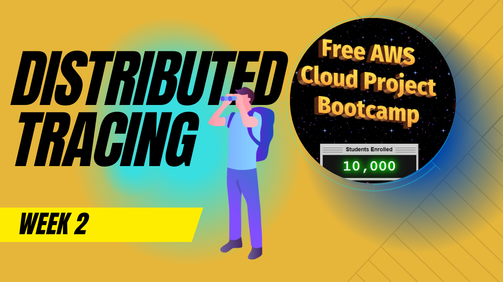
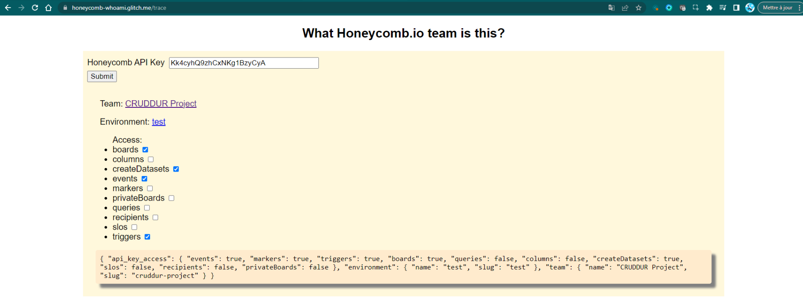
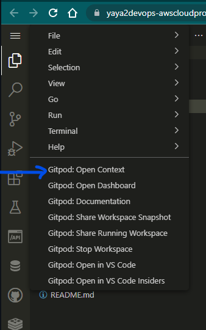

# Week 2 — Distributed Tracing



The good times continue!

This past week was a great dive into the world of troubleshooting and the importance of observability for us; software developers.

I started by learning about the three main observability pillars: metrics, traces, and logs. 

I gained a deeper understanding of how each of these pillars can provide valuable insights into the performance of software applications & help to identify and resolve issues quickly.

I succesfully setup CRUDDUR to four different observability tools: Honeycomb, AWS X-Ray, CloudWatch, and Rollbar.

Here is a brief on the tools, if you consider learning more.

|  Tools         | Description                                          |
|-------------| -----------------------------------------------------|
| [Honeycomb](#honeycomb-dive)   |  Honeycomb is a distributed tracing & observability platform to help engineers understand and debug complex systems. |
| [AWS X-Ray](#instrument-aws-x-ray)   |  AWS X-Ray is a tracing service provided by AWS that helps analyze and debug distributed applications.  |
| [CloudWatch](#aws-cloudwatch)  |Amazon CloudWatch is a monitoring and observability service provided by AWS |
| [Rollbar](#rollbar)  |Rollbar is a cloud-based error and log monitoring tool  helps identify software errors in real-time.  |


Through careful analysis of the data generated, I was capable to effectively identify and resolve numerous critical issues, allowing me to make data-driven decisions that led to real improvements in the performance and stability of the app.


There were two practices I was doing that are worth mentioning:

- **Instrumentation**, which is the practice of adding code to a software application in order to capture data about its performance or behavior, most onboarding to the tools was taking this putting that and troubleshoot in between.
- **Distrubuted Tracing**, it is a technique for tracking the path of a request as it flows through a distributed system or application.

In a distributed system, a single request can touch many different components, services, and systems, and tracking the path of that request can be challenging. This is what these tools can help us in achieving.


Very decent accumulated knowledge, and there is still more related to acquire. 

Take a look at the work completed thus far below!


# Honeycomb Dive


## A- Set Honeycomb API Env Var

```
export HONEYCOMB_API_KEY="Kk4cyhQ9zhCxNKg1BzyCyA"
```

```
gp env HONEYCOMB_API_KEY="Kk4cyhQ9zhCxNKg1BzyCyA"
```


## B-Hard code Service Name  in docker compose


You may ask why not these and gg?

```
export HONEYCOMB_SERVICE_NAME="Cruddur" //cruddur Service name in span 
```

```
gp env HONEYCOMB_SERVICE_NAME="Cruddur"
```

:lamp: Because you dont want it to be consistent as your backend services may vary.


## C- Configure Open Telemetry to send for honeycomb

```
      OTEL_SERVICE_NAME: "backend-flask" 
```

Automatic Instrumentation isnt as good in the frontend.


#  Send Data to required backend lang  dependent

## 1-  Install your backend required language packages

go to backend

```
cd backend-flask
```

Run

```
pip install opentelemetry-api 
```


Include all the packages in requirement.txt
```
opentelemetry-api
opentelemetry-sdk 
opentelemetry-exporter-otlp-proto-http 
opentelemetry-instrumentation-flask 
opentelemetry-instrumentation-requests
```


Run requirement txt to get the packages installed since python isnt that good in package management ;)

```
pip install -r requirements.txt
```


## 2- Initialize

add this to app.py

- This before main 

```
# HoneyComb things for reference 1-----
from opentelemetry import trace
from opentelemetry.instrumentation.flask import FlaskInstrumentor
from opentelemetry.instrumentation.requests import RequestsInstrumentor
from opentelemetry.exporter.otlp.proto.http.trace_exporter import OTLPSpanExporter
from opentelemetry.sdk.trace import TracerProvider
from opentelemetry.sdk.trace.export import BatchSpanProcessor


# HoneyComb things for reference 2-----
# Initialize tracing and an exporter that can send data to Honeycomb
provider = TracerProvider()
processor = BatchSpanProcessor(OTLPSpanExporter())
provider.add_span_processor(processor)
trace.set_tracer_provider(provider)
tracer = trace.get_tracer(__name__)
```

A this should be after main `app = Flask(__name__)`


```
# HoneyComb things for reference 3-----
FlaskInstrumentor().instrument_app(app)
RequestsInstrumentor().instrument()
```

Instructed from:


Making code explicit, env var are sneaky. 

Env var are technically easy but.


## D- Docker Compose up
No need to build the container, it will do it for us. Simple let the docker compose do the magic.

ERROR!


## Troubleshoot


added this 
```
# Show this in the logs within the backend-flask app (STDOUT)
simple_processor = SimpleSpanProcessor(ConsoleSpanExporter())
provider.add_span_processor(simple_processor)
```

and imported its librairy
```
from opentelemetry.sdk.trace.export import ConsoleSpanExporter, SimpleSpanProcessor
```

and then go try the endpoint once more


Oh it shows data now!


## Honeycomb dont show?

- Check again

env | grep HONEY

It is there.


go to 

honeycomb-whoami.glitch.me to find out what api is that..



# Restart fresh



## Let's automate this in gitpod


## And make ports unlocked by default in gitpod


### Solved, here is the dashbaord showing data.


# Observing 👀


<br>


## Spans:


## More Observability


<br>


## I Added Spans:

- 1:Aquiring a tracer:


Go to an api endpoint like the home_activites.py endpoint & add this:

This will help using only the opentelemetryAPI, cause there is fat pack of import.

```
from opentelemetry import trace
tracer = trace.get_tracer("home.activities")
```
- 2: Creating Spans afte def run():

```
with tracer.start_as_current_span("home-activities-mock"):
```


add these after and align to identation to adding Attributes to Spans external-link

```
span = trace.get_current_span()
span.set_attribute("user.id", user.id())
```


<br>


## Advanced Visibility

#### Required code:


#### Output:


### Custom Queries & DB Calls


<br>


This error happened cause i called the endpoint after running docker compose with python syntax missing identation:


<br>


<br>


## Dig deep with this feature and + 


---

# Instrument AWS X-Ray

### Install AWS SDK


## Create group


```
aws xray create-group \
   --group-name "Cruddur" \
   --filter-expression "service(\"backend-flask\")
```


### Here it is


## Sampling 

a good way to ask it to show you what you really need.

```
aws xray create-sampling-rule --cli-input-json file://aws/json/xray.json
```


Create it using CLI using the xray.json

You can do it using aws console. However listen brother, UI changes json dont ;)


### Set up the deamon

It is ca-central, i corrected it before commiting.


## Backend working:


## Things are going succesfully to XRAY


## We have data:


## Digging into XRAY specific request:


## More:


## Overview:


## Part 2 XRAY: Subsegmentation:

### Checking the connectivity:


## Service Map in AWS XRAY:


## Metadata ERROR is not Big deal:


## Gaining more insights:


## Mock data is there, success:


---


# AWS CloudWatch

## Installing the requried package:


## Facing an error :


## Troubleshooting the error:


## Solving the Error:


## here:


## Dev Proof:


## Cloudwatch Visual Proof:


## Cloudwatch is set to receive logs:


---

# Rollbar

Rollbar is a great product indeed. Simply put it's a way to investigate any kind of error that can happen to the backend with further details.


## Install required packages:


## Configure Rollbar Tokens:


## Sample verification page:


# Listening:


## Seeing this page after clicking on Items is  good sign:


<br>


## The Hello World:


## Checking connection and trying things:


## Dashboard Overview:


---
# Week Three To-Do & Student Status

| Tasks                                             | Status |
|:---------------------------------------------------|:--------:|
| Watch Week 2 Live-Stream Video                    | ✅     |
| Watch Chirag Week 2 - Spending Considerations     | ✅     |
| Watched Ashish's Week 2 - Observability Security Considerations | ✅     |
| Instrument Honeycomb with OTEL                     | ✅     |
|Run queries to explore traces within Honeycomb.io|✅|
| Instrument AWS X-Ray                              | ✅     |
|Configure and provision X-Ray daemon within docker-compose and send data back to X-Ray API|✅|
|Observe X-Ray traces within the AWS Console|✅|
| Instrument AWS X-Ray Subsegments                   | ✅     |
|Install WatchTower & Onboard to Cloudwatch|✅|
| Configure custom logger to send to CloudWatch Logs |  ✅    |
| Integrate Rollbar and capture an error             |   ✅   |


---

# Homework Challenge & Student Status

|  Challenge                                                                                                   | Status |
|:----------------------------------------------------------------------------------------------------------------------|:--------:|
| Instrument Honeycomb for the frontend-application to observe network latency between frontend and backend[HARD]      |        |
| Add custom instrumentation to Honeycomb to add more attributes eg. UserId, Add a custom span                          |     ✅    |
| Run custom queries in Honeycomb and save them later eg. Latency by UserID, Recent Traces                              |     ✅    |
| Figure out how to do segment and sub-segment on AWS XRAY                                                               |     ✅    |
