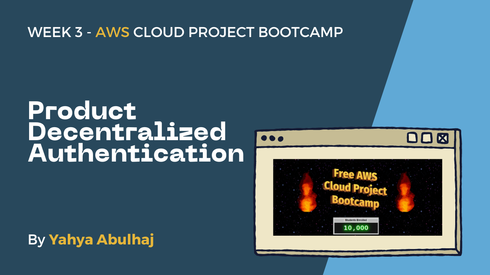
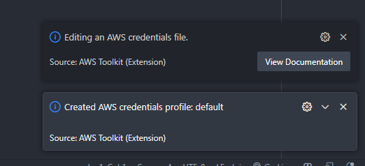
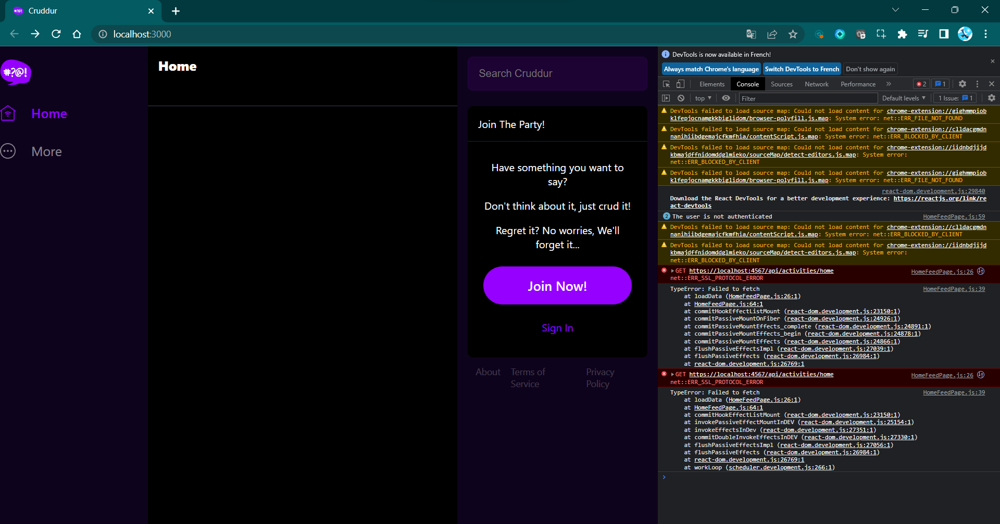
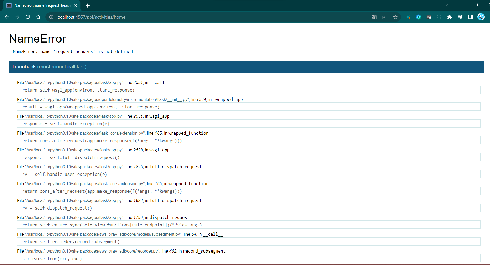
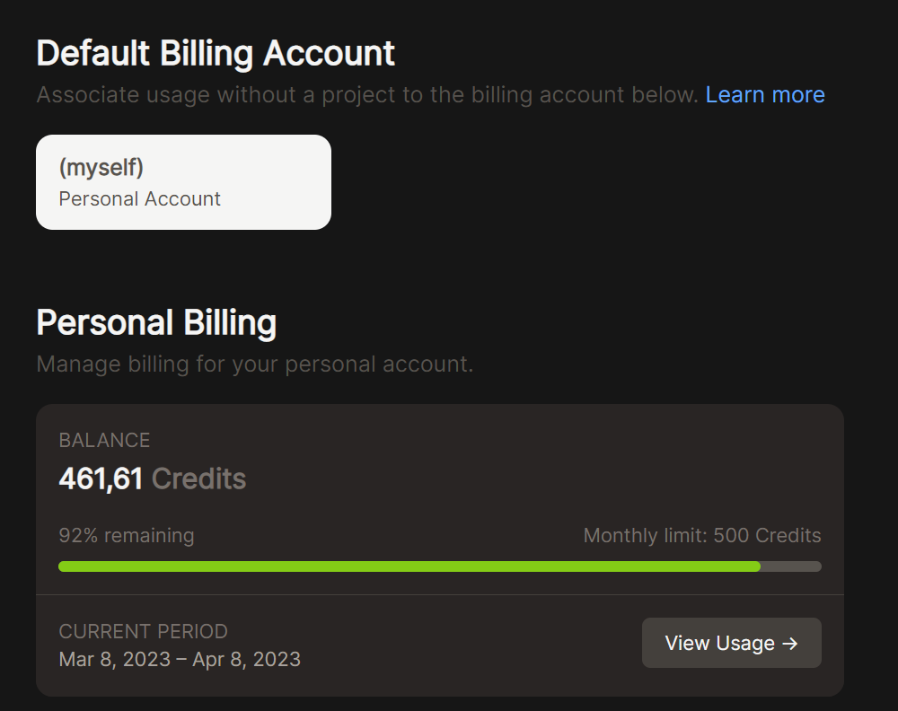

# Week 3 — Decentralized Authentication

Once upon a time, there was a passionate software developer named Yahya who spent his week(s) learning about AWS Cognito and its user pools.

Welcome to Week 3 Journal.




He was determined to master this technology and create a seamless user experience.

**Y**aya dove right into his work, creating Cognito User Pools not once, not twice, but three times! He wanted to ensure that he had a solid understanding of the process and could troubleshoot any issues that may arise in the future.

After setting up the user pools,  Yahya created a user and forced its password. He then integrated everything with Amplify, a development framework that simplifies building web and mobile applications. He made sure to include authentication sign-in, sign-up, and password recovery features.

To make sure that his project was secure, Yahya used JWToken to secure both the front and back end of the application. Everything was running smoothly until he ran out of credit on his development platform, Gitpod.


Yahya learned more than just the technical aspects of authentication during his week working on the Cognito User Pools. He also went over the various authentication methods and their distinct features.

For example, Yahya noted about authentication methods like OAuth, OpenID Connect, and SAML and how they differ. While OAuth is primarily used for authorization, he discovered that OpenID Connect and SAML are used for authentication.

Undeterred, Yaya switched to Codespaces, a cloud-based development environment, and continued his work there. Eventually, he decided to work locally with Docker Desktop, suddenly, his credits had been reset on Gitpod. So, he went back happy to continue that on this super smooth environement.

Despite the challenges he faced, Yahya remained dedicated to his work and successfully completed his project, leaving him with a sense of pride and accomplishment. 

### Table Of Contents:

- [Create Amazon Cognito](#authenticate-with-amazon-cognito)
- [Amplify Integration](#amplify-integration)
  - [Setup Authentication](#authentication-set-up)
  - [Setup Sign in](#sign-in-setup)
  - [Setup Recover Page](#recover-page-setup)
  - [Client Sign up](#client-sign-up)
- [JSON Web Token](#cognito-jason-web-token--construction)
  - [AWS Cognito Librairy](#flask-aws-cognito-librairy-)
- Environments
   - [GitHub Codespaces](#configuring-codespaces)
   - [Docker Desktop](#codespaces-down---moving-to-local)
   - [Gitpod](#credit-restart---back-to-gitpod)


# Authenticate with Amazon Cognito

## Create Cognito:


## Password Security


## MFA costs extra:


## We want this:


## SMS will cost EXTRA:

<br>


## Pick the attributes
Will redo the pool with preferred username included.


## Pick the domain or accept Default:


## Name your Pool &:
Cognito UI is Nah.


## I went with this Indeed:


## First App User Created, Myself


---

# Amplify Integration


## Config Cognito Env:


## User pools ID:


## App client IP:


## A missing one:


## Coding.


## See this?


## Outplay:


## Navigating codebase:


## Critical Thinking:


## However, blank:


## Shooting issues:


## Analyzing situation


## Issue found:


## Strategic decision-making:


## Solved:


## Authentication Set up:


## Coding requirements:


## System Established:


## Navigating complexity:


## Troubleshooting Signin page:


## Touchpoints:


## Sign in Setup:


## Creating myself in Cognito & Strong PW:


## Additionnal Client Infos:


## User created:


> required after creation:

```
aws cognito-idp admin-set-user-password \
  --user-pool-id <your-user-pool-id> \
  --username <username> \
  --password <password> \
  --permanent
```

## Enforcing PW Status:


## Cognito Status Done:


## Logging Success BUT?


> will see.

---

# User recreation with attributes:


## Specify new user pool:


## New client name:


## Specify new connection:


## New user validate:


## Public Client:


## Enforcing PW:


## Enforced:


## Had to specify this:


## Overall users:


## Verified User:


## Self-Digital Confirmation:


## Home page Authentication:


## Recover Page setup:


## The pre-results:


## Internal User stats:


## Cruddur delivered:


---

# Client Sign up

## Code Sign up page:


## Innovative thinking


## Parameters:


## Confirmation page:


## Sign up UI with additionnal inputs:


## Error:


## Resilience in the face of challenges


## This is missing: 


---

# Recreation of USER Pool N3: 

## Deleting existing clients:


## Only email config:


## Sign up testing Confirmation Email:


## Email Confirmed:


## Inside, we can custom this:


## Confirming:


## Confirmed:


## Sign in after confirmation:


## Recover Notification:


## Password Recovery:


## Recovered Client's Account:


## Client Recovered Connection✔️:


> we better then login users after they confirm directly.


---

# Cognito Jason Web Token — Construction


## securing front:


## Passing headers with authorization as called in homefeedpage:


## Blank:


## Shooting this:


## And this:


## Yet:


## Trying to force flush:


# Not yet:


## Trying App logger:


## Still:


## Checking  the error:


## We back with better error:


## CORS Policy


## Debug instead of info:


## Up again:


## Where is my token:


---

# Flask AWS Cognito Librairy —

## Librairy source code:


## Taking the class:


## JWT Limits:


## Install the librairy:


## Learning about the librairy and its code base:


## Adjusting the code:


## Importing the librairy:


## Validating the pattern:


## Adding auth work to backend but im getting error:


## Limited librairy:


## Here we are again:


## Adding these:


## And added here:


## And did this:


## From here:


## God tier plays:


## We doing JWT so lets make it more readable:


## Digging deeper:


## Adjusting librairy:


## And this:


## Passing the token:


## Its fine:
We aint changing the header.


## This is not self:


## Taking this out:


## As well as this:


## We dont know what this class really about:


## Maybe we can call it here, i mean in ruby nah but maybe in py:


## Import but this token service makes no sense:


## There is no data in here:


## The user pool is well set:


## The client pool is set as well:


## Errors:


- [Troubleshoot Completion](#revert-back-to-jwt-debugging)

# Gitpod is down


## Configuring codespaces:


## Settin AWS CLI:


## Secret Key:


## Region:


## Overall Env var:


## Setup port for front:


## Env var port again:


## All set:


## Reloading:


## Rebuilding container:


## Innovative thinking while loading:


## AWS is authenticated for the time number too much:


## Container Launch:


## Codespaces is set:


# Codespaces Down - Moving to local


## AWS CLI:


## Secret from UI


## Done:


## Install AWS EXE:


## Checking Availability:


## Env var:


## Hm, i dont see:


## Exported, worked:


## That's why we document our stuff:


## Depedency requirements:


## Satisfying it:


## Launching Docker local:


## Docker Images:


## Available containers:


## Further stats:


## Ops:


## Compose Config:


## And this:


## Close look:


# Relaunching containers:


## Great News:
We are back to the exact error before running out of credit in gitpod as well as moving to codespaces which run of space due to high volume of journal assets.


# Revert back to JWT Debugging

[JWT Intial work](#cognito-jason-web-token--construction)

## Backend Logs:


## Browser:


## Token issue:



## Solved:


## However token is not passed: 


## Credit Restart - back to gitpod



## Settin env:


## BACK:


## Wrapup Week 3: Improving UI


---

# Week Three To-Do & Student Status
| Task                                        | Status |
|---------------------------------------------|--------|
| Watched Ashish's Week 3                     |   ✅   |
| Provision via ClickOps a Amazon Cognito User Pool                      |   ✅   |
|Implement API calls to Amazon Coginto for custom login|✅|
|Install and configure Amplify client-side library for Amazon Congito|✅|
| Implement Custom Signup Page                 |   ✅   |
| Implement Custom Confirmation Page           |   ✅   |
| Implement Custom Recovery Page               |   ✅   |
| Watch about different approaches to verifying JWTs  |   ✅   |
|Verify JWT Token server side to serve authenticated API endpoints in Flask Application|✅|


---


## Security Quiz

| Question | Answer |
| --- | --- |
| Which additional AWS service should be enabled and monitored alongside Cognito to help detect malicious Cognito user behavior? | Cloud Trail |
| When it comes to single-sign-on, what does the acronym SAML stand for? | Security Assertion Markup Language |
| Which AWS service should be used with Cognito to enable rate limiting, and setup allow/deny rule lists? | WAF (Web Application Firewall) |
| Which of the following is NOT an industry standard for authentication and authorization? | YAML |
| Your Cognito deployment should only be in the AWS region which you are legally allowed to hold user data in | FALSE |


---

| Alternatives and Considerations                                                                 | 
|-------------------------------------------------------------------------------------------------|
| We could have used Auth0 which is a popular decentralized authentication service which has a free-tier. Since we are building a social media website we have to consider the cost of Monthly Active Users (MAUs) |
| In practice a social media platform would likely roll its own decentralized authentication service |
| AuthN would have put on a good technical path to roll own decentralized authentication service however it requires Postgres and Redis so it would be too many extra moving parts and costs considerations for the scope of this bootcamp |
| Azure AD B2C is another possible solution. Its low cost has support for many Identity Providers (IpDs) |

| Alternatives and Considerations                              |
|-------------------------------------------------------------|
| We require a Postgres service if we plan into AuthN which will rely on Postgres to store users for authentication. |
| I want both an OnLine Transaction Processing (OLTP) and an OLAP in this project. |
| Redshift Serverless could be used as an OLAP.                |
| DDB Streams to S3 and then Athena caching to Momento could have been possible as well for our OLAP like solution. |