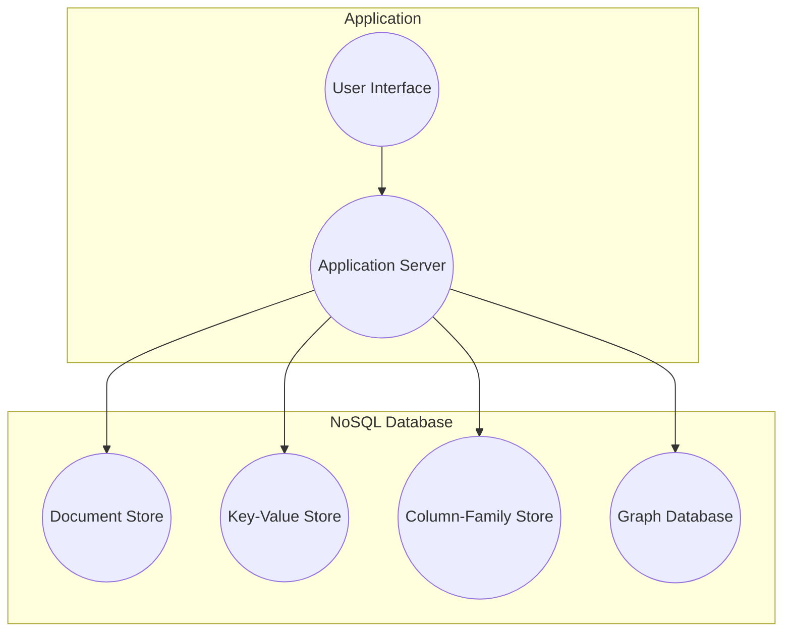
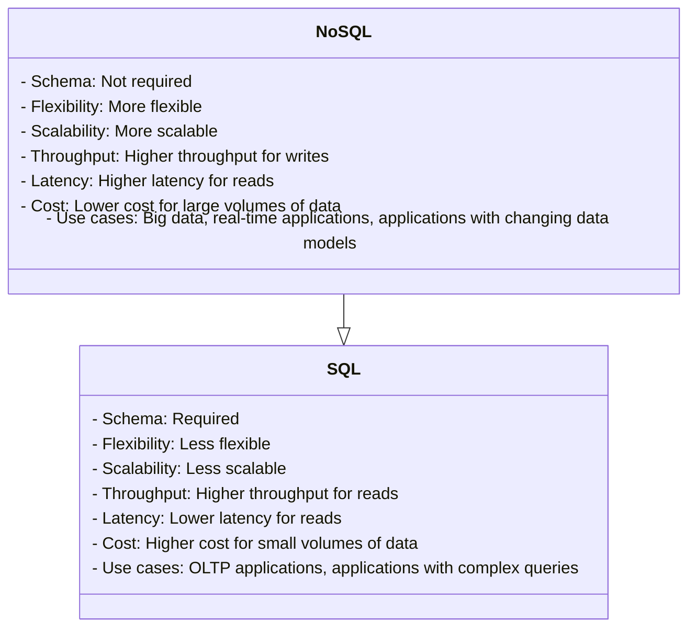
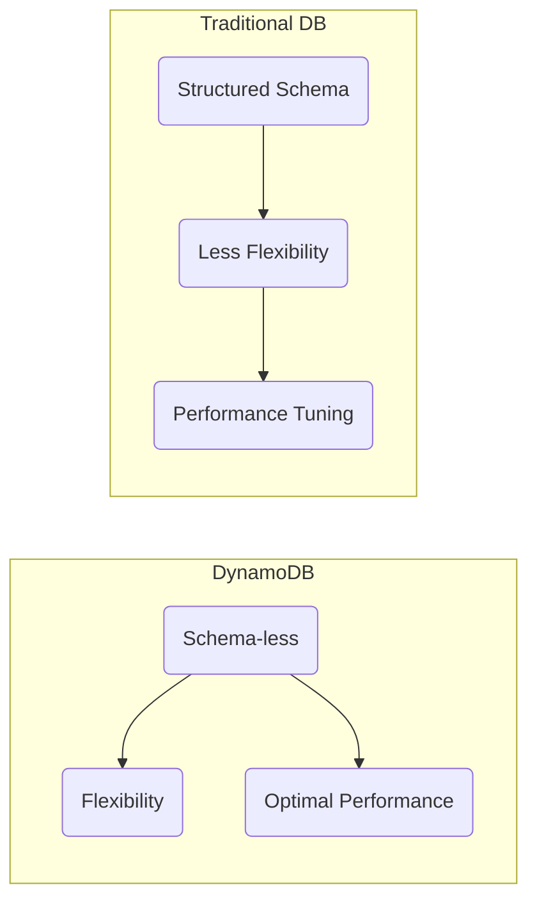

# Week 5 — NoSQL with DynamoDB

This week, we're diving headfirst into the exciting world of NoSQL, harnessing the power of AWS DynamoDB to revolutionize the messaging functionality within our application.

My data journey began with my Microsoft Azure Fundamentals experience. You can [find my notes on the subject here](https://github.com/yaya2devops/ExperienceInCloud/tree/main/Notes#azure-data-fundamentals), which might be useful to you.

Our choice of NoSQL over SQL is a testament to the sheer complexity of the messaging process, which defies conventional schema-based structuring. Messages are inherently unpredictable; you never know who will engage in a conversation with whom. Some may even create group chats that defy the boundaries of conventional data modeling in SQL. 

## Personalizing Your NoSQL Experience
The term **NoSQL** was first coined in 1998 by Carlo Strozzi, who used it to describe his lightweight, open-source relational database that did not expose the standard Structured Query Language (SQL) interface. 

The concept of NoSQL databases has its roots in the early days of the internet—early 2000s, when developers began to realize that traditional relational databases were not well-suited for storing and querying large amounts of unstructured data.

#### Different types of NoSQL databases;

There are many different types of NoSQL databases, each with its own strengths and weaknesses.

* **Key-value stores(Our DynamoDB):** Key-value stores store data in the form of key-value pairs. The key is used to uniquely identify the data, and the value is the data itself.
* **Document stores:** Document stores store data in the form of documents. Documents are like JSON objects, and they can contain a variety of data types.
* **Columnar stores:** Columnar stores store data in columns. This can be useful for applications that need to scan large amounts of data for specific values.
* **Graph databases:** Graph databases store data in the form of graphs. Graphs are made up of nodes and edges, and they can be used to represent relationships between data.

A number of NoSQL databases were developed, including Bigtable, Cassandra, and MongoDB and were designed to be more scalable, flexible, and fault-tolerant. Later in 2012, Amazon Web Services introduced DynamoDB in response to the growing demand and to make it easier for you to develop on the NoSQL model.

## NoSQL VS SQL

NoSQL databases are designed to be flexible and scalable, while SQL databases are designed for querying and reporting.

In SQL databases, the schema is fixed and must be desined first. NoSQL databases do not have a fixed schema. 

**Observe the self-generated insights to empower you on this topic;**

* NoSQL databases are often used for big data applications. The data model must be able to handle large volumes of data.
* NoSQL databases are often used for real-time applications.The data model must be able to keep the data consistent in real time.

NoSQL databases offer a dynamic approach to data modeling but it is a complex task. This flexibility can be advantageous in scenarios where the data's structure is not well-known in advance or where rapid development and scalability are essential. 

Nonetheless, achieving data integrity and efficient querying demands thoughtful planning and design. Let's go over the process of architecting the data model for our application.

# A Masterclass On NoSQL Schema

Data modeling in DynamoDB differs from traditional relational databases due to its schema-less nature, which allows for flexibility but requires careful planning to achieve optimal performance.

It's quite remarkable that you can integrate Amazon DynamoDB, a NoSQL database service, into a [SQL-based environment](https://docs.aws.amazon.com/amazondynamodb/latest/developerguide/ql-gettingstarted.html).

## Pre-Data Model

The following steps serve as acknowledged guidelines that will steer you towards establishing a solid foundation for designing your NoSQL data modeling that will be showcased through our Cruddur app development.

1. **Understand Your Data Access Patterns**
   - Understand [the primary access patterns](#cruddur-access-patterns-design) of your application. 
   - Identify the [common queries](assets/week5/resources/patternsdb.md) that your application will perform.
   -  Apply frequently used patterns in your app before optimization.
2. **Denormalization is Key**
   - DynamoDB doesn't support complex JOIN operations like relational databases.
   - Design for flat tables instead.
   - Using one table instead of linked tables boosts scalability.
   - Duplicate some information across multiple tables to optimize read operations. 
3. **Choose the Right Partition Key**
   - The hash key determines how data is distributed across DynamoDB partitions. 
   - Common choices for partition keys include user IDs, timestamps, or unique identifiers.
   - Key condition expressions for query only for RANGE, HASH is only equality
   - Generate a UUID for an entity only when needed for a specific access pattern.
   - Each query requires a partition key (pk) and, if available in the table, a sort key (sk).
4. **Design Secondary Indexes**
   - Design these indexes based on your access patterns.
   - Store data as a JSON document in a string field If you're not indexing
   - Repeating data for better indexing is acceptable.
   - Be aware that secondary indexes come with additional costs and write capacity requirements.
   - Changing a key (simple.pk or composite.sk) requires creating a new item.
5. **Use Composite Primary Keys Sparingly**
   - Composite primary keys consist of both a partition key and a sort key (range key) e.g. pk = 'yaya2devops'
   - Data keys can serve as a third key or store JSON documents
   - Useful for modeling hierarchical data but should be used judiciously because they limit your query flexibility.
6. **Understand Provisioned Throughput vs. On-Demand Capacity**
   - DynamoDB offers both provisioned and on-demand capacity modes. 
   - Provisioned capacity requires you to specify the read and write capacity units
   - On-demand automatically scales capacity based on your actual usage.
   - Choose the capacity mode that aligns with your workload and budget.
7. **Monitor and Optimize**
   - Regularly monitor your DynamoDB tables using CloudWatch metrics and AWS X-Ray for tracing. 
   - Adjust your table's provisioned capacity or indexes as needed based on real usage patterns.
   - Use tools like the AWS DynamoDB Auto Scaling feature to automate capacity adjustments.
8. **Use Conditional Writes**
   - Allow you to make changes to your data only if specific conditions are met. 
   - Help yourself with data consistency and integrity.
9. **Understand the Consistency Models**
   - DynamoDB offers two consistency models: eventually consistent reads and strongly consistent reads. 
   - Choose the one that fits your application's requirements.
10. **Leverage DynamoDB Streams**
    - DynamoDB Streams can be used to capture changes to your data and trigger other AWS services, enabling real-time processing and event-driven architectures(Employed).
11. **Consider Data Size and Item Size Limits**
    - DynamoDB's maximum item size limit (400 KB) 
    - Partition size limit (10 GB). 
    - Design your data model accordingly.
12. **Use the AWS SDK for DynamoDB**
    - Utilize the AWS SDKs, which provide convenient APIs for working with DynamoDB, making it easier to interact with your data.

Continuously reevaluate and retest your data model to verify its alignment with your performance and scalability prerequisites. Let me take you into our application's data modeling for further insight.

## DynamoDB Data Modeling

This tabular data model represents our use case for retrieving messages. This table is used to store messages in a DynamoDB table. This is available just for You in [CSV](assets/week5/Spreadsheet-DynamoDBData%20Modeling.csv) and [PDF](assets/week5/Spreadsheet-DynamoDBData%20Modeling.pdf)!

| pk                | sk                   | data                       | uuid                                | display_name    | handle       | message               | user_uuid                            | message_group_uuid                   |
|-------------------|----------------------|----------------------------|------------------------------------|----------------|--------------|-----------------------|--------------------------------------|--------------------------------------|
| MSG#{message_group_uuid} | MSG#{created_at} |                            | 32423432-235325-3525-325235352-235235 | Yahya Abulhaj  | yaya2devops  | Hey Bayko             | 232cfd0f-3841-47bc-ad8b-44d9d3b7264f | 23523532-6433634643-234234234-23423525 |
| GRP#{my_user_uuid}      | GRP#{last_reply_at} |                          |                                    | Andrew Bayko   | bayko        | Hey - Yaya, The legend. | 2342342-52353252-23523523-23424    | 23523532-6433634643-234234234-23423525 |
| GRP#{my_user_uuid}      | GRP#{last_reply_at} |                          |                                    | Yahya Abulhaj  | yaya2devops  | Ty. Love the cloud!    | 232cfd0f-3841-47bc-ad8b-44d9d3b7264f | 23523532-6433634643-234234234-23423525 |

The table can be queried by the `message_group_uuid` or the `created_at` field.  The data column can be used to retrieve the data for a specific message

Refer to the following to get a clear overview of each attribute within our DynamoDB table.
- **pk (Primary Key)**: A combination of the `message_group_uuid` and `created_at` fields, ensuring unique message identification.
- **sk (Sort Key)**: Represents the `created_at` field, ensuring messages are sorted chronologically.
- **data**: A JSON object containing message data, including message text, sender's username, and sender's UUID.
- **uuid**: Unique identifier for each message.
- **display_name**: The sender's display name used for identification.
- **handle**: The sender's username used for logging into the application.
- **message**: The actual text content of the message.
- **user_uuid**: Unique identifier for the sender.
- **message_group_uuid**: Unique identifier for the message group.

I made sure not to place [similar formats](assets/week5/resources/other-format-dynamdb.md) in close proximity.

## Cruddur Messanging Access Patterns
To enable messaging functionality, we employed five DynamoDB patterns for implementation.
We will uncover each access pattern A through E and explain how to implement them effectively.

Before delving deeper, take a moment to examine the following comprehensive architecture that encapsulates the key aspects. The representation of patterns describe the different ways in which we will access and query data using the NoSQL approach.

Proceed to my complete guide about the access patterns prior to our implemention.

- [A. Listing Messages in Message Group into Application](#a-listing-messages-in-message-group-into-application)
- [B. Listing Messages Group into Application](#b-listing-messages-group-into-application)
- [C. Creating a Message for an existing Message Group into Application](#c-creating-a-message-for-an-existing-message-group-into-application)
- [D. Creating a Message for a new Message Group into Application](#d-creating-a-message-for-a-new-message-group-into-application)
- [E. Updating a Message Group using DynamoDB Streams](#e-updating-a-message-group-using-dynamodb-streams)

### A. Listing Messages in Message Group into Application

This pattern is used to list all the messages in a message group. The following steps are involved in implementing this pattern:

1. Create a DynamoDB table with the following schema:

- `MessageGroupID:` The primary key of the table. This is a partition key.
- `MessageID:` The secondary index of the table. This is a sort key.
- `Message:` The message content.
2. Create a Lambda function that will be triggered when a new message is added to the table. The Lambda function should list all the messages in the message group and return them to the application.

3. Call the Lambda function to list all the messages in the message group.

### B. Listing Messages Group into Application

This pattern is used to list all the message groups. The following steps are involved in implementing this pattern:

1. Create a DynamoDB table with the following schema:

- `MessageGroupID:` The primary key of the table. This is a partition key.
- `Name:` The name of the message group.
2. In the application, query the DynamoDB table for all the message groups.

### C. Creating a Message for an existing Message Group into Application

This pattern is used to create a new message for an existing message group. The following steps are involved in implementing this pattern:

1. Create a DynamoDB table with the following schema:

- `MessageGroupID:` The primary key of the table. This is a partition key.
- `MessageID:` The secondary index of the table. This is a sort key.
- `Message:` The message content.
2. In the application, create a new message and add it to the DynamoDB table.

### D. Creating a Message for a new Message Group into Application

This pattern is used to create a new message group and a new message in the message group. The following steps are involved in implementing this pattern:

1.Create a DynamoDB table with the following schema:

- `MessageGroupID:` The primary key of the table. This is a partition key.
- `MessageID:` The secondary index of the table. This is a sort key.
- `Message:` The message content.
2. In the application, create a new message group and add a new message to the message group.

### E. Updating a Message Group using DynamoDB Streams

This pattern is used to update a message group using DynamoDB Streams. DynamoDB Streams is a feature of DynamoDB that allows you to track changes to your data. The following steps are involved in implementing this pattern:

1. Enable DynamoDB Streams on the table that contains the message group.
2. Create a Lambda function that will be triggered when a change is made to the message group.
3. In the Lambda function, update the message group accordingly.

---

**To Be Continued..**

---