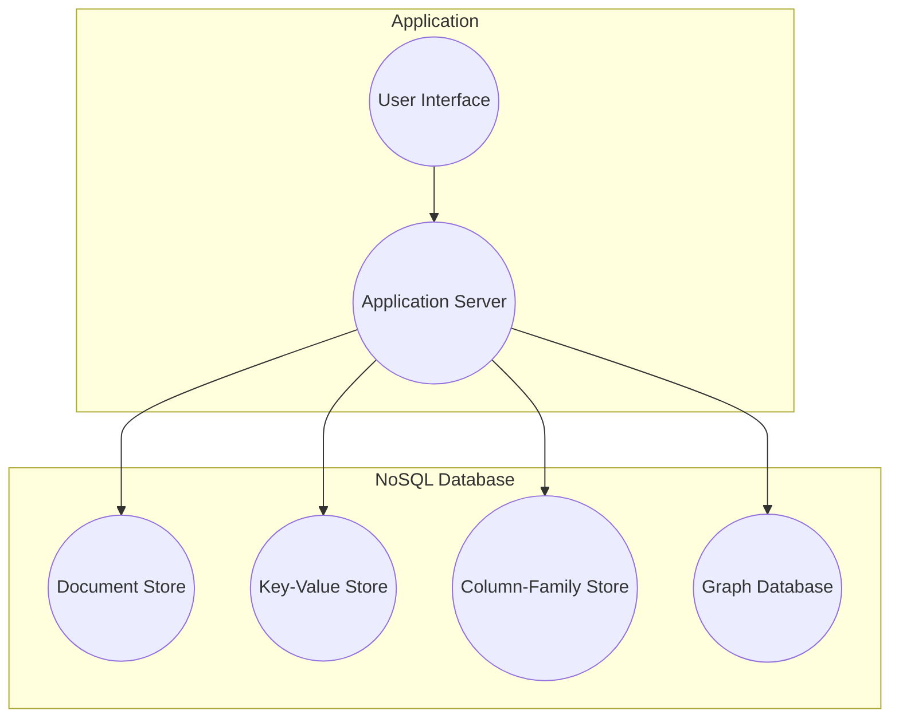
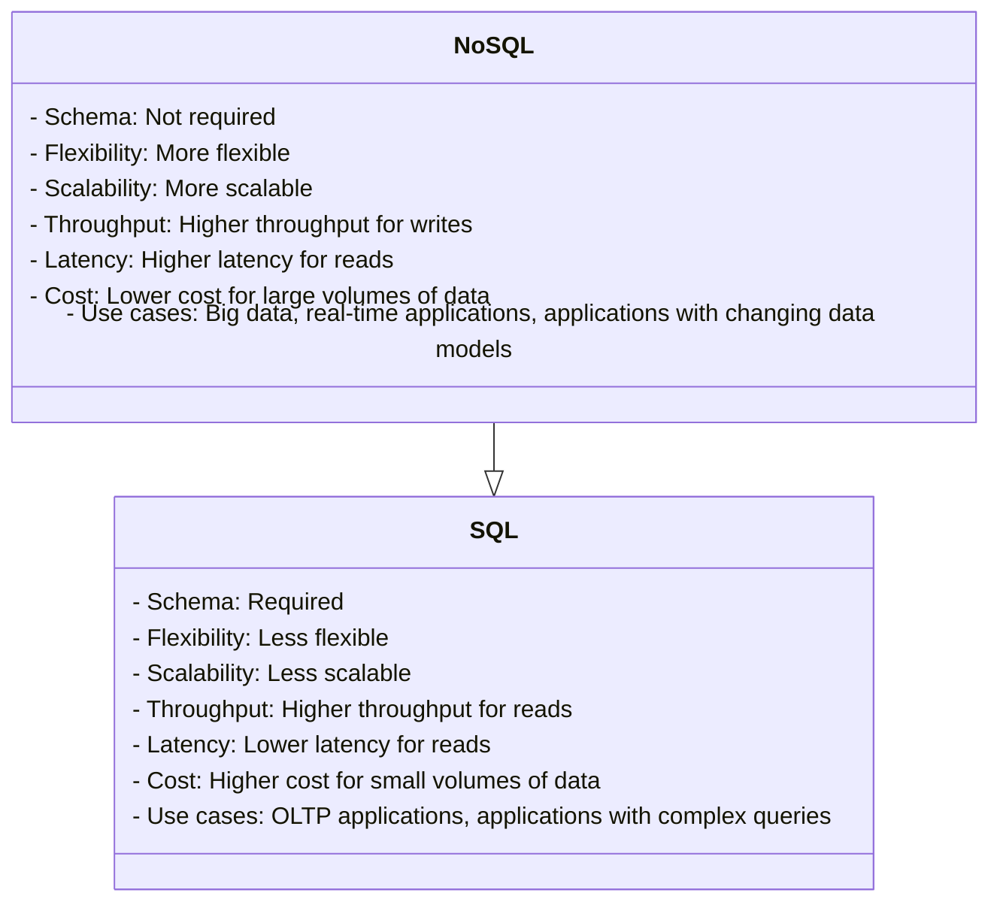
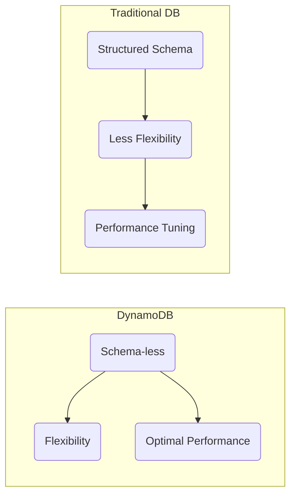
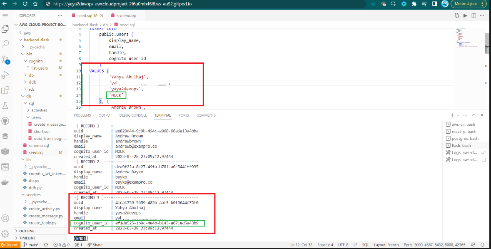

# Week 5 — NoSQL with Amazon DynamoDB

This week, we're diving headfirst into the exciting world of NoSQL, harnessing the power of AWS DynamoDB to revolutionize the messaging functionality within our application.

My data journey began with my [Microsoft Azure Fundamentals](https://www.linkedin.com/posts/yahya-abulhaj_cloud-microsoft-strategy-activity-7079118494864175104-NKq1?utm_source=share&utm_medium=member_desktop) experience. <br>You can [find my notes on the subject here](https://github.com/yaya2devops/ExperienceInCloud/tree/main/Notes#azure-data-fundamentals), which might be useful to you. <br> I passed that with a 900 points plus score, Its [open sourced too](https://github.com/yaya2devops/ExperienceInCloud/blob/main/Certifications!/2%C2%B0DP-900.pdf).


- [Personalizing Your NoSQL Experience](#personalizing-your-nosql-experience)
  - [Different types of NoSQL databases](#different-types-of-nosql-databases)
  - [The Data Manager Battle](#the-data-manager-battle)
- [A Masterclass On NoSQL Schema](#a-masterclass-on-nosql-schema)
  - [Pre-Data Model](#pre-data-model)
  - [DynamoDB Data Modeling](#dynamodb-data-modeling)
- [The DynamoDB Encyclopedia](#the-dynamodb-encyclopedia)
    - [DynamoDB Local](#dynamodb-local)
    - [Design Schema Load Script](#design-schema-load-script)
  - [A Rapid NoSQL Operator](#a-rapid-nosql-operator)
    - [Create List Tables Script — `list-tables`](#create-list-tables-script---list-tables)
    - [Drop Table Script — `drop`](#drop-table-script---drop)
    - [Implement Seed Script — `seed`](#implement-seed-script---seed)
    - [Implement Scan Script — `scan`](#implement-scan-script---scan)
- [Access Patterns Scripts and More](#scripted-solutions-for-access-patterns-and-beyond)
  - [Conversation Script Generator — `get-convo`](#conversation-script-generator)
    - [Step 1 : Shebang and Imports](#step-1--shebang-and-imports)
    - [Step 2: Configuration](#step-2-configuration)
    - [Step 3: DynamoDB Client Setup](#step-3-dynamodb-client-setup)
  - [Customer Focused Script — `list-convo`](#customer-focused-script)
  - [Amazon Cognito Meets PostgreSQL](#amazon-cognito-meets-postgresql)
    - [Scripting `list-users`](#script-list-users)
    - [Scripting `update_cognito_user_ids`](#script-update_cognito_user_ids)
- [`Ddb` Class for Conversational Feature](#ddb-class-for-conversational-feature)
- [Cruddur Messanging Pre-Access Patterns](#cruddur-messanging-pre-access-patterns)
   - [`Ddb` Class for Conversational Feature](#ddb-class-for-conversational-feature)
    - [Implement Pattern A For Conversations — `7 Steps`](#implement-pattern-a-for-conversations)


Our choice of NoSQL over SQL is a testament to the sheer complexity of the messaging process, which defies conventional schema-based structuring. Messages are inherently unpredictable; you never know who will engage in a conversation with whom. Some may even create group chats that defy the boundaries of conventional data modeling in SQL. 

## Personalizing Your NoSQL Experience
The term **NoSQL** was first coined in 1998 by Carlo Strozzi, who used it to describe his lightweight, open-source relational database that did not expose the standard Structured Query Language (SQL) interface. 

The concept of NoSQL databases has its roots in the early days of the internet—early 2000s, when developers began to realize that traditional relational databases were not well-suited for storing and querying large amounts of unstructured data.

#### Different types of NoSQL databases;

There are many different types of NoSQL databases, each with its own strengths and weaknesses.



* **Key-value stores(Our DynamoDB):** Key-value stores store data in the form of key-value pairs. The key is used to uniquely identify the data, and the value is the data itself.
* **Document stores:** Document stores store data in the form of documents. Documents are like JSON objects, and they can contain a variety of data types.
* **Columnar stores:** Columnar stores store data in columns. This can be useful for applications that need to scan large amounts of data for specific values.
* **Graph databases:** Graph databases store data in the form of graphs. Graphs are made up of nodes and edges, and they can be used to represent relationships between data.

A number of NoSQL databases were developed, including Bigtable, Cassandra, and MongoDB and were designed to be more scalable, flexible, and fault-tolerant. Later in 2012, Amazon Web Services introduced DynamoDB in response to the growing demand and to make it easier for you to develop on the NoSQL model.


## The Data Manager Battle

NoSQL databases are designed for unstructured data like images and videos, while SQL databases are designed for querying and reporting.

In SQL databases, the schema is fixed and must be desined first.<br> NoSQL databases do not have a fixed schema. 

**Observe the self-generated insights to empower you on this topic;**



* NoSQL databases are often used for big data applications. The data model must be able to handle large volumes of data.
* NoSQL databases are often used for real-time applications.The data model must be able to keep the data consistent in real time.

NoSQL databases offer a dynamic approach to data modeling but it is a complex task. This flexibility can be advantageous in scenarios where the data's structure is not well-known in advance or where rapid development and scalability are essential. 

Nonetheless, achieving data integrity and efficient querying demands thoughtful planning and design. Let's go over the process of architecting the data model for our application.


# A Masterclass On NoSQL Schema

Data modeling in DynamoDB differs from traditional relational databases due to its schema-less nature, which allows for flexibility but requires careful planning to achieve optimal performance.



It's quite remarkable that you can integrate Amazon DynamoDB, a NoSQL database service, into a [SQL-based environment](https://docs.aws.amazon.com/amazondynamodb/latest/developerguide/ql-gettingstarted.html).

## Pre-Data Model

The following steps serve as acknowledged guidelines that will steer you towards establishing a solid foundation for designing your NoSQL data modeling that will be showcased through our Cruddur app development.

1. **Understand Your Data Access Patterns**
   - Understand [the primary access patterns](#cruddur-access-patterns-design) of your application. 
   - Identify the [common queries](assets/week5/resources/patternsdb.md) that your application will perform.
   -  Apply frequently used patterns in your app before optimization.
2. **Denormalization is Key**
   - DynamoDB doesn't support complex JOIN operations like relational databases.
   - Design for flat tables instead.
   - Using one table instead of linked tables boosts scalability.
   - Duplicate some information across multiple tables to optimize read operations. 
3. **Choose the Right Partition Key**
   - The hash key determines how data is distributed across DynamoDB partitions. 
   - Common choices for partition keys include user IDs, timestamps, or unique identifiers.
   - Key condition expressions for query only for RANGE, HASH is only equality
   - Generate a UUID for an entity only when needed for a specific access pattern.
   - Each query requires a partition key (pk) and, if available in the table, a sort key (sk).
4. **Design Secondary Indexes**
   - Design these indexes based on your access patterns.
   - Store data as a JSON document in a string field If you're not indexing
   - Repeating data for better indexing is acceptable.
   - Be aware that secondary indexes come with additional costs and write capacity requirements.
   - Changing a key (simple.pk or composite.sk) requires creating a new item.
5. **Use Composite Primary Keys Sparingly**
   - Composite primary keys consist of both a partition key and a sort key (range key) e.g. pk = 'yaya2devops'
   - Data keys can serve as a third key or store JSON documents
   - Useful for modeling hierarchical data but should be used judiciously because they limit your query flexibility.
6. **Understand Provisioned Throughput vs. On-Demand Capacity**
   - DynamoDB offers both provisioned and on-demand capacity modes. 
   - Provisioned capacity requires you to specify the read and write capacity units
   - On-demand automatically scales capacity based on your actual usage.
   - Choose the capacity mode that aligns with your workload and budget.
7. **Monitor and Optimize**
   - Regularly monitor your DynamoDB tables using CloudWatch metrics and AWS X-Ray for tracing. 
   - Adjust your table's provisioned capacity or indexes as needed based on real usage patterns.
   - Use tools like the AWS DynamoDB Auto Scaling feature to automate capacity adjustments.
8. **Use Conditional Writes**
   - Allow you to make changes to your data only if specific conditions are met. 
   - Help yourself with data consistency and integrity.
9. **Understand the Consistency Models**
   - DynamoDB offers two consistency models: eventually consistent reads and strongly consistent reads. 
   - Choose the one that fits your application's requirements.
10. **Leverage DynamoDB Streams**
    - DynamoDB Streams can be used to capture changes to your data and trigger other AWS services, enabling real-time processing and event-driven architectures(Employed).
11. **Consider Data Size and Item Size Limits**
    - DynamoDB's maximum item size limit (400 KB) 
    - Partition size limit (10 GB). 
    - Design your data model accordingly.
12. **Use the AWS SDK for DynamoDB**
    - Utilize the AWS SDKs, which provide convenient APIs for working with DynamoDB, making it easier to interact with your data.

Continuously reevaluate and retest your data model to verify its alignment with your performance and scalability prerequisites. Let me take you into our application's data modeling for further insight.


## DynamoDB Data Modeling

This tabular data model represents our use case for retrieving messages. This table is used to store messages in a DynamoDB table and is available just for You in [CSV](assets/week5/Spreadsheet-DynamoDBData%20Modeling.csv) and [PDF](assets/week5/Spreadsheet-DynamoDBData%20Modeling.pdf)!


| pk                | sk                   | data                       | uuid                                | display_name    | handle       | message               | user_uuid                            | message_group_uuid                   |
|-------------------|----------------------|----------------------------|------------------------------------|----------------|--------------|-----------------------|--------------------------------------|--------------------------------------|
| MSG#{message_group_uuid} | MSG#{created_at} |                            | 32423432-235325-3525-325235352-235235 | Yahya Abulhaj  | yaya2devops  | Hey Bayko             | 232cfd0f-3841-47bc-ad8b-44d9d3b7264f | 23523532-6433634643-234234234-23423525 |
| GRP#{my_user_uuid}      | GRP#{last_reply_at} |                          |                                    | Andrew Bayko   | bayko        | Hey - Yaya, The legend. | 2342342-52353252-23523523-23424    | 23523532-6433634643-234234234-23423525 |
| GRP#{my_user_uuid}      | GRP#{last_reply_at} |                          |                                    | Yahya Abulhaj  | yaya2devops  | Ty. Love the cloud!    | 232cfd0f-3841-47bc-ad8b-44d9d3b7264f | 23523532-6433634643-234234234-23423525 |

The table can be queried by the `message_group_uuid` or the `created_at` field.<br> The data column can be used to retrieve the data for a specific message

Refer to the following to get a clear overview of each attribute within our DynamoDB table.
- **pk (Primary Key)**: A combination of the `message_group_uuid` and `created_at` fields, ensuring unique message identification.
- **sk (Sort Key)**: Represents the `created_at` field, ensuring messages are sorted chronologically.
- **data**: A JSON object containing message data, including message text, sender's username, and sender's UUID.
- **uuid**: Unique identifier for each message.
- **display_name**: The sender's display name used for identification.
- **handle**: The sender's username used for logging into the application.
- **message**: The actual text content of the message.
- **user_uuid**: Unique identifier for the sender.
- **message_group_uuid**: Unique identifier for the message group.

I made sure not to place [similar formats](assets/week5/resources/other-format-dynamdb.md) in close proximity.


## Cruddur Messanging Pre-Access Patterns
To enable messaging functionality, we employed five DynamoDB patterns for implementation.
We will uncover each access pattern A through E and explain how to implement them effectively.

Before delving deeper, take a moment to examine the following comprehensive architecture that encapsulates the key aspects. The representation of patterns describe the different ways in which we will access and query data using the NoSQL approach.

[Check me in SVG](assets/week5/DynamoDB%20Modelling-Patterns.svg)


Proceed to my complete guide about the access patterns prior to our implemention.

- [A. Listing Messages in Message Group into Application](#a-listing-messages-in-message-group-into-application)
- [B. Listing Messages Group into Application](#b-listing-messages-group-into-application)
- [C. Creating a Message for an existing Message Group into Application](#c-creating-a-message-for-an-existing-message-group-into-application)
- [D. Creating a Message for a new Message Group into Application](#d-creating-a-message-for-a-new-message-group-into-application)
- [E. Updating a Message Group using DynamoDB Streams](#e-updating-a-message-group-using-dynamodb-streams)

### A. Listing Messages in Message Group into Application

This pattern is used to list all the messages in a message group. The following steps are involved in implementing this pattern:

1. Create a DynamoDB table with the following schema:

- `MessageGroupID:` The primary key of the table. This is a partition key.
- `MessageID:` The secondary index of the table. This is a sort key.
- `Message:` The message content.

> Complete [Pattern A Implementation]().

### B. Listing Messages Group into Application

This pattern is used to list all the message groups. The following steps are involved in implementing this pattern:

1. Create a DynamoDB table with the following schema:

- `MessageGroupID:` The primary key of the table. This is a partition key.
- `Name:` The name of the message group.
2. In the application, query the DynamoDB table for all the message groups.
3. Create a Lambda function that will be triggered when a new message is added to the table. The Lambda function should list all the messages in the message group and return them to the application.

4. Call the Lambda function to list all the messages in the message group.

### C. Creating a Message for an existing Message Group into Application

This pattern is used to create a new message for an existing message group. The following steps are involved in implementing this pattern:

1. Create a DynamoDB table with the following schema:

- `MessageGroupID:` The primary key of the table. This is a partition key.
- `MessageID:` The secondary index of the table. This is a sort key.
- `Message:` The message content.
2. In the application, create a new message and add it to the DynamoDB table.

### D. Creating a Message for a new Message Group into Application

This pattern is used to create a new message group and a new message in the message group. The following steps are involved in implementing this pattern:

1.Create a DynamoDB table with the following schema:

- `MessageGroupID:` The primary key of the table. This is a partition key.
- `MessageID:` The secondary index of the table. This is a sort key.
- `Message:` The message content.
2. In the application, create a new message group and add a new message to the message group.

### E. Updating a Message Group using DynamoDB Streams

This pattern is used to update a message group using DynamoDB Streams. DynamoDB Streams is a feature of DynamoDB that allows you to track changes to your data. The following steps are involved in implementing this pattern:

1. Enable DynamoDB Streams on the table that contains the message group.
2. Create a Lambda function that will be triggered when a change is made to the message group.
3. In the Lambda function, update the message group accordingly.


# The DynamoDB Encyclopedia
Let's embark on a journey to master the art of NoSQL database using DynamoDB. <br>We will craft all that to our great bin directory!
```sh
bin/
├── ddb/
│   ├── patterns/
│   │   ├── list-conversations
│   │   └── get-conversations
│   ├── list-tables
│   ├── drop
│   ├── Seed Script
│   └── Scan Script
└── cognito/
    ├── list-users
    └── db/
        └── update_cognito_user_ids
```   
The following is a recap of what we'll be doing.
- **Local DynamoDB Setup—** We'll start by setting up DynamoDB locally, ensuring you have a working environment for development.
- **Schema Design—** Next, we'll delve into the schema design, carefully crafting the structure that suits your application's needs.
- **Data Loading—** We'll guide you through the process of loading data into DynamoDB, ensuring your database is populated with the necessary information.
- **Basic Operations—** We'll create scripts for fundamental operations like adding, updating, and deleting records in the database.
- **Access Patterns—** We'll take a deep dive into each access pattern presented earlier, developing scripts for tasks such as reading and listing conversations from the database.
- **Cognito Integration—** We'll also cover scripts for seamless integration with Amazon Cognito.

### DynamoDB Local

In our first week, we efficiently initiated the setup of Dynamo, and subsequently, we made a prudent decision to comment it out temporarily in order to conserve workspace credits. 

Now, we are poised to re-enable it by simply uncommenting the relevant code in your `docker-compose.yml`


You can find guidance on configuring the DynamoDB setup locally in [my previous technical writings](week1.md#dynamodb-container).

### Design Schema Load Script
We now have to set up the database structure and initialize it with the necessary configuration using a schema.


1. **Requirements and Dependencies**

   - Add `boto3` to the `requirements.txt` file:
     ```
     boto3==1.18.2
     ```
     

   - Install the dependencies:
     ```
     pip install -r requirements.txt
     ```
   - You can also automate the process in **Gitpod**
    


We import the `boto3` library to interact with AWS services.


2. **Folder Structure**

   - Create a new folder called `ddb` inside the `backend-flask/bin` directory. This is where you will place the `schema-load` script.

3. **Execute `schema-load` Script**

   - Create a new file named `schema-load` inside the `ddb` folder.

   - Make it executable:
     ```
     chmod +x schema-load
     ```

4. **Design the `schema-load` Script**

   - Set default attributes for DynamoDB client
     ```py
      attrs = {"endpoint_url": "http://localhost:8000"}
     ```   
     We define default attributes for the DynamoDB client, including the local development endpoint URL.

   - Check if "prod" argument is provided to run in production mode
     ```py
        if len(sys.argv) == 2:
            if "prod" in sys.argv[1]:
                attrs = {}     
        ```
        The script checks if an argument is provided when running the script. If the argument is "prod," it clears the attributes, which is used for production AWS environment settings.
 
   - Create a DynamoDB client
     ```py 
      ddb = boto3.client("dynamodb", **attrs)
     ``` 
     We create a DynamoDB client using the provided or default attributes.

   - Define the table name
     ```py
      table_name = "cruddur-messages"
     ``` 
     The `table_name` variable holds the name of the table to be created.

   - Create the DynamoDB table
     ```py
        response = ddb.create_table(
        TableName=table_name,
        AttributeDefinitions=[
            {"AttributeName": "pk", "AttributeType": "S"},
            {"AttributeName": "sk", "AttributeType": "S"},
        ],
        KeySchema=[
            {"AttributeName": "pk", "KeyType": "HASH"},
            {"AttributeName": "sk", "KeyType": "RANGE"},
        ],
        BillingMode="PROVISIONED",
        ProvisionedThroughput={"ReadCapacityUnits": 5, "WriteCapacityUnits": 5},
     )
     ``` 
     We use the ddb.create_table() method to create the DynamoDB table with the specified schema and settings.

   - Print the response from table creation
     ```
      print(response)
     ```      

   - Ace your script with The `#! /usr/bin/env python3` shebang line at the start indicates that this is a py script.
   


After independently designing each component of the schema loading script, validate the script as follows.


```py  
#! /usr/bin/env python3

import boto3
import sys

attrs = {"endpoint_url": "http://localhost:8000"}

if len(sys.argv) == 2:
    if "prod" in sys.argv[1]:
        attrs = {}

ddb = boto3.client("dynamodb", **attrs)

table_name = "cruddur-messages"

response = ddb.create_table(
    TableName=table_name,
    AttributeDefinitions=[
        {"AttributeName": "pk", "AttributeType": "S"},
        {"AttributeName": "sk", "AttributeType": "S"},
    ],
    KeySchema=[
        {"AttributeName": "pk", "KeyType": "HASH"},
        {"AttributeName": "sk", "KeyType": "RANGE"},
    ],
    BillingMode="PROVISIONED",
    ProvisionedThroughput={"ReadCapacityUnits": 5, "WriteCapacityUnits": 5},
)

print(response)
```  

5. Execute the script using `./schema-load` to create the specified DynamoDB table with the defined schema. 


## A Rapid NoSQL Operator

Hey Operator, I'll provide you with the necessary scripts to work with the NoSQL system. Once your schema is created, it will generate a single table in DynamoDB. With this table in place, you'll have the capability to perform actions such as listing the tables and dropping. Also, you can populate this table with data and subsequently scan its contents. 

We welcome you to explore and engage in these operations as I guide you through each step.

- [Create List Tables Script - `list-tables`](#create-list-tables-script---list-tables)
- [Drop Table Script - `drop`](#drop-table-script---drop)
- [Implement Seed Script - `seed`](#implement-seed-script---seed)
- [Implement Scan Script - `scan`](#implement-scan-script---scan)

Let's recap our directory structure. We've already created the `load-schema` script in the `ddb` directory. Now, we'll also add the following scripts that we discussed:
```
bin/ddb/
├── schema-load (done King and Queen!)
├── list-tables
├── drop
├── Seed 
└── Scan 
```
### Create List Tables Script - `list-tables`

The purpose of this script is to list the tables in DynamoDB, and it allows you to specify whether you want to target the production environment or a local development environment.

```bash
#!/usr/bin/bash

set -e # Stop if it fails at any point

if [ "$1" = "prod" ]; then
    ENDPOINT_URL=""
else
    ENDPOINT_URL="--endpoint-url=http://localhost:8000"
fi

aws dynamodb list-tables $ENDPOINT_URL \
--query TableNames \
--output table
```

The `set -e` statement tells the script to exit immediately if any command fails. This is a good practice to follow in all shell scripts, as it helps to prevent errors from cascading.

The `if` statement checks to see if the `prod` argument was passed to the script. If it was, the `ENDPOINT_URL` variable is set to an empty string. This tells the AWS CLI to use the production DynamoDB endpoint. Otherwise, the ENDPOINT_URL variable is set to the default endpoint, which is `http://localhost:8000`.


The aws `dynamodb list-tables` command lists all the tables in the current account. The --query TableNames option tells the command to only return the table names. The --output table option tells the command to format the output as a table.


### Drop Table Script - `drop`
This script is used to delete a DynamoDB table. You need to provide the TABLE_NAME as an argument when running the script. It also supports specifying the environment (prod or local).

```sh
#! /usr/bin/bash

set -e # stop if it fails at any point

if [ -z "$1" ]; then
  echo "No TABLE_NAME argument supplied eg ./bin/ddb/drop cruddur-messages prod "
  exit 1
fi
TABLE_NAME=$1

if [ "$2" = "prod" ]; then
  ENDPOINT_URL=""
else
  ENDPOINT_URL="--endpoint-url=http://localhost:8000"
fi

echo "deleting table: $TABLE_NAME"

aws dynamodb delete-table $ENDPOINT_URL \
  --table-name $TABLE_NAME
```

The `aws dynamodb delete-table` command drops the specified table. 


The `--table-name` option tells the command the name of the table to be dropped.

### Implement Seed Script - `seed`

This script is responsible for updating the PostgreSQL database schema and seeding the data into DynamoDB. 


1. Import necessary modules:
   - Start by importing the required modules, including `boto3`, `os`, `sys`, `datetime`, `timedelta`, and `uuid`. These modules are used for various tasks such as interacting with DynamoDB, managing paths, and handling dates and times.
```py
#!/usr/bin/env python3

import boto3
import os
import sys
from datetime import datetime, timedelta, timezone
import uuid
```
2. Set up some initial variables:
   - It defines `current_path` to store the absolute path of the current script file.
   - It calculates `parent_path` as the absolute path of the parent directory, which is three levels above the current script.
   - It appends the `parent_path` to `sys.path`, which allows importing modules from the `lib.db` package located in that directory.

```py
current_path = os.path.dirname(os.path.abspath(__file__))
parent_path = os.path.abspath(os.path.join(current_path, '..', '..', 'backend-flask'))
sys.path.append(parent_path)
from lib.db import db
```
3. Configure DynamoDB client:
   - It sets the `attrs` dictionary with an `endpoint_url` key set to 'http://localhost:8000'. This is used for local development. If a command-line argument is provided with "prod" in it, the `attrs` dictionary is left empty to connect to a production database.
   - It creates a DynamoDB client (`ddb`) using the `boto3.client` method with the specified attributes.

```py
attrs = {
  'endpoint_url': 'http://localhost:8000'
}
# unset endpoint url for use with production database
if len(sys.argv) == 2:
  if "prod" in sys.argv[1]:
    attrs = {}
ddb = boto3.client('dynamodb',**attrs)
```

4. Define a function to get user UUIDs:
   - This function executes an SQL query to retrieve user data from a database.
   - It uses the `db.query_array_json` method with a SQL query and parameters.
   - It extracts the user information for 'yaya2devops' and 'bayko' from the query results and stores them in a dictionary.

```py
def get_user_uuids():
  sql = """
    SELECT 
      users.uuid,
      users.display_name,
      users.handle
    FROM users
    WHERE
      users.handle IN(
        %(my_handle)s,
        %(other_handle)s
        )
  """
  users = db.query_array_json(sql,{
    'my_handle':  'yaya2devops',
    'other_handle': 'bayko'
  })
  my_user    = next((item for item in users if item["handle"] == 'yaya2devops'), None)
  other_user = next((item for item in users if item["handle"] == 'bayko'), None)
  results = {
    'my_user': my_user,
    'other_user': other_user
  }
  print('get_user_uuids')
  print(results)
  return results
```
5. Define a function to create a message group:
   - This function inserts a new record into a DynamoDB table named 'cruddur-messages' to represent a message group.
   - It takes parameters such as the DynamoDB client (`client`), message group UUID, user UUIDs, last message timestamp, and message content.
   - It constructs a dictionary called `record` containing the data for the record and uses the `client.put_item` method to insert it into the table.
```py
def create_message_group(client,message_group_uuid, my_user_uuid, last_message_at=None, message=None, other_user_uuid=None, other_user_display_name=None, other_user_handle=None):
  table_name = 'cruddur-messages'
  record = {
    'pk':   {'S': f"GRP#{my_user_uuid}"},
    'sk':   {'S': last_message_at},
    'message_group_uuid': {'S': message_group_uuid},
    'message':  {'S': message},
    'user_uuid': {'S': other_user_uuid},
    'user_display_name': {'S': other_user_display_name},
    'user_handle': {'S': other_user_handle}
  }

  response = client.put_item(
    TableName=table_name,
    Item=record
  )
  print(response)
```
6. Define a function to create a message:
   - This function inserts a new message record into the 'cruddur-messages' table in DynamoDB.
   - It takes parameters including the message group UUID, message creation timestamp, message content, user UUID, user display name, and user handle.
   - It constructs a dictionary called `record` containing the data for the message record and uses the `client.put_item` method to insert it into the table.
```py
def create_message(client,message_group_uuid, created_at, message, my_user_uuid, my_user_display_name, my_user_handle):
  table_name = 'cruddur-messages'
  record = {
    'pk':   {'S': f"MSG#{message_group_uuid}"},
    'sk':   {'S': created_at },
    'message_uuid': { 'S': str(uuid.uuid4()) },
    'message': {'S': message},
    'user_uuid': {'S': my_user_uuid},
    'user_display_name': {'S': my_user_display_name},
    'user_handle': {'S': my_user_handle}
  }
  # insert the record into the table
  response = client.put_item(
    TableName=table_name,
    Item=record
  )
  # print the response
  print(response)
```
7. Set `message_group_uuid` and get user UUIDs:
   - It assigns a specific UUID to `message_group_uuid`.
   - It calls the `get_user_uuids` function to retrieve user UUIDs for 'yaya2devops' and 'bayko' and stores the results in the `users` dictionary.
```py
message_group_uuid = "5ae290ed-55d1-47a0-bc6d-fe2bc2700399" 
now = datetime.now()
users = get_user_uuids()
```

8. Create message groups:
   - Two message groups are created using the `create_message_group` function. One message group is created from 'yaya2devops' to 'Fan123', and the other from 'Fan123' to 'yaya2devops'. These message groups are placeholders with a filler message and a timestamp.

```py
create_message_group(
  client=ddb,
  message_group_uuid=message_group_uuid,
  my_user_uuid=users['my_user']['uuid'],
  other_user_uuid=users['other_user']['uuid'],
  other_user_handle=users['other_user']['handle'],
  other_user_display_name=users['other_user']['display_name'],
  last_message_at=now.isoformat(),
  message="this is a filler message"
)

create_message_group(
  client=ddb,
  message_group_uuid=message_group_uuid,
  my_user_uuid=users['other_user']['uuid'],
  other_user_uuid=users['my_user']['uuid'],
  other_user_handle=users['my_user']['handle'],
  other_user_display_name=users['my_user']['display_name'],
  last_message_at=now.isoformat(),
  message="this is a filler message"
)
```
9. Process a conversation:
   - A conversation string is defined with alternating lines representing messages from "Person 1" and "Person 2".
   - The conversation is split into individual lines.
   - For each line in the conversation:
     - If the line starts with 'Person 1:', it is considered a message from 'yaya2devops'.
     - If the line starts with 'Person 2:', it is considered a message from 'Fan123'.
     - The message content is extracted, and a timestamp is generated.
     - The `create_message` function is called to insert each message into the 'cruddur-messages' table.

[Take me to the Convo](assets/week5/convo-nosql.md)
```py
conversation = """
Yaya2DevOps: Hello You Gotta Understand Years Of Experience Have nothing To Do with Experience!
Fan123: Yes, truth ! I love it. You look very experienced in a young age!
Fan123: Hi again Yaya! I'm a huge fan of your work. Can we chat about your latest project?
Yaya2DevOps: Of course! I'd love to chat about my latest project. What would you like to know?
Fan123: I'm really interested in the technology stack you used for your project. Can you share some details?
Yaya2DevOps: Sure thing! For this project, I used Python for the backend, React for the frontend, and AWS DynamoDB as the database. It was a challenging but rewarding tech stack to work with.
Fan123: That sounds fascinating! Did you encounter any particularly interesting challenges while working with DynamoDB?
Yaya2DevOps: Oh, absolutely! DynamoDB's NoSQL nature was both a blessing and a challenge. The schema-less design gave us flexibility, but we had to carefully plan our data model to optimize queries and avoid bottlenecks.
Fan123: I can imagine that. How about scalability? Did you face any issues with scaling the system?
Yaya2DevOps: Scalability was a key concern. We had to design our tables and indexes with scalability in mind. DynamoDB's auto-scaling feature helped, but we still had to monitor and fine-tune our capacity settings.
Fan123: Thanks for sharing those insights, Yaya. It's really interesting to hear about your experiences. Can you tell me more about the project's architecture?
Yaya2DevOps: Certainly! We followed a microservices architecture, with various components communicating via RESTful APIs. We also used AWS Lambda for serverless functions to handle specific tasks.
Fan123: That sounds like a robust architecture. How about deployment and CI/CD? Did you have any automation in place?
Yaya2DevOps: Yes, we had a CI/CD pipeline set up using AWS CodePipeline and AWS CodeBuild. It allowed us to automate the deployment process, ensuring that updates were tested and deployed seamlessly.
Fan123: That's impressive! One last question: what advice do you have for aspiring developers looking to work on similar projects?
Yaya2DevOps: My advice would be to dive deep into your chosen technologies, stay updated with best practices, and never stop learning. Also, don't be afraid to seek help from the developer community—it's a valuable resource.
Fan123: Thank you for the advice, Yaya2DevOps! I'll definitely take that to heart. By the way, I've been following your work for a while now, and I'm really impressed with your projects. How do you manage to stay so productive and motivated?
Yaya2DevOps: I appreciate the kind words! Staying productive and motivated can be a challenge at times, but I find that setting clear goals and breaking them down into smaller, achievable tasks really helps. Plus, I'm passionate about what I do, and that enthusiasm drives me to keep going. And of course, having a supportive community like you all makes a big difference!
Fan123: That's great to hear! Speaking of communities, do you have any recommendations for online communities or forums where I can connect with other developers and learn from their experiences?
Yaya2DevOps: Absolutely! There are many fantastic online communities and forums where developers gather to share knowledge and experiences. Some popular ones include Stack Overflow, GitHub Discussions, Reddit's programming subreddits, and various tech-focused Discord servers. It's a good idea to explore these platforms, find the ones that align with your interests, and start engaging with fellow developers.
Fan123: Thanks for the suggestions, Yaya2DevOps! I'll definitely check those out. One last question: Do you have any favorite programming languages or tech stacks that you enjoy working with the most?
Yaya2DevOps: Ah, that's a tough one! I enjoy working with a variety of technologies, but if I had to pick, I'd say I have a soft spot for Python and the MERN (MongoDB, Express.js, React, Node.js) stack. Python's versatility is amazing, and MERN provides a great ecosystem for web development. But remember, the best tech stack often depends on the project's requirements. 
Fan123: Thanks for sharing your favorites, Yaya2DevOps! Your insights are incredibly valuable. I'll keep that in mind as I continue my journey in the world of development. Keep up the fantastic work!
Yaya2DevOps: You're very welcome! I'm glad I could help. Feel free to reach out anytime if you have more questions or just want to chat about tech. Keep learning and coding, and best of luck with your development journey! 
"""

lines = conversation.lstrip('\n').rstrip('\n').split('\n')
for i in range(len(lines)):
  if lines[i].startswith('Yaya2DevOps: '):
    key = 'my_user'
    message = lines[i].replace('Yaya2DevOps: ', '')
  elif lines[i].startswith('Fan123: '):
    key = 'other_user'
    message = lines[i].replace('Fan123: ', '')
  else:
    print(lines[i])
    raise 'invalid line'

  created_at = (now - timedelta(days=1)+ timedelta(minutes=i)).isoformat()
  create_message(
    client=ddb,
    message_group_uuid=message_group_uuid,
    created_at=created_at,
    message=message,
    my_user_uuid=users[key]['uuid'],
    my_user_display_name=users[key]['display_name'],
    my_user_handle=users[key]['handle']
  )
```

You can execute it using `./bin/ddb/seed`.


The seed script would typically be run once, when you first deploy your application.

### Implement Scan Script - `scan`

The `scan` script is used to list all data in DynamoDB. 

```py
#!/usr/bin/env python3

import boto3
import sys

attrs = {"endpoint_url": "http://localhost:8000"}

ddb = boto3.resource("dynamodb", **attrs)

table_name = "cruddur-messages"

table = ddb.Table(table_name)
response = table.scan()

print("RESPONSE >>>>>>>>", response)

items = response["Items"]

for item in items:
    print(item)
```
- **import boto3** statement imports the Boto3 library, which is used to interact with AWS services.
- **attrs** dictionary defines the endpoint URL for the DynamoDB service.
- **ddb** variable is created and assigned to a Boto3 resource object for the DynamoDB service.
- **table_name** variable is assigned the name of the DynamoDB table to be scanned.
- table variable is created and assigned to a Boto3 table object for the specified table.
- **scan()** method is called on the table object to scan the table.
- **print()** statement prints the response from the scan() method to the console.

Execute the Python script to scan for data using the following command;

```sh
./bin/ddb/scan
```


```bash
.............Scanning Return..............

{
  "user_uuid": "{{user_uuid_1}}",
  "user_handle": "{{user_handle_1}}",
  "sk": "{{sk_1}}",
  "pk": "{{pk_1}}",
  "message_uuid": "{{message_uuid_1}}",
  "message": "{{message_1}}",
  "user_display_name": "{{user_display_name_1}}"
}
{
  "user_uuid": "{{user_uuid_2}}",
  "user_handle": "{{user_handle_2}}",
  "sk": "{{sk_2}}",
  "pk": "{{pk_2}}",
  "message_uuid": "{{message_uuid_2}}",
  "message": "{{message_2}}",
  "user_display_name": "{{user_display_name_2}}"
}
{
  "user_uuid": "{{user_uuid_3}}",
  "user_handle": "{{user_handle_3}}",
  "sk": "{{sk_3}}",
  "pk": "{{pk_3}}",
  "message_uuid": "{{message_uuid_3}}",
  "message": "{{message_3}}",
  "user_display_name": "{{user_display_name_3}}"
}
............................................
```

# Scripted Solutions for Access Patterns and Beyond

We will be incorporating the necessary design patterns into our app that plays a crucial role in facilitating interaction with Cruddur DynamoDB designed patterns later.
- [Get conversations:](#conversation-script-generator) Get conversations from various groups and years, with applied filters.
- [List conversioanations:](#customer-focused-script)  Display conversations specific to a user identified by their UUID, without duration-based filtering.
- [List Cognito Users:](#script-list-users) Display sign ups users from cognito to the CLI.
- [Update Cognito ID:](#script-update_cognito_user_ids) Update Cognito ID Script for PostgresSQL Database

```sh
/
├── bin/
│   ├── cognito/
│   │   └── list-users  # psql+cognito          
│   ├── ddb/
│   │   └── patterns/
│   │       ├── get-conversation  
│   │       └── list-conversation   
│   └── db/
│       └── update_cognito_user_ids # psql+cognito
└── lib/
    └── db.py
```

The first script will use composite keys (pk and sk) for querying, while the second script relies on a single partition key (pk) for user-specific queries.
Later, you'll also have the opportunity to explore additional scripts that assist with PostgreSQL and Cognito.

### Conversation Script Generator

The get script is designed to query our DynamoDB table for messages and get conversations. It filters messages from a specific year  e.g. we tried (2023) and displays that.

#### Step 1 : Shebang and Imports

1. Import the following library;
- AWS SDK library
- The sys module for command-line arguments
- JSON module for data serialization 
- The datetime module for date and time manipulation.

```python
#!/usr/bin/env python3

import boto3
import sys
import json
import datetime
```

#### Step 2: Configuration

1. Set default local DynamoDB endpoint 
```python
attrs = {"endpoint_url": "http://localhost:8000"}
```

2. Check if there's one command-line argument and it contains "prod"

```python
if len(sys.argv) == 2:
    if "prod" in sys.argv[1]:
        attrs = {}
```
If in production, use default AWS configuration.

#### Step 3: DynamoDB Client Setup
1. Create a DynamoDB client
```python
dynamodb = boto3.client("dynamodb", **attrs)
```
 2. Define Table Name and Message Group UUID
```python
table_name = "cruddur-messages"

message_group_uuid = "5ae290ed-55d1-47a0-bc6d-fe2bc2700399"
```

3. Define Query Parameters, Set the partition key and Filter for the year 2023.
```python
query_params = {
    "TableName": table_name,
    "ScanIndexForward": False,
    "Limit": 20,
    "KeyConditionExpression": "pk = :pk AND begins_with(sk, :year)",
    "ExpressionAttributeValues": {
        ":pk": {"S": f"MSG#{message_group_uuid}"},
        ":year": {"S": "2023"},
    },
    "ReturnConsumedCapacity": "TOTAL",
}
```
4. Execute Query DynamoDB and Print Query Response, in JSON and Consumed Capacity;

```py
response = dynamodb.query(**query_params)

print(json.dumps(response, sort_keys=True, indent=2))

print(json.dumps(response["ConsumedCapacity"], sort_keys=True, indent=2))
```
5. Process and Display Results
```py
items = response["Items"]
```

6. Loop through the items in reverse order
```py
for item in reversed(items):
    sender_handle = item["user_handle"]["S"]
    message = item["message"]["S"]
    timestamp = item["sk"]["S"]
    dt_object = datetime.datetime.strptime(timestamp, "%Y-%m-%dT%H:%M:%S.%f%z")
    formatted_datetime = dt_object.strftime("%Y-%m-%d %I:%M %p")
    print(f"{sender_handle: <16}{formatted_datetime: <22}{message[:40]}...")
```

7. Make the file executable and run `./bin/ddb/patterns/get-conversations`

- `{{response_date}}`: This variable represents the date value in the "ResponseMetadata" section, which could be replaced with an actual date value (e.g., "Wed, 22 Mar 2023 08:35:09 GMT").
- `{{server}}`: Represents the server value in the "ResponseMetadata" section, which could be replaced with the server information (e.g., "Jetty(9.4.48.v20220622)").
- `{{x_amz_crc32}}`: Represents the x-amz-crc32 value in the "ResponseMetadata" section, which could be replaced with an actual CRC32 value.
- `{{request_id}}`: Represents both the "RequestId" in the "ResponseMetadata" section and the "x-amzn-requestid" in the "HTTPHeaders" section. This can be replaced with a unique request ID.
- `{{http_status_code}}`: Represents the HTTP status code in the "ResponseMetadata" section, which should be replaced with an actual HTTP status code (e.g., 200).
- `{{retry_attempts}}`: Represents the number of retry attempts in the "ResponseMetadata" section. You can replace it with the actual number of retry attempts.

```yaml
"ResponseMetadata": {
    "HTTPHeaders": {
      "content-type": "application/x-amz-json-1.0",
      "date": "{{response_date}}",
      "server": "{{server}}",
      "transfer-encoding": "chunked",
      "x-amz-crc32": "{{x_amz_crc32}}",
      "x-amzn-requestid": "{{request_id}}"
    },
    "HTTPStatusCode": {{http_status_code}},
    "RequestId": "{{request_id}}",
    "RetryAttempts": {{retry_attempts}}
  },
  "ScannedCount": {{scanned_count}}
```
- `{{scanned_count}}`: Represents the "ScannedCount" value, which can be replaced with the actual count of scanned items.
- `{{capacity_units}}`: Represents the "CapacityUnits" value, which can be replaced with an actual numerical value (e.g., 1.0).
```yaml
{
  "CapacityUnits": {{capacity_units}},
  "TableName": "{{table_name}}"
}
{{user_handle_1}}           {{user_sk_1}}   Hi again Yaya! I'm a huge fan of your work. Can we...
{{user_handle_2}}     {{user_sk_2}}   Of course! I'd love to chat about my latest projec...
{{user_handle_1}}           {{user_sk_3}}   I'm really interested in the technology stack you used for...
{{user_handle_2}}     {{user_sk_4}}   Sure thing! For this project, I used Python for the backend, React for the frontend, and AWS DynamoDB as the database. It was a challenging but rewarding tech stack to work with.
{{user_handle_1}}           {{user_sk_5}}   That sounds fascinating! Did you encounter any particularly interesting challenges while working with DynamoDB?
{{user_handle_2}}     {{user_sk_6}}   Oh, absolutely! DynamoDB's NoSQL nature was both a blessing and a challenge. The schema-less design gave us flexibility, but we had to carefully plan our data model to optimize queries and avoid bottlenecks.
```
- `{{table_name}}`: Represents the "TableName" value, which should be replaced with the actual table name (e.g., "cruddur-messages").
- `{{user_handle_X}}`: These variables represent the user handles in the subsequent data entries. Replace them with the actual user handles.
- `{{user_sk_X}}`: These variables represent the "sk" values associated with each user in the subsequent data entries. Replace them with the actual values, which might represent timestamps or sorting keys.


Overall, the code sets up a script to query a DynamoDB table for messages, filter by a specific year, and print the results which is our get all convo.


### Customer Focused Script

The script is tailored to listing conversations for a specific user. 

- [ Step 0 : Custom Library Inspections](#step-0--custom-library-inspections)
- [Step 1: Set up paths and imports](#step-1-set-up-paths-and-imports)
- [Step 2: Configure DynamoDB client](#step-2-configure-dynamodb-client)
- [Step 3: Define the DynamoDB table name](#step-3-define-the-dynamodb-table-name)
- [Step 4: Define a function to get the user's UUID](#step-4-define-a-function-to-get-the-users-uuid)
- [Step 5: Call the function to get the user's UUID](#step-5-call-the-function-to-get-the-users-uuid)
- [Step 6: Define the query parameters for DynamoDB](#step-6-define-the-query-parameters-for-dynamodb)
- [Step 7: Query and print the DynamoDB table and execute](#step-7-query-and-print-the-dynamodb-table-and-execute)

We have to first start updading our libary before creating the script. It also includes a custom module (lib.db) for database operations.

####  Step 0 : Custom Library Inspections
1. Create `query_value` function in our custom-built library `db.py` to simplify the retrieval of a single value from the database.

```python
  def query_value(self, sql, params={}):
      self.print_sql("value", sql, params)

      with self.pool.connection() as conn:
          with conn.cursor() as cur:
              cur.execute(sql, params)
              json = cur.fetchone()
              return json[0]
```
The Function abstracts away the details of executing a query, fetching the value, and returning it. This simplifies code in other parts of your application where you need to retrieve single values from the database.


2. Add The print_sql function in `db.py` to include a new parameter `(params)` and slightly modify its output format.

```python
def print_sql(self,title,sql,params={}):
    print(sql,params)
```

This allows the `print_sql` function to display the query parameters alongside the SQL statement. This is helpful for debugging and understanding which values are being used in the query.

3. Add some great color to the SQL statement, making it stand out for easier identification in the console output.
```py
    cyan = '\033[96m'
    no_color = '\033[0m'
    print(f'{cyan} SQL STATEMENT-[{title}]------{no_color}')
```
4. Make sure the print_sql looks like this;

```python
def print_sql(self,title,sql,params={}):
    cyan = '\033[96m'
    no_color = '\033[0m'
    print(f'{cyan} SQL STATEMENT-[{title}]------{no_color}')
    print(sql,params)
```


#### Step 1: Set up paths and imports
1. Determine the script's parent directory and add it to the system path for imports

```
current_path = os.path.dirname(os.path.abspath(__file__))
parent_path = os.path.abspath(os.path.join(current_path, "..", "..", ".."))
sys.path.append(parent_path)
```

2.  Import a custom module 'db' from 'lib.db'
```
from lib.db import db
```

#### Step 2: Configure DynamoDB client
1. Set a default local DynamoDB endpoint for testing
```py
attrs = {"endpoint_url": "http://localhost:8000"}
```

2. Check for command-line arguments to configure for production if needed like we've done above.

```py
if len(sys.argv) == 2:
    if "prod" in sys.argv[1]:
        attrs = {}

dynamodb = boto3.client("dynamodb", **attrs)
```

#### Step 3: Define the DynamoDB table name
```
table_name = "cruddur-messages"
```
####  Step 4: Define a function to get the user's UUID
1. Start by creating the function.
```
def get_my_user_uuids():
   # lets do this!
```
2. Define an SQL query to select the user's UUID based on their handle
```py
    sql = """
        SELECT 
            users.uuid
        FROM users
        WHERE
            users.handle = %(handle)s
    """
```
3. Execute the SQL query using the 'db' module and return the UUID
```py
    uuid = db.query_value(sql, {"handle": "andrewbrown"})

    return uuid
```


#### Step 5: Call the function to get the user's UUID
```py
my_user_uuid = get_my_user_uuids()
print("my user uuid >>>>", my_user_uuid)
```
#### Step 6: Define the query parameters for DynamoDB
```py
query_params = {
    "TableName": table_name,
    "KeyConditionExpression": "pk = :pk",  # Query based on the partition key
    "ExpressionAttributeValues": {":pk": {"S": f"GRP#{my_user_uuid}"}},  # Set the partition key value
    "ReturnConsumedCapacity": "TOTAL",
}
```

#### Step 7: Query and print the DynamoDB table and execute

1. add this line to query the table:
```py
response = dynamodb.query(**query_params)
```
2. Print the items returned by the query
```py
print(json.dumps(response, sort_keys=True, indent=2))
```

3. make the file executable and run 

```
./bin/ddb/patterns/list-coversations
```


```JSON
  "Items": [
    {
      "message": {
        "S": "this is a filler message"
      },
      "message_group_uuid": {
        "S": "{{message_group_uuid}}"
      },
      "pk": {
        "S": "{{pk}}"
      },
      "sk": {
        "S": "{{sk}}"
      },
      "user_display_name": {
        "S": "{{user_display_name}}"
      },
      "user_handle": {
        "S": "{{user_handle}}"
      },
      "user_uuid": {
        "S": "{{user_uuid}}"
      }
```

This script is more user-specific and lists conversations for a specific user based on their UUID, without filtering by year!


### Amazon Cognito Meets PostgreSQL

We require a way to view the user details stored in your AWS Cognito user pool this the `list-users` script and then we will go to script the record update to psql using the `update_cognito_user_ids`.

- [Script `list-users`](#script-list-users)
- [Script `update_cognito_user_ids`](#script-update_cognito_user_ids)

```sh
/
├── bin/
│   ├── cognito/
│   │   └── list-users            
│   └── db/
└       └── update_cognito_user_ids 
```

#### Script `list-users`

1. Import the required lib json, boto3, and os.
```py
#!/usr/bin/env python3

import boto3
import os
import json
```

2. Get the User Pool ID from environment variables
```py
userpool_id = os.getenv("AWS_USER_POOLS_ID")
```
It retrieves the User Pool ID from the environment variable `AWS_USER_POOLS_ID` using `os.getenv`.

3. Create a Cognito client
```py
client = boto3.client("cognito-idp")
```

4.  Define parameters for listing users
```py
params = {
    "UserPoolId": userpool_id,
    "AttributesToGet": ["preferred_username", "sub"],
}
```

5. List users in the Cognito user pool
```py
response = client.list_users(**params)
users = response["Users"]
```

6. Create a dictionary to store user data
```py
dict_users = {}
```

7. Iterate through the list of users
```py
for user in users:
    attrs = user["Attributes"]
    sub = next((a for a in attrs if a["Name"] == "sub"), None)
    handle = next((a for a in attrs if a["Name"] == "preferred_username"), None)
    dict_users[handle["Value"]] = sub["Value"]
```

8. Print the user details in a formatted JSON format. This allows you to see the list of users and their Cognito user IDs.
```py
print(json.dumps(dict_users, sort_keys=True, indent=2, default=str))
```


This script essentially fetches user data from your AWS Cognito user pool and presents it in a readable JSON format, which can be useful for debugging or monitoring purposes.


9. Make sure the dev is well completed and your code is like this;
```python
#!/usr/bin/env python3

import boto3
import os
import json

userpool_id = os.getenv("AWS_USER_POOLS_ID")
client = boto3.client("cognito-idp")
params = {"UserPoolId": userpool_id, "AttributesToGet": ["preferred_username", "sub"]}
response = client.list_users(**params)
users = response["Users"]

print(json.dumps(users, sort_keys=True, indent=2, default=str))

dict_users = {}
for user in users:
    attrs = user["Attributes"]
    sub = next((a for a in attrs if a["Name"] == "sub"), None)
    handle = next((a for a in attrs if a["Name"] == "preferred_username"), None)
    dict_users[handle["Value"]] = sub["Value"]

print(json.dumps(dict_users, sort_keys=True, indent=2, default=str))
```

10. Save it in `/bin/cognito/list-users`, make it executable and run that.


```bash
{
  "theclientwinner": "UUID-1",
  "yayaincloud": "UUID-2",
}
```

#### Script `update_cognito_user_ids`

We know have to update user records in a Postgres database based on information obtained from an AWS Cognito user pool. It takes a user's handle  and their Cognito user ID as parameters and performs an SQL update operation.

If ready lets go design this as well.

1. Your imports and python shebang;

```py
#!/usr/bin/env python3

import boto3
import os
import sys
```

2. Set up the path to import custom modules

```py
current_path = os.path.dirname(os.path.abspath(__file__))
parent_path = os.path.abspath(os.path.join(current_path, "..", ".."))
sys.path.append(parent_path)
from lib.db import db
```


3. Prepare your functions;

```python
def update_users_with_cognito_user_id(handle, sub):
     # To be continued..
def get_cognito_user_ids():
     # To be continued..
```


4. Start by creating your `update_users_with_cognito_user_id` Function:
```py
def update_users_with_cognito_user_id(handle, sub):
    sql = """
    UPDATE public.users
    SET cognito_user_id = %(sub)s
    WHERE
      users.handle = %(handle)s;
  """
    db.query_commit(sql, {"handle": handle, "sub": sub})
```	

- It takes two parameters: `handle` (presumably a user's handle or username) and `sub` (Cognito user ID).
- It defines an SQL query (`sql`) to update the `cognito_user_id` field in the `public.users` table for a specific user (identified by `handle`).
- The `db.query_commit` function is used to execute the SQL query with the provided parameters.

5. Create `get_cognito_user_ids` Function:


```py
def get_cognito_user_ids():
    userpool_id = os.getenv("AWS_USER_POOLS_ID")
    client = boto3.client("cognito-idp")
    params = {
        "UserPoolId": userpool_id,
        "AttributesToGet": ["preferred_username", "sub"],
    }
    response = client.list_users(**params)
    users = response["Users"]
    dict_users = {}
    for user in users:
        attrs = user["Attributes"]
        sub = next((a for a in attrs if a["Name"] == "sub"), None)
        handle = next((a for a in attrs if a["Name"] == "preferred_username"), None)
        dict_users[handle["Value"]] = sub["Value"]
    return dict_users
```

This function is responsible for retrieving user data from an AWS Cognito user pool.

- It first fetches the `AWS_USER_POOLS_ID` environment variable, which presumably contains the User Pool ID for your Cognito pool.
- It then creates a Cognito client using `boto3.client`.
- The `params` dictionary specifies that you want to retrieve the "preferred_username" and "sub" (Cognito user ID) attributes for each user.
- It calls `client.list_users(**params)` to list the users in the Cognito user pool and stores the result in the `users` variable.
- It iterates through the list of users, extracting their attributes, including "sub" (Cognito user ID) and "preferred_username," and adds this data to a dictionary named `dict_users`. The keys are user handles, and the values are Cognito user IDs.
- Finally, it returns this dictionary.

It will then provide this data for further processing, in updating user records in a database.


3. Execute the script as code
```py
users = get_cognito_user_ids()

for handle, sub in users.items():
    print("----", handle, sub)
    update_users_with_cognito_user_id(handle=handle, sub=sub)
```

4. Overall the following is what the  execution part will work to achive.

| **Step**                      | **Description**                                                                                   |
|-------------------------------:|---------------------------------------------------------------------------------------------------|
| **Retrieve Cognito User Data**    |  Call the `get_cognito_user_ids` function to retrieve user data from an AWS Cognito user pool.   |
|                               |  Store resulting data in the `users` dictionary, with user handles (usernames) as keys and their corresponding Cognito user IDs as values. |
| **Iterate Through User Data**     |  Iterate through the `users` dictionary using a `for` loop.                                      |
|                               |  Extract the user's handle (username) and Cognito user ID for each user.                          |
| **Print User Data**               |  Inside the loop, print the user's handle and Cognito user ID in the format `"----", handle, sub`. |
|                               |  Allows viewing of user data in the console or log.                                              |
| **Update Database Records**       |  After printing user data, call the `update_users_with_cognito_user_id` function for each user.   |
|                               |  Function updates user records in a PostgreSQL database with the corresponding Cognito user ID. |
|                               |  Ensures the database stays up-to-date with Cognito user IDs for each user.                         |


5. Once done developing, please make sure It looks like this. Or close in logic;

```py
#!/usr/bin/env python3

import boto3
import os
import sys

current_path = os.path.dirname(os.path.abspath(__file__))
parent_path = os.path.abspath(os.path.join(current_path, "..", ".."))
sys.path.append(parent_path)
from lib.db import db

def update_users_with_cognito_user_id(handle, sub):
    sql = """
    UPDATE public.users
    SET cognito_user_id = %(sub)s
    WHERE
      users.handle = %(handle)s;
  """
    db.query_commit(sql, {"handle": handle, "sub": sub})

def get_cognito_user_ids():
    userpool_id = os.getenv("AWS_USER_POOLS_ID")
    client = boto3.client("cognito-idp")
    params = {
        "UserPoolId": userpool_id,
        "AttributesToGet": ["preferred_username", "sub"],
    }
    response = client.list_users(**params)
    users = response["Users"]
    dict_users = {}
    for user in users:
        attrs = user["Attributes"]
        sub = next((a for a in attrs if a["Name"] == "sub"), None)
        handle = next((a for a in attrs if a["Name"] == "preferred_username"), None)
        dict_users[handle["Value"]] = sub["Value"]
    return dict_users

users = get_cognito_user_ids()

for handle, sub in users.items():
    print("----", handle, sub)
    update_users_with_cognito_user_id(handle=handle, sub=sub)
```

6. Make sure It is automated along your other required setup scripts.

```bash
python3 "$bin_path/db/update_cognito_user_ids"
```


7. Run the script that better serve your current need to test this e.g.



# `Ddb` Class for Conversational Feature

We will create  an independent  to interact with Amazon DynamoDB. The class will provide the required methods to implementent the conversations feature in our app with the five patterns.

Allow me to assist you in getting your design off the ground by guiding you through a structured process. 

We'll kick things off by commencing with the essential step of importing the necessary statements.

- `boto3` ;  the official AWS SDK for Python. 
- `sys` ;   provides access to various system-specific parameters and functions.
- classes from `datetime` module ;  (datetime, timedelta, and timezone)
   - `datetime` is used to represent timestamps,
   - `timedelta` is used to perform time-related calculations
   - `timezone` is used to work with time zones.
```py
import boto3
import sys
from datetime import datetime, timedelta, timezone
import uuid
import os
import botocore.exceptions

class Ddb:
  def client():
  # Your Code goes here

  def list_message_groups(client,my_user_uuid):
  # Your Code goes here

  def list_messages(client,message_group_uuid):
  # Your Code goes here

  def create_message():
  # Your Code goes here

  def create_message_group()
  # Your Code goes here
```


1. Create **`client()` Method**:
   - This method initializes and returns an AWS DynamoDB client.
   - It checks if the `AWS_ENDPOINT_URL` environment variable is set and uses it as the endpoint URL for the client. If not set, it uses the default endpoint.
```py
  def client():
    endpoint_url = os.getenv("AWS_ENDPOINT_URL")
    if endpoint_url:
      attrs = { 'endpoint_url': endpoint_url }
    else:
      attrs = {}
    dynamodb = boto3.client('dynamodb',**attrs)
    return dynamodb
  def list_message_groups(client,my_user_uuid):
    year = str(datetime.now().year)
    table_name = 'cruddur-messages'
    query_params = {
      'TableName': table_name,
      'KeyConditionExpression': 'pk = :pk AND begins_with(sk,:year)',
      'ScanIndexForward': False,
      'Limit': 20,
      'ExpressionAttributeValues': {
        ':year': {'S': year },
        ':pk': {'S': f"GRP#{my_user_uuid}"}
      }
    }
    print('query-params:',query_params)
    print(query_params)
    # query the table
    response = client.query(**query_params)
    items = response['Items']


    results = []
    for item in items:
      last_sent_at = item['sk']['S']
      results.append({
        'uuid': item['message_group_uuid']['S'],
        'display_name': item['user_display_name']['S'],
        'handle': item['user_handle']['S'],
        'message': item['message']['S'],
        'created_at': last_sent_at
      })
    return results
```
2. Create **`list_message_groups(args)` Method**:
   - This method retrieves a list of message groups associated with a specific user.
   - It constructs a query to the DynamoDB table named 'cruddur-messages' to retrieve message groups for the given user UUID (`my_user_uuid`).
```py
  def list_message_groups(client,my_user_uuid):
    year = str(datetime.now().year)
    table_name = 'cruddur-messages'
    query_params = {
      'TableName': table_name,
      'KeyConditionExpression': 'pk = :pk AND begins_with(sk,:year)',
      'ScanIndexForward': False,
      'Limit': 20,
      'ExpressionAttributeValues': {
        ':year': {'S': year },
        ':pk': {'S': f"GRP#{my_user_uuid}"}
      }
    }
    print('query-params:',query_params)
    print(query_params)
    # query the table
    response = client.query(**query_params)
    items = response['Items']


    results = []
    for item in items:
      last_sent_at = item['sk']['S']
      results.append({
        'uuid': item['message_group_uuid']['S'],
        'display_name': item['user_display_name']['S'],
        'handle': item['user_handle']['S'],
        'message': item['message']['S'],
        'created_at': last_sent_at
      })
    return results
```
   - The query filters for items where the partition key (`pk`) equals 'GRP#{my_user_uuid}' and the sort key (`sk`) begins with the current year.
   - It limits the result to 20 items and returns the results as a list of dictionaries.

3. Create **`list_messages(args)` Method**:
   - This method retrieves a list of messages within a specific message group.
   - It constructs a query to the DynamoDB table named 'cruddur-messages' to retrieve messages for the given message group UUID (`message_group_uuid`).
```py
  def list_messages(client,message_group_uuid):
    year = str(datetime.now().year)
    table_name = 'cruddur-messages'
    query_params = {
      'TableName': table_name,
      'KeyConditionExpression': 'pk = :pk AND begins_with(sk,:year)',
      'ScanIndexForward': False,
      'Limit': 20,
      'ExpressionAttributeValues': {
        ':year': {'S': year },
        ':pk': {'S': f"MSG#{message_group_uuid}"}
      }
    }

    response = client.query(**query_params)
    items = response['Items']
    items.reverse()
    results = []
    for item in items:
      created_at = item['sk']['S']
      results.append({
        'uuid': item['message_uuid']['S'],
        'display_name': item['user_display_name']['S'],
        'handle': item['user_handle']['S'],
        'message': item['message']['S'],
        'created_at': created_at
      })
    return results
```
   - The query filters for items where the partition key (`pk`) equals 'MSG#{message_group_uuid}' and the sort key (`sk`) begins with the current year.
   - It limits the result to 20 items and returns the results as a list of dictionaries.

4. Create **`create_message(args)` Method**:
   - This method is used to create a new message within a message group.
```py
  def create_message(client,message_group_uuid, message, my_user_uuid, my_user_display_name, my_user_handle):
    now = datetime.now(timezone.utc).astimezone().isoformat()
    created_at = now
    message_uuid = str(uuid.uuid4())

    record = {
      'pk':   {'S': f"MSG#{message_group_uuid}"},
      'sk':   {'S': created_at },
      'message': {'S': message},
      'message_uuid': {'S': message_uuid},
      'user_uuid': {'S': my_user_uuid},
      'user_display_name': {'S': my_user_display_name},
      'user_handle': {'S': my_user_handle}
    }
    # insert the record into the table
    table_name = 'cruddur-messages'
    response = client.put_item(
      TableName=table_name,
      Item=record
    )
    # print the response
    print(response)
    return {
      'message_group_uuid': message_group_uuid,
      'uuid': my_user_uuid,
      'display_name': my_user_display_name,
      'handle':  my_user_handle,
      'message': message,
      'created_at': created_at
    }
```
   - It generates a message UUID, constructs a DynamoDB item record with various attributes including the message content, user information, and timestamps.
   - It then inserts this record into the 'cruddur-messages' table using the `put_item` operation.

5. Create **`create_message_group(args)` Method**:
   - This method is used to create a new message group.
```py
  def create_message_group(client, message,my_user_uuid, my_user_display_name, my_user_handle, other_user_uuid, other_user_display_name, other_user_handle):
    print('== create_message_group.1')
    table_name = 'cruddur-messages'

    message_group_uuid = str(uuid.uuid4())
    message_uuid = str(uuid.uuid4())
    now = datetime.now(timezone.utc).astimezone().isoformat()
    last_message_at = now
    created_at = now
    print('== create_message_group.2')

    my_message_group = {
      'pk': {'S': f"GRP#{my_user_uuid}"},
      'sk': {'S': last_message_at},
      'message_group_uuid': {'S': message_group_uuid},
      'message': {'S': message},
      'user_uuid': {'S': other_user_uuid},
      'user_display_name': {'S': other_user_display_name},
      'user_handle':  {'S': other_user_handle}
    }
```
   - It generates UUIDs for the message group and message, constructs item records for both users' message groups, and the initial message within the group.
   - It uses a batch write operation to insert these records into the 'cruddur-messages' table as a transaction.

6. Include the print statements that can be used for debugging purposes. This also shows the 3 types of items of Cruddur DynamoDB table.

```py
    print('== create_message_group.3')
    other_message_group = {
      'pk': {'S': f"GRP#{other_user_uuid}"},
      'sk': {'S': last_message_at},
      'message_group_uuid': {'S': message_group_uuid},
      'message': {'S': message},
      'user_uuid': {'S': my_user_uuid},
      'user_display_name': {'S': my_user_display_name},
      'user_handle':  {'S': my_user_handle}
    }

    print('== create_message_group.4')
    message = {
      'pk':   {'S': f"MSG#{message_group_uuid}"},
      'sk':   {'S': created_at },
      'message': {'S': message},
      'message_uuid': {'S': message_uuid},
      'user_uuid': {'S': my_user_uuid},
      'user_display_name': {'S': my_user_display_name},
      'user_handle': {'S': my_user_handle}
    }

    items = {
      table_name: [
        {'PutRequest': {'Item': my_message_group}},
        {'PutRequest': {'Item': other_message_group}},
        {'PutRequest': {'Item': message}}
      ]
    }

    try:
      print('== create_message_group.try')
      # Begin the transaction
      response = client.batch_write_item(RequestItems=items)
      return {
        'message_group_uuid': message_group_uuid
      }
    except botocore.exceptions.ClientError as e:
      print('== create_message_group.error')
      print(e)
```

This code serves as the foundation for initiating our process of implementing the five patterns we've previously discussed. Our aim is to provide you with a solid starting point for your coding journey. So, without further ado, let's dive into the first pattern, Pattern A.


## Implement Pattern A For Conversations

- [Step 0 : Create DDB Class](#ddb-class-for-conversational-feature)
- [Step 1 : Develop Get Conversations Script](#step-1--develop-get-conversations-script)
- [Step 2 : Develop List Conversations Script](#step-2--develop-list-conversations-script)
- [Step 3 : Code SQL Message Users](#step-3--code-sql-message-users)
- [Step 4 :  Handle Route for Message groups](#step-4--handle-route-for-message-groups)
- [Step 5 : Reusable Authentication Class](#step-5--reusable-authentication-class)
- [Step Take A Look Pattern A](#step-take-a-look-at-pattern-a)

### Step 1 : Develop Get Conversations Script

1.  We will introduce the use of the `datetime` module to obtain the current year (year) as a string.
```py
# Updated code

# ...

year = str(datetime.datetime.now().year)  
```

2.  Code the `KeyConditionExpression` within the `query_params` dictionary to include the `begins_with(sk, :year)` condition, allowing the script to filter results based on the current year in the sorting key `(sk)`.

```py
query_params = {
    "TableName": table_name,
    "ScanIndexForward": False,
    "Limit": 20,
    "KeyConditionExpression": "pk = :pk AND begins_with(sk, :year)",  # Modified this line

    # ... (rest of the code remains unchanged)
}
```
3.  Reverse the order of messages in the items list to ensure that the most recent messages appear first in the output.
```py
items.reverse()  # Added this line
# ... (rest of the code remains unchanged)
```

#### Step 2 : Develop List Conversations Script

1. Same as with previous script, employ the time.

```py
# ...

my_user_uuid = get_my_user_uuids()

year = str(datetime.datetime.now().year)  # Added this line
```

2.  Modify the query parameters to include the 'begins_with' condition
```py
query_params = {
    "TableName": table_name,
    "KeyConditionExpression": "pk = :pk AND begins_with(sk, :year)",  # Modified this line
    "ExpressionAttributeValues": {
        ":year": {"S": year},
        ":pk": {"S": f"GRP#{my_user_uuid}"},
    },
    "ReturnConsumedCapacity": "TOTAL",
}
```
This allows the code to filter results based on the current year in the sorting key `(sk)`.

### Step 3 : Code SQL Message Users

This SQL query will retrieve information from a database `users` table  based on the following conditions.


1. Create an empty `create_message_users.sql` in `backend-flask/db/sql/users/`

2.  Create **SELECT Clause**:
   - The query selects the following columns from the `users` table:
     - `uuid`: Represents the universally unique identifier of a user.
     - `display_name`: Denotes the display name of a user.
     - `handle`: Represents the user's handle or username.
     - `kind`: This column is created using a CASE statement and will be explained further below.
```sql
SELECT 
  users.uuid,
  users.display_name,
  users.handle,
  CASE users.cognito_user_id = %(cognito_user_id)s
  WHEN TRUE THEN
    'sender'
  WHEN FALSE THEN
    'recv'
  ELSE
    'other'
  END as kind
```
3. Create **FROM Clause**:
   - The query specifies that it is retrieving data from the `public.users` table, which likely refers to the `users` table in the `public` schema of the database.
```sql
FROM public.users
```

3. Create **WHERE Clause**:
   - The query applies filtering conditions using the WHERE clause:
     - `users.cognito_user_id = %(cognito_user_id)s`: This condition checks if the `cognito_user_id` in the `users` table matches the value provided as `%(cognito_user_id)s`. It filters rows where the user's `cognito_user_id` matches a specific value.
     - `users.handle = %(user_receiver_handle)s`: This condition checks if the `handle` in the `users` table matches the value provided as `%(user_receiver_handle)s`. It filters rows where the user's handle matches a specific value.

```sql
WHERE
  users.cognito_user_id = %(cognito_user_id)s
  OR 
  users.handle = %(user_receiver_handle)s
```

4. About **CASE Statement (kind)**:
   - The `kind` column is generated using a CASE statement.
   - The CASE statement evaluates multiple conditions and returns a value based on the first condition that is true.
   - In this case, it evaluates the condition `users.cognito_user_id = %(cognito_user_id)s`.
   - If this condition is TRUE, it assigns the value 'sender' to the `kind` column.
   - If the condition is FALSE, it evaluates the condition `users.cognito_user_id = %(cognito_user_id)s`.
   - If this second condition is TRUE, it assigns the value 'recv' to the `kind` column.
   - If neither condition is TRUE, it assigns the value 'other' to the `kind` column.
   - Essentially, this CASE statement categorizes users into three groups: 'sender,' 'recv' (receiver), or 'other,' based on whether their `cognito_user_id` matches the provided value or not.


### Step 4 :  Handle Route for Message groups

1. **Update the `data_message_groups` Function in `app.py`**:

  - Modify the `data_message_groups` function in the `app.py` file as follows:

    ```python
    @app.route("/api/message_groups", methods=["GET"])
    def data_message_groups():
        claims = request.environ["claims"]
        cognito_user_id = claims["sub"]
        model = MessageGroups.run(cognito_user_id=cognito_user_id)

        if model["errors"] is not None:
            return model["errors"], 422
        else:
            return model["data"], 200
    ```

2. Code the `services/message_groups.py` file with the following code:

    ```python
    from datetime import datetime, timedelta, timezone

    from lib.ddb import Ddb
    from lib.db import db

    class MessageGroups:
        def run(cognito_user_id):
            model = {"errors": None, "data": None}

            sql = db.template("users", "uuid_from_cognito_user_id")
            my_user_uuid = db.query_value(sql, {"cognito_user_id": cognito_user_id})

            print(f"UUID: {my_user_uuid}")

            ddb = Ddb.client()
            data = Ddb.list_message_groups(ddb, my_user_uuid)
            print("list_message_groups: ", data)

            model["data"] = data
            return model
    ```
    
3. Remove the decoder Sign from that `data_messages` Route in `app.py` aka **@**.


### Step 5 : Reusable Authentication Class

we are taking a significant step to improve our authentication mechanism. We will create a dedicated and independent class that can be called whenever authentication is needed within our application.

- [Create Reusable Authentication Component](#create-reusable-authentication-component)
- [Implement Authentication in Various Source Code](#implement-authentication-in-source-code)

This approach not only strengthens our authentication system but also enhances the overall workflow of our application.

#### Create Reusable Authentication Component

Create a reusable authentication component named `CheckAuth.js` in the `frontend-react-js/src/lib/` directory. This component will be used for authentication across various parts of your application.

```jsx
import { Auth } from "aws-amplify";

const checkAuth = async (setUser) => {
    Auth.currentAuthenticatedUser({
        bypassCache: false,
    })
        .then((user) => {
            console.log("user", user);
            return Auth.currentAuthenticatedUser();
        })
        .then((cognito_user) => {

            setUser({
                display_name: cognito_user.attributes.name,
                handle: cognito_user.attributes.preferred_username,
            });

        })
        .catch((err) => console.log(err));
};
```
Additionally, remove the import statement for cookies.

####  Implement Authentication in Source Code
For the following files, implement authentication using the `CheckAuth` component:
- `frontend-react-js/src/pages/HomeFeedPage.js`
- `frontend-react-js/src/pages/MessageGroupPage.js`
- `frontend-react-js/src/pages/MessageGroupsPage.js`
- `frontend-react-js/src/components/MessageForm.js`

In each of these files, perform the following steps:

1. Add the auth header to pass the bearer token:
```js
headers: {
  'Authorization': `Bearer ${localStorage.getItem("access_token")}`,
},
```

2. Import the `checkAuth` function:
```py
import checkAuth from '../lib/CheckAuth'
```

3. Call the `checkAuth` function:

```py
checkAuth(setUser);
```

4. In `MessageGroupPage.js` file, re define the asynchronous function `loadMessageGroupData`
```py
const loadMessageGroupData = async () => {
    try {
      const backend_url = `${process.env.REACT_APP_BACKEND_URL}/api/messages/${params.message_group_uuid}`
      const res = await fetch(backend_url, {
        method: "GET"
      });
      let resJson = await res.json();
      if (res.status === 200) {
        setMessages(resJson)
      } else {
        console.log(res)
      }
    } catch (err) {
      console.log(err);
    }
  };
```
The function first constructs the URL based on the `REACT_APP_BACKEND_URL` environment variable and `params.message_group_uuid`.

5. Recode the class in `MessageGroupItem.js` component for improved UI interaction:


```js
const classes = () => {
    let classes = ["message_group_item"];
    if (params.message_group_uuid == props.message_group.uuid) {
      classes.push("active");
    }
    return classes.join(" ");
  };

  return (
    <Link className={classes()} to={`/messages/` + props.message_group.uuid}>
      <!-- Link To Content -->
    </Link>
  );
```

We used this code to style a link element conditionally. If the `message_group_uuid` matches the `uuid from props.message_group`, it applies the "active" CSS class to the link, allowing for custom styling when the link represents the active message group.

### Step Take A Look At Pattern A

1. After incorporating the necessary modifications mentioned earlier, launch the application and ensure that it is included in your Docker Compose configuration.

    ```yaml
    AWS_ENDPOINT_URL: "http://dynamodb-local:8000"
    ```
2. [Reload](#design-schema-load-script) your schema, and dont [seed it with your data](#implement-seed-script---seed).
3. Now, navigate to your application and click on the "Message" tab. In the URL, include the handle name that you previously added to the seed data. For example, use `yaya2devops`.
4. You should observe the placeholder message, which is "good and clean." without seed this time.


Great, let's proceed with additional patterns to ensure the system is in an optimal state.


---

**To Be Continued...Patterns B, C, D,& E**

---