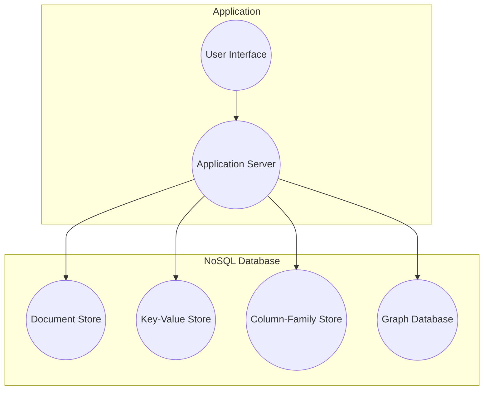
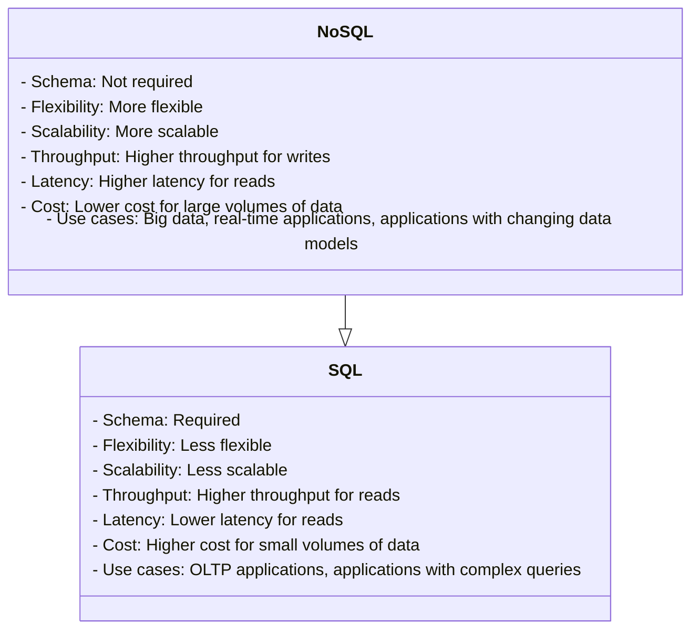
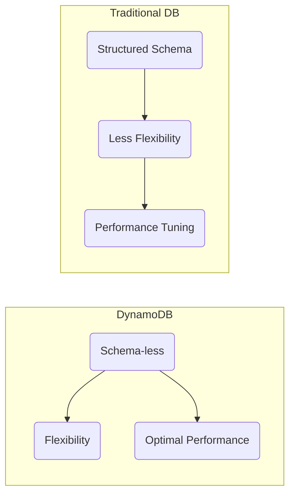

# Week 5 — NoSQL with Amazon DynamoDB

This week, we're diving headfirst into the exciting world of NoSQL, harnessing the power of AWS DynamoDB to revolutionize the messaging functionality within our application.

My data journey began with my Microsoft Azure Fundamentals experience. You can [find my notes on the subject here](https://github.com/yaya2devops/ExperienceInCloud/tree/main/Notes#azure-data-fundamentals), which might be useful to you.

- [Week 5 — NoSQL with Amazon DynamoDB](#week-5--nosql-with-amazon-dynamodb)
  - [Personalizing Your NoSQL Experience](#personalizing-your-nosql-experience)
  - [The Data Manager Battle](#the-data-manager-battle)
- [A Masterclass On NoSQL Schema](#a-masterclass-on-nosql-schema)
  - [Pre-Data Model](#pre-data-model)
  - [DynamoDB Data Modeling](#dynamodb-data-modeling)
  - [Cruddur Messanging Pre-Access Patterns](#cruddur-messanging-pre-access-patterns)
- [The DynamoDB Encyclopedia](#the-dynamodb-encyclopedia)
    - [DynamoDB Local](#dynamodb-local)
    - [Design Schema Load Script](#design-schema-load-script)
  - [The NoSQL Quick Operator](#the-nosql-quick-operator)
    - [Create List Tables Script - `list-tables`](#create-list-tables-script---list-tables)
    - [Drop Table Script - `drop`](#drop-table-script---drop)
    - [Implement Seed Script - `seed`](#implement-seed-script---seed)
    - [Implement Scan Script - `scan`](#implement-scan-script---scan)


Our choice of NoSQL over SQL is a testament to the sheer complexity of the messaging process, which defies conventional schema-based structuring. Messages are inherently unpredictable; you never know who will engage in a conversation with whom. Some may even create group chats that defy the boundaries of conventional data modeling in SQL. 


## Personalizing Your NoSQL Experience
The term **NoSQL** was first coined in 1998 by Carlo Strozzi, who used it to describe his lightweight, open-source relational database that did not expose the standard Structured Query Language (SQL) interface. 

The concept of NoSQL databases has its roots in the early days of the internet—early 2000s, when developers began to realize that traditional relational databases were not well-suited for storing and querying large amounts of unstructured data.


#### Different types of NoSQL databases;


There are many different types of NoSQL databases, each with its own strengths and weaknesses.



* **Key-value stores(Our DynamoDB):** Key-value stores store data in the form of key-value pairs. The key is used to uniquely identify the data, and the value is the data itself.
* **Document stores:** Document stores store data in the form of documents. Documents are like JSON objects, and they can contain a variety of data types.
* **Columnar stores:** Columnar stores store data in columns. This can be useful for applications that need to scan large amounts of data for specific values.
* **Graph databases:** Graph databases store data in the form of graphs. Graphs are made up of nodes and edges, and they can be used to represent relationships between data.

A number of NoSQL databases were developed, including Bigtable, Cassandra, and MongoDB and were designed to be more scalable, flexible, and fault-tolerant. Later in 2012, Amazon Web Services introduced DynamoDB in response to the growing demand and to make it easier for you to develop on the NoSQL model.


## The Data Manager Battle

NoSQL databases are designed for unstructured data like images and videos, while SQL databases are designed for querying and reporting.

In SQL databases, the schema is fixed and must be desined first.<br> NoSQL databases do not have a fixed schema. 

**Observe the self-generated insights to empower you on this topic;**



* NoSQL databases are often used for big data applications. The data model must be able to handle large volumes of data.
* NoSQL databases are often used for real-time applications.The data model must be able to keep the data consistent in real time.

NoSQL databases offer a dynamic approach to data modeling but it is a complex task. This flexibility can be advantageous in scenarios where the data's structure is not well-known in advance or where rapid development and scalability are essential. 

Nonetheless, achieving data integrity and efficient querying demands thoughtful planning and design. Let's go over the process of architecting the data model for our application.


# A Masterclass On NoSQL Schema

Data modeling in DynamoDB differs from traditional relational databases due to its schema-less nature, which allows for flexibility but requires careful planning to achieve optimal performance.



It's quite remarkable that you can integrate Amazon DynamoDB, a NoSQL database service, into a [SQL-based environment](https://docs.aws.amazon.com/amazondynamodb/latest/developerguide/ql-gettingstarted.html).

## Pre-Data Model

The following steps serve as acknowledged guidelines that will steer you towards establishing a solid foundation for designing your NoSQL data modeling that will be showcased through our Cruddur app development.

1. **Understand Your Data Access Patterns**
   - Understand [the primary access patterns](#cruddur-access-patterns-design) of your application. 
   - Identify the [common queries](assets/week5/resources/patternsdb.md) that your application will perform.
   -  Apply frequently used patterns in your app before optimization.
2. **Denormalization is Key**
   - DynamoDB doesn't support complex JOIN operations like relational databases.
   - Design for flat tables instead.
   - Using one table instead of linked tables boosts scalability.
   - Duplicate some information across multiple tables to optimize read operations. 
3. **Choose the Right Partition Key**
   - The hash key determines how data is distributed across DynamoDB partitions. 
   - Common choices for partition keys include user IDs, timestamps, or unique identifiers.
   - Key condition expressions for query only for RANGE, HASH is only equality
   - Generate a UUID for an entity only when needed for a specific access pattern.
   - Each query requires a partition key (pk) and, if available in the table, a sort key (sk).
4. **Design Secondary Indexes**
   - Design these indexes based on your access patterns.
   - Store data as a JSON document in a string field If you're not indexing
   - Repeating data for better indexing is acceptable.
   - Be aware that secondary indexes come with additional costs and write capacity requirements.
   - Changing a key (simple.pk or composite.sk) requires creating a new item.
5. **Use Composite Primary Keys Sparingly**
   - Composite primary keys consist of both a partition key and a sort key (range key) e.g. pk = 'yaya2devops'
   - Data keys can serve as a third key or store JSON documents
   - Useful for modeling hierarchical data but should be used judiciously because they limit your query flexibility.
6. **Understand Provisioned Throughput vs. On-Demand Capacity**
   - DynamoDB offers both provisioned and on-demand capacity modes. 
   - Provisioned capacity requires you to specify the read and write capacity units
   - On-demand automatically scales capacity based on your actual usage.
   - Choose the capacity mode that aligns with your workload and budget.
7. **Monitor and Optimize**
   - Regularly monitor your DynamoDB tables using CloudWatch metrics and AWS X-Ray for tracing. 
   - Adjust your table's provisioned capacity or indexes as needed based on real usage patterns.
   - Use tools like the AWS DynamoDB Auto Scaling feature to automate capacity adjustments.
8. **Use Conditional Writes**
   - Allow you to make changes to your data only if specific conditions are met. 
   - Help yourself with data consistency and integrity.
9. **Understand the Consistency Models**
   - DynamoDB offers two consistency models: eventually consistent reads and strongly consistent reads. 
   - Choose the one that fits your application's requirements.
10. **Leverage DynamoDB Streams**
    - DynamoDB Streams can be used to capture changes to your data and trigger other AWS services, enabling real-time processing and event-driven architectures(Employed).
11. **Consider Data Size and Item Size Limits**
    - DynamoDB's maximum item size limit (400 KB) 
    - Partition size limit (10 GB). 
    - Design your data model accordingly.
12. **Use the AWS SDK for DynamoDB**
    - Utilize the AWS SDKs, which provide convenient APIs for working with DynamoDB, making it easier to interact with your data.

Continuously reevaluate and retest your data model to verify its alignment with your performance and scalability prerequisites. Let me take you into our application's data modeling for further insight.


## DynamoDB Data Modeling

This tabular data model represents our use case for retrieving messages. This table is used to store messages in a DynamoDB table and is available just for You in [CSV](assets/week5/Spreadsheet-DynamoDBData%20Modeling.csv) and [PDF](assets/week5/Spreadsheet-DynamoDBData%20Modeling.pdf)!


| pk                | sk                   | data                       | uuid                                | display_name    | handle       | message               | user_uuid                            | message_group_uuid                   |
|-------------------|----------------------|----------------------------|------------------------------------|----------------|--------------|-----------------------|--------------------------------------|--------------------------------------|
| MSG#{message_group_uuid} | MSG#{created_at} |                            | 32423432-235325-3525-325235352-235235 | Yahya Abulhaj  | yaya2devops  | Hey Bayko             | 232cfd0f-3841-47bc-ad8b-44d9d3b7264f | 23523532-6433634643-234234234-23423525 |
| GRP#{my_user_uuid}      | GRP#{last_reply_at} |                          |                                    | Andrew Bayko   | bayko        | Hey - Yaya, The legend. | 2342342-52353252-23523523-23424    | 23523532-6433634643-234234234-23423525 |
| GRP#{my_user_uuid}      | GRP#{last_reply_at} |                          |                                    | Yahya Abulhaj  | yaya2devops  | Ty. Love the cloud!    | 232cfd0f-3841-47bc-ad8b-44d9d3b7264f | 23523532-6433634643-234234234-23423525 |

The table can be queried by the `message_group_uuid` or the `created_at` field.<br> The data column can be used to retrieve the data for a specific message

Refer to the following to get a clear overview of each attribute within our DynamoDB table.
- **pk (Primary Key)**: A combination of the `message_group_uuid` and `created_at` fields, ensuring unique message identification.
- **sk (Sort Key)**: Represents the `created_at` field, ensuring messages are sorted chronologically.
- **data**: A JSON object containing message data, including message text, sender's username, and sender's UUID.
- **uuid**: Unique identifier for each message.
- **display_name**: The sender's display name used for identification.
- **handle**: The sender's username used for logging into the application.
- **message**: The actual text content of the message.
- **user_uuid**: Unique identifier for the sender.
- **message_group_uuid**: Unique identifier for the message group.

I made sure not to place [similar formats](assets/week5/resources/other-format-dynamdb.md) in close proximity.


## Cruddur Messanging Pre-Access Patterns
To enable messaging functionality, we employed five DynamoDB patterns for implementation.
We will uncover each access pattern A through E and explain how to implement them effectively.

Before delving deeper, take a moment to examine the following comprehensive architecture that encapsulates the key aspects. The representation of patterns describe the different ways in which we will access and query data using the NoSQL approach.

[Check me in SVG](assets/week5/DynamoDB%20Modelling-Patterns.svg)


Proceed to my complete guide about the access patterns prior to our implemention.

- [A. Listing Messages in Message Group into Application](#a-listing-messages-in-message-group-into-application)
- [B. Listing Messages Group into Application](#b-listing-messages-group-into-application)
- [C. Creating a Message for an existing Message Group into Application](#c-creating-a-message-for-an-existing-message-group-into-application)
- [D. Creating a Message for a new Message Group into Application](#d-creating-a-message-for-a-new-message-group-into-application)
- [E. Updating a Message Group using DynamoDB Streams](#e-updating-a-message-group-using-dynamodb-streams)

### A. Listing Messages in Message Group into Application

This pattern is used to list all the messages in a message group. The following steps are involved in implementing this pattern:

1. Create a DynamoDB table with the following schema:

- `MessageGroupID:` The primary key of the table. This is a partition key.
- `MessageID:` The secondary index of the table. This is a sort key.
- `Message:` The message content.
2. Create a Lambda function that will be triggered when a new message is added to the table. The Lambda function should list all the messages in the message group and return them to the application.

3. Call the Lambda function to list all the messages in the message group.

### B. Listing Messages Group into Application

This pattern is used to list all the message groups. The following steps are involved in implementing this pattern:

1. Create a DynamoDB table with the following schema:

- `MessageGroupID:` The primary key of the table. This is a partition key.
- `Name:` The name of the message group.
2. In the application, query the DynamoDB table for all the message groups.

### C. Creating a Message for an existing Message Group into Application

This pattern is used to create a new message for an existing message group. The following steps are involved in implementing this pattern:

1. Create a DynamoDB table with the following schema:

- `MessageGroupID:` The primary key of the table. This is a partition key.
- `MessageID:` The secondary index of the table. This is a sort key.
- `Message:` The message content.
2. In the application, create a new message and add it to the DynamoDB table.

### D. Creating a Message for a new Message Group into Application

This pattern is used to create a new message group and a new message in the message group. The following steps are involved in implementing this pattern:

1.Create a DynamoDB table with the following schema:

- `MessageGroupID:` The primary key of the table. This is a partition key.
- `MessageID:` The secondary index of the table. This is a sort key.
- `Message:` The message content.
2. In the application, create a new message group and add a new message to the message group.

### E. Updating a Message Group using DynamoDB Streams

This pattern is used to update a message group using DynamoDB Streams. DynamoDB Streams is a feature of DynamoDB that allows you to track changes to your data. The following steps are involved in implementing this pattern:

1. Enable DynamoDB Streams on the table that contains the message group.
2. Create a Lambda function that will be triggered when a change is made to the message group.
3. In the Lambda function, update the message group accordingly.


# The DynamoDB Encyclopedia
Let's embark on a journey to master the art of NoSQL database using DynamoDB. <br>We will craft all that to our great bin directory!
```sh
bin/
├── ddb/
│   ├── patterns/
│   │   ├── list-conversations
│   │   └── get-conversations
│   ├── list-tables
│   ├── drop
│   ├── Seed Script
│   └── Scan Script
└── cognito/
    ├── list-users
    └── db/
        └── update_cognito_user_ids
```   
The following is a recap of what we'll be doing.
- **Local DynamoDB Setup—** We'll start by setting up DynamoDB locally, ensuring you have a working environment for development.
- **Schema Design—** Next, we'll delve into the schema design, carefully crafting the structure that suits your application's needs.
- **Data Loading—** We'll guide you through the process of loading data into DynamoDB, ensuring your database is populated with the necessary information.
- **Basic Operations—** We'll create scripts for fundamental operations like adding, updating, and deleting records in the database.
- **Access Patterns—** We'll take a deep dive into each access pattern presented earlier, developing scripts for tasks such as reading and listing conversations from the database.
- **Cognito Integration—** We'll also cover scripts for seamless integration with Amazon Cognito.

### DynamoDB Local

In our first week, we efficiently initiated the setup of Dynamo, and subsequently, we made a prudent decision to comment it out temporarily in order to conserve workspace credits. 

Now, we are poised to re-enable it by simply uncommenting the relevant code in your `docker-compose.yml`


You can find guidance on configuring the DynamoDB setup locally in [my previous technical writings](week1.md#dynamodb-container).

### Design Schema Load Script
We now have to set up the database structure and initialize it with the necessary configuration using a schema.


1. **Requirements and Dependencies**

   - Add `boto3` to the `requirements.txt` file:
     ```
     boto3==1.18.2
     ```
     

   - Install the dependencies:
     ```
     pip install -r requirements.txt
     ```
   - You can also automate the process in **Gitpod**
    


We import the `boto3` library to interact with AWS services.


2. **Folder Structure**

   - Create a new folder called `ddb` inside the `backend-flask/bin` directory. This is where you will place the `schema-load` script.

3. **Execute `schema-load` Script**

   - Create a new file named `schema-load` inside the `ddb` folder.

   - Make it executable:
     ```
     chmod +x schema-load
     ```

4. **Design the `schema-load` Script**

   - Set default attributes for DynamoDB client
     ```py
      attrs = {"endpoint_url": "http://localhost:8000"}
     ```   
     We define default attributes for the DynamoDB client, including the local development endpoint URL.

   - Check if "prod" argument is provided to run in production mode
     ```py
        if len(sys.argv) == 2:
            if "prod" in sys.argv[1]:
                attrs = {}     
        ```
        The script checks if an argument is provided when running the script. If the argument is "prod," it clears the attributes, which is used for production AWS environment settings.
 
   - Create a DynamoDB client
     ```py 
      ddb = boto3.client("dynamodb", **attrs)
     ``` 
     We create a DynamoDB client using the provided or default attributes.

   - Define the table name
     ```py
      table_name = "cruddur-messages"
     ``` 
     The `table_name` variable holds the name of the table to be created.

   - Create the DynamoDB table
     ```py
        response = ddb.create_table(
        TableName=table_name,
        AttributeDefinitions=[
            {"AttributeName": "pk", "AttributeType": "S"},
            {"AttributeName": "sk", "AttributeType": "S"},
        ],
        KeySchema=[
            {"AttributeName": "pk", "KeyType": "HASH"},
            {"AttributeName": "sk", "KeyType": "RANGE"},
        ],
        BillingMode="PROVISIONED",
        ProvisionedThroughput={"ReadCapacityUnits": 5, "WriteCapacityUnits": 5},
     )
     ``` 
     We use the ddb.create_table() method to create the DynamoDB table with the specified schema and settings.

   - Print the response from table creation
     ```
      print(response)
     ```      

   - Ace your script with The `#! /usr/bin/env python3` shebang line at the start indicates that this is a py script


After independently designing each component of the schema loading script, validate the script as follows.


```py  
#! /usr/bin/env python3

import boto3
import sys

attrs = {"endpoint_url": "http://localhost:8000"}

if len(sys.argv) == 2:
    if "prod" in sys.argv[1]:
        attrs = {}

ddb = boto3.client("dynamodb", **attrs)

table_name = "cruddur-messages"

response = ddb.create_table(
    TableName=table_name,
    AttributeDefinitions=[
        {"AttributeName": "pk", "AttributeType": "S"},
        {"AttributeName": "sk", "AttributeType": "S"},
    ],
    KeySchema=[
        {"AttributeName": "pk", "KeyType": "HASH"},
        {"AttributeName": "sk", "KeyType": "RANGE"},
    ],
    BillingMode="PROVISIONED",
    ProvisionedThroughput={"ReadCapacityUnits": 5, "WriteCapacityUnits": 5},
)

print(response)
```  

5. Execute the script using `./schema-load` to create the specified DynamoDB table with the defined schema. 

```
poc
```


## The NoSQL Quick Operator 

Hey Operator, I'll provide you with the necessary scripts to work with the NoSQL system. Once your schema is created, it will generate a single table in DynamoDB. With this table in place, you'll have the capability to perform actions such as listing the tables and dropping. Also, you can populate this table with data and subsequently scan its contents. 

We welcome you to explore and engage in these operations as I guide you through each step.

- [Create List Tables Script - `list-tables`](#create-list-tables-script---list-tables)
- [Drop Table Script - `drop`](#drop-table-script---drop)
- [Implement Seed Script - `seed`](#implement-seed-script---seed)
- [Implement Scan Script - `scan`](#implement-scan-script---scan)

Let's recap our directory structure. We've already created the 'load-schema' script in the 'ddb' directory. Now, we'll also add the following scripts that we discussed:
```
bin/ddb/
├── schema-load (done King!)
├── list-tables
├── drop
├── Seed Script
└── Scan Script
```
### Create List Tables Script - `list-tables`

The purpose of this script is to list the tables in DynamoDB, and it allows you to specify whether you want to target the production environment or a local development environment.

```bash
#!/usr/bin/bash

set -e # Stop if it fails at any point

if [ "$1" = "prod" ]; then
    ENDPOINT_URL=""
else
    ENDPOINT_URL="--endpoint-url=http://localhost:8000"
fi

aws dynamodb list-tables $ENDPOINT_URL \
--query TableNames \
--output table
```

The `set -e` statement tells the script to exit immediately if any command fails. This is a good practice to follow in all shell scripts, as it helps to prevent errors from cascading.

The `if` statement checks to see if the `prod` argument was passed to the script. If it was, the `ENDPOINT_URL` variable is set to an empty string. This tells the AWS CLI to use the production DynamoDB endpoint. Otherwise, the ENDPOINT_URL variable is set to the default endpoint, which is `http://localhost:8000`.


The aws `dynamodb list-tables` command lists all the tables in the current account. The --query TableNames option tells the command to only return the table names. The --output table option tells the command to format the output as a table.


### Drop Table Script - `drop`
This script is used to delete a DynamoDB table. You need to provide the TABLE_NAME as an argument when running the script. It also supports specifying the environment (prod or local).

```sh
#! /usr/bin/bash

set -e # stop if it fails at any point

if [ -z "$1" ]; then
  echo "No TABLE_NAME argument supplied eg ./bin/ddb/drop cruddur-messages prod "
  exit 1
fi
TABLE_NAME=$1

if [ "$2" = "prod" ]; then
  ENDPOINT_URL=""
else
  ENDPOINT_URL="--endpoint-url=http://localhost:8000"
fi

echo "deleting table: $TABLE_NAME"

aws dynamodb delete-table $ENDPOINT_URL \
  --table-name $TABLE_NAME
```

The `aws dynamodb delete-table` command drops the specified table. 


The `--table-name` option tells the command the name of the table to be dropped.

### Implement Seed Script - `seed`

This script is responsible for updating the PostgreSQL database schema and seeding the data into DynamoDB. 


1. Import necessary modules:
   - Start by importing the required modules, including `boto3`, `os`, `sys`, `datetime`, `timedelta`, and `uuid`. These modules are used for various tasks such as interacting with DynamoDB, managing paths, and handling dates and times.
```py
#!/usr/bin/env python3

import boto3
import os
import sys
from datetime import datetime, timedelta, timezone
import uuid
```
2. Set up some initial variables:
   - It defines `current_path` to store the absolute path of the current script file.
   - It calculates `parent_path` as the absolute path of the parent directory, which is three levels above the current script.
   - It appends the `parent_path` to `sys.path`, which allows importing modules from the `lib.db` package located in that directory.

```py
current_path = os.path.dirname(os.path.abspath(__file__))
parent_path = os.path.abspath(os.path.join(current_path, '..', '..', 'backend-flask'))
sys.path.append(parent_path)
from lib.db import db
```
3. Configure DynamoDB client:
   - It sets the `attrs` dictionary with an `endpoint_url` key set to 'http://localhost:8000'. This is used for local development. If a command-line argument is provided with "prod" in it, the `attrs` dictionary is left empty to connect to a production database.
   - It creates a DynamoDB client (`ddb`) using the `boto3.client` method with the specified attributes.

```py
attrs = {
  'endpoint_url': 'http://localhost:8000'
}
# unset endpoint url for use with production database
if len(sys.argv) == 2:
  if "prod" in sys.argv[1]:
    attrs = {}
ddb = boto3.client('dynamodb',**attrs)
```

4. Define a function to get user UUIDs:
   - This function executes an SQL query to retrieve user data from a database.
   - It uses the `db.query_array_json` method with a SQL query and parameters.
   - It extracts the user information for 'yaya2devops' and 'bayko' from the query results and stores them in a dictionary.

```py
def get_user_uuids():
  sql = """
    SELECT 
      users.uuid,
      users.display_name,
      users.handle
    FROM users
    WHERE
      users.handle IN(
        %(my_handle)s,
        %(other_handle)s
        )
  """
  users = db.query_array_json(sql,{
    'my_handle':  'yaya2devops',
    'other_handle': 'bayko'
  })
  my_user    = next((item for item in users if item["handle"] == 'yaya2devops'), None)
  other_user = next((item for item in users if item["handle"] == 'bayko'), None)
  results = {
    'my_user': my_user,
    'other_user': other_user
  }
  print('get_user_uuids')
  print(results)
  return results
```
5. Define a function to create a message group:
   - This function inserts a new record into a DynamoDB table named 'cruddur-messages' to represent a message group.
   - It takes parameters such as the DynamoDB client (`client`), message group UUID, user UUIDs, last message timestamp, and message content.
   - It constructs a dictionary called `record` containing the data for the record and uses the `client.put_item` method to insert it into the table.
```py
def create_message_group(client,message_group_uuid, my_user_uuid, last_message_at=None, message=None, other_user_uuid=None, other_user_display_name=None, other_user_handle=None):
  table_name = 'cruddur-messages'
  record = {
    'pk':   {'S': f"GRP#{my_user_uuid}"},
    'sk':   {'S': last_message_at},
    'message_group_uuid': {'S': message_group_uuid},
    'message':  {'S': message},
    'user_uuid': {'S': other_user_uuid},
    'user_display_name': {'S': other_user_display_name},
    'user_handle': {'S': other_user_handle}
  }

  response = client.put_item(
    TableName=table_name,
    Item=record
  )
  print(response)
```
6. Define a function to create a message:
   - This function inserts a new message record into the 'cruddur-messages' table in DynamoDB.
   - It takes parameters including the message group UUID, message creation timestamp, message content, user UUID, user display name, and user handle.
   - It constructs a dictionary called `record` containing the data for the message record and uses the `client.put_item` method to insert it into the table.
```py
def create_message(client,message_group_uuid, created_at, message, my_user_uuid, my_user_display_name, my_user_handle):
  table_name = 'cruddur-messages'
  record = {
    'pk':   {'S': f"MSG#{message_group_uuid}"},
    'sk':   {'S': created_at },
    'message_uuid': { 'S': str(uuid.uuid4()) },
    'message': {'S': message},
    'user_uuid': {'S': my_user_uuid},
    'user_display_name': {'S': my_user_display_name},
    'user_handle': {'S': my_user_handle}
  }
  # insert the record into the table
  response = client.put_item(
    TableName=table_name,
    Item=record
  )
  # print the response
  print(response)
```
7. Set `message_group_uuid` and get user UUIDs:
   - It assigns a specific UUID to `message_group_uuid`.
   - It calls the `get_user_uuids` function to retrieve user UUIDs for 'yaya2devops' and 'bayko' and stores the results in the `users` dictionary.
```py
message_group_uuid = "5ae290ed-55d1-47a0-bc6d-fe2bc2700399" 
now = datetime.now()
users = get_user_uuids()
```

8. Create message groups:
   - Two message groups are created using the `create_message_group` function. One message group is created from 'yaya2devops' to 'bayko', and the other from 'bayko' to 'yaya2devops'. These message groups are placeholders with a filler message and a timestamp.

```py
create_message_group(
  client=ddb,
  message_group_uuid=message_group_uuid,
  my_user_uuid=users['my_user']['uuid'],
  other_user_uuid=users['other_user']['uuid'],
  other_user_handle=users['other_user']['handle'],
  other_user_display_name=users['other_user']['display_name'],
  last_message_at=now.isoformat(),
  message="this is a filler message"
)

create_message_group(
  client=ddb,
  message_group_uuid=message_group_uuid,
  my_user_uuid=users['other_user']['uuid'],
  other_user_uuid=users['my_user']['uuid'],
  other_user_handle=users['my_user']['handle'],
  other_user_display_name=users['my_user']['display_name'],
  last_message_at=now.isoformat(),
  message="this is a filler message"
)
```
9. Process a conversation:
   - A conversation string is defined with alternating lines representing messages from "Person 1" and "Person 2".
   - The conversation is split into individual lines.
   - For each line in the conversation:
     - If the line starts with 'Person 1:', it is considered a message from 'yaya2devops'.
     - If the line starts with 'Person 2:', it is considered a message from 'bayko'.
     - The message content is extracted, and a timestamp is generated.
     - The `create_message` function is called to insert each message into the 'cruddur-messages' table.

[Take me to the Convo](assets/week5/convo-nosql.md)
```py
conversation = """
Yaya2DevOps: Hello You Gotta Understand Years Of Experience Have nothing To Do with Experience!
Fan: Yes, truth ! I love it. You look very experienced in a young age!
Fan123: Hi again Yaya! I'm a huge fan of your work. Can we chat about your latest project?
Yaya2DevOps: Of course! I'd love to chat about my latest project. What would you like to know?
Fan123: I'm really interested in the technology stack you used for your project. Can you share some details?
Yaya2DevOps: Sure thing! For this project, I used Python for the backend, React for the frontend, and AWS DynamoDB as the database. It was a challenging but rewarding tech stack to work with.
Fan123: That sounds fascinating! Did you encounter any particularly interesting challenges while working with DynamoDB?
Yaya2DevOps: Oh, absolutely! DynamoDB's NoSQL nature was both a blessing and a challenge. The schema-less design gave us flexibility, but we had to carefully plan our data model to optimize queries and avoid bottlenecks.
Fan123: I can imagine that. How about scalability? Did you face any issues with scaling the system?
Yaya2DevOps: Scalability was a key concern. We had to design our tables and indexes with scalability in mind. DynamoDB's auto-scaling feature helped, but we still had to monitor and fine-tune our capacity settings.
Fan123: Thanks for sharing those insights, Yaya. It's really interesting to hear about your experiences. Can you tell me more about the project's architecture?
Yaya2DevOps: Certainly! We followed a microservices architecture, with various components communicating via RESTful APIs. We also used AWS Lambda for serverless functions to handle specific tasks.
Fan123: That sounds like a robust architecture. How about deployment and CI/CD? Did you have any automation in place?
Yaya2DevOps: Yes, we had a CI/CD pipeline set up using AWS CodePipeline and AWS CodeBuild. It allowed us to automate the deployment process, ensuring that updates were tested and deployed seamlessly.
Fan123: That's impressive! One last question: what advice do you have for aspiring developers looking to work on similar projects?
Yaya2DevOps: My advice would be to dive deep into your chosen technologies, stay updated with best practices, and never stop learning. Also, don't be afraid to seek help from the developer community—it's a valuable resource.
Fan: Thank you for the advice, Yaya2DevOps! I'll definitely take that to heart. By the way, I've been following your work for a while now, and I'm really impressed with your projects. How do you manage to stay so productive and motivated?
Yaya2DevOps: I appreciate the kind words! Staying productive and motivated can be a challenge at times, but I find that setting clear goals and breaking them down into smaller, achievable tasks really helps. Plus, I'm passionate about what I do, and that enthusiasm drives me to keep going. And of course, having a supportive community like you all makes a big difference!
Fan: That's great to hear! Speaking of communities, do you have any recommendations for online communities or forums where I can connect with other developers and learn from their experiences?
Yaya2DevOps: Absolutely! There are many fantastic online communities and forums where developers gather to share knowledge and experiences. Some popular ones include Stack Overflow, GitHub Discussions, Reddit's programming subreddits, and various tech-focused Discord servers. It's a good idea to explore these platforms, find the ones that align with your interests, and start engaging with fellow developers.
Fan: Thanks for the suggestions, Yaya2DevOps! I'll definitely check those out. One last question: Do you have any favorite programming languages or tech stacks that you enjoy working with the most?
Yaya2DevOps: Ah, that's a tough one! I enjoy working with a variety of technologies, but if I had to pick, I'd say I have a soft spot for Python and the MERN (MongoDB, Express.js, React, Node.js) stack. Python's versatility is amazing, and MERN provides a great ecosystem for web development. But remember, the best tech stack often depends on the project's requirements. 
Fan: Thanks for sharing your favorites, Yaya2DevOps! Your insights are incredibly valuable. I'll keep that in mind as I continue my journey in the world of development. Keep up the fantastic work!
Yaya2DevOps: You're very welcome! I'm glad I could help. Feel free to reach out anytime if you have more questions or just want to chat about tech. Keep learning and coding, and best of luck with your development journey! 
"""

lines = conversation.lstrip('\n').rstrip('\n').split('\n')
for i in range(len(lines)):
  if lines[i].startswith('Yaya2DevOps: '):
    key = 'my_user'
    message = lines[i].replace('Yaya2DevOps: ', '')
  elif lines[i].startswith('Fan123: '):
    key = 'other_user'
    message = lines[i].replace('Fan123: ', '')
  else:
    print(lines[i])
    raise 'invalid line'

  created_at = (now - timedelta(days=1)+ timedelta(minutes=i)).isoformat()
  create_message(
    client=ddb,
    message_group_uuid=message_group_uuid,
    created_at=created_at,
    message=message,
    my_user_uuid=users[key]['uuid'],
    my_user_display_name=users[key]['display_name'],
    my_user_handle=users[key]['handle']
  )
```

You can execute it using `./bin/ddb/seed`.


The seed script would typically be run once, when you first deploy your application.

### Implement Scan Script - `scan`

The `scan` script is used to list all data in DynamoDB. 

```py
#!/usr/bin/env python3

import boto3
import sys

attrs = {"endpoint_url": "http://localhost:8000"}

ddb = boto3.resource("dynamodb", **attrs)

table_name = "cruddur-messages"

table = ddb.Table(table_name)
response = table.scan()

print("RESPONSE >>>>>>>>", response)

items = response["Items"]

for item in items:
    print(item)
```
- **import boto3** statement imports the Boto3 library, which is used to interact with AWS services.
- **attrs** dictionary defines the endpoint URL for the DynamoDB service.
- **ddb** variable is created and assigned to a Boto3 resource object for the DynamoDB service.
- **table_name** variable is assigned the name of the DynamoDB table to be scanned.
- table variable is created and assigned to a Boto3 table object for the specified table.
- **scan()** method is called on the table object to scan the table.
- **print()** statement prints the response from the scan() method to the console.

Execute the Python script to scan for data using

```sh
./bin/ddb/scan
```


---

**To Be Continued..Patterns Implentations+Scripts**

---