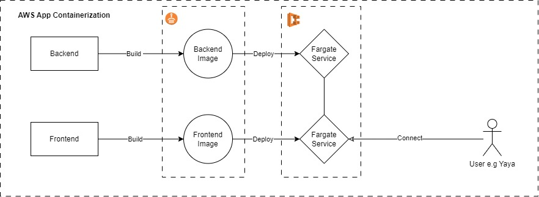
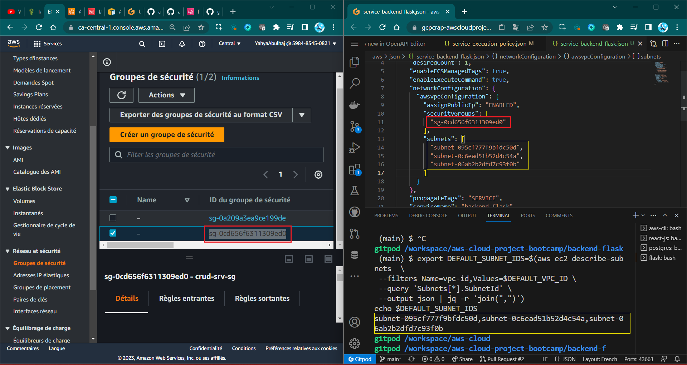
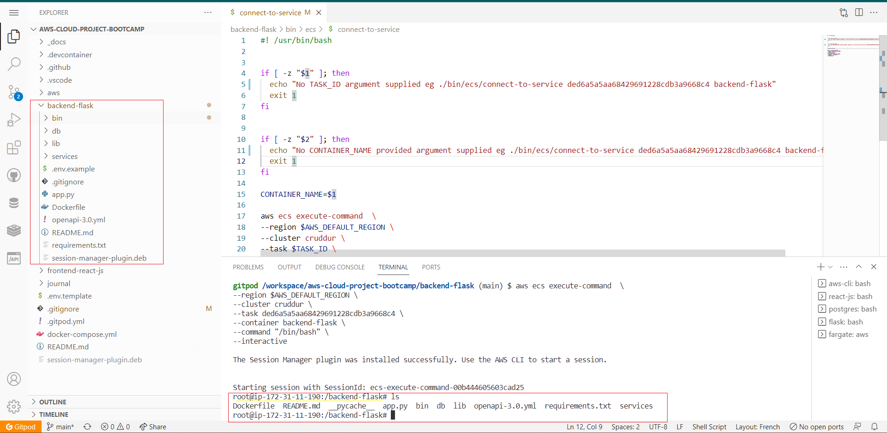
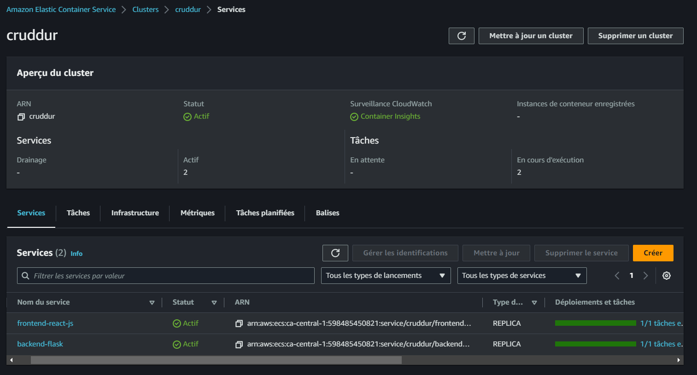
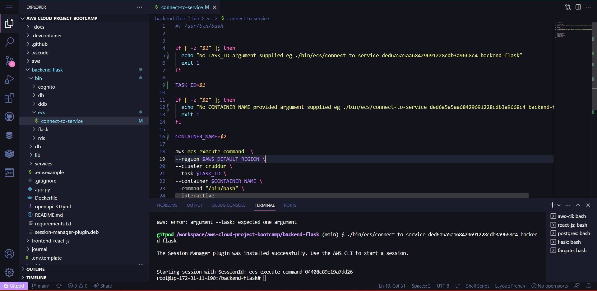
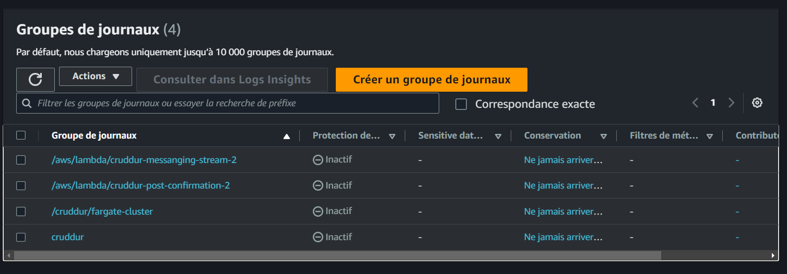

# Week 6 — Deploying Containers

Weeks 6 and 7 were consolidated into a two-week period of harmony, in here i'll organize them as separate weeks and give it a proper structure.



- [Get it.](assets/week6-7/ArchitectStuff/1-ship-to-aws.drawio)


This will primarily involve onboarding the project to AWS, creating three repositories, building and pushing the Python container, backend flask and frontend reactjs to ECR.

## Main Week Six Tasks
- [Provision ECS Cluster](#ecs-cluster-creation)
- [Create ECR repo and push image for backend-flask](#backend-health-check)
- [Deploy Backend Flask app as a service to Fargate](#deploy-to-fargate)
- [Create ECR repo and push image for fronted-react-js](#ecr-frontend)
- [Deploy Frontend React JS app as a service to Fargate](#frontend-task)
- [Rebuild containers with custom dockerfiles for prod](#react-static-assets-serve-using-nginx)

 
### ECS Cluster Creation


To create a new ECS cluster, run the following command in your terminal:

```sh
aws ecs create-cluster \
--cluster-name cruddur \
--service-connect-defaults namespace=cruddur
```

The `service-connect` flag creates a namespace in cloudmap which can be used internally instead of an endpoint.

- RDS Connection Test
Create the file `backend-flask/bin/db/test` and make it executable.


Run the script to test the RDS connection:

```sh
❯ ./backend-flask/bin/db/test
attempting connection
Connection successful!
```

### Backend Health Check
Add a health check endpoint in `app.py`:


```sh
@app.route("/api/health-check")
def health_check():
    return {"success": True}, 200
```

> Hint: pros dont Ops compose up specific services, but get all using `docker compose up` in CLI


Create the file backend-flask/bin/flask/health-check and make it executable:

```sh
#!/usr/bin/env python3

import urllib.request

try:
  response = urllib.request.urlopen('http://localhost:4567/api/health-check')
  if response.getcode() == 200:
    print("[OK] Flask server is running")
    # yes
    exit(0)
  else:
    print("[BAD] Flask server is not running")
    exit(1) # false
except Exception as e:
  print(e)
  exit(1)
```


- Run the python script to test the backend:


```sh
❯ ./backend-flask/bin/flask/health-check
[OK] Flask server is running
```


### Python Image

1- Create a new repository named cruddur-python using the following command:
```sg
aws ecr create-repository \
  --repository-name cruddur-python \
  --image-tag-mutability MUTABLE
```

2- Log in to ECR using the following command:
```sh
aws ecr get-login-password --region $AWS_DEFAULT_REGION | docker login --username AWS --password-stdin "$AWS_ACCOUNT_ID.dkr.ecr.$AWS_DEFAULT_REGION.amazonaws.com"
```

3- Export the repo URL:

```sh
export ECR_PYTHON_URL="$AWS_ACCOUNT_ID.dkr.ecr.$AWS_DEFAULT_REGION.amazonaws.com/cruddur-python"
echo $ECR_PYTHON_URL
```

4- Get the image from your spot what we call pull image

```sh
docker pull python:3.10-slim-buster
```


5- Tag it

```sh
docker tag python:3.10-slim-buster $ECR_PYTHON_URL:3.10-slim-buster
```

6- Get it straight to ECR:

```sh
docker push $ECR_PYTHON_URL:3.10-slim-buster
```


7 load-balancer.png
This is the process to containerize any project of your wish.


#### ECR [Backend](../backend-flask#readme)


#### ECR [Frontend](../bin/frontend/)

Bin is restructured in week 7 - [check from now.](../bin/README.md)


---

#### Parameter Store


| Secret Storage Option | Features | Costs |
| --- | --- | --- |
| Secrets Manager | Securely store and manage secrets such as passwords, API keys, and database credentials. | $$$$$ |
| Parameter Store | Store secrets as key-value pairs or encrypted strings. | $ |


Use something easy so u can call it somewhere [e.g.](../backend-flask/buildspec.yml#L33) Click.
SecureString is a parameter type to store sensitive data such as passwords, API keys, and other secrets in an encrypted format.


As easy as typing this in ur aws cli:

```bash
aws ssm put-parameter --type "SecureString" --name "/cruddur/backend-flask/AWS_ACCESS_KEY_ID" --value $AWS_ACCESS_KEY_ID
aws ssm put-parameter --type "SecureString" --name "/cruddur/backend-flask/AWS_SECRET_ACCESS_KEY" --value $AWS_SECRET_ACCESS_KEY
aws ssm put-parameter --type "SecureString" --name "/cruddur/backend-flask/CONNECTION_URL" --value $PROD_CONNECTION_URL
aws ssm put-parameter --type "SecureString" --name "/cruddur/backend-flask/ROLLBAR_ACCESS_TOKEN" --value $ROLLBAR_ACCESS_TOKEN
aws ssm put-parameter --type "SecureString" --name "/cruddur/backend-flask/OTEL_EXPORTER_OTLP_HEADERS" --value "x-honeycomb-team=$HONEYCOMB_API_KEY"
```


**Fargate Environment:**


Project Assets can be [found here.](assets/README.md)

### Policies & Permissions
- Set [Execution Cruddur Role](../aws/policies/README.md)
- Set [Task Role](../aws/policies/task-role#readme)
---

### Deploy to fargate:

**Deploy Backend**

**Using CLI**

- Create `aws/json/service-backend-flask.json`


- Get subnet ID

```bash
export DEFAULT_SUBNET_IDS=$(aws ec2 describe-subnets  \
 --filters Name=vpc-id,Values=$DEFAULT_VPC_ID \
 --query 'Subnets[*].SubnetId' \
 --output json | jq -r 'join(",")')
echo $DEFAULT_SUBNET_IDS
```



- Create service

```bash
aws ecs create-service --cli-input-json file://aws/json/service-backend-flask.json
```

#### Connect via Session Manager

- Install it:

```bash
curl "https://s3.amazonaws.com/session-manager-downloads/plugin/latest/ubuntu_64bit/session-manager-plugin.deb" -o "session-manager-plugin.deb"
sudo dpkg -i session-manager-plugin.deb
```

- Checking if it's there:

```bash
session-manager-plugin
```


- Replace ARN and run 

```bash
aws ecs execute-command  \
--region us-east-1 \
--cluster cruddur \
--task <Valeur> \
--container backend-flask \
--command "/bin/bash" \
--interactive
```

```bash
The Session Manager plugin was installed successfully. Use the AWS CLI to start a session.
```

**Connect:**



- Add this to `.gitpod.yml` to auto install session manager auto.

```bash
- name: fargate
    before: |
      curl "https://s3.amazonaws.com/session-manager-downloads/plugin/latest/ubuntu_64bit/session-manager-plugin.deb" -o "session-manager-plugin.deb"
      sudo dpkg -i session-manager-plugin.deb
      cd backend-flask
```

**Make sure Containers are healthy:**



## curl is bad practice in docker. Potential threat.

- Now to make this into a script create this file `backend-flask/bin/ecs/connect-to-service` and make it executable. It's later migrated to just connect under backend.


### Get into pushed App

- Use **URL:4567** to access the backend application.


#### Connect to Conainter from dev env:


```bash
./backend-flask/bin/ecs/connect-to-service backend-flask
```

From **Bash**



- Run this command to check connection to RDS.

```bash
./bin/db/test
```

```bash
$backend-flask# ./bin/db/test
attempting connection
Connection successful!
```

#### Service Connect

- In `taskDefinition` add the below:

```bash
,
"serviceConnectConfiguration": {
    "enabled": true,
    "namespace": "cruddur",
    "services": [
      {
        "portName": "backend-flask",
        "discoveryName": "backend-flask",
        "clientAliases": [{"port": 4567}]
      }
    ]
  }
```

- Create service.

```bash
aws ecs create-service --cli-input-json file://aws/json/service-backend-flask.json
```

- check service accessibility.

---

### Frontend Task

Same steps applied, go over this [bin/frontend](../bin/frontend) and think.

build and push the image. View Push Commands button to see the commands for pushing images. You should see the three.


Everything you require in one place.

```sh
├── frontend
│   ├── build
│   ├── connect
│   ├── deploy
│   ├── generate-env
│   ├── push
│   ├── register
│   ├── repo
│   ├── run
│   ├── service-off
└───└──service-on
```


## Debug Master: CloudWatch Log

Create a log group to check logs and help you troubleshoot fargate related errors.
```bash
aws logs create-log-group --log-group-name cruddur
aws logs put-retention-policy --log-group-name cruddur --retention-in-days 1
```



### **Reactjs** Static assets serve using Nginx:
- create a docker prod.
- add build to .gitignore
- Create frontend-react-js/nginx.conf
- Build Frontend
  - cd frontend-react-js
  - run  `npm run build`
  - run `docker build command` - it's [here](../bin/frontend/build)

#### Resend 
- Create a repo for front as [shown above](#ecr-backend).
- Set URL, Login, pull, Tag img and push.


#### Flask

For backend, now it's time to do a sperate prod for it as well.
- Use the dockerfile for prod and incl the `FROM` command to use the py image from ECR.
- Create a repo for front as shown above of the [above](#resend).
- Set URL, Login, pull, Tag img and push.


> I'm also good in Azure, wanna [see?](https://sentinel.yahya-abulhaj.dev/)
