# Week 7 — Solving CORS with a Load Balancer and Custom Domain
In this, we will continue from last week by focusing on maintaining equilibrium. 


<div align="center">
      
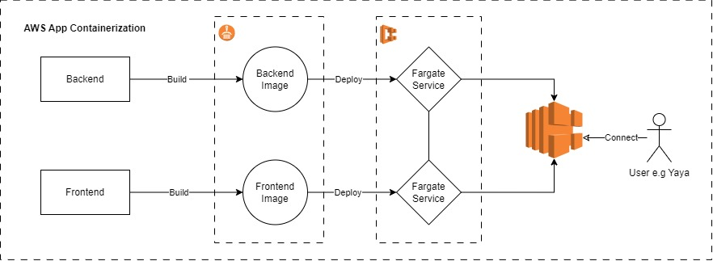
</div>

 **[Get it.](assets/week6-7/ArchitectStuff/2-app-via-lb.drawio)**


Our technical responsibility for the week involves provisioning and operating containers to execute load balancing tasks, configuring our custom domain and mapping it to the load balancer's URL for seamless functionality.

Our domain, on the other hand, will be fully onboarded to route53 and will be issued the necessary SSL certificate from AWS Certificate Manager.


We'll also tackle technical tasks like refreshing the JWT token from week 3, refactoring bin directory scripts incl. my design skills, and enhancing Docker networking, among others.


Partway through, I took you on a tour of my primary domain and showed you the projects hosted there that could be beneficial to you.


## Main Week Seven  Tasks
- [Provision and configure Application Load Balancer along with target groups](#setup-load-balancer)
- [Manage your domain using Route53 via hosted zone](#route-53-with-porkbun-domain-provider)
- [Create an SSL certificate via ACM](#ssl-request-using-aws-certificate-manager)
- [Fargate Technical Questions](#fargate-technical-questions)
- [Setup a record set for naked domain to point to frontend-react-js](#connect-dns-to-alb)
- [Setup a record set for api subdomain to point to the backend-flask](#connect-dns-to-alb)
- [Configure CORS to only permit traffic from our domain](#cross-origin-resource-sharing)
- [Secure Flask by not running in debug mode](#flask-security-restricting-access-based-on-ip-address)
- [Implement Refresh Token for Amazon Cognito](#implement-refresh-token-cognito)
- [Refactor bin directory to be top level](#refactor-bin-directory)
- [Configure task definitions to contain x-ray and turn on Container Insights](#fargate---configuring-for-container-insights)
- [Change Docker Compose to explicitly use a user-defined network](#docker-container-networks)
- [Scripting Relative Path](#readlink-and-dirname-in-action)
- [Create Dockerfile specifically for production use case](#working-with-docker-images-in-production)
- [Fargate Service Scripts](#service-on---service-off)
- [Using ruby generate out env dot files for docker using erb templates](#dynamic-environment-variable-ruby)
- [Host a website with AWS CloudFront](#frontend-application-on-cloudfront)
- [Brainstorming Notes](#note-vault)
- [Containers Security Practices in AWS](#security-best-practices)

---

## Setup Load Balancer

Console → EC2 → Load Balancers <br>
Create an Application Load Balancer named **"cruddur-alb"** → select 3 subnets.


Create a new Security Group named **"cruddur-alb-sg"**
- inbound rules for HTTP  <br>
-  HTTPS traffic from any source.<br>


**Listeners and routing**
-  create a target group for the backend.
-  create a target group for the frontend.


**Security Rules**
<br> Change "crud-srv-sg" security group inbound rule
-  create a new rule that allows traffic from "cruddur-alb-sg" on port 4567.<br>
-  delete the old rule that allowed direct access to the backend Flask server.<br>


### Create Target Group

**Backend**<br>
-  Navigate to Basic Configuration and select IP addresses for Fargate, ECS, or EC2.<br>
-  Set the target group name as "cruddur-backend-flask-tg."<br>
-  Configure the target group to use port 4567 and set "/api/health-check" as the health check path.<br>
-  Under Advanced Health Check Settings, set the healthy threshold to 3.<br>
→ Click "Next" and then "Create Target Group."<br>

**Frontend**<br>
- Navigate to Basic Configuration and select IP addresses for Fargate, ECS, or EC2.<br>
- Set the target group name as "cruddur-frontend-react-js."<br>
- Configure the target group to use port 3000.<br>
- Under Advanced Health Check Settings, set the healthy threshold to 3.<br>
→ Click "Next" and then "Create Target Group."<br>


**Harmonize**<br>
- Remove the default Def SG only from LB  <br>
- Set "cruddur-alb-sg SG"<br>
- Set the default action to use the "cruddur-backend-flask-tg" target group with port 4567.<br>
→ Create an additional listener for port 3000 with the default action set to use the "cruddur-frontend-react-js" target group.


### ECS Loadbalancer


- Add lb config to the [service backend](../aws/json/service-backend-flask.json#L7)

```JSON
"loadBalancers": [
      {
          "targetGroupArn": "<yacrud-backend-flask-target-group-ARN>",
          "containerName": "backend-flask",
          "containerPort": 4567
      }           ]
 ```

Delete running backend app from ECS

Recreate fargate service:

```sh
aws ecs create-service --cli-input-json file://aws/json/service-backend-flask.json
```

> It took me ages waiting for the drain, we will force it later the road.

Once finished ur new service will take place. <br>

You can simply go check the lb URL and add ur backend port and map to the health check endpoint. 

```
:4567/api/health-check
```


- Browser returned
```JSON
{ "success":true }
```


---

## Route 53 with Porkbun Domain Provider

<details>
<summary>
Porkbun Overview
</summary>

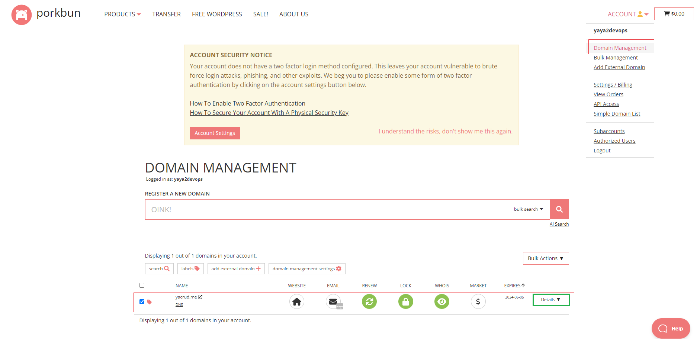

</details>

- Log in to your AWS account and navigate to the Amazon Route 53 console.
- Click on the "Hosted zones" option and select the domain for which you want to add the nameservers.
- Click on the "Create record" button and select "NS" and SOA as the record type.
- Copy the NS and SOA values 
- In the "Value" field, enter the nameservers that you want to add. 
- You can find the nameservers in your domain registrar's account or with your web hosting provider.
- Click on the "Create records" button to save the changes.


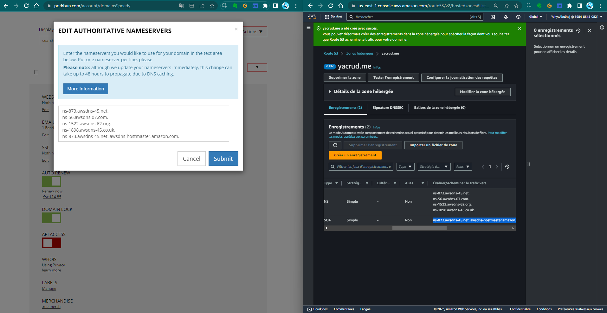


Once the changes are saved, you will need to wait for the changes to propagate across the DNS network, which can take anywhere from a few minutes to a 48 hours; Mine happened extremely quick.

## Request Cert using AWS Certificate Manager
Route 53 Integrate with ACM  to enable TLS.
- Log in to your AWS account and navigate to the AWS Certificate Manager (ACM) console.
- Click on the "Request a certificate" button.
- Enter the domain name for which you want to create the SSL certificate:
   - In the **Fully qualified domain name** field, enter [`yacrud.me`]()
   - Click **Add another name to this certificate**, and add `*.yacrud.me`
- click on the "Request" button.
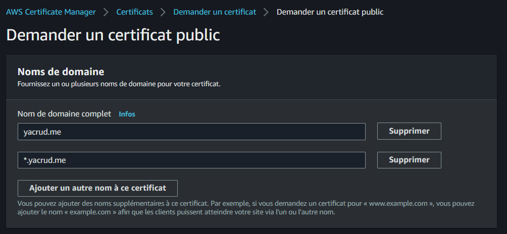

- Follow the on-screen instructions to complete the domain validation process.
- Check the required CNAME in Route 53

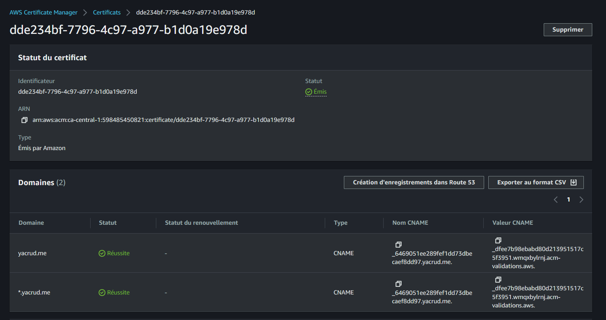


You can now use this SSL certificate route 53 when it returns as success.


**OFF-CRUDDUR**

- I tried `sub` with my main domain to Route53 as well. It has been coupled with [Cloudflare](https://one.dash.cloudflare.com/onboarding) all the time and I like it too.

**[DNS Configuration](assets/week6-7/3-DNS/DNS_Configuration.csv)**


- Assigned the Certificate
 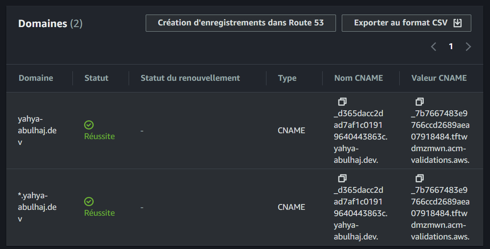

**PostScript:** My Main domain is hosting many great projects that you may find helpful. Get started with [Linux](https://linux.yahya-abulhaj.dev/), [Sentinel](https://sentinel.yahya-abulhaj.dev/), and My [Blog](https://blog.yahya-abulhaj.dev/) to name few.

I also shared the [resources](https://cloudrise.yahya-abulhaj.dev/) that helped me best succeed in the cloud.


## Configuring ALB Listeners and Routing for Frontend and API 

- Go to the EC2 Load Balancer page and select the "cruddur-alb" load balancer.
- Navigate to the "Listeners" tab and click on "Add Listener."
- Set the "Default actions" to "Redirect" and the "Port" to "443," then click "Add."
- Add another listener and set the "Protocol" to "HTTPS" and the "Port" to "443."
- In the "Default actions" field, select "Forward" and choose the "frontend-react-js" target group from the dropdown menu.
- Choose the SSL/TLS certificate that you previously created from the "Default SSL/TLS certificate" dropdown, then click "Add."
- Delete the "HTTP:3000" and "HTTP:4567" listeners.
  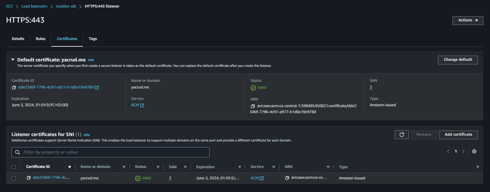
- Check the box for "HTTPS:443" and click the "Manage Rules" button.
- Click on "Insert Rule" and then click "Add Condition" followed by "Host Header."
- Set the "is" field to "api.yacrud.me" and click "Add Action" followed by "Forward to."
- Select the "backend-flask" target group from the dropdown menu, then click "Save."
Your backend API is now accessible via the "api.yacrud.me" in my case.
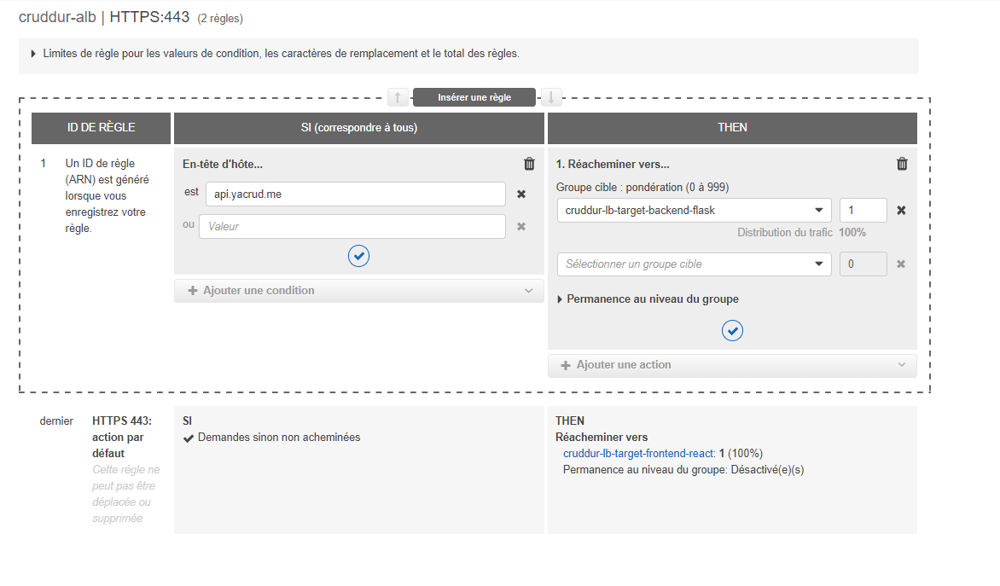


## Connect DNS to ALB


- Check App on Loadbalancer <br>
  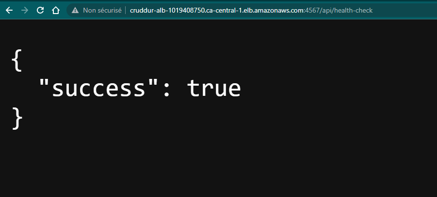
- Open the Route53 console in your AWS account and select the domain you want to point to the ALB.
- In the domain management section, click on the "Create Record" button to add a new record.
- Under the record creation options, choose "Alias" and select "Alias to Application and Classic Load Balancer" from the dropdown menu for "Route traffic to."
- Choose the "ca-central-1" region and select your target Application Load Balancer from the list of load balancers.
- Click on the "Create Route" button to save the record.
  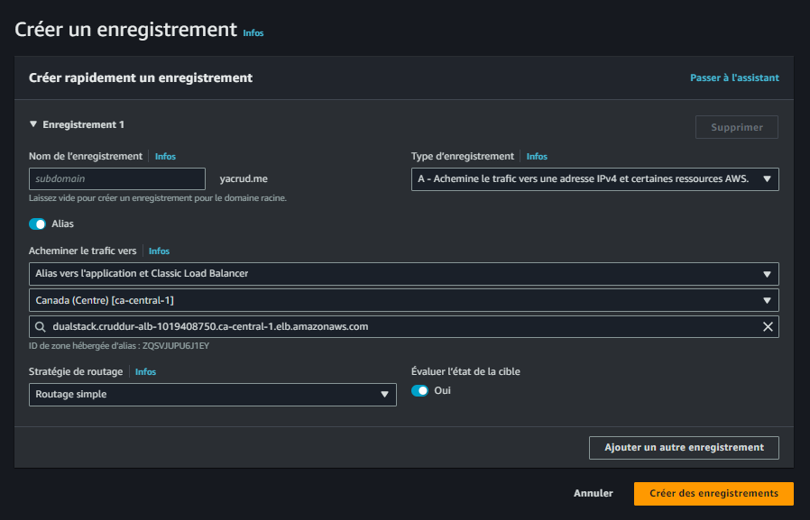
- To create a subdomain for your API, click on "Create Record" again and this time set the "Record name" to "api."
- Follow the same alias setup as above, choosing the same ALB target as the main domain.
- Expect to have these records
  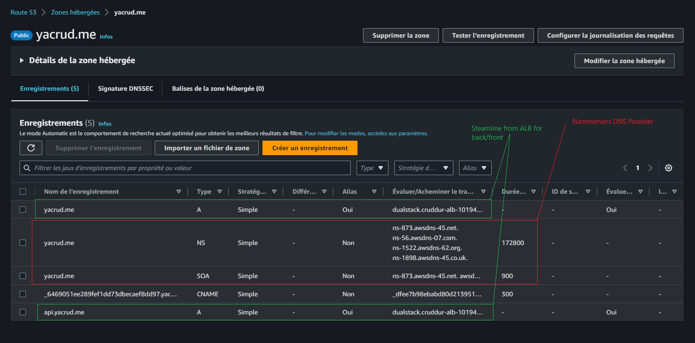
- Wait for the DNS changes to propagate, which can take a few minutes or several hours.
- Once the changes have taken effect, visit your custom domain in a web browser to view the frontend. 

Your frontend should now be working on the custom domain, with API requests being directed to the ALB.

Note that it may take some time for the changes to take effect, so you may need to wait or try accessing the site from a different browser.

- Try checking Frontend
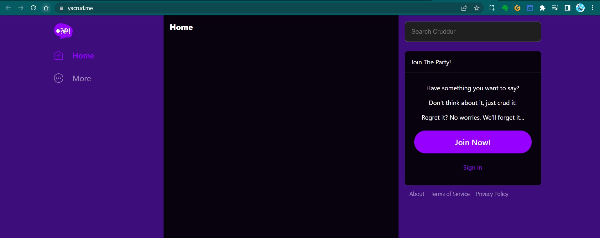

**Test the backend**

- Start from CLI using Curl
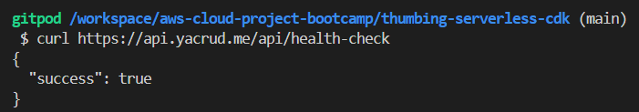

- Head over the browser and test
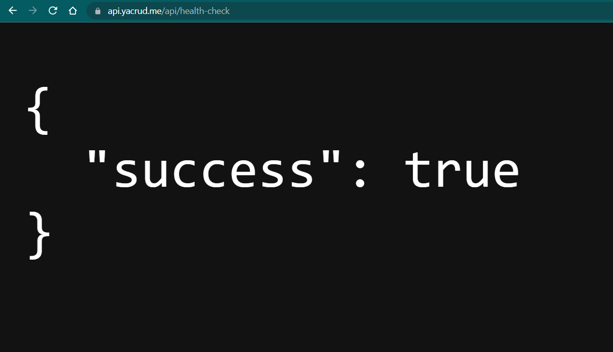

- Check Access to Data
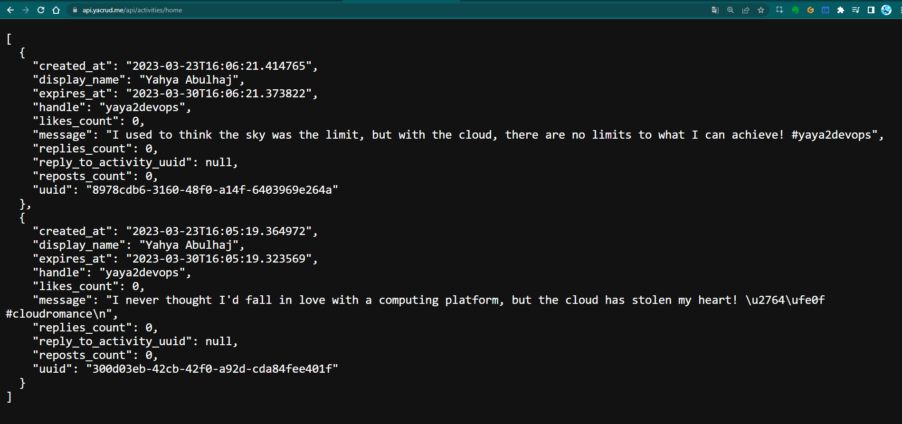

- App Function with RDS in PROD
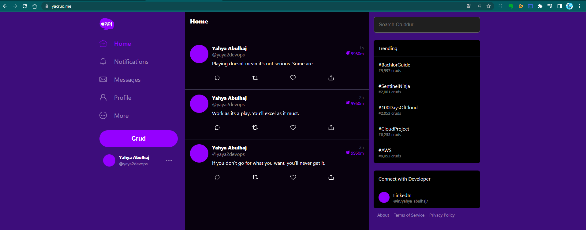


### Cross-origin resource sharing 


To update the CORS settings for your backend task definition, follow these steps:

1- Open the `aws/task-definitions/backend-flask.json` file and add your domain to the following section:

```
{"name": "FRONTEND_URL", "value": "https://<domain>"},
{"name": "BACKEND_URL", "value": "https://api.<domain>"},
```

2- Save the changes to the file.

3- Run the following command to update the task definition:

```sh
aws ecs register-task-definition --cli-input-json file://aws/task-definitions/backend-flask.json
```


#### Frontend Docker Build

- Login to ECR.

```bash
docker build \
--build-arg REACT_APP_BACKEND_URL="https://api.yacrud.me" \
--build-arg REACT_APP_FRONTEND_URL="https://yacrud.me" \
--build-arg REACT_APP_AWS_PROJECT_REGION="$AWS_DEFAULT_REGION" \
--build-arg REACT_APP_AWS_COGNITO_REGION="$AWS_DEFAULT_REGION" \
--build-arg REACT_APP_AWS_USER_POOLS_ID="" \
--build-arg REACT_APP_CLIENT_ID="" \
-t frontend-react-js \
-f Dockerfile.prod .
```
- Run build command with updated URL from frontend folder.
- Tag and push container image.


## ECS Services for Full-Stack App


Update your ECS services with the latest changes, follow these steps
- Navigate to the ECS console.
- Check the box next to the `backend-flask` service, and click **Update** to make changes.
- Check the **Force new deployment** checkbox.
- Select the latest **Revision**.
- Click **Update**.
- Repeat the same steps for the `frontend` service.
- Wait for the changes to complete.
- Verify that both the frontend and backend URLs are running.

You can check if your full-stack app is running by visiting the URL shown in the ECS console or navigating to the frontend URL in your browser. If the app is running correctly, you should see a success message or the expected content for your application.


## Flask Security: Restricting Access based on IP Address

To restrict access to your Flask application to specific IP addresses, follow these steps:

- Navigate to the EC2 console and select **Security Groups**.
- Check the box next to **cruddur-alb-sg** and click on **Edit inbound rules**.
- Remove the rules for ports 4567 and 3000.
- For the remaining rules, change the Source Type to **My IP**.
- Save the changes to the security group.
This will ensure that only IP addresses added to the Source Type can access the website.


### Disable Debug Mode
To disable debug mode, follow these steps:

- Navigate to the `backend-flask` directory.
- Create a new file called `Dockerfile.prod` and copy the contents of `Dockerfile` into this new file.
- Update the CMD line in `Dockerfile.prod` with the following command:
```
CMD [ "python3", "-m" , "flask", "run", "--host=0.0.0.0", "--port=4567", "--no-debug","--no-debugger", "--no-reload" ]
```
- Delete `ENV FLASK_DEBUG=1`
- Update the CMD line in `Dockerfile` to include the `--debug` flag, as follows:
```sh
CMD [ "python3", "-m" , "flask", "run", "--host=0.0.0.0", "--port=4567", "--debug"]
```
- Build and run the docker container locally using the following command:
```sh
docker build -f Dockerfile.prod -t backend-flask-prod .
```
To use the backend-flask-prod image Update Docker Compose


### ECR Sign-in 
Create a new file called `backend-flask/bin/ecr/sign-in` and make it executable. 

Paste the following code into the file

```
#! /usr/bin/bash

aws ecr get-login-password --region $AWS_DEFAULT_REGION | docker login --username AWS --password-stdin "$AWS_ACCOUNT_ID.dkr.ecr.$AWS_DEFAULT_REGION.amazonaws.com"
```

The script is still there and is now being automated in `.gitpod.yml`.

## Working With Docker Images in Production

### Build Prod Image

- Create a new file called `backend-flask/bin/docker/build/backend-flask-prod` with the following script:

```sh
#! /usr/bin/bash
docker build -f backend-flask/Dockerfile.prod -t backend-flask-prod ./backend-flask
```

- Create a new file called `backend-flask/bin/docker/build/frontend-react-js-prod` with the following script:
```sh
#! /usr/bin/bash

docker build \
    --build-arg REACT_APP_BACKEND_URL="https://api.yacrud.me" \
    --build-arg REACT_APP_FRONTEND_URL="https://yacrud.me" \
    --build-arg REACT_APP_AWS_PROJECT_REGION="$AWS_DEFAULT_REGION" \
    --build-arg REACT_APP_AWS_COGNITO_REGION="$AWS_DEFAULT_REGION" \
    --build-arg REACT_APP_AWS_USER_POOLS_ID="$AWS_USER_POOLS_ID" \
    --build-arg REACT_APP_CLIENT_ID="$CLIENT_ID" \
    -t frontend-react-js-prod \
    -f frontend-react-js/Dockerfile.prod ./frontend-react-js
```

- Tag and push Prod image


- Create `backend-flask/bin/docker/push/backend-flask-prod`

```bash
#! /usr/bin/bash
export ECR_BACKEND_FLASK_URL="$AWS_ACCOUNT_ID.dkr.ecr.$AWS_DEFAULT_REGION.amazonaws.com/backend-flask"
docker tag backend-flask-prod:latest $ECR_BACKEND_FLASK_URL
docker push $ECR_BACKEND_FLASK_URL
```

- Create `backend-flask/bin/docker/push/frontend-react-js-prod`

```bash
#! /usr/bin/bash
export ECR_FRONTEND_REACT_URL="$AWS_ACCOUNT_ID.dkr.ecr.$AWS_DEFAULT_REGION.amazonaws.com/frontend-react-js"
docker tag frontend-react-js-prod:latest $ECR_FRONTEND_REACT_URL
docker push $ECR_FRONTEND_REACT_URL
```

Due to new innovations, both have now been moved to [`bin/frontend/push`](../bin/frontend/push) and [`bin/backend/push`](../bin/backend/push)

> The great Bin Restructure just below.

### Force Service Deploy with bash scripts

- create `backend-flask/bin/ecs/force-deploy-backend-flask` and `bin/ecs/force-deploy-frontend-react-js`.
- In `backend-flask/bin/ecs/force-deploy-backend-flask`, set the **CLUSTER_NAME** variable to the name of your ECS cluster, the **SERVICE_NAME** variable to the name of the backend-flask service, and the **TASK_DEFINTION_FAMILY** variable to the task definition family of your backend-flask service.
- In `bin/ecs/force-deploy-frontend-react-js`, set the **CLUSTER_NAME** variable to the name of your ECS cluster, the **SERVICE_NAME** variable to the name of the `frontend-react-js service`, and the **TASK_DEFINTION_FAMILY** variable to the task definition family of your frontend-react-js service.
- Run the scripts to update your services with the new changes. The scripts use the AWS CLI to obtain the latest task definition ARN and force a new deployment of the service with that task definition.

Use this method only when necessary and during off-peak hours to minimize the impact on your users.

**NOTE:** Scripts are now migrated under `bin/backend/deploy` and `bin/frontend/deploy`

# [Refactor Bin Directory](../bin/README.md)
This was particularly enjoyable.

Binairy has been updated and relocated to the top-level directory to make it easier to execute and run scripts as we continue to add more and more to the project. 

The initial migration was made using the command `mv` 
```sh
mv bin ..
```
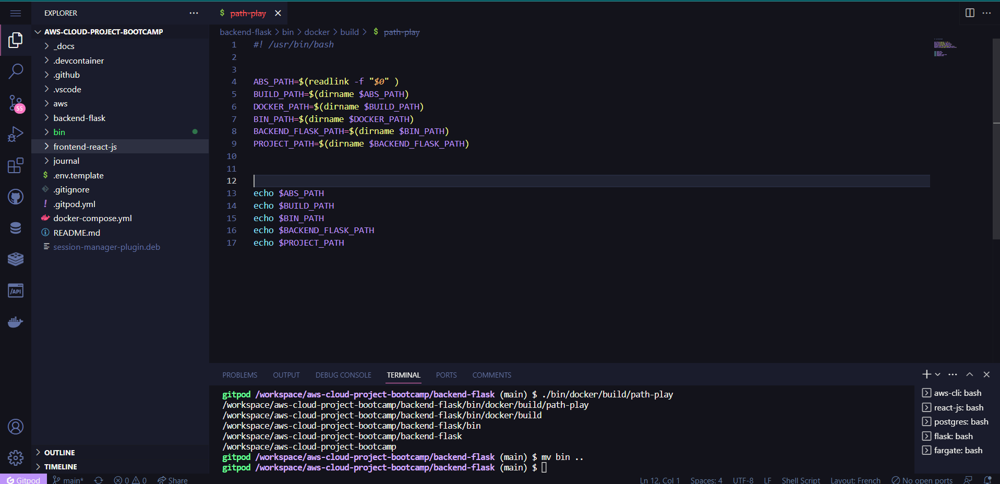

<details>
<summary>
Check The Process Out
</summary> 

- Step 1

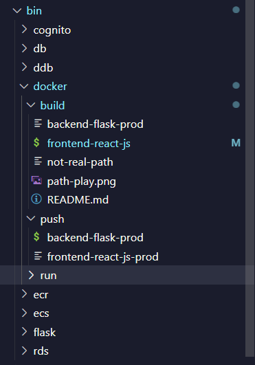

- Step 2

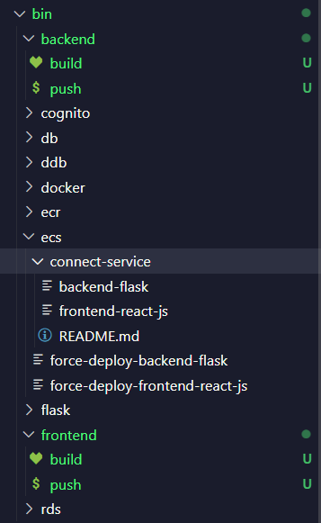

- Step 3

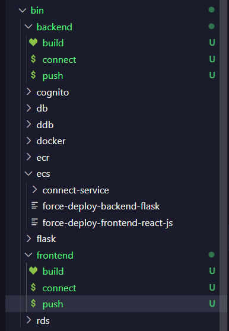

- Step 4

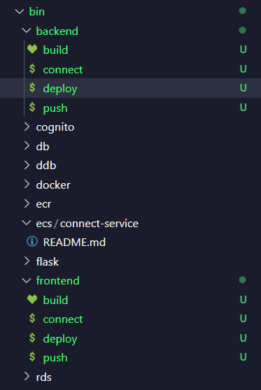

</details>


I've gone ahead and designed a [slick BinBanner](../bin/bin-dir-banner-v2.png) that's sure to get you SCRIPTING fired up. Plus, I've included the complete bintree. 

[Passé BinBanner](../bin/bin-dir-banner.png) below in case you're interested in the progress so far!


## Readlink and Dirname in Action

I worked with readlink and dirname and explained the process [here.](../bin/docker/build/README.md)

## PSQL Session Kill Command

The purpose of this part is to create a script to kill all sessions connected to PSQL.

- create a file named `kill-all-connections.sql` in the `backend-flask/db directory`. This will contain the SQL query to terminate the sessions.

Open the `kill-all-connections.sql` and add the following SQL query

```
SELECT pg_terminate_backend(pid)
FROM pg_stat_activity
WHERE
  -- don't kill my own connection!
  pid <> pg_backend_pid()
  -- don't kill the connections to other databases
  AND datname = 'cruddur';
```

This actually selects all active sessions connected to the 'cruddur' database and terminates them, excluding your own connection.


- Next, create a file named `kill-all` in the `bin/db`. This will executes the SQL query.

Open the `kill-all` file and add the following code:
```
#! /usr/bin/bash

CYAN='\033[1;36m'
NO_COLOR='\033[0m'
LABEL="db-kill-all"
printf "${CYAN}== ${LABEL}${NO_COLOR}\n"

# Set absolute path to SQL file
abs_filepath="$ABS_PATH/backend-flask/db/kill-all-connections.sql"

# Get relative path to file from current dir
kill_path=$(realpath --relative-base="$PWD" "$abs_filepath")

# Execute query using psql and connection URL
psql $CONNECTION_URL cruddur < $kill_path
```

This script will have the cool color formatting for the console output as well and executes the SQL query using the psql command with the specified connection URL and the 'cruddur' database.

## Implement Refresh Token Cognito

- Update the `frontend-react-js/src/lib/CheckAuth.js` file with the following code: 

```py
import { Auth } from "aws-amplify";

export async function getAccessToken() {
  try {
    const cognitoUserSession = await Auth.currentSession();
    const accessToken = cognitoUserSession.accessToken.jwtToken;
    localStorage.setItem("access_token", accessToken);
  } catch (error) {
    console.log(error);
  }
}

export async function checkAuth(setUser) {
  try {
    const cognitoUser = await Auth.currentAuthenticatedUser({
      bypassCache: false, // Optional: Set to true if you want to fetch the latest user data from Cognito
    });

    console.log("cognito_user", cognitoUser);
    setUser({
      display_name: cognitoUser.attributes.name,
      handle: cognitoUser.attributes.preferred_username,
    });

    const cognitoUserSession = await Auth.currentSession();
    localStorage.setItem(
      "access_token",
      cognitoUserSession.accessToken.jwtToken
    );
  } catch (error) {
    console.log(error);
  }
}
```
- Ensure that you cleanup all files that make use of the checkAuth function to incorporate the latest updates.
- Update the `frontend-react-js/src/pages/HomeFeedPage.js` file to incorporate the new authentication flow:

```py
import { checkAuth, getAccessToken } from '../lib/CheckAuth';

const backendUrl = `${process.env.REACT_APP_BACKEND_URL}/api/activities/home`;
await getAccessToken();
const accessToken = localStorage.getItem("access_token");
const res = await fetch(backendUrl, {
  headers: {
    'Content-Type': 'application/json',
    'Authorization': `Bearer ${accessToken}`,
  },
});
```


Refer to the [fix commit](https://github.com/yaya2devops/aws-cloud-project-bootcamp/commit/11e378ef037a6e3b0f16bb9d43a851f8936ba683) for further details.

The commit above was pushed using my classmate's GitHub, when I ran out of credit and had to wrap up things. 

I had been working locally but became engrossed in this platform🍊. Therefore, shoutout to [Jawher](https://github.com/BytM3) for generously sharing their credentials, enabling me to proceed that time.

Later on, I found my way to deal with my gitpod obsessions. 😏


## Fargate - Configuring for Container Insights

- Turn on container insights
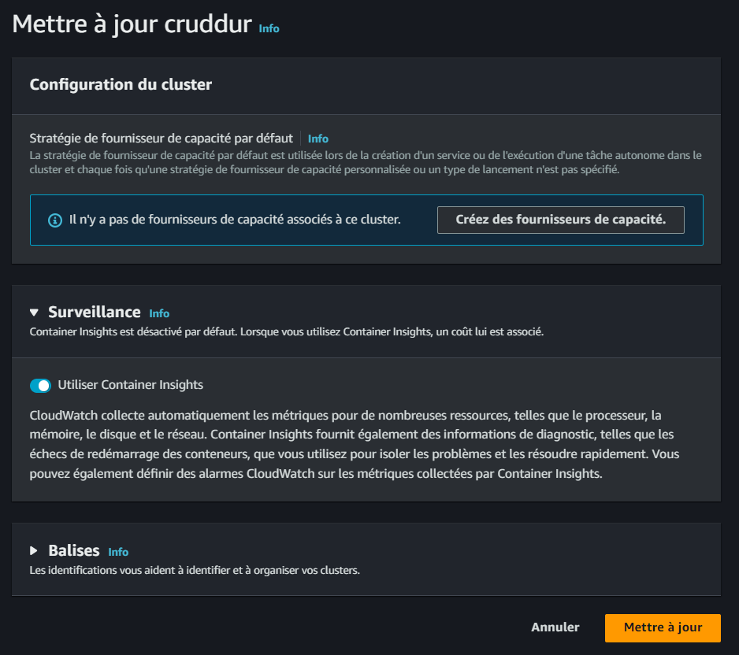

- Add this to backend task definition
```sh
{
      "name": "xray",
      "image": "public.ecr.aws/xray/aws-xray-daemon" ,
      "essential": true,
      "user": "1337",
      "portMappings": [
        {
          "name": "xray",
          "containerPort": 2000,
          "protocol": "udp"
        }
      ]
    },
```

Run the register script. I made it [here](../bin/backend/register)

- Check it in fargate


>   Above isn not healthy because the health check was in the bin directory when refactoring and the container dealt with no health-checks.

To address this, I set up a bin directory in the backend and included the health check before shipping the image.

- Make use of container insights 
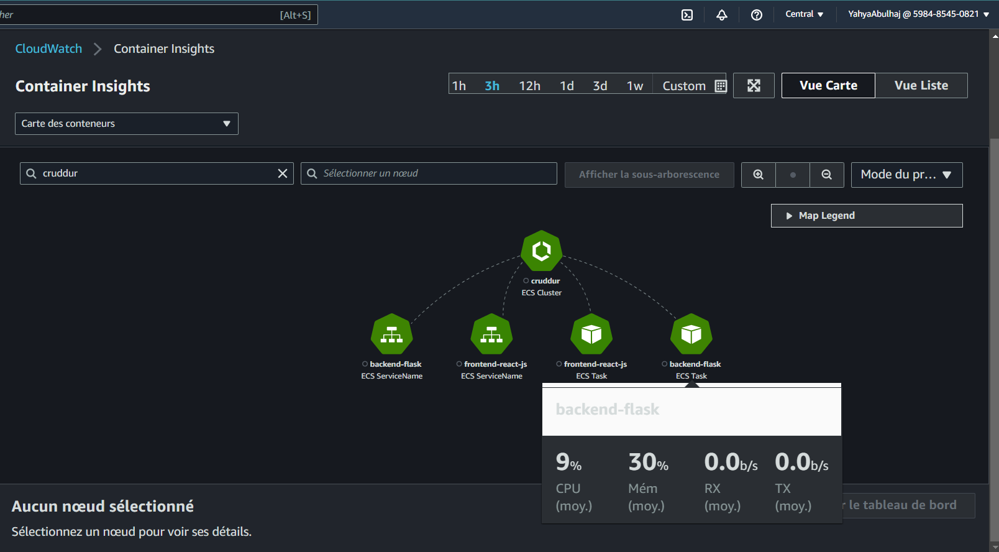


## Docker Container Networks
- add this config to `docker-compose.yml`

```yml
networks:
  cruddur-net:
    driver: bridge
    name: cruddur-net
 ```
 
 - And name the network attribute
```yml
networks:
  - cruddur-net
```

**Debug using Busybox**

- Create the [script](../bin/busybox)

- Operate debug e.g. liste network
```
docker network list
```

**Debug with iputils-ping**

- Add this too `Dockerfile.prod`
```sh
RUN apt update && apt install -y iputils-ping
```
- Redefined the networking in [docker compose](../docker-compose.yml)

### Service On - Service Off
I created these scripts to force deleting and creating service in fargate.
- [Start Service](../bin/backend/service-on)
- [Shut down Service](../bin/backend/service-off)

## Dynamic Environment Variable Ruby

A magical transmit to use in conjunction with your environment variable.


Create ruby scripts to read your environment variables and map it for app function.
- [Ruby file to read frontend environment variables](../bin/frontend/generate-env)
- [Ruby fil to read backend environment variables](../bin/backend/generate-env)


Create the actual files that hold the required env variables of ur app

- **Backend** environment variables [erb/backend-flask.env.erb](../erb/frontend-react-js.env.erb)
- **Backend** environment variables [erb/frontend-react-js.env.erb](../erb/frontend-react-js.env.erb)
- Include the configuration option for [backend](../docker-compose.yml#L5) to your `docker-compose.yml`
- Include the configuration option for [frontend](../docker-compose.yml#L15) to your `docker-compose.yml`


Run the scripts to generate the magical environment variables.

- **Frontend**
```sh
./bin/frontend/generate-env
```

- **Backend**
```sh
./bin/backend/generate-env
```

- Update your `.gitpod.yml` to generate the env var once you start a new workspace
```sh
ruby "./bin/backend/generate-env"
ruby "./bin/backend/generate-env"
 ```

### Frontend Application on CloudFront

- Create S3 with with default settings
- Create a distrubtion in the console 
- redirect http to https
- Allowed HTTP methods to GET, HEAD, OPTIONS
- Add the policy to S3

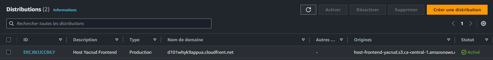


- create the [build](..//frontend-react-js/.gitignore#L39) for the frontend


```
npm run build 
```

- sync [content](../frontend-react-js/sync-cloudfront.md) to s3 to get served with cloudfront

```
aws s3 sync build s3://<bucket-name>
```
  
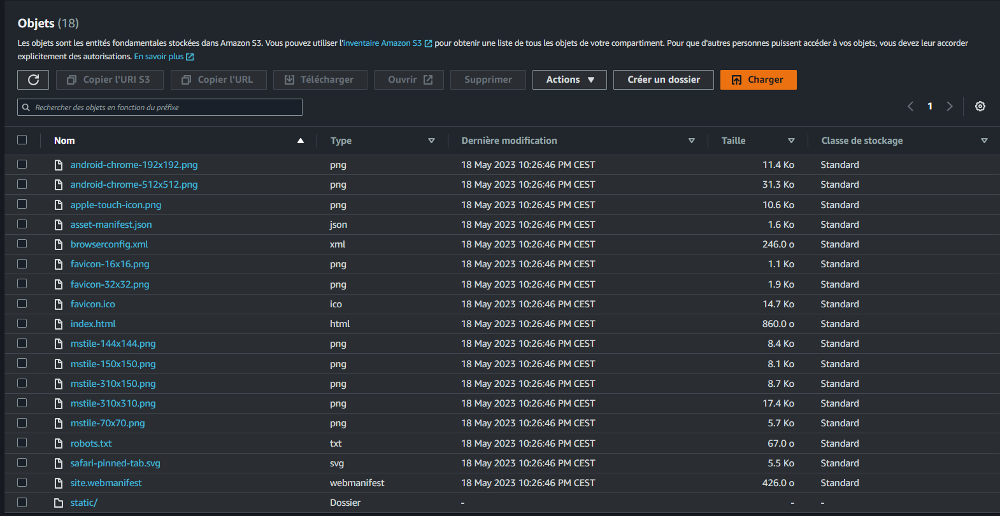

- Static App Hosted on CloudFront

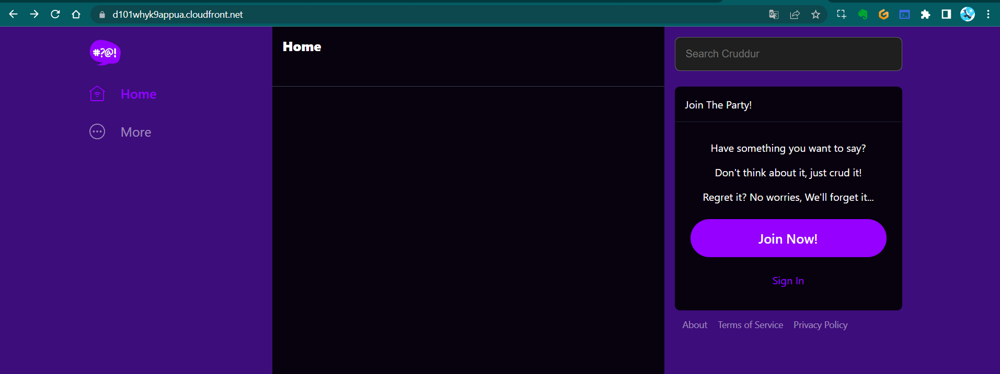

I'll keep this up for the community a while longer: [d101whyk9appua.cloudfront.net](https://d101whyk9appua.cloudfront.net/)


### Fargate Technical Questions

Depending on your preferences..<br>
Find all the answers to the technical questions via [notion here](https://yaya2devops.notion.site/Fargate-Technical-Questions-1af7a45f1fca4f9799209f9e04a18adf), or [click in](assets/week6-7/Fargate-Technical-Questions/Fargate-Technical-Questions.pdf) to download the document.


## Security Best Practices

Deploying and managing containers using AWS Fargate can simplify infrastructure management, but it also introduces specific security concerns that need to be addressed effectively.

- **Networking and Security Configuration:**
Integrating with existing network architectures and incorporating best practices for network isolation and access control can be demanding but difficult to do.
- **Monitoring and Logging:** Monitoring containerized applications running in Fargate requires careful configuration of logging and monitoring solutions to capture container-level metrics, logs, and events.
Aggregating and analyzing logs from multiple containers, managing log retention, and setting up alerts and notifications for critical events can be complex.


- **Container Orchestration and Scaling:** Orchestrating containers at scale in Fargate involves proper task definition creation, task scheduling, and managing container lifecycles. Optimizing resource allocation, managing task placement strategies, and understanding the implications of Fargate's resource limits are critical for efficient container orchestration.

Understand that, while Fargate abstracts the underlying infrastructure, addressing these issues requires a thorough understanding of many technical concepts, and the only way to deal with this is to remain on guard.

Below are some security practices of the various services used this week that I think you should be aware of.

| Topic                                     | Security Best Practices                                                                                           |
|-------------------------------------------:|------------------------------------------------------------------------------------------------------------------|
| **Amazon ECR Security Best Practices**   | 1. Enable image scanning to identify vulnerabilities and malware.                                                |
|                                           | 2. Implement access controls and fine-grained permissions for ECR repositories.                                  |
|                                           | 3. Regularly update and patch container images to address security vulnerabilities.                              |
|                                           | 4. Use secure image repositories with encrypted communication and access policies.                               |
|                                           | 5. Enable ECR lifecycle policies to remove unused images and minimize attack surface.                            |
| **Amazon ECS Security Best Practices**         | 1. Implement task role-based access control to limit permissions.                                                 |
|                                           | 2. Use AWS Fargate to provide better isolation between tasks.                                                     |
|                                           | 3. Enable VPC networking and security groups for enhanced network security.                                       |
|                                           | 4. Monitor and log ECS container instances and tasks for security events.                                         |
|                                           | 5. Regularly update and patch ECS agent, task definitions, and container images.                                  |
| **Amazon ECS security best practices**  | 1. Implement application-level security controls, such as authentication and authorization.                 |
|                                           | 2. Encrypt sensitive data in transit and at rest within containers.                                               |
|                                           | 3. Use secrets management services to securely store sensitive information.                                      |
|                                           | 4. Perform regular security testing, including vulnerability scanning and penetration testing.                   |
|                                           | 5. Enable container-level logging and monitoring for early detection of security incidents.                      |
| **Route 53 Security Best Practices**    | 1. Enable DNSSEC to ensure data integrity and authentication of DNS responses.                                    |
|                                           | 2. Implement IAM policies and roles for secure management of Route 53 resources.                                 |
|                                           | 3. Enable DNS query logging and analyze logs for suspicious activity.                                            |
|                                           | 4. Implement rate limiting and firewall rules to protect against DDoS attacks.                                   |
|                                           | 5. Regularly review and update DNS resource records to maintain accuracy and security.  |


### Note Vault

Some of my notes along week six and seven are listed below for inspirations.

- [Note 1](assets/week6-7/1-workflow/Week-6-7-Part-1.txt) - [ 2](assets/week6-7/1-workflow/Week-6-7-Part-2.txt) - [ 3](assets/week6-7/1-workflow/notes.txt) - [ 4](assets/week6-7/3-DNS/latest.txt) - [ 5](assets/week6-7/notes/aws-json-readme.txt) - [ 6](assets/week6-7/notes/reference-cloudfront.txt) - [Note 7](assets/week6-7/yacrud.me/dns-back-to-week-6.txt)

**Reference**

- [CloudFront to serve a static website hosted on Amazon S3?](https://repost.aws/knowledge-center/cloudfront-serve-static-website) 
- [Connection URL](https://www.linkedin.com/in/yahya-abulhaj/) 
- [How to use BusyBox on Linux](https://opensource.com/article/21/8/what-busybox) 
- [Docker Networking](https://docs.docker.com/config/containers/container-networking/) 
- [Debian iputils-ping Package](https://packages.debian.org/fr/sid/iputils-ping)
- [Python and Bash for Next-Level Automation](https://blog.yahya-abulhaj.dev/mastering-python-and-bash-for-next-level-automation) 


