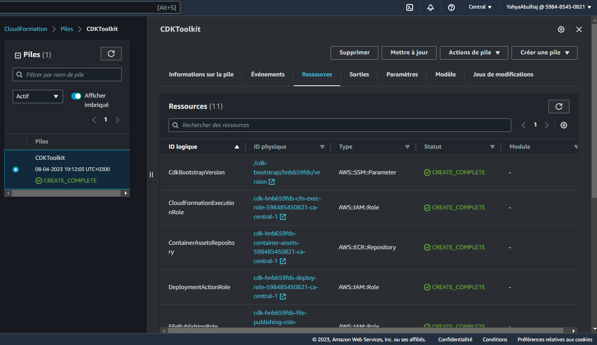
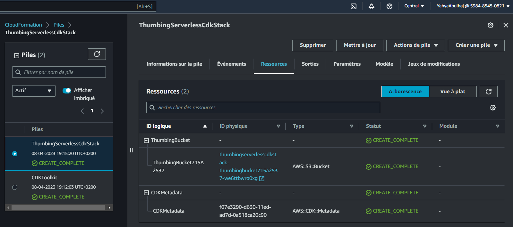
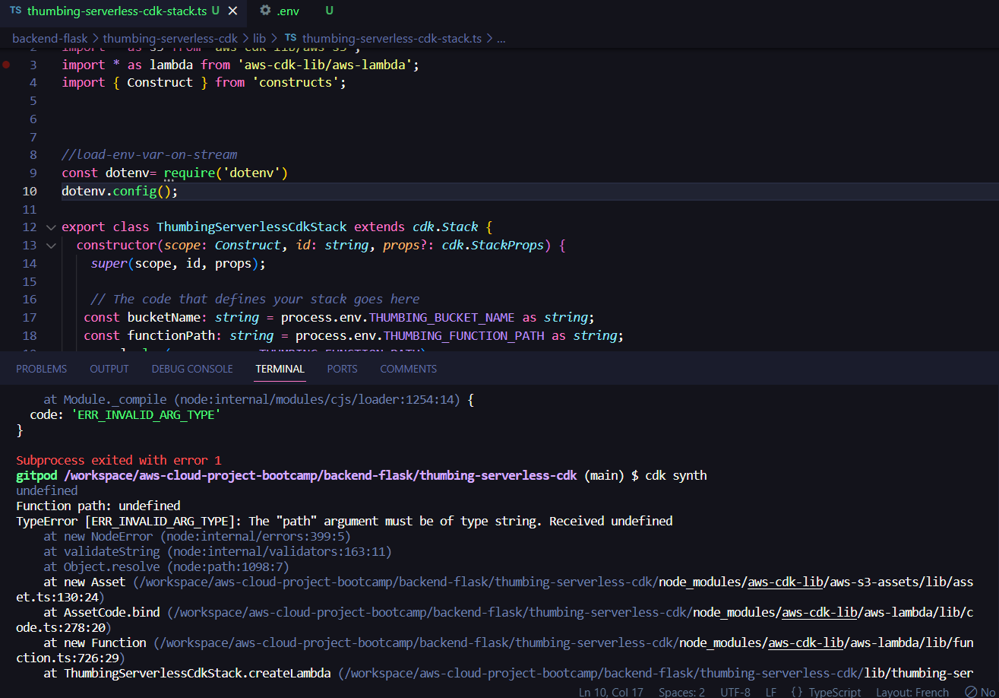
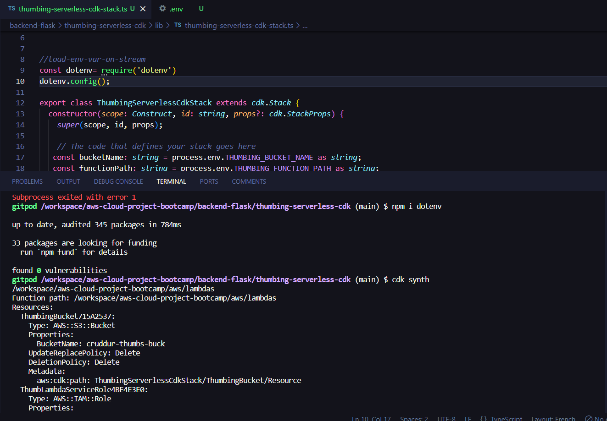

# Week 8 — Serverless Image Processing

> the missing architecture in here


Along the lifestream, i created 2 functions within `thumbing-serverless-cdk-stack.ts`.


- Created Bucket

```ts
  createBucket(bucketName: string): s3.IBucket{
    const bucket =  new s3.Bucket(this, 'ThumbingBucket', {
    bucketName: bucketName,
    removalPolicy: cdk.RemovalPolicy.DESTROY,
    });
    return bucket;
    }
```    

- Generates a CloudFormation template for an AWS CDK app

```sh
cdk synth
```

**Output:**
```YML
Resources:
  # --This was manually inserted --
  ThumbingBucket715A2537:
    Type: AWS::S3::Bucket
    UpdateReplacePolicy: Delete
    DeletionPolicy: Delete
    Metadata:
      aws:cdk:path: ThumbingServerlessCdkStack/ThumbingBucket/Resource
  CDKMetadata:
    Type: AWS::CDK::Metadata
    Properties:
      Analytics: v2:deflate64:H4sIAAAAAAAA/zPSMzfWM1BMLC/WTU7J1s3JTNKrDi5JTM7WAQrFFxvrVTuVJmenlug4p+VBWLUgZlBqcX5pUXIqiO2cn5eSWZKZn1erk5efkqqXVaxfZmihZ2gKNDerODNTt6g0ryQzN1UvCEIDAFohbiRzAAAA
    Metadata:
      aws:cdk:path: ThumbingServerlessCdkStack/CDKMetadata/Default
    Condition: CDKMetadataAvailable
Conditions:
  CDKMetadataAvailable:
    Fn::Or:
      - Fn::Or:
          - Fn::Equals:
              - Ref: AWS::Region
              - af-south-1
          - Fn::Equals:
              - Ref: AWS::Region
              - ap-east-1
          - Fn::Equals:
              - Ref: AWS::Region
              - ap-northeast-1
          - Fn::Equals:
              - Ref: AWS::Region
              - ap-northeast-2
          - Fn::Equals:
              - Ref: AWS::Region
              - ap-south-1
          - Fn::Equals:
              - Ref: AWS::Region
              - ap-southeast-1
          - Fn::Equals:
              - Ref: AWS::Region
              - ap-southeast-2
          - Fn::Equals:
              - Ref: AWS::Region
              - ca-central-1
          - Fn::Equals:
              - Ref: AWS::Region
              - cn-north-1
          - Fn::Equals:
              - Ref: AWS::Region
              - cn-northwest-1
      - Fn::Or:
          - Fn::Equals:
              - Ref: AWS::Region
              - eu-central-1
          - Fn::Equals:
              - Ref: AWS::Region
              - eu-north-1
          - Fn::Equals:
              - Ref: AWS::Region
              - eu-south-1
          - Fn::Equals:
              - Ref: AWS::Region
              - eu-west-1
          - Fn::Equals:
              - Ref: AWS::Region
              - eu-west-2
          - Fn::Equals:
              - Ref: AWS::Region
              - eu-west-3
          - Fn::Equals:
              - Ref: AWS::Region
              - me-south-1
          - Fn::Equals:
              - Ref: AWS::Region
              - sa-east-1
          - Fn::Equals:
              - Ref: AWS::Region
              - us-east-1
          - Fn::Equals:
              - Ref: AWS::Region
              - us-east-2
      - Fn::Or:
          - Fn::Equals:
              - Ref: AWS::Region
              - us-west-1
          - Fn::Equals:
              - Ref: AWS::Region
              - us-west-2
Parameters:
  BootstrapVersion:
    Type: AWS::SSM::Parameter::Value<String>
    Default: /cdk-bootstrap/hnb659fds/version
    Description: Version of the CDK Bootstrap resources in this environment, automatically retrieved from SSM Parameter Store. [cdk:skip]
Rules:
  CheckBootstrapVersion:
    Assertions:
      - Assert:
          Fn::Not:
            - Fn::Contains:
                - - "1"
                  - "2"
                  - "3"
                  - "4"
                  - "5"
                - Ref: BootstrapVersion
        AssertDescription: CDK bootstrap stack version 6 required. Please run 'cdk bootstrap' with a recent version of the CDK CLI.
```

- Get ready to deploy

from what i understood this command creates an S3 bucket to store the deployment artifacts, DynamoDB table to store CDK toolkit metadata, and an IAM role to grant CDK permissions to your AWS account.

```Sh
cdk bootstrap "aws://598485450821/ca-central-1"
```



- package and deploy AWS resources

```sh
cdk deploy
```



- created Lambda

```ts
  createLambda(functionPath: string): lambda.IFunction {
    const lambdaFunction = new lambda.Function(this, 'ThumbLambda', {
      runtime: lambda.Runtime.NODEJS_14_X,
      handler: 'index.handler',
      code: lambda.Code.fromAsset(functionPath)
    });
    return lambdaFunction;
  }
```


- created .env to include the env var under the cdk `thumbing-serverless-cdk` dir

```sh
THUMBING_BUCKET_NAME="cruddur-thumbs-buck"
THUMBING_FUNCTION_PATH="/workspace/aws-cloud-project-bootcamp/aws/lambdas"
```

**Returning Error:**



**Solution:**

added this lines to our `thumbing-serverless-cdk-stack.ts` file:
```ts
const dotenv= require('dotenv')
dotenv.config();
```

- Install "dotenv":

```sh
npm i dotenv
```


- Synthesize:

```sh
cdk synth
```



- Adding environement variable to our lambda functions

```ts
createLambda(bucketName: string, folderInput: string, folderOutput: string )
```

 created this env within the func:

```ts
      environment: {
        DEST_BUCKET_NAME: bucketName,
        FOLDER_INPUT: folderInput,
        FOLDER_OUTPUT: folderOutput,
        PROCESS_WIDTH:  '512',
        PROCECSS_HEIGHT: '512'
    }
```


Initialized 'folderInput' and 'folderOutput' with S3 input and output folders retrieved from environment variables,
```sh
   const folderInput: string = process.env.THUMBING_S3_FOLDER_INPUT as string;
   const folderOutput: string = process.env.THUMBING_S3_FOLDER_OUTPUT as string;
```

- passed them as parameters to the 'createLambda' method to instantiate the Lambda function.
```ts
   const lambdaFunction = this.createLambda(functionPath, bucketName, folderInput, folderOutput);
```

-  defined S3 input and output folders for the Thumbing Lambda function in the .env file 

```
THUMBING_S3_FOLDER_INPUT="avatar/original"
THUMBING_S3_FOLDER_INPUT="avatar/processed"
```

